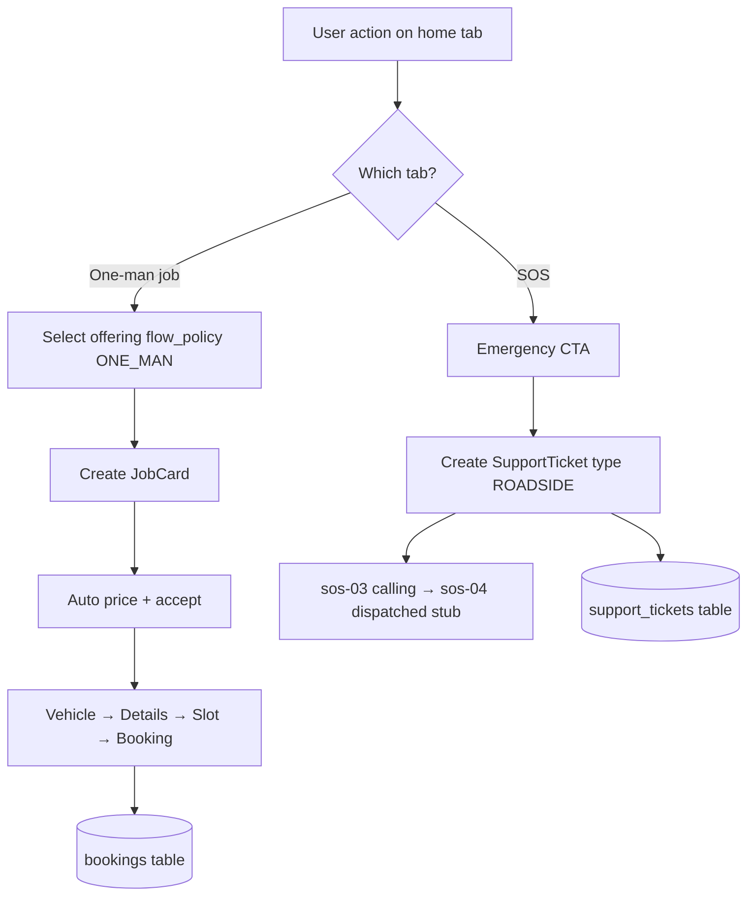

# PHASE 05 — One-Man Job, SOS, and Account Hub

**Document ID:** `PHASE-05-oneman-sos-account.md`  
**Version:** 1.0.0  
**Status:** Execution-ready specification  
**Depends on:** [PHASE-01-monorepo-platform-foundation.md](./PHASE-01-monorepo-platform-foundation.md), [PHASE-02-identity-design-catalog.md](./PHASE-02-identity-design-catalog.md), [PHASE-03-general-service-e2e.md](./PHASE-03-general-service-e2e.md) (Exit Gate §24 complete)  
**Unblocks:** [PHASE-06-technician-field-execution.md](./PHASE-06-technician-field-execution.md), [PHASE-08-payments-invoicing-closure.md](./PHASE-08-payments-invoicing-closure.md)  
**Estimated effort:** 8–14 engineer-days (single developer + Cursor agent)

**Authority chain:**

1. Walkthrough screens embedded inline in §14 and [`docs/CARATOM-client-walkthrough.html`](../CARATOM-client-walkthrough.html) — UI/flow truth.
2. [`docs/AUDIT-REPORT.md`](../AUDIT-REPORT.md) — resolved contradictions: **full 4-screen SOS UI required**; **one-man direct book without estimate screen**; **walkthrough vehicle-before-details for one-man**.
3. [`docs/architecture/01-product-constitution.md`](../architecture/01-product-constitution.md) — commercial invariants.
4. Architecture docs **02, 04, 08, 09, 11** — server-owned flow policy, state machines, API shapes.

**Critical glossary (repeat in code review):**

> **`ONE_MAN` (flow_policy)** — Server enum value for fixed-scope one-man jobs. Product/walkthrough copy says **"One-man job"**. Do **not** introduce a separate `ONE_MAN_JOB` enum in the database; map product language to `ONE_MAN` in code and OpenAPI.  
> **`SOS`** — Emergency roadside UX tab. **Not** a `flow_policy` on `service_offerings`. SOS creates a **`SupportTicket`** aggregate (`type=ROADSIDE`); it must **never** create a `JobCard` or `Booking`.  
> **Account hub** — Bottom-tab screens `orders`, `profile`, `addresses`, plus polished `login` OTP flow wired to booking and SOS contexts.

---

## 0. Phase Summary

### Objective

Deliver the **remaining core customer journeys** after General Service E2E: **One-man job direct booking** (`om-01` → `om-06`), **SOS emergency flow** (`sos-01` → `sos-04`) backed by **`SupportTicket`**, and the **account hub** (`login`, `orders`, `profile`, `addresses`).

The backend must enforce `flow_policy = ONE_MAN` with **no estimate acceptance screen** (price is catalog-fixed; server auto-publishes and accepts a single estimate version at job-card creation or pricing). SOS must remain **honest**: MVP shows ops handoff and stub dispatch status without pretending full roadside partner integration exists.

### What Phase 05 delivers

| ID | Deliverable | Description |
|----|-------------|-------------|
| P05-A | One-man booking E2E | `om-01`–`om-06`; `oneManCoordinator`; direct book path |
| P05-B | ONE_MAN backend policy | Auto-estimate + skip accept UI; 30-min slot windows; FlowDecision `SELECT_SLOT` after finalization |
| P05-C | SOS full UI | `sos-01`–`sos-04`; MapLibre map; warning/amber chrome |
| P05-D | SupportTicket module | `support_tickets` table; `POST/GET /v1/support-tickets`; status stub worker |
| P05-E | Account — orders | Paginated booking list; tap → booking detail read model (progress stub) |
| P05-F | Account — profile | Avatar, name, phone, orders link, logout |
| P05-G | Account — addresses | List, add, edit saved addresses; map pin optional |
| P05-H | Login polish | OTP flow wired to return paths from checkout, orders, SOS |
| P05-I | Contracts + tests | OpenAPI-aligned DTOs; ONE_MAN + SOS integration tests; walkthrough audit |

### What Phase 05 explicitly does NOT deliver

| Item | Phase |
|------|-------|
| Repair add-on cart, advisor case (`gpr-*`) | 04 |
| Razorpay, invoice, payment, review | 08 |
| Full booking detail progress steps, visit ETA | 06, 08 |
| Admin SOS dispatch board, partner assignment | 09, 10 |
| Push notifications for SOS status | 11 |
| Inspection + Repair customer UI | 07 |
| Technician field app | 06 |
| Saved vehicles management UI (list/edit) | 08 or later |
| Real telephony integration (Twilio/exotel) | 11+ |
| Production MapLibre tile CDN hardening | 12 |

### Canonical journeys (Phase 05 only)

**One-man (`flow_policy = ONE_MAN`):**

```text
om-01-home (One-man job tab)
  → om-02-detail (service detail — tap grid item)
  → om-03-vehicle (confirm vehicle — reuse draft or saved)
  → om-04-details (name + phone + address — reuse checkout/details)
  → om-05-slot (30-min windows — reuse checkout/slot)
  → om-06-confirmed (reference JC-0991 pattern)
```

**SOS (SupportTicket — no JobCard):**

```text
sos-01-home (SOS tab — map + emergency tiles)
  → sos-02-pick (issue list)
  → sos-03-active (calling ops — location shared)
  → sos-04-dispatched (help dispatched stub — partner ETA copy)
```

**Account:**

```text
login (phone OTP) ← gated from checkout, orders, profile
orders → booking detail stub
profile → orders link, logout
addresses → list + add/edit
```

### Success statement

At Phase 05 exit, an authenticated user can book **Bulb / headlight** at ₹399 through the One-man tab without seeing an estimate acceptance screen, see **Booking confirmed** with reference `JC-0991` pattern, trigger SOS from the SOS tab through all four screens with a persisted `SupportTicket`, view **orders** listing GS and one-man bookings, manage **profile** and **saved addresses**, and log in/out via phone OTP. API tests prove SOS never creates `job_cards` rows; ONE_MAN FlowDecision never emits `ACCEPT_ESTIMATE` to the client after initial pricing.

---

## 1. Starting State

### 1.1 Phase 03 exit gate (must be true)

| Prerequisite | Verification |
|--------------|--------------|
| General Service gs-01→gs-10 E2E works | Manual device test |
| `POST /v1/job-cards` + price + accept + finalization + book | Integration test green |
| `GET /v1/bookings/{id}` returns snapshot | curl with customer JWT |
| Checkout `details.tsx`, `slot.tsx` exist | File tree |
| Vehicle picker + `vehicleDraftStore` | gs-02–05 pass |
| `FlowDecision` module | Unit tests |
| Addresses/vehicles tables + CRUD API | curl roundtrip |
| Phase 02 home: om-01 grid, sos-01 shell | Visual compare |
| Supabase OTP + session restore | Login on device |
| CI green | GitHub Actions |

**Phase 04 is NOT required for Phase 05.** One-man and SOS depend only on Phase 03 booking infrastructure.

### 1.2 Repository state at Phase 05 start

```text
apps/customer/
  app/
    (auth)/splash.tsx, phone.tsx, otp.tsx     # Phase 02 — may need return-path polish
    (customer)/(tabs)/
      home.tsx                                 # om-01, sos-01 bodies from Phase 02
      orders.tsx                               # placeholder empty state
      profile.tsx                              # placeholder guest CTA
    checkout/details.tsx, slot.tsx             # Phase 03 — reuse for om-04, om-05
    booking/[id]/index.tsx                     # Phase 03 gs-10 — reuse om-06
    vehicle/*                                  # Phase 03 — optional for om-03 "change vehicle"
    services/[slug].tsx                        # Phase 02 read-only stub
backend/
  app/modules/
    job_cards/, pricing/, bookings/, slots/   # Phase 03
    support/                                   # Missing
packages/contracts/                            # JobCard/Booking types; no SupportTicket
```

**Absent at start:**

- `support_tickets` table and module
- `oneManCoordinator` / `sosCoordinator`
- SOS routes `app/sos/*`
- One-man wired CTAs from om-01 grid and om-02 detail
- Orders list API `GET /v1/bookings`
- Addresses management UI
- MapLibre integration
- ONE_MAN auto-accept pricing path

### 1.3 Walkthrough vs architecture resolution (apply in Phase 05)

| Topic | Winning rule | Phase 05 implementation |
|-------|--------------|-------------------------|
| One-man estimate screen | Walkthrough wins | **Skip** om-estimate UI; server auto-accepts fixed price |
| One-man vehicle timing | Walkthrough wins | om-03 after detail; **before** om-04 details |
| One-man slot duration | Walkthrough wins | 30-min windows; subtitle "Short visit · ~30 min" |
| SOS scope | Walkthrough wins | Full 4-screen UI; honest ops handoff backend |
| SOS vs booking | Architecture wins | **No** JobCard/Booking for SOS |
| flow_policy naming | Architecture wins | DB enum `ONE_MAN`; UI copy "One-man job" |
| Login timing | Phase 03 pattern | Auth gate at finalization; Phase 05 extends to orders/profile |
| Combined details | Walkthrough wins | Reuse gs-08 combined form for om-04 |

---

## 2. Desired End State

### 2.1 Repository tree (additions)

```text
apps/customer/
  app/
    (auth)/
      phone.tsx                    # returnPath query param support
      otp.tsx                      # redirect after verify
    (customer)/
      (tabs)/
        orders.tsx                 # P05-E — booking cards
        profile.tsx                # P05-F — hub + logout
      services/
        [slug].tsx                 # om-02 detail (enhanced)
      oneman/
        vehicle.tsx                # om-03
      sos/
        _layout.tsx
        pick.tsx                   # sos-02
        active.tsx                 # sos-03
        dispatched.tsx             # sos-04
      addresses/
        index.tsx                  # list
        [id].tsx                   # edit
        new.tsx                    # add
      booking/
        [id]/
          index.tsx                # om-06 + gs-10 + orders detail stub
    lib/
      coordinators/
        oneManCoordinator.ts
        sosCoordinator.ts
      location/
        useLiveLocation.ts         # SOS GPS
    components/
      sos/
        SosMap.tsx
        EmergencyTileGrid.tsx
        IssuePickerList.tsx
      orders/
        OrderCard.tsx
      addresses/
        AddressCard.tsx
        AddressForm.tsx
      map/
        MapLibreView.tsx           # shared map wrapper
backend/
  app/modules/
    support/
      __init__.py
      models.py
      schemas.py
      service.py
      router.py
    job_cards/
      one_man_policy.py            # auto-estimate accept rules
    bookings/
      list_service.py              # GET /v1/bookings
  alembic/versions/
    20260829_0005_phase05_support_tickets.py
  tests/
    integration/
      test_one_man_e2e.py
      test_sos_support_ticket.py
      test_bookings_list.py
packages/contracts/src/
  support-ticket.ts
  booking-list.ts
  one-man-flow.ts
```

### 2.2 Runtime capabilities

| Capability | Customer | Backend |
|------------|----------|---------|
| Book one-man job end-to-end | ✓ | ✓ |
| SOS ticket create + poll status | ✓ | ✓ |
| List own bookings | ✓ | ✓ |
| CRUD saved addresses (UI) | ✓ | ✓ (API from Phase 03) |
| Phone OTP login with return path | ✓ | ✓ (Supabase) |
| Map with live GPS (SOS) | ✓ | N/A |
| Admin dispatch SOS | — | stub only |

### 2.3 Demo fixtures (Phase 05)

| Fixture | Value |
|---------|-------|
| One-man slug | `one-man-bulb-headlight` |
| One-man price | ₹399 (39900 paise) |
| One-man duration | 30 min |
| One-man booking ref | JC-0991 |
| One-man slot demo | Wed 19 · 16:00–16:30 |
| SOS demo location | Koramangala · 12.9352, 77.6245 |
| SOS issue demo | Flat tyre |
| Orders demo rows | JC-1042 Scheduled, JC-0991 Completed |
| Profile demo | Rajesh Kumar · +91 98765 43210 |

---

## 3. Why This Phase Exists Here

Phase 05 completes the **walkthrough customer surface area** that is not General Service or Service+Repair:

1. **Parallelizes with Phase 04** — One-man and SOS do not require advisor or repair cart; they only need Phase 03 booking primitives.
2. **Validates alternate flow policies** — `ONE_MAN` proves FlowDecision handles paths without estimate acceptance UI.
3. **Introduces non-booking aggregate** — `SupportTicket` ensures engineers do not misuse JobCard for emergency flows.
4. **Account retention** — Orders, profile, and addresses make repeat bookings testable before payments (Phase 08).
5. **Unlocks technician work** — Phase 06 needs diverse booking types in orders list for visit assignment testing.

**Sequencing rationale:** Implement after Phase 03 so checkout, slots, and snapshots are proven. Implement before Phase 08 so payment flows can attach to existing booking detail routes.

---

## 4. Source Material

| Source | Use in Phase 05 |
|--------|-----------------|
| [`docs/CARATOM-client-walkthrough.html`](../CARATOM-client-walkthrough.html) | Pixel/copy truth for om-*, sos-*, orders, profile, addresses |
| [`docs/EMERGENT-IMPLEMENTATION-PROMPT.md`](../EMERGENT-IMPLEMENTATION-PROMPT.md) §5.4–5.6 | Flow sequences, backend SOS rules |
| [`docs/AUDIT-REPORT.md`](../AUDIT-REPORT.md) C6 | SOS full UI requirement |
| [`docs/architecture/02-product-flows.md`](../architecture/02-product-flows.md) | ONE_MAN direct book |
| [`docs/architecture/04-state-machines.md`](../architecture/04-state-machines.md) | JobCard ONE_MAN transitions |
| [`docs/architecture/08-data-model.md`](../architecture/08-data-model.md) | support_tickets |
| [`docs/architecture/09-api-contracts.md`](../architecture/09-api-contracts.md) | support-tickets, bookings list |
| [`docs/architecture/11-screen-specifications.md`](../architecture/11-screen-specifications.md) | Orders, profile, addresses, SOS |
| [`docs/implementation/PHASE-02-identity-design-catalog.md`](./PHASE-02-identity-design-catalog.md) §12.3–12.4 | om-01, sos-01 specs |
| [`docs/implementation/PHASE-03-general-service-e2e.md`](./PHASE-03-general-service-e2e.md) §25.2 | Reuse artifacts |
| [`docs/inspiration/customer-home/README.md`](../inspiration/customer-home/README.md) | Tab chrome, SOS accent |

---

## 5. Architectural Context (diagram)

### 5.1 Phase 05 in customer app map

```text
┌─────────────────────────────────────────────────────────────────┐
│                    apps/customer (Expo Router)                     │
├─────────────────────────────────────────────────────────────────┤
│  (tabs)/home          │ 4 mode tabs — om-01, sos-01 active bodies│
│  (tabs)/orders        │ GET /v1/bookings                        │
│  (tabs)/profile       │ GET /v1/me, logout                      │
│  services/[slug]      │ om-02 detail                            │
│  oneman/vehicle       │ om-03                                   │
│  checkout/*           │ om-04, om-05 (shared with GS)            │
│  booking/[id]         │ om-06, orders detail                    │
│  sos/*                │ sos-02–04                               │
│  addresses/*          │ CRUD UI                                 │
│  (auth)/*             │ login OTP + returnPath                  │
└─────────────────────────────────────────────────────────────────┘
                              │ Bearer JWT
                              ▼
┌─────────────────────────────────────────────────────────────────┐
│              backend FastAPI (Railway / local)                   │
├─────────────────────────────────────────────────────────────────┤
│  job_cards + one_man_policy   │ auto-estimate, skip accept UI    │
│  bookings.list_service        │ paginated customer bookings    │
│  support                      │ SupportTicket ROADSIDE         │
│  slots                        │ 30-min ONE_MAN windows         │
└─────────────────────────────────────────────────────────────────┘
                              │
                              ▼
                    Supabase PostgreSQL
              job_cards │ bookings │ support_tickets
```

### 5.2 ONE_MAN vs SOS decision tree



### 5.3 FlowDecision — ONE_MAN path

```text
CREATE job_card (ONE_MAN offering)
  → POST /price (auto-accept server-side)
  → JobCard READY_FOR_FINALIZATION
  → FlowDecision.required_next_action = FINALIZE
  → POST /finalization
  → FlowDecision.required_next_action = SELECT_SLOT
  → slot hold + book
  → FlowDecision.required_next_action = VIEW_BOOKING
```

**Client rule:** `oneManCoordinator` must **never** navigate to `/job-card/{id}/estimate` for `policy === 'ONE_MAN'`.

### 5.4 SupportTicket lifecycle (MVP stub)

```text
CREATED → OPS_NOTIFIED → DISPATCHED_STUB → CLOSED
                ↑
         sos-03 "Calling ops"
                ↓
         sos-04 "Help dispatched" (dev timer or admin stub PATCH)
```

---

## 6. Exact Implementation Scope + Out of Scope

### 6.1 In scope (must ship)

| Area | Requirement |
|------|-------------|
| **om-01** | Wire grid taps → `/services/{slug}` |
| **om-02** | Full detail: photo, copy, price, duration, "Book this job" CTA |
| **om-03** | Vehicle confirm screen; "Change vehicle" → `/vehicle/make` |
| **om-04** | Reuse checkout/details with one-man context subtitle |
| **om-05** | Reuse checkout/slot; 30-min grid; dynamic confirm label |
| **om-06** | Reuse booking confirmed; one-man copy variant |
| **sos-01** | Map, location card, 2×2 tiles, amber "Get help now" |
| **sos-02** | Issue list + CTA |
| **sos-03** | Active call state; cancel |
| **sos-04** | Dispatched stub; partner card; call ops again |
| **SupportTicket API** | POST create, GET by id, GET list mine |
| **ONE_MAN policy** | Server auto-accept; no client estimate screen |
| **orders** | List bookings with status chips |
| **profile** | Name, phone, orders link, logout |
| **addresses** | List, add, edit (no delete required — archive optional) |
| **login** | Return path after OTP for gated flows |
| **MapLibre** | SOS map + optional address map placeholder |
| **Tests** | ONE_MAN E2E, SOS no-job-card guard, bookings list auth |

### 6.2 Out of scope (explicit)

| Item | Reason |
|------|--------|
| Estimate accept UI for ONE_MAN | Walkthrough direct book |
| JobCard creation from SOS | Architecture forbidden |
| Real partner dispatch API | Ops dependency — stub |
| Razorpay / invoice | Phase 08 |
| Push notifications | Phase 11 |
| Admin SOS inbox UI | Phase 09/10 |
| Saved vehicles UI | Deferred — om-03 uses draft + change vehicle link |
| Booking detail full progress | Phase 08 — stub step label OK |
| Inspection + Repair | Phase 07 |
| `flow_policy` value `ONE_MAN_JOB` in DB | Use canonical `ONE_MAN` only |

### 6.3 Scope boundaries vs Phase 04

Phase 04 may land on the same branch in some teams. If both exist:

- ONE_MAN coordinator must not import advisor components.
- Repair cart routes must not appear in one-man navigation stack.
- Feature flags not required — route separation is sufficient.

---

## 7. Repository Changes

### 7.1 New files (minimum)

```text
backend/app/modules/support/{models,schemas,service,router}.py
backend/app/modules/job_cards/one_man_policy.py
backend/app/modules/bookings/list_service.py
backend/alembic/versions/20260829_0005_phase05_support_tickets.py
backend/tests/integration/test_one_man_e2e.py
backend/tests/integration/test_sos_support_ticket.py
backend/tests/integration/test_bookings_list.py
packages/contracts/src/support-ticket.ts
packages/contracts/src/booking-summary.ts
apps/customer/app/oneman/vehicle.tsx
apps/customer/app/sos/{_layout,pick,active,dispatched}.tsx
apps/customer/app/addresses/{index,new,[id]}.tsx
apps/customer/lib/coordinators/{oneManCoordinator,sosCoordinator}.ts
apps/customer/lib/location/useLiveLocation.ts
apps/customer/components/{sos,orders,addresses,map}/*
```

### 7.2 Modified files (expected)

```text
apps/customer/app/(customer)/(tabs)/home.tsx          # wire om/sos CTAs
apps/customer/app/services/[slug].tsx                   # om-02
apps/customer/app/checkout/details.tsx                # one-man subtitle param
apps/customer/app/checkout/slot.tsx                   # 30-min mode flag
apps/customer/app/booking/[id]/index.tsx              # one-man confirmation copy
apps/customer/app/(customer)/(tabs)/orders.tsx
apps/customer/app/(customer)/(tabs)/profile.tsx
apps/customer/app/(auth)/phone.tsx, otp.tsx            # returnPath
backend/app/modules/job_cards/service.py                # ONE_MAN branch
backend/app/modules/pricing/service.py                  # auto-accept hook
backend/app/modules/bookings/router.py                  # list endpoint
backend/app/main.py                                     # include support router
packages/contracts/src/index.ts
packages/api-client/src/bookings.ts, support.ts
```

### 7.3 Dependencies to add

| Package | App | Purpose |
|---------|-----|---------|
| `@maplibre/maplibre-react-native` | customer | SOS map |
| `@react-native-community/geolocation` or `expo-location` | customer | Live GPS |

Pin versions in `apps/customer/package.json`; document in README MapLibre setup (Android/iOS permissions).

### 7.4 Environment variables

```text
# apps/customer/.env.example (additions)
EXPO_PUBLIC_MAP_STYLE_URL=https://demotiles.maplibre.org/style.json

# backend/.env.example (additions)
SOS_STUB_DISPATCH_SECONDS=90          # dev: auto-advance to DISPATCHED_STUB
SOS_OPS_PHONE_E164=+918012345678      # display only — tap-to-call on sos-04
```

---

## 8. Detailed Implementation Sequence

Execute tasks in order unless marked parallel-safe.

### Block A — Database + Support module (Days 1–2)

#### Task 5.1 — Alembic migration: `support_tickets`

Create `20260829_0005_phase05_support_tickets.py`:

```sql
CREATE TYPE support_ticket_type AS ENUM ('ROADSIDE', 'GENERAL', 'BILLING');
CREATE TYPE support_ticket_status AS ENUM (
  'CREATED', 'OPS_NOTIFIED', 'DISPATCHED_STUB', 'CLOSED', 'CANCELLED'
);
CREATE TYPE support_ticket_priority AS ENUM ('LOW', 'NORMAL', 'HIGH', 'EMERGENCY');

CREATE TABLE support_tickets (
  id              UUID PRIMARY KEY DEFAULT gen_random_uuid(),
  profile_id      UUID NOT NULL REFERENCES profiles(id) ON DELETE RESTRICT,
  ticket_type     support_ticket_type NOT NULL DEFAULT 'ROADSIDE',
  status          support_ticket_status NOT NULL DEFAULT 'CREATED',
  priority        support_ticket_priority NOT NULL DEFAULT 'EMERGENCY',
  issue_code      TEXT NOT NULL,
  issue_label     TEXT NOT NULL,
  latitude        DOUBLE PRECISION,
  longitude       DOUBLE PRECISION,
  location_label  TEXT,
  booking_id      UUID REFERENCES bookings(id) ON DELETE SET NULL,
  public_ref      TEXT UNIQUE,
  ops_notes       TEXT,
  dispatched_partner_label TEXT,
  eta_minutes     INT,
  created_at      TIMESTAMPTZ NOT NULL DEFAULT now(),
  updated_at      TIMESTAMPTZ NOT NULL DEFAULT now(),
  closed_at       TIMESTAMPTZ
);

CREATE INDEX idx_support_tickets_profile ON support_tickets(profile_id, created_at DESC);
CREATE INDEX idx_support_tickets_status ON support_tickets(status) WHERE status NOT IN ('CLOSED', 'CANCELLED');
CREATE SEQUENCE support_ticket_ref_seq START 7001;
```

**Verify:** `alembic upgrade head`; insert fixture row.

#### Task 5.2 — SupportTicket SQLAlchemy model + repository

Implement `SupportTicket` ORM mirroring migration. Repository methods:

- `create_roadside(profile_id, issue_code, lat, lng, location_label)`
- `get_for_customer(ticket_id, profile_id)`
- `list_for_customer(profile_id, cursor, limit)`
- `transition_status(ticket_id, new_status, **kwargs)`

**Verify:** Unit test create + ownership scoping.

#### Task 5.3 — Reference generator `ST-####`

`refs.next_support_ticket_ref()` → `ST-7001` pattern (distinct from JC-).

**Verify:** Unique under concurrent insert test.

### Block B — ONE_MAN backend policy (Days 2–4)

#### Task 5.4 — `one_man_policy.py`

Rules:

```python
def is_one_man(job_card: JobCard) -> bool:
    return job_card.flow_policy == FlowPolicy.ONE_MAN

def after_price_one_man(job_card, estimate, db) -> None:
    """Auto-accept estimate; transition to READY_FOR_FINALIZATION."""
    # Create estimate_acceptances row with source=AUTO_CATALOG
    # JobCard → ESTIMATE_ACCEPTED → READY_FOR_FINALIZATION
```

**Verify:** POST price on ONE_MAN job card returns FlowDecision with `required_next_action=FINALIZE`, not `ACCEPT_ESTIMATE`.

#### Task 5.5 — Extend `POST /v1/job-cards` for ONE_MAN

When `service_offering.flow_policy == ONE_MAN`:

- Create job card with single SERVICE line item from offering
- **No concerns required** (optional empty)
- Immediately call internal pricing + auto-accept
- Return JobCard + FlowDecision `FINALIZE`

Optional query flag `?auto_price=true` (default true for ONE_MAN from mobile).

**Verify:** Integration test creates bulb job card in one round-trip.

#### Task 5.6 — ONE_MAN slot generation

Extend slot service:

- Duration from offering `duration_minutes` (default 30)
- Window step 30 minutes for ONE_MAN
- Label format `16:00 – 16:30`

**Verify:** GET slots for ONE_MAN returns 30-min cells; GS still returns 2-hour windows.

#### Task 5.7 — Booking snapshot one-man metadata

Include in snapshot JSON:

```json
{
  "flow_policy": "ONE_MAN",
  "offering_slug": "one-man-bulb-headlight",
  "confirmation_copy_key": "one_man_confirmed"
}
```

**Verify:** GET booking returns policy for orders list subtitle.

### Block C — Support API (Days 3–4)

#### Task 5.8 — `POST /v1/support-tickets`

Request:

```json
{
  "ticket_type": "ROADSIDE",
  "issue_code": "FLAT_TYRE",
  "issue_label": "Flat tyre",
  "latitude": 12.9352,
  "longitude": 77.6245,
  "location_label": "Koramangala · live GPS"
}
```

Response `201`:

```json
{
  "id": "uuid",
  "public_ref": "ST-7001",
  "status": "CREATED",
  "issue_label": "Flat tyre",
  "location_label": "Koramangala · live GPS",
  "allowed_actions": ["VIEW_ACTIVE", "CANCEL"],
  "created_at": "ISO8601"
}
```

**Guards:**

- Requires authenticated customer JWT
- **Must not** accept `job_card_id` or create job card
- Idempotency-Key: return same ticket if duplicate within 60s same issue+location

**Verify:** pytest asserts no row in `job_cards` after POST.

#### Task 5.9 — `GET /v1/support-tickets/{id}`

Poll-friendly read model for sos-03/sos-04:

```json
{
  "id": "uuid",
  "public_ref": "ST-7001",
  "status": "DISPATCHED_STUB",
  "issue_label": "Flat tyre",
  "location_label": "Koramangala · live GPS",
  "dispatched_partner_label": "Roadside partner · tyre assist",
  "eta_minutes": 25,
  "allowed_actions": ["CALL_OPS", "VIEW_DISPATCHED"],
  "ops_phone_e164": "+918012345678"
}
```

**Verify:** Non-owner 404.

#### Task 5.10 — `GET /v1/support-tickets`

Cursor pagination for profile's tickets (future support history; optional in SOS UI).

**Verify:** Returns empty list for new user.

#### Task 5.11 — `POST /v1/support-tickets/{id}/cancel`

Customer cancel from sos-03. Transition → `CANCELLED`.

**Verify:** Cancelled ticket not shown as active.

#### Task 5.12 — SOS stub status worker (dev)

ARQ task or synchronous dev hook:

- On create → `OPS_NOTIFIED` after 2s (optional)
- After `SOS_STUB_DISPATCH_SECONDS` → `DISPATCHED_STUB` with partner label + eta

**Verify:** Poll GET shows status progression in dev.

#### Task 5.13 — Dev-only admin stub `PATCH /v1/admin/support-tickets/{id}`

Minimal admin role route to force status for QA (Phase 09 expands).

**Verify:** Customer JWT gets 403.

### Block D — Bookings list API (Day 4)

#### Task 5.14 — `GET /v1/bookings`

Query: `?cursor=&limit=20`

Response:

```json
{
  "items": [
    {
      "id": "uuid",
      "public_ref": "JC-1042",
      "status": "CONFIRMED",
      "progress_label": "Scheduled",
      "service_summary": "General + repairs · Wed 11:00",
      "flow_policy": "GENERAL_SERVICE",
      "visit_starts_at": "ISO8601",
      "created_at": "ISO8601"
    },
    {
      "id": "uuid",
      "public_ref": "JC-0991",
      "status": "COMPLETED",
      "progress_label": "Completed",
      "service_summary": "One-man · lighting",
      "flow_policy": "ONE_MAN",
      "visit_starts_at": "ISO8601",
      "created_at": "ISO8601"
    }
  ],
  "next_cursor": null
}
```

**Verify:** Customer sees only own bookings; guest 401.

### Block E — Contracts + api-client (Day 4)

#### Task 5.15 — TypeScript contracts

Add Zod schemas:

- `SupportTicketDto`, `CreateSupportTicketRequest`
- `BookingSummaryDto`, `BookingListResponse`
- Extend `FlowPolicy` — document `ONE_MAN` (not `ONE_MAN_JOB`)

**Verify:** `pnpm typecheck` all packages.

#### Task 5.16 — api-client mutations

- `createSupportTicket`, `getSupportTicket`, `cancelSupportTicket`
- `listBookings`
- Extend `createJobCard` ONE_MAN path

**Verify:** Import in customer app without circular deps.

### Block F — Mobile: One-man flow (Days 5–8)

#### Task 5.17 — Enhance `services/[slug].tsx` (om-02)

For offerings with `flow_policy === ONE_MAN`:

| Block | Spec |
|-------|------|
| Hero image | From catalog `hero_media_url` or placeholder |
| Title | Offering name |
| Meta row | Duration · 1 technician · **₹399** from API |
| Body copy | `short_description` — e.g. "Fit H4 / LED bulb at your doorstep..." |
| CTA | **Book this job** → create job card → `/oneman/vehicle?jobCardId=` |

On CTA press:

```typescript
const { job_card, flow_decision } = await createJobCard({ slug, vehicle_context: draft });
oneManCoordinator.navigate(flow_decision, { jobCardId: job_card.id });
// Expect FINALIZE path → vehicle first per walkthrough
router.push(`/oneman/vehicle?jobCardId=${job_card.id}`);
```

**Verify:** No navigation to estimate screen.

#### Task 5.18 — `oneman/vehicle.tsx` (om-03)

| Element | Copy |
|---------|------|
| Subtitle | `{offeringName} · {vehicleSummary}` |
| Preview | Car photo placeholder + caption |
| Secondary | **Change vehicle** → `/vehicle/make?return=/oneman/vehicle?jobCardId=` |
| Primary | **Continue** → `/checkout/details?jobCardId=&flow=oneman` |

Load vehicle from `vehicleDraftStore` or last saved vehicle API.

**Verify:** Matches walkthrough om-03 layout.

#### Task 5.19 — Extend checkout/details for one-man (om-04)

Query param `flow=oneman` adjusts:

- Nav subtitle context only (optional)
- CTA label: **Pick a slot** (not "Continue to slot")
- Same fields: name, phone, address

POST finalization unchanged.

**Verify:** Combined form — no split routes.

#### Task 5.20 — Extend checkout/slot for one-man (om-05)

When `flow=oneman`:

- Subtitle: **Short visit · ~30 min**
- Slot grid from API (30-min windows)
- CTA: **Confirm 16:00** (dynamic — uses selected slot start)

**Verify:** Confirm creates hold + book; lands on booking/[id].

#### Task 5.21 — Booking confirmed one-man copy (om-06)

When snapshot `flow_policy === ONE_MAN`:

| Element | Copy |
|---------|------|
| Title | **Booking confirmed** |
| Reference | **JC-0991** pattern |
| Body | **One-man job confirmed. Tech arrives with basic parts.** |
| Detail rows | Wed 19 · 16:00 · vehicle · address |

**Verify:** Distinct from gs-10 general copy.

#### Task 5.22 — Wire om-01 grid

In `OneManHome.tsx` / home tab:

- Each grid card → `/services/{slug}`
- Ensure 6 seeded ONE_MAN offerings from Phase 02 catalog

**Verify:** Tap Bulb → om-02 detail.

#### Task 5.23 — `oneManCoordinator.ts`

```typescript
export function nextRouteFromOneManDecision(
  decision: FlowDecision,
  ctx: { jobCardId: string; bookingId?: string }
): Href {
  switch (decision.required_next_action) {
    case 'FINALIZE':
      return `/checkout/details?jobCardId=${ctx.jobCardId}&flow=oneman`;
    case 'SELECT_SLOT':
      return `/checkout/slot?jobCardId=${ctx.jobCardId}&flow=oneman`;
    case 'VIEW_BOOKING':
      return `/booking/${ctx.bookingId}`;
    default:
      throw new Error(`Unexpected ONE_MAN action: ${decision.required_next_action}`);
  }
}
```

**Verify:** Never returns estimate route.

### Block G — Mobile: SOS flow (Days 7–10)

#### Task 5.24 — MapLibre setup

- Install `@maplibre/maplibre-react-native`
- `MapLibreView.tsx` wrapper with default demo style URL
- iOS/Android location permissions in `app.json`

**Verify:** Map renders on sos-01 without crash.

#### Task 5.25 — `useLiveLocation.ts`

- Request permission on SOS tab focus
- Emit `{ latitude, longitude, accuracy, label }`
- Fallback: Koramangala demo coords if denied (show permission banner)

**Verify:** Location card updates on sos-01.

#### Task 5.26 — Enhance sos-01 home body

In `SosHome.tsx`:

| Block | Action |
|-------|--------|
| Warning chip | **Emergency · not scheduled service** |
| Map | `SosMap` with user pin |
| Location card | **Your location** / **Koramangala · live GPS** + **Live** chip |
| 2×2 grid | Call ops · Flat tyre · Dead battery · Tow |
| CTA | **Get help now** → `/sos/pick` |

Tile taps pre-select issue and skip to pick or auto-create (product choice: **navigate to pick** with prefill).

**Verify:** SOS tab active underline uses `#E07A3D`.

#### Task 5.27 — `sos/pick.tsx` (sos-02)

| Issue | Subtitle |
|-------|----------|
| Flat tyre | Can't drive · need roadside |
| Dead battery | Car won't start |
| Need a tow | Move vehicle safely |
| Out of fuel | Fuel delivery or tow |

CTA: **Call with this issue** → POST support-ticket → `/sos/active?id=`

**Verify:** Creates ticket before navigation.

#### Task 5.28 — `sos/active.tsx` (sos-03)

| Element | Copy |
|---------|------|
| Title | **Calling CARATOM ops** |
| Subtitle | Sharing location + issue type |
| Map | Same pin |
| Secondary | **Cancel call** → cancel API → back to sos-01 |

Poll GET ticket every 3s; when `OPS_NOTIFIED` or `DISPATCHED_STUB`, navigate to dispatched.

**Verify:** Cancel transitions ticket CANCELLED.

#### Task 5.29 — `sos/dispatched.tsx` (sos-04)

| Element | Copy |
|---------|------|
| Chip | **Help dispatched** (success green) |
| Map | Partner en-route placeholder |
| Partner card | **Roadside partner · ETA ~25 min · tyre assist** |
| Summary | Issue + location |
| Secondary | **Call ops again** — `tel:` link |

**Verify:** Honest stub copy — no fake live partner API.

#### Task 5.30 — `sosCoordinator.ts`

Centralize navigation + polling cleanup on unmount.

**Verify:** Back stack does not leave orphan polls.

### Block H — Account hub (Days 9–11)

#### Task 5.31 — Login return path

Extend `(auth)/phone.tsx` and `otp.tsx`:

```typescript
// ?returnPath=/checkout/details?jobCardId=...
// After verify: router.replace(returnPath ?? '/(customer)/(tabs)/home')
```

Gate orders/profile tabs for guests → login with returnPath.

**Verify:** Guest booking details → OTP → returns to details form with preserved store.

#### Task 5.32 — `orders.tsx`

- `useQuery(['bookings'], listBookings)`
- `OrderCard` — ref, status chip, service summary, datetime
- Tap → `/booking/{id}`
- Empty: **No orders yet** + browse CTA
- Guest: prompt login

Demo seed optional second booking JC-1042 for screenshot parity.

**Verify:** Shows GS + ONE_MAN rows after E2E tests.

#### Task 5.33 — `profile.tsx`

| Element | Spec |
|---------|------|
| Avatar | Initials circle brand |
| Name | From `/v1/me` |
| Phone | Formatted +91 |
| Row | **Your orders** → orders tab |
| Row | **Saved addresses** → `/addresses` |
| Ghost button | **Log out** — supabase.auth.signOut() |

Guest state: show login CTA only.

**Verify:** Logout clears session; orders tab shows guest prompt.

#### Task 5.34 — Addresses UI

`addresses/index.tsx`:

- List from `GET /v1/me/addresses`
- Card: line1, locality, pin icon
- **Add address** → `/addresses/new`
- Tap card → `/addresses/[id]` edit

`AddressForm.tsx`:

- Fields: line1, locality, city, postal_code
- Optional map pin (static placeholder OK)
- Save → POST or PATCH

**Verify:** New address appears in checkout details picker if integrated (optional autocomplete from saved list).

### Block I — Tests + docs (Days 11–12)

#### Task 5.35 — Integration tests

- `test_one_man_e2e.py` — full book bulb path
- `test_sos_support_ticket.py` — create SOS, assert no job_card
- `test_bookings_list.py` — pagination + auth

#### Task 5.36 — Customer unit tests

- `oneManCoordinator.test.ts`
- `sosCoordinator.test.ts`

#### Task 5.37 — README + env updates

Document one-man E2E, SOS stub timer, MapLibre setup.

**Verify:** Fresh clone steps in README work.

---

## 9. Mobile Implementation (4 empty Expo shells + Next.js admin shell)

Phase 05 work is **customer app only** (`apps/customer`). Technician, admin-mobile, and admin web shells remain unchanged except optional seed data docs.

### 9.1 Expo Router structure (Phase 05 target)

```text
app/
  (auth)/
    splash.tsx
    phone.tsx                    # + returnPath
    otp.tsx
  (customer)/
    (tabs)/
      _layout.tsx                # Home | Orders | Profile
      home.tsx
      orders.tsx                 # P05
      profile.tsx                # P05
    services/
      [slug].tsx                 # om-02
    oneman/
      vehicle.tsx                # om-03
    checkout/
      details.tsx                # om-04 + gs-08
      slot.tsx                   # om-05 + gs-09
    booking/
      [id]/
        index.tsx                # om-06 + detail stub
    sos/
      _layout.tsx
      pick.tsx
      active.tsx
      dispatched.tsx
    addresses/
      index.tsx
      new.tsx
      [id].tsx
    vehicle/                     # Phase 03 — change vehicle link
      make.tsx, model.tsx, year.tsx, fuel.tsx
```

### 9.2 Tab bar (unchanged from Phase 02)

| Tab | Icon | Guest behavior |
|-----|------|----------------|
| Home | house | Open |
| Orders | list | Login prompt |
| Profile | user | Login prompt |

### 9.3 State management

| State | Store | Persist |
|-------|-------|---------|
| Auth session | Supabase + SecureStore | yes |
| Vehicle draft | `vehicleDraftStore` | AsyncStorage |
| Checkout form draft | `checkoutDraftStore` | AsyncStorage (Phase 05 add if missing) |
| Active SOS ticket id | `sosSessionStore` | session only |
| Live location | `useLiveLocation` hook | no |

### 9.4 Coordinator pattern

| Flow | Coordinator | Forbidden |
|------|-------------|-----------|
| General Service | `generalServiceCoordinator` | — |
| ONE_MAN | `oneManCoordinator` | Route to estimate |
| SOS | `sosCoordinator` | Create job card |

### 9.5 MapLibre integration notes

```typescript
// components/map/MapLibreView.tsx — conceptual
import MapLibreGL from '@maplibre/maplibre-react-native';

export function MapLibreView({ center, showUserLocation }: Props) {
  return (
    <MapLibreGL.MapView style={{ flex: 1 }} styleURL={process.env.EXPO_PUBLIC_MAP_STYLE_URL}>
      <MapLibreGL.Camera zoomLevel={14} centerCoordinate={[center.lng, center.lat]} />
      {showUserLocation && <MapLibreGL.UserLocation visible />}
    </MapLibreGL.MapView>
  );
}
```

Android: `ACCESS_FINE_LOCATION`. iOS: `NSLocationWhenInUseUsageDescription` — "CARATOM uses your location for roadside assistance."

### 9.6 Auth gate matrix

| Screen | Guest allowed | Return path after login |
|--------|---------------|-------------------------|
| om-01, om-02 | ✓ | — |
| om-03 | ✓ | — |
| om-04 submit | ✗ | checkout details |
| om-05 book | ✗ | checkout slot |
| sos-01 browse | ✓ | — |
| sos-02 create ticket | ✗ | sos/pick |
| orders | ✗ | orders tab |
| profile | ✓ (limited) | profile tab |
| addresses | ✗ | addresses |

### 9.7 Component inventory

```text
components/home/OneManHome.tsx      # om-01 — wire grid
components/home/SosHome.tsx         # sos-01 — map + CTA
components/sos/SosMap.tsx
components/sos/EmergencyTileGrid.tsx
components/sos/IssuePickerList.tsx
components/orders/OrderCard.tsx
components/addresses/AddressCard.tsx
components/addresses/AddressForm.tsx
components/map/MapLibreView.tsx
```

### 9.8 Accessibility

- SOS CTA: accessibilityLabel "Get emergency help now"
- Order cards: combine ref + status + summary in one label
- Map: don't require map interaction to proceed — location also in text card
- OTP boxes: accessibilityHint per digit

### 9.9 Performance

- Debounce location updates to 5s on sos-01
- Stop polling when sos screen unmounts
- Orders list: FlatList with `keyExtractor` booking id
- Map: unmount when leaving SOS tab if memory pressure on low-end Android

---

## 10. Backend Implementation (FastAPI health, structure)

### 10.1 Module layout

```text
backend/app/modules/support/
  models.py          # SupportTicket ORM
  schemas.py         # Pydantic DTOs
  service.py         # create, cancel, transition, list
  router.py          # /v1/support-tickets/*
  tasks.py           # ARQ stub dispatch timer

backend/app/modules/job_cards/
  one_man_policy.py  # auto-accept after price
  service.py         # hook ONE_MAN branch in create + price

backend/app/modules/bookings/
  list_service.py    # customer list projection
  router.py          # GET /v1/bookings
```

### 10.2 ONE_MAN pricing service changes

In `pricing/service.py` after estimate creation:

```python
if job_card.flow_policy == FlowPolicy.ONE_MAN:
    one_man_policy.auto_accept_estimate(db, job_card, estimate)
    return build_flow_decision(job_card, estimate, accepted=True)
```

Price source: `service_offerings.display_price_minor` + pricing_policy if exists.

### 10.3 Support service rules

| Rule | Enforcement |
|------|-------------|
| SOS never creates JobCard | service layer — no import of job_cards.create |
| ROADSIDE default priority EMERGENCY | schema default |
| Customer can only cancel CREATED/OPS_NOTIFIED | state machine guard |
| Location optional but recommended | validation warning in logs only |
| booking_id optional link | for "support about order" future — null for SOS MVP |

### 10.4 Bookings list projection

Compose `service_summary` server-side:

```python
def format_summary(snapshot: dict) -> str:
    policy = snapshot.get("flow_policy")
    if policy == "ONE_MAN":
        name = snapshot.get("offering_name", "One-man")
        return f"One-man · {short_label(name)}"
    # GENERAL_SERVICE: "General + repairs · Wed 11:00" etc.
```

Never expose internal technician ids in list DTO.

### 10.5 Router registration

```python
# main.py
app.include_router(support_router, prefix="/v1")
app.include_router(bookings_router, prefix="/v1")
```

### 10.6 Error codes (Phase 05 additions)

| Code | HTTP | When |
|------|------|------|
| `SOS_ALREADY_ACTIVE` | 409 | Second ROADSIDE ticket while one open |
| `TICKET_NOT_CANCELLABLE` | 409 | Cancel dispatched ticket |
| `ONE_MAN_CONCERNS_NOT_ALLOWED` | 422 | Concerns sent on ONE_MAN create |

### 10.7 Logging + redaction

Log support ticket create with `ticket_id`, `issue_code`, coarse location (2 decimal places). Do not log full phone or precise GPS in info logs.

---

## 11. Database Implementation (minimal — connection only)

Phase 05 adds **`support_tickets`** only. Reuses Phase 03 tables for ONE_MAN bookings.

### 11.1 `support_tickets` column notes

| Column | Purpose |
|--------|---------|
| `issue_code` | Machine enum: `FLAT_TYRE`, `DEAD_BATTERY`, `TOW`, `OUT_OF_FUEL`, `CALL_OPS`, `OTHER` |
| `issue_label` | Human display from client |
| `location_label` | "Koramangala · live GPS" |
| `dispatched_partner_label` | sos-04 partner card |
| `eta_minutes` | sos-04 ETA |
| `public_ref` | ST-#### customer-facing |
| `booking_id` | Optional FK — null for MVP SOS |

### 11.2 Indexes

- `(profile_id, created_at DESC)` — list mine
- `(status)` partial active — admin future
- Unique `public_ref`

### 11.3 Seed data (ONE_MAN offerings)

Verify Phase 02 seed includes 6 ONE_MAN offerings (§Phase 02 Task seed). If missing, migration seed:

| slug | name | price_minor | duration |
|------|------|-------------|----------|
| one-man-bulb-headlight | Bulb / headlight | 39900 | 30 |
| one-man-sensor-obd | Sensor / OBD code | 44900 | 45 |
| one-man-wiper-blades | Wiper blades | 34900 | 20 |
| one-man-battery-check | Battery check | 29900 | 30 |
| one-man-interior-light | Interior light | 39900 | 25 |
| one-man-panel-clip | Panel / clip fit | 44900 | 40 |

### 11.4 Demo bookings seed (optional dev)

Insert JC-0991 ONE_MAN completed + JC-1042 GS scheduled for orders screenshot — dev fixture script only, not production migration.

### 11.5 No schema change to job_cards

ONE_MAN uses existing `flow_policy` enum value `ONE_MAN`. Do not add `ONE_MAN_JOB`.

---

## 12. API Contracts (health, stub `/v1/me`)

### 12.1 ONE_MAN job card create

**POST `/v1/job-cards`**

```json
{
  "service_offering_slug": "one-man-bulb-headlight",
  "vehicle_context": {
    "make": "Honda",
    "model": "City",
    "year": 2019,
    "fuel_type": "PETROL",
    "transmission": "MANUAL"
  }
}
```

Response includes `flow_decision`:

```json
{
  "policy": "ONE_MAN",
  "advisor_requirement": "NOT_REQUIRED",
  "estimate_requirement": "PRE_BOOKING",
  "required_next_action": "FINALIZE",
  "allowed_actions": ["FINALIZE", "EDIT_VEHICLE"],
  "blocking_reasons": [],
  "estimate_version_id": "uuid"
}
```

Note: `ACCEPT_ESTIMATE` **absent** from `allowed_actions`.

### 12.2 Finalization + book (unchanged from Phase 03)

Reuse `POST /v1/job-cards/{id}/finalization`, slot hold, book.

ONE_MAN slot response example:

```json
{
  "timezone": "Asia/Kolkata",
  "visit_duration_minutes": 30,
  "slots": [
    {
      "slot_id": "2026-08-19T16:00:00+05:30",
      "starts_at": "2026-08-19T16:00:00+05:30",
      "ends_at": "2026-08-19T16:30:00+05:30",
      "label": "16:00 – 16:30",
      "available": true
    }
  ]
}
```

### 12.3 Support tickets

**POST `/v1/support-tickets`**

Request/response — see Task 5.8.

**GET `/v1/support-tickets/{id}`** — see Task 5.9.

**POST `/v1/support-tickets/{id}/cancel`**

Response: updated ticket status `CANCELLED`.

**GET `/v1/support-tickets?cursor=&limit=20`**

Paginated list for authenticated customer.

### 12.4 Bookings list

**GET `/v1/bookings?cursor=&limit=20`**

See Task 5.14.

### 12.5 Profile + addresses (Phase 03 — consumed by UI)

**GET `/v1/me`** — profile hub  
**GET/POST/PATCH `/v1/me/addresses`** — addresses UI  
**POST `/v1/me/addresses/{id}/archive`** — optional soft delete

### 12.6 Auth

Supabase OTP unchanged. All Phase 05 write endpoints require Bearer JWT except public catalog browse.

### 12.7 OpenAPI tags

Add tags: `Support`, `Bookings`, `OneMan` (internal tag on job-cards filter).

Sync to `packages/contracts` before mobile integration.

---

## 13. Complete Data Flow

### 13.1 ONE_MAN happy path

```text
Customer taps Bulb/headlight on om-01
  → GET /v1/services/one-man-bulb-headlight (detail)
  → POST /v1/job-cards { slug, vehicle_context }
       Backend: create JobCard flow_policy=ONE_MAN
       Backend: price + auto-accept estimate
       Returns FlowDecision FINALIZE
  → om-03 vehicle confirm
  → POST /v1/job-cards/{id}/finalization { customer, address, vehicle }
       Returns FlowDecision SELECT_SLOT
  → GET /v1/job-cards/{id}/slots
  → POST slot-hold
  → POST book
       Creates booking + snapshot
  → GET /v1/bookings/{id}
  → om-06 confirmation UI
  → Visible in GET /v1/bookings list
```

### 13.2 SOS happy path

```text
Customer opens SOS tab sos-01
  → useLiveLocation acquires GPS
  → Tap "Get help now" → sos-02 pick issue
  → POST /v1/support-tickets { ROADSIDE, issue, lat, lng }
       Creates support_tickets row — NO job_cards
  → sos-03 poll GET /v1/support-tickets/{id}
       Stub worker → DISPATCHED_STUB
  → sos-04 show partner card + ETA
```

### 13.3 Login interrupt path

```text
Guest on om-04 submits details
  → POST finalization → 401 AUTH_REQUIRED
  → Navigate /(auth)/phone?returnPath=/checkout/details?...
  → OTP verify → session
  → Retry POST finalization → 200
  → Continue om-05 slot
```

### 13.4 Orders tap path

```text
Profile or Orders tab
  → GET /v1/bookings
  → Tap JC-0991
  → GET /v1/bookings/{id}
  → booking/[id] read model (progress stub)
```

### 13.5 Address save path

```text
addresses/new form submit
  → POST /v1/me/addresses
  → List refresh
  → Optional: available in checkout details autocomplete (Phase 05 nice-to-have)
```

### 13.6 Entity touch map

| Screen | Tables touched |
|--------|----------------|
| om-* book | job_cards, estimates, estimate_acceptances, addresses, vehicles, slot_holds, bookings, booking_snapshots |
| sos-* | support_tickets only |
| orders | bookings (read) |
| profile | profiles (read) |
| addresses | addresses (CRUD) |

---

## 14. UI/UX Conformance (placeholder screens only)

All copy below is **canonical** — implement verbatim unless walkthrough HTML differs (HTML wins).

### 14.1 Screen `om-01-home` — One-man job tab

**Walkthrough ID:** `om-01-home`  
**Route:** `(tabs)/home` with mode tab `oneman`  
**Phase 02 baseline:** grid rendered — Phase 05 wires navigation

#### Navigation

| Action | Target |
|--------|--------|
| Tap job card | `/services/{slug}` |

#### Copy

| Element | Text |
|---------|------|
| Hero kicker | **One-man job** |
| Hero title | **Small fixes · fixed price** |
| Policy note | **Direct book · no advisor for listed jobs** |

#### Grid items (6)

| Job | Price | Duration |
|-----|-------|----------|
| Bulb / headlight | ₹399 | 30 min |
| Sensor / OBD code | ₹449 | 45 min |
| Wiper blades | ₹349 | 20 min |
| Battery check | ₹299 | 30 min |
| Interior light | ₹399 | 25 min |
| Panel / clip fit | ₹449 | 40 min |

#### Colors

Light-blue accent system; 2-column compact cards white with border.

---

### 14.2 Screen `om-02-detail`

**Walkthrough ID:** `om-02-detail`  
**Route:** `app/services/[slug].tsx`  
**Example slug:** `one-man-bulb-headlight`

#### Navigation

| Action | Target |
|--------|--------|
| Back | home one-man tab |
| **Book this job** | POST job-cards → `/oneman/vehicle?jobCardId=` |

#### Copy (Bulb example)

| Element | Text |
|---------|------|
| Title | **Bulb / headlight replacement** |
| Meta | **~30 min · 1 technician · ₹399** |
| Body | **Fit H4 / LED bulb at your doorstep. Parts priced if non-standard.** |
| CTA | **Book this job** |

#### Layout

1. Hero photo top ~40% width
2. Title + meta row
3. Body paragraph
4. Sticky bottom primary CTA

---

### 14.3 Screen `om-03-vehicle`

**Walkthrough ID:** `om-03-vehicle`  
**Route:** `app/oneman/vehicle.tsx`

#### Navigation

| Action | Target |
|--------|--------|
| **Change vehicle** | `/vehicle/make?return=...` |
| **Continue** | `/checkout/details?jobCardId=&flow=oneman` |

#### Copy

| Element | Text |
|---------|------|
| Subtitle | **Bulb / headlight · Honda City 2019** |
| Caption | Vehicle preview |
| Secondary | **Change vehicle** |
| Primary | **Continue** |

#### Layout

1. Subtitle muted above preview
2. Car photo placeholder centered
3. Secondary outline + primary bottom

---

### 14.4 Screen `om-04-details`

**Walkthrough ID:** `om-04-details`  
**Route:** `app/checkout/details.tsx?flow=oneman`

#### Navigation

| Action | Target |
|--------|--------|
| Back | `/oneman/vehicle` |
| **Pick a slot** | POST finalization → `/checkout/slot?flow=oneman` |

#### Copy

| Element | Text |
|---------|------|
| Name | Rajesh Kumar |
| Phone | +91 98765 43210 |
| Address | 12, 5th Cross, Koramangala 5th Block |
| CTA | **Pick a slot** |

Same combined form as gs-08 — **one screen**.

---

### 14.5 Screen `om-05-slot`

**Walkthrough ID:** `om-05-slot`  
**Route:** `app/checkout/slot.tsx?flow=oneman`

#### Navigation

| Action | Target |
|--------|--------|
| **Confirm 16:00** (dynamic) | hold + book → `/booking/{id}` |

#### Copy

| Element | Text |
|---------|------|
| Subtitle | **Short visit · ~30 min** |
| Slots | **14:00 – 14:30**, **16:00 – 16:30**, ... |
| CTA demo | **Confirm 16:00** |

#### Layout

2-column time grid; selected cell brand border.

---

### 14.6 Screen `om-06-confirmed`

**Walkthrough ID:** `om-06-confirmed`  
**Route:** `app/booking/[id]/index.tsx`

#### Copy

| Element | Text |
|---------|------|
| Reference | **JC-0991** |
| Schedule | **Wed 19 · 16:00** |
| Body | **One-man job confirmed. Tech arrives with basic parts.** |

Success green check icon; summary rows for vehicle + address.

---

### 14.7 Screen `sos-01-home`

**Walkthrough ID:** `sos-01-home`  
**Route:** `(tabs)/home` mode tab `sos`

#### Navigation

| Action | Target |
|--------|--------|
| **Get help now** | `/sos/pick` |
| Emergency tile | `/sos/pick?issue=...` (prefill) |

#### Copy

| Element | Text |
|---------|------|
| Warning chip | **Emergency · not scheduled service** |
| Location title | **Your location** |
| Location sub | **Koramangala · live GPS** |
| Live badge | **Live** |
| Tiles | Call ops · Flat tyre · Dead battery · Tow |
| CTA | **Get help now** |

#### Colors

- Tab underline active: `#E07A3D`
- CTA fill: `#E07A3D` (warning — **not green**)
- Canvas optional: `#FAF9F7`

---

### 14.8 Screen `sos-02-pick`

**Walkthrough ID:** `sos-02-pick`  
**Route:** `app/sos/pick.tsx`

#### Navigation

| Action | Target |
|--------|--------|
| **Call with this issue** | POST ticket → `/sos/active?id=` |

#### Copy

| Issue | Subtitle |
|-------|----------|
| Flat tyre | Can't drive · need roadside |
| Dead battery | Car won't start |
| Need a tow | Move vehicle safely |
| Out of fuel | Fuel delivery or tow |

---

### 14.9 Screen `sos-03-active`

**Walkthrough ID:** `sos-03-active`  
**Route:** `app/sos/active.tsx`

#### Copy

| Element | Text |
|---------|------|
| Title | **Calling CARATOM ops** |
| Subtitle | Sharing location + issue type |
| Secondary | **Cancel call** |

Map visible; polling indicator subtle.

---

### 14.10 Screen `sos-04-dispatched`

**Walkthrough ID:** `sos-04-dispatched`  
**Route:** `app/sos/dispatched.tsx`

#### Copy

| Element | Text |
|---------|------|
| Chip | **Help dispatched** |
| Partner | **Roadside partner · ETA ~25 min · tyre assist** |
| Action | **Call ops again** |

Green success chip; map remains visible.

---

### 14.11 Screen `login`

**Walkthrough ID:** `login`  
**Routes:** `(auth)/phone.tsx`, `(auth)/otp.tsx`

#### Copy

| Element | Text |
|---------|------|
| Title | **Doorstep car care** |
| Subtitle | **Genuine parts · trained technicians · warranty** |
| Primary | **Send OTP** |
| Verify | **Verify & continue** |

Support `returnPath` query param (Phase 05 enhancement).

---

### 14.12 Screen `orders`

**Walkthrough ID:** `orders`  
**Route:** `(tabs)/orders.tsx`

#### Copy

| Card | Content |
|------|---------|
| JC-1042 | **Scheduled** — General + repairs · Wed 11:00 |
| JC-0991 | **Completed** — One-man · lighting |

Empty: **No orders yet**

---

### 14.13 Screen `profile`

**Walkthrough ID:** `profile`  
**Route:** `(tabs)/profile.tsx`

#### Copy

| Element | Text |
|---------|------|
| Name | **Rajesh Kumar** |
| Phone | +91 98765 43210 |
| Row | **Your orders** → |
| Button | **Log out** |

---

### 14.14 Screen `addresses`

**Walkthrough ID:** `addresses`  
**Route:** `app/addresses/index.tsx`

#### Copy

| Element | Text |
|---------|------|
| Card | 12, 5th Cross, Koramangala 5th Block |
| Secondary | **Add address** |

---

### 14.15 Walkthrough audit matrix

| ID | Route | Phase 05 |
|----|-------|----------|
| om-01 | home/oneman | Wire grid |
| om-02 | services/[slug] | Full detail |
| om-03 | oneman/vehicle | New |
| om-04 | checkout/details | Reuse |
| om-05 | checkout/slot | Reuse 30-min |
| om-06 | booking/[id] | Copy variant |
| sos-01 | home/sos | Map + CTA |
| sos-02 | sos/pick | New |
| sos-03 | sos/active | New |
| sos-04 | sos/dispatched | New |
| login | auth/* | returnPath |
| orders | tabs/orders | List API |
| profile | tabs/profile | Hub |
| addresses | addresses/* | CRUD UI |

---

## 15. Security

### 15.1 Authentication

- All support ticket mutations require valid Supabase JWT.
- Bookings list scoped by `profile_id` — no cross-customer leakage.
- SOS create rate limit: max 3 tickets per hour per profile (configurable).

### 15.2 Authorization

- Customer cannot PATCH ticket to DISPATCHED — server/worker only.
- Admin stub route requires `role=admin`.
- ONE_MAN job cards owned by creator profile only.

### 15.3 Location privacy

- Store GPS only on support ticket with consent (SOS flow implicit consent copy).
- Do not expose other users' locations via API.
- Precision: store full precision DB; return rounded in list endpoints if added later.

### 15.4 SOS abuse mitigation

- `SOS_ALREADY_ACTIVE` if open ROADSIDE ticket exists.
- Log excessive cancel/create patterns for ops review.
- No automated emergency services dispatch without human ops (MVP).

### 15.5 Client secrets

- MapLibre style URL is public OK.
- No service role key in Expo bundle.
- `tel:` links for ops phone — display only from server config.

### 15.6 Idempotency

- Support ticket create: Idempotency-Key header.
- Booking book: reuse Phase 03 idempotency.

---

## 16. Testing Strategy

### 16.1 Backend integration tests

| Test file | Covers |
|-----------|--------|
| `test_one_man_e2e.py` | Create → finalize → slot → book; no accept endpoint call |
| `test_sos_support_ticket.py` | POST SOS; assert job_cards count unchanged |
| `test_bookings_list.py` | Auth, pagination, summary formatting |
| `test_one_man_flow_decision.py` | Unit: allowed_actions excludes ACCEPT_ESTIMATE |

### 16.2 Backend unit tests

- `one_man_policy.auto_accept` state transitions
- Support ticket status machine illegal transitions
- Slot 30-min generation for ONE_MAN

### 16.3 Mobile unit tests

- `oneManCoordinator` route matrix
- `sosCoordinator` poll stop on cancel
- OrderCard formatting

### 16.4 Manual E2E checklist

```text
[ ] om-01 grid → om-02 → om-03 → om-04 → om-05 → om-06 (authenticated)
[ ] One-man guest → login at om-04 → completes booking
[ ] SOS sos-01 → sos-04 full path; ticket in DB
[ ] SOS cancel from sos-03
[ ] Orders shows new one-man booking
[ ] Profile logout → orders gated
[ ] Add address → appears in list
[ ] Regression: gs-01→gs-10 still passes
[ ] SOS tab orange accent; GS tab green
```

### 16.5 Visual regression

Snapshot om-01 grid, sos-01 map, orders cards against walkthrough HTML sections.

### 16.6 Performance tests

- Bookings list p95 < 300ms for 20 items local
- SOS poll does not block UI thread

---

## 17. Verification Procedure (concrete commands)

### 17.1 Backend setup

```powershell
cd backend
uv sync
uv run alembic upgrade head
uv run pytest tests/integration/test_one_man_e2e.py tests/integration/test_sos_support_ticket.py tests/integration/test_bookings_list.py -v
```

### 17.2 ONE_MAN API smoke

```powershell
$TOKEN = "<customer-jwt>"
$BASE = "http://localhost:8000/v1"

# Create one-man job card (auto-priced)
curl -s -X POST "$BASE/job-cards" `
  -H "Authorization: Bearer $TOKEN" `
  -H "Content-Type: application/json" `
  -d '{"service_offering_slug":"one-man-bulb-headlight","vehicle_context":{"make":"Honda","model":"City","year":2019,"fuel_type":"PETROL","transmission":"MANUAL"}}' | jq '.flow_decision.required_next_action'
# Expected: "FINALIZE"

# Verify no ACCEPT_ESTIMATE in allowed_actions
curl -s -X POST "$BASE/job-cards" ... | jq '.flow_decision.allowed_actions | index("ACCEPT_ESTIMATE")'
# Expected: null
```

### 17.3 SOS API smoke

```powershell
curl -s -X POST "$BASE/support-tickets" `
  -H "Authorization: Bearer $TOKEN" `
  -H "Content-Type: application/json" `
  -d '{"ticket_type":"ROADSIDE","issue_code":"FLAT_TYRE","issue_label":"Flat tyre","latitude":12.9352,"longitude":77.6245,"location_label":"Koramangala"}' | jq '.public_ref'
# Expected: ST-7001 pattern

# Confirm no job card created
psql $DATABASE_URL -c "SELECT count(*) FROM job_cards WHERE created_at > now() - interval '1 minute';"
```

### 17.4 Bookings list

```powershell
curl -s "$BASE/bookings" -H "Authorization: Bearer $TOKEN" | jq '.items | length'
# Expected: >= 1 after E2E
```

### 17.5 Mobile

```powershell
cd apps/customer
pnpm install
pnpm test
npx expo start
```

Manual: complete om and sos flows on iOS + Android simulators.

### 17.6 Typecheck monorepo

```powershell
pnpm typecheck
pnpm lint
```

### 17.7 CI

Push branch; verify GitHub Actions green.

### 17.8 Walkthrough conformance

Open `docs/CARATOM-client-walkthrough.html` side-by-side with app for om-*, sos-*, orders, profile, addresses.

---

## 18. Full Codebase Audit checklist

| # | Check | Pass criteria |
|---|-------|---------------|
| 1 | ONE_MAN never shows estimate screen | Code search: no route push to estimate for ONE_MAN |
| 2 | SOS never creates JobCard | Integration test + code review support module |
| 3 | flow_policy enum uses ONE_MAN not ONE_MAN_JOB | Grep codebase |
| 4 | All §14 copy matches walkthrough | Manual audit |
| 5 | SOS CTA uses warning color not brand | Style inspect |
| 6 | MapLibre permissions declared | app.json |
| 7 | Guest gating on orders/addresses | Manual |
| 8 | returnPath login works | Manual |
| 9 | Bookings list auth scoped | Test |
| 10 | Support ticket refs unique | Test |
| 11 | Phase 03 GS regression | gs E2E test |
| 12 | Phase 02 home tabs intact | Visual |
| 13 | No secrets in client bundle | grep service_role |
| 14 | Contracts synced with OpenAPI | typecheck |
| 15 | ARQ stub worker registered | logs on SOS create |
| 16 | Idempotency on SOS create | retry test |
| 17 | 30-min slots ONE_MAN only | API compare GS vs OM |
| 18 | Coordinator tests pass | jest |
| 19 | README Phase 05 section | doc exists |
| 20 | `.env.example` updated | file diff |

---

## 19. Vibe Coding Principles Audit (table format)

| Control | Source | Phase 05 evidence |
|---------|--------|-------------------|
| V1 — AI code unverified until tested | VIBE-CODING-ARTICLE §4.3 | pytest + manual E2E before exit |
| V2 — Smallest diff | QUICKSTART | Reuse checkout screens for om-04/05 |
| V3 — No client-side pricing | CONSTITUTION | ONE_MAN displays catalog price from API |
| V4 — Server-owned flow | 02-product-flows | oneManCoordinator reads FlowDecision |
| V5 — Secrets hygiene | GREENFIELD-PLAYBOOK | No service key in Expo |
| V6 — Idempotent writes | 09-api-contracts | SOS + book idempotency |
| V7 — Honest MVP UX | AUDIT-REPORT C6 | SOS stub dispatch copy |
| V8 — Regression gate | AUDIT-PLAYBOOK | gs-01→gs-10 re-run |
| V9 — Location consent | 14-security | Permission strings + fallback |
| V10 — No invented enums | Architecture | ONE_MAN not ONE_MAN_JOB |

---

## 20. Architecture Conformance Audit

| Architecture doc | Requirement | Phase 05 compliance |
|------------------|-------------|---------------------|
| 01-product-constitution | Server-owned money + flow | ONE_MAN price from server; SOS no booking |
| 02-product-flows | ONE_MAN direct book | No estimate UI |
| 03-domain-model | SupportTicket aggregate | Implemented |
| 04-state-machines | ONE_MAN skip accept path | auto_accept in policy |
| 06-frontend-architecture | Route map | sos/*, addresses/* added |
| 08-data-model | support_tickets table | Migration 0005 |
| 09-api-contracts | POST support-tickets, GET bookings | Implemented |
| 11-screen-specifications | Orders, profile, addresses, SOS | §14 |
| 14-security | JWT scope, redaction | §15 |

**Non-conformance allowed:** None at exit gate.

---

## 21. Walkthrough Conformance Audit

### 21.1 Screen-by-screen sign-off

| Screen | Layout | Copy | Colors | Navigation |
|--------|--------|------|--------|------------|
| om-01 | ☐ | ☐ | ☐ | ☐ |
| om-02 | ☐ | ☐ | ☐ | ☐ |
| om-03 | ☐ | ☐ | ☐ | ☐ |
| om-04 | ☐ | ☐ | ☐ | ☐ |
| om-05 | ☐ | ☐ | ☐ | ☐ |
| om-06 | ☐ | ☐ | ☐ | ☐ |
| sos-01 | ☐ | ☐ | ☐ | ☐ |
| sos-02 | ☐ | ☐ | ☐ | ☐ |
| sos-03 | ☐ | ☐ | ☐ | ☐ |
| sos-04 | ☐ | ☐ | ☐ | ☐ |
| login | ☐ | ☐ | ☐ | ☐ |
| orders | ☐ | ☐ | ☐ | ☐ |
| profile | ☐ | ☐ | ☐ | ☐ |
| addresses | ☐ | ☐ | ☐ | ☐ |

### 21.2 Flow sequences

| Flow | Matches walkthrough |
|------|---------------------|
| om-01 → om-06 | ☐ |
| sos-01 → sos-04 | ☐ |
| Account hub | ☐ |

### 21.3 Forbidden deviations

- ☐ No estimate accept screen on one-man path
- ☐ No JobCard from SOS
- ☐ SOS orange CTA not green

---

## 22. Regression Audit

### 22.1 Phase 03 General Service

Re-run `test_general_service_e2e.py` and manual gs-01→gs-10. Must pass unchanged.

### 22.2 Phase 02 home + auth

- Four tabs render
- Catalog home API
- OTP still works after profile changes

### 22.3 Shared checkout components

Changes to `checkout/details.tsx` and `slot.tsx` must not break GS `flow=general` default.

### 22.4 Slot service

GS 2-hour windows unchanged when `flow_policy=GENERAL_SERVICE`.

### 22.5 CI pipeline

Lint + typecheck + all pytest suites green.

---

## 23. Technical Debt Review

| ID | Debt | Severity | Follow-up |
|----|------|----------|-----------|
| D05-1 | SOS dispatch is stub timer — not real ops integration | Medium | Phase 09 admin + ops |
| D05-2 | No telephony — "Calling ops" is UX only | Medium | Phase 11 integrations |
| D05-3 | MapLibre demo tiles — not production CDN | Low | Phase 12 |
| D05-4 | Booking detail progress is stub | Low | Phase 08 |
| D05-5 | Saved vehicles management UI deferred | Low | Phase 08 |
| D05-6 | Single active SOS ticket rule may block legitimate retries | Low | Product review |
| D05-7 | Admin PATCH support ticket dev-only | Low | Phase 09 full admin |
| D05-8 | Address autocomplete in checkout optional | Low | UX polish |

Register in project tracker; do not block Phase 05 exit unless Severity Critical.

---

## 24. Phase Exit Gate (checkbox list)

### 24.1 One-man E2E

- [ ] om-01 grid navigates to detail for all 6 jobs
- [ ] om-02 Book this job creates ONE_MAN job card without estimate screen
- [ ] om-03 vehicle confirm + change vehicle works
- [ ] om-04 combined details + auth gate
- [ ] om-05 30-min slots + confirm books
- [ ] om-06 confirmation copy correct
- [ ] FlowDecision never shows ACCEPT_ESTIMATE to client after create

### 24.2 SOS E2E

- [ ] sos-01 map + location + amber CTA
- [ ] sos-02 issue pick creates SupportTicket
- [ ] sos-03 active polling + cancel
- [ ] sos-04 dispatched stub display
- [ ] No JobCard row on SOS path (test proof)

### 24.3 Account hub

- [ ] login with returnPath from checkout
- [ ] orders list with GS + ONE_MAN rows
- [ ] profile name/phone/logout
- [ ] addresses list + add + edit

### 24.4 Backend

- [ ] support_tickets migration applied
- [ ] ONE_MAN auto-accept policy tested
- [ ] GET /v1/bookings paginated
- [ ] Integration tests green

### 24.5 Quality

- [ ] pnpm typecheck + lint pass
- [ ] Phase 03 regression pass
- [ ] §18 audit checklist complete
- [ ] §21 walkthrough sign-off complete

### 24.6 Documentation

- [ ] README Phase 05 verification steps
- [ ] `.env.example` SOS + map vars

**Exit statement:** Phase 05 complete when all §24.1–24.6 boxes checked and §17 executed with evidence.

---

## 25. Outputs Passed to Next Phase

### 25.1 Artifacts for Phase 06 (Technician)

| Artifact | Location | Use |
|----------|----------|-----|
| ONE_MAN bookings | DB | Visit assignment diversity |
| Bookings list API | `GET /v1/bookings` | Ops seed |
| Booking snapshots | DB | Technician read scope |

### 25.2 Artifacts for Phase 08 (Payments)

| Artifact | Location | Use |
|----------|----------|-----|
| booking/[id] route | customer app | Invoice + payment attach |
| Orders list | tabs/orders | Payment due navigation |
| Profile hub | tabs/profile | Account settings extend |

### 25.3 Artifacts for Phase 09 (Admin web)

| Artifact | Location | Use |
|----------|----------|-----|
| support_tickets table | DB | Admin SOS inbox |
| Admin stub PATCH | support router | Expand to full ops |

### 25.4 Demo credentials & fixtures

| Fixture | Value |
|---------|-------|
| One-man booking ref | JC-0991 |
| SOS ticket ref | ST-7001 |
| Demo issue | Flat tyre |
| Ops phone display | +91 80 1234 5678 |

### 25.5 API surface frozen for downstream

Phase 06+ must not break:

- `POST /v1/support-tickets` request shape
- `GET /v1/bookings` list item shape
- ONE_MAN auto-accept semantics
- SOS ≠ JobCard invariant

### 25.6 Customer journeys complete after Phase 05

```text
✓ General Service (Phase 03)
✓ One-man job (Phase 05)
✓ SOS (Phase 05)
✓ Account hub (Phase 05)
○ Service + repair + advisor (Phase 04)
○ Payments + detail (Phase 08)
```

---

## 26. Cursor Execution Instructions

### 26.1 Agent preamble

When executing Phase 05 in Cursor:

1. Read this entire document before writing code.
2. Confirm Phase 03 exit gate (§1.1) — do not start if GS booking broken.
3. Read [`AUDIT-REPORT.md`](../AUDIT-REPORT.md) C6 (SOS full UI).
4. Execute §8 tasks in order; parallel OK for mobile/backend after Task 5.6.
5. Embed walkthrough copy from §14 — do not paraphrase customer-facing strings.
6. Never create JobCard from SOS flow.
7. Never add estimate accept screen for ONE_MAN.
8. Use canonical enum `ONE_MAN` — not `ONE_MAN_JOB` in database or TypeScript union.
9. Run §17 verification before claiming §24 exit gate.
10. AI-generated code is unverified until pytest + manual E2E pass (Vibe §4.3).

### 26.2 Recommended workflow

```text
Step 1: Tasks 5.1–5.3   (support_tickets migration + module)
Step 2: Tasks 5.4–5.7   (ONE_MAN policy + slots)
Step 3: Tasks 5.8–5.13  (Support API + stub worker)
Step 4: Task 5.14       (bookings list)
Step 5: Tasks 5.15–5.16 (contracts + api-client)
Step 6: Tasks 5.17–5.23 (one-man mobile)
Step 7: Tasks 5.24–5.30 (SOS mobile + MapLibre)
Step 8: Tasks 5.31–5.34 (account hub)
Step 9: Tasks 5.35–5.37 (tests + docs)
Step 10: §17 verification
Step 11: §18–§23 audits
Step 12: §24 exit gate
```

### 26.3 Scope discipline

| Do | Do not |
|----|--------|
| Implement om-01→om-06 ONE_MAN path | Add estimate accept UI for one-man |
| Implement sos-01→sos-04 + SupportTicket | Create booking from SOS |
| Reuse checkout for om-04/om-05 | Duplicate details/slot screens |
| Use `flow_policy=ONE_MAN` | Introduce `ONE_MAN_JOB` enum |
| Navigate via FlowDecision | Hardcode slot durations client-side |
| Full SOS 4-screen UI | Replace with support web form only |
| Orders/profile/addresses | Razorpay or invoice |
| Honest stub dispatch copy | Fake live partner GPS |

### 26.4 File creation order

1. Alembic migration support_tickets
2. Backend support module + ONE_MAN policy
3. Bookings list endpoint
4. Contracts + api-client
5. oneManCoordinator + om-02/om-03 routes
6. Extend checkout + booking confirmed
7. MapLibre + SOS routes
8. Account tabs + addresses
9. Login returnPath
10. Integration tests last

### 26.5 Common failure modes

| Failure | Fix |
|---------|-----|
| ONE_MAN shows estimate screen | Check coordinator; remove estimate route push |
| SOS creates job card | Audit support service imports |
| MapLibre crash on Android | Verify texture rendering + permissions |
| Guest stuck after OTP | Check returnPath URL encoding |
| 30-min slots on GS | Pass flow_policy to slot generator |
| ACCEPT_ESTIMATE in FlowDecision | Fix one_man_policy auto-accept hook |
| Orders empty after book | Verify list query profile_id filter |
| SOS CTA green | Apply warning token `#E07A3D` |
| Phase 03 regression fail | checkout flow param default `general` |
| Duplicate SOS tickets | Implement SOS_ALREADY_ACTIVE guard |

### 26.6 Testing commands (run before completion report)

```powershell
cd backend && uv run pytest tests/integration/test_one_man_e2e.py tests/integration/test_sos_support_ticket.py tests/integration/test_bookings_list.py -v
cd ..
pnpm --filter @caratom/customer test
pnpm typecheck
```

### 26.7 Commit guidance

Suggested messages (commit only when user requests):

```text
feat(phase-05): add support_tickets migration and module
feat(phase-05): ONE_MAN auto-accept policy and 30-min slots
feat(phase-05): bookings list API
feat(phase-05): one-man booking flow om-02–om-06
feat(phase-05): SOS flow sos-02–sos-04 with MapLibre
feat(phase-05): orders, profile, addresses account hub
test(phase-05): one-man and SOS integration tests
docs(phase-05): README verification steps
```

### 26.8 Completion report template

```markdown
## Phase 05 Complete

- Exit gate: X/X checkboxes (§24)
- Integration tests: one_man [pass/fail] sos [pass/fail] bookings_list [pass/fail]
- Manual E2E: one-man [pass/fail] SOS [pass/fail] account [pass/fail]
- Walkthrough audit: om/sos/orders/profile/addresses [pass/fail]
- Regression Phase 03: [pass/fail]
- Known debt: [§23 items]
- Ready for Phase 06 / 08: [yes/no]
```

### 26.9 Stop condition

**Stop after §24 exit gate passes.** Do not implement Razorpay, full booking detail progress, admin SOS board, advisor repair cart, or technician field app — those belong to Phases 04, 06, 08, 09.

---

*End of PHASE-05-oneman-sos-account.md*