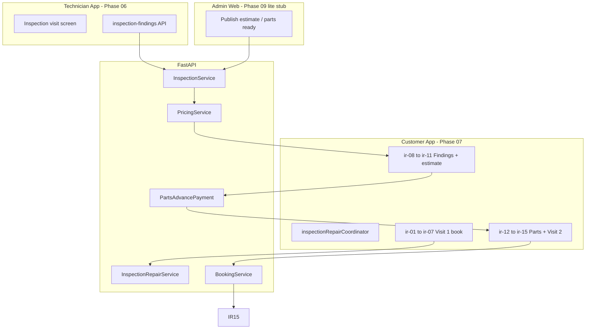

# PHASE 07 — Inspection + Repair Two-Visit Loop (INSPECTION_REPAIR)

**Document ID:** `PHASE-07-inspection-repair-loop.md`  
**Version:** 1.0.0  
**Status:** Execution-ready specification  
**Depends on:** [PHASE-06-technician-field-execution.md](./PHASE-06-technician-field-execution.md) (Exit Gate §24 complete)  
**Unblocks:** [PHASE-08-payments-invoicing-closure.md](./PHASE-08-payments-invoicing-closure.md)  
**Estimated effort:** 12–18 engineer-days (single developer + Cursor agent)

**Authority chain:**

1. [`docs/architecture/02-product-flows.md`](../architecture/02-product-flows.md) § Inspection-and-repair — **primary flow truth** (no customer walkthrough folder exists).
2. [`docs/architecture/04-state-machines.md`](../architecture/04-state-machines.md) — Job Card, Visit, Estimate, Payment lifecycles for `INSPECTION_REPAIR`.
3. [`docs/architecture/03-domain-model.md`](../architecture/03-domain-model.md) — Inspection, InspectionFinding, JobPart, JobLabour aggregates.
4. [`docs/architecture/07-backend-architecture.md`](../architecture/07-backend-architecture.md) § Inspection/repair service.
5. [`docs/AUDIT-REPORT.md`](../AUDIT-REPORT.md) — C5 resolution: **this document is the customer UI spec** (inline §14).
6. [`docs/architecture/01-product-constitution.md`](../architecture/01-product-constitution.md) — two-visit invariant; technician cannot set selling prices.

**Critical glossary (repeat in code review):**

> **"Service + repair" tab** = General Service **with optional repair add-ons** (Phase 04). It is **NOT** Inspection + Repair.  
> **Inspection + Repair** = `flow_policy = INSPECTION_REPAIR`, a **separate catalog offering** with **two visits** (inspection then repair).  
> **Visit 1** = `visit_type = INSPECTION`. **Visit 2** = `visit_type = REPAIR`. Never collapse into one appointment.  
> **Findings** = technician-submitted `InspectionFinding` rows. **Estimate** = admin/pricing-published commercial proposal sourced from findings.  
> **Parts advance** = partial payment (`Payment.purpose = PARTS_ADVANCE`) before parts procurement; gates repair slot booking when policy requires.

---

## 0. Phase Summary

### Objective

Deliver the **complete INSPECTION_REPAIR commercial loop**: customer books **visit 1 (inspection)**, technician submits findings (Phase 06), backend publishes inspection-sourced estimate, customer reviews findings and **accepts/rejects estimate**, pays **parts advance** when configured, waits for **parts readiness**, books **visit 2 (repair)**, and sees repair visit progress through QC completion.

This phase **defines the missing customer UI inline** (screens `ir-01` through `ir-16`) because no walkthrough folder exists ([`AUDIT-REPORT.md`](../AUDIT-REPORT.md) C5). Technician inspection submission (Phase 06) **feeds** customer estimate approval in this phase.

### What Phase 07 delivers

| ID | Deliverable | Description |
|----|-------------|-------------|
| P07-A | Catalog offering | `inspection-and-repair` service offering with `flow_policy=INSPECTION_REPAIR`, inspection fee disclosure, two-visit copy |
| P07-B | Customer journey visit 1 | `ir-01`–`ir-07`: offering → symptoms → photos → vehicle → details → inspection slot → visit 1 confirmed |
| P07-C | Findings → estimate loop | Technician findings trigger estimate publish; customer `ir-08`–`ir-11`: awaiting → findings review → estimate → accept/reject |
| P07-D | Parts advance | `ir-12` parts advance payment UI; `POST /payment-order` with `PARTS_ADVANCE`; webhook stub or minimal capture |
| P07-E | Parts readiness | `ir-13` waiting state; admin/parts workflow marks parts ready; `PARTS_PENDING` → `REPAIR_BOOKING_REQUIRED` |
| P07-F | Visit 2 booking | `ir-14` repair slot selection (`visit_type=REPAIR`); `ir-15` visit 2 confirmed |
| P07-G | Repair execution visibility | `ir-16` booking detail with repair visit timeline; feeds Phase 08 invoice |
| P07-H | `inspectionRepairCoordinator` | Maps `allowed_actions` / `customer_progress` to routes; never infers policy from tab |
| P07-I | Backend services | `InspectionRepairService`, estimate publish from inspection, parts advance policy, visit 2 book gate |
| P07-J | Job Card status extensions | `INSPECTION_BOOKED`, `ESTIMATE_PENDING`, `REPAIR_APPROVAL_DUE`, `PARTS_ADVANCE_DUE`, `PARTS_PENDING`, `REPAIR_BOOKED`, `REPAIR_IN_PROGRESS` |
| P07-K | DB extensions | `inspections`, `inspection_findings` (if not Phase 06), `job_parts` readiness, `parts_advance_allocations` |
| P07-L | Tests | Two visits remain distinct; approval + parts payment gates; estimate supersession; visit 2 reschedule rules |

### What Phase 07 explicitly does NOT deliver

| Item | Phase |
|------|-------|
| General Service or add-on repair cart | 03, 04 |
| One-man / SOS journeys | 05 |
| Full Razorpay production webhook hardening, refund automation | 08 |
| Final invoice derivation, balance payment, review screen | 08 |
| Admin web parts procurement ERP, supplier integrations | 09 |
| Push notification delivery workers | 11 |
| Automatic dispatch optimization | Future |
| Inspection fee Razorpay before visit 1 (optional policy — default: fee on estimate or at visit 1 confirm only) | Configurable; default in §6.3 |

### Canonical journey (Phase 07)

```text
Visit 1 path (customer books inspection):
ir-01-offering → ir-02-symptoms → ir-03-photos → ir-04-vehicle (picker)
  → ir-05-details → [optional advisor if configured] → ir-06-inspection-slot
  → ir-07-visit1-confirmed

Technician field (Phase 06 — prerequisite):
  visit 1 ON_SITE → INSPECTION_IN_PROGRESS → inspection-findings submitted
  → admin/pricing publishes inspection-sourced Estimate

Post-inspection commercial loop (Phase 07):
ir-08-awaiting (push/deep link) → ir-09-findings-review → ir-10-estimate
  → ir-11-accept → [if parts advance policy] ir-12-parts-advance
  → ir-13-parts-pending → ir-14-repair-slot → ir-15-visit2-confirmed
  → technician repair visit + QC → ir-16-repair-progress
  → (final invoice + balance payment in Phase 08)
```

**Server policy:** `flow_policy = INSPECTION_REPAIR`, `estimate_requirement = POST_INSPECTION`, `visit_count = 2`.

### Success statement

At Phase 07 exit, a customer can book inspection visit 1, receive findings-backed estimate after technician submission, accept estimate, pay parts advance when required, book repair visit 2 only after parts readiness + valid estimate, and see distinct visit 1 / visit 2 statuses on booking detail. API tests prove: (1) visit types never merge; (2) repair slot blocked until estimate accepted + parts advance captured + parts ready; (3) visit 2 reschedule preserves approved estimate; (4) technician findings cannot set customer prices.

---

## 1. Starting State

### 1.1 Phase 06 exit gate (must be true)

| Prerequisite | Verification |
|--------------|--------------|
| Technician app: assigned visits list, navigation, check-in | Device smoke on technician app |
| `POST /v1/technician/visits/{id}/start-inspection` | Integration test |
| `POST /v1/technician/visits/{id}/inspection-findings` | Creates findings + recommended JobPart/JobLabour |
| Visit lifecycle: `INSPECTION_IN_PROGRESS` → `INSPECTION_SUBMITTED` | State machine test |
| `visits` table with `visit_type` enum | DB migration applied |
| Media signed upload for inspection photos | Upload + attach to finding |
| Customer General Service E2E (Phase 03) still passes regression | CI green |
| Phase 04 advisor loop unaffected | Regression §22 |

### 1.2 Repository state at Phase 07 start

```text
apps/customer/
  # No ir-* routes; no inspectionRepairCoordinator
  # Home tabs: general, repair (GS add-ons), oneman, sos — NO inspection tab
apps/technician/
  app/(tech)/visits/[id]/inspection.tsx   # Phase 06
backend/
  app/modules/visits/                     # Phase 06
  app/modules/inspections/                # Partial or missing publish→estimate
  app/modules/job_cards/                  # No INSPECTION_REPAIR status extensions
  # No parts advance payment purpose handling
packages/contracts/
  # No InspectionFinding, PartsAdvance, visit_type=REPAIR booking types
```

**Absent at start:**

- Customer screens `ir-01` through `ir-16`
- `inspectionRepairCoordinator`
- `InspectionRepairService` domain logic
- Estimate `source=inspection` publish workflow
- Parts advance calculation and payment order
- Visit 2 booking with `visit_type=REPAIR` gate
- Catalog seed for `inspection-and-repair` offering
- Job Card status enum values for inspection/repair loop

### 1.3 Architecture vs audit resolution (apply in Phase 07)

| Topic | Winning rule | Phase 07 implementation |
|-------|--------------|---------------------------|
| Customer UI for IR | **This document §14** (audit C5) | Inline screen specs `ir-*`; no walkthrough folder |
| Entry point | Architecture + audit | **Not** Service+repair tab; catalog section + `GET /v1/services?flow_policy=INSPECTION_REPAIR` |
| Two visits | Constitution §16, `02-product-flows` | Separate bookings/visits; visit 2 only after estimate + parts gates |
| Pre-inspection price | `02-product-flows` §180 | Show inspection fee or "quote after inspection"; **no fabricated repair total** |
| Technician pricing | Constitution §5 | Findings recommend parts; admin/pricing publishes estimate |
| Visit 2 reschedule | `02-product-flows` §249 | Reschedule without discarding approved estimate / completed inspection |
| Parts advance % | Open question #9 | Default **60%** of parts subtotal in dev fixtures; configurable via `pricing_policies` |
| Inspection fee | Open question #8 | Default **₹499** inspection fee line on visit 1 estimate or pre-book disclosure |

---

## 2. Desired End State

### 2.1 Repository tree (additions)

```text
apps/customer/
  app/
    inspection-repair/
      _layout.tsx
      offering.tsx              # ir-01
      symptoms.tsx              # ir-02
      photos.tsx                # ir-03
    vehicle/                    # reuse gs-02–05 with flowPolicy=INSPECTION_REPAIR
    checkout/
      details.tsx               # ir-05 (query param flow=ir)
      inspection-slot.tsx       # ir-06
      repair-slot.tsx           # ir-14
    job-card/[id]/
      awaiting-findings.tsx     # ir-08
      findings.tsx              # ir-09
      estimate.tsx              # ir-10 (shared component; IR copy variant)
      parts-advance.tsx         # ir-12
      parts-pending.tsx         # ir-13
    booking/[id]/
      index.tsx                 # ir-07, ir-15, ir-16 variants
  src/
    coordinators/inspectionRepairCoordinator.ts
    components/InspectionFlowRail.tsx   # 14-dot rail for IR
    components/FindingCard.tsx
    components/PartsAdvanceSummary.tsx
backend/
  app/modules/inspections/
    service.py                  # publish estimate from findings
    router.py                   # customer GET findings (safe DTO)
  app/modules/inspection_repair/
    service.py                  # gates: approval, parts advance, visit 2
    policy.py                   # parts advance %, inspection fee rules
  app/modules/parts/
    models.py                   # job_parts readiness
    service.py                  # mark_ready, list_for_job_card
  app/modules/payments/
    parts_advance.py            # PARTS_ADVANCE order creation
  alembic/versions/20260829_0007_phase07_inspection_repair.py
  tests/integration/test_inspection_repair_e2e.py
  tests/integration/test_parts_advance_gate.py
  tests/integration/test_visit2_booking_gate.py
packages/contracts/src/
  inspection.ts
  inspection-repair-flow.ts
  parts-advance.ts
```

### 2.2 Customer route map

| Screen ID | Route | Flow step |
|-----------|-------|-----------|
| `ir-01-offering` | `/inspection-repair/offering` | 1 of 14 |
| `ir-02-symptoms` | `/inspection-repair/symptoms` | 2 of 14 |
| `ir-03-photos` | `/inspection-repair/photos` | 3 of 14 |
| `ir-04-vehicle` | `/vehicle/make?flow=ir` … `/vehicle/fuel` | 4–7 of 14 |
| `ir-05-details` | `/checkout/details?flow=ir&jobCardId=` | 8 of 14 |
| `ir-06-inspection-slot` | `/checkout/inspection-slot?jobCardId=` | 9 of 14 |
| `ir-07-visit1-confirmed` | `/booking/{id}?phase=visit1` | 10 of 14 |
| `ir-08-awaiting` | `/job-card/{id}/awaiting-findings` | — (post visit 1) |
| `ir-09-findings-review` | `/job-card/{id}/findings` | 11 of 14 |
| `ir-10-estimate` | `/job-card/{id}/estimate?source=inspection` | 12 of 14 |
| `ir-11-accept` | (action on ir-10) | — |
| `ir-12-parts-advance` | `/job-card/{id}/parts-advance` | 13 of 14 |
| `ir-13-parts-pending` | `/job-card/{id}/parts-pending` | — |
| `ir-14-repair-slot` | `/checkout/repair-slot?jobCardId=` | 14 of 14 |
| `ir-15-visit2-confirmed` | `/booking/{id}?phase=visit2` | — |
| `ir-16-repair-progress` | `/booking/{id}?view=repair-progress` | — |

### 2.3 Backend capability summary

| Capability | Endpoint / service |
|------------|-------------------|
| Create IR job card | `POST /v1/job-cards` with `inspection-and-repair` slug |
| Book visit 1 | `POST /v1/job-cards/{id}/book` with `visit_type=INSPECTION` |
| Technician findings | `POST /v1/technician/visits/{id}/inspection-findings` (Phase 06) |
| Publish estimate | `POST /v1/admin/job-cards/{id}/estimate` or auto on findings submit |
| Customer findings read | `GET /v1/job-cards/{id}/inspection-findings` |
| Accept/reject estimate | `POST .../estimates/{id}/accept`, `reject` |
| Parts advance order | `POST /v1/job-cards/{id}/parts-advance/payment-order` |
| Parts status | `GET /v1/job-cards/{id}/parts-status` |
| Mark parts ready | `POST /v1/admin/job-cards/{id}/parts-ready` |
| Book visit 2 | `POST /v1/job-cards/{id}/book-repair` or `book` with `visit_type=REPAIR` |
| Customer progress | Composed on Job Card / Booking GET |

---

## 3. Why This Phase Exists Here

Phase 07 sits **after Phase 06 (technician field execution)** because the inspection-repair loop is meaningless without technician ability to perform visit 1, capture evidence, and submit structured findings. It sits **before Phase 08 (payments/invoicing closure)** because parts advance is a distinct payment purpose that gates visit 2 booking, and final invoice derivation requires completed repair scope.

Per [`18-implementation-roadmap.md`](../architecture/18-implementation-roadmap.md) Phase 6 (architecture numbering):

> Work: inspection findings, estimate from inspection, approval/rejection, parts advance policy, parts readiness, visit 2 booking, repair execution, final invoice.

Implementation README maps this to **Phase 07** with Phase 08 handling Razorpay hardening and final invoice.

**Risk if skipped or merged with General Service:**

- Customers book uncertain work with a fabricated pre-inspection repair price (constitution violation).
- Single-visit booking collapses the CARATOM two-visit differentiator.
- Technician field findings have no customer approval surface.
- Parts procurement starts without advance payment or explicit customer consent.
- Visit 2 scheduled before parts are available, causing failed repair visits.

**Risk if done before Phase 06:**

- No technician path to submit findings; estimate publish cannot be tested E2E.
- Visit 1 execution states untested; customer "awaiting findings" stalls forever.

---

## 4. Source Material

| Source | Use in Phase 07 |
|--------|-----------------|
| [`02-product-flows.md`](../architecture/02-product-flows.md) § Inspection-and-repair | Canonical customer journey sequence |
| [`04-state-machines.md`](../architecture/04-state-machines.md) | Job Card IR statuses, Visit types, `customer_progress` |
| [`03-domain-model.md`](../architecture/03-domain-model.md) | Inspection, InspectionFinding, JobPart, Estimate `source=inspection` |
| [`07-backend-architecture.md`](../architecture/07-backend-architecture.md) § Inspection/repair service | Publish estimate, parts advance unlock, visit 2 gate |
| [`08-data-model.md`](../architecture/08-data-model.md) | `inspections`, `inspection_findings`, `job_parts` indexes |
| [`09-api-contracts.md`](../architecture/09-api-contracts.md) | Extend with IR-specific endpoints |
| [`11-screen-specifications.md`](../architecture/11-screen-specifications.md) | Inspection visit (technician), estimate screen semantics |
| [`06-frontend-architecture.md`](../architecture/06-frontend-architecture.md) | `inspectionRepairCoordinator` |
| [`15-testing-strategy.md`](../architecture/15-testing-strategy.md) | E2E path #5: inspection → estimate → parts → repair |
| [`16-analytics.md`](../architecture/16-analytics.md) | `inspection_to_estimate_time`, `parts_advance_conversion` |
| [`19-open-questions.md`](../architecture/19-open-questions.md) | Inspection fee, parts advance % — defaults in §6.3 |
| [`AUDIT-REPORT.md`](../AUDIT-REPORT.md) C5 | This doc replaces missing walkthrough folder |
| [PHASE-06-technician-field-execution.md](./PHASE-06-technician-field-execution.md) | Technician inspection submission prerequisite |
| [PHASE-03-general-service-e2e.md](./PHASE-03-general-service-e2e.md) | Reuse vehicle picker, checkout patterns |
| [PHASE-04-service-repair-advisor.md](./PHASE-04-service-repair-advisor.md) | Advisor optional branch for IR if configured |

---

## 5. Architectural Context

### 5.1 INSPECTION_REPAIR system context



### 5.2 Two-visit trust boundary

```text
┌─────────────────────────────────────────────────────────────────────┐
│  VISIT 1 — INSPECTION (commercially: diagnose, not repair)          │
│  - Customer books with symptoms + optional photos                   │
│  - May charge inspection fee (policy); NO full repair estimate      │
│  - Technician submits findings; cannot set selling prices             │
│  - Visit completes → INSPECTION_SUBMITTED                           │
└──────────────────────────────┬──────────────────────────────────────┘
                               │ Estimate publish (source=inspection)
┌──────────────────────────────▼──────────────────────────────────────┐
│  COMMERCIAL GATE — Customer approval + parts advance                  │
│  - Customer reviews findings + estimate                                 │
│  - Accept → PARTS_ADVANCE_DUE (if policy) → PARTS_PENDING → ready       │
│  - Reject → EDITABLE / support path                                     │
└──────────────────────────────┬──────────────────────────────────────┘
                               │ visit_type=REPAIR + parts ready + valid estimate
┌──────────────────────────────▼──────────────────────────────────────┐
│  VISIT 2 — REPAIR (execute approved scope)                          │
│  - Separate booking/slot; may be different day                      │
│  - Technician service visit + fitted parts + QC                     │
│  - Final invoice derived in Phase 08                                  │
└─────────────────────────────────────────────────────────────────────┘
```

### 5.3 Job Card state machine (INSPECTION_REPAIR overlay)

Per [`04-state-machines.md`](../architecture/04-state-machines.md):

```text
EDITABLE → ... → READY_TO_BOOK
  → (book visit 1) → INSPECTION_BOOKED
  → (visit 1 starts) → INSPECTION_IN_PROGRESS
  → (findings submitted, no estimate yet) → ESTIMATE_PENDING
  → (estimate READY) → REPAIR_APPROVAL_DUE
  → (customer accepts) → PARTS_ADVANCE_DUE | REPAIR_BOOKING_REQUIRED
  → (parts advance captured) → PARTS_PENDING | REPAIR_BOOKING_REQUIRED
  → (parts ready) → REPAIR_BOOKING_REQUIRED
  → (book visit 2) → REPAIR_BOOKED
  → (visit 2 in progress) → REPAIR_IN_PROGRESS
  → (QC complete) → COMPLETED (invoice Phase 08)
```

### 5.4 Customer progress read model mapping

| `customer_progress` | Customer screen | `allowed_actions` examples |
|---------------------|-----------------|---------------------------|
| `BUILDING` | ir-01–ir-06 | `EDIT_JOB_CARD`, `FINALIZE`, `SELECT_SLOT` |
| `BOOKING_CONFIRMED` | ir-07 | `VIEW_BOOKING` (visit 1) |
| `VISIT_IN_PROGRESS` | ir-07 / ir-08 | `VIEW_BOOKING` |
| `ESTIMATE_APPROVAL_REQUIRED` | ir-09, ir-10 | `VIEW_FINDINGS`, `ACCEPT_ESTIMATE`, `REJECT_ESTIMATE` |
| `PARTS_PAYMENT_REQUIRED` | ir-12 | `PAY_PARTS_ADVANCE` |
| `REPAIR_BOOKING_REQUIRED` | ir-13, ir-14 | `SELECT_REPAIR_SLOT` |
| `BOOKING_CONFIRMED` (visit 2) | ir-15 | `VIEW_BOOKING` |
| `VISIT_IN_PROGRESS` (repair) | ir-16 | `VIEW_BOOKING` |
| `PAYMENT_DUE` | Phase 08 | `PAY_INVOICE` |
| `COMPLETED` | Phase 08 | `SUBMIT_REVIEW` |

### 5.5 Data flow: findings → estimate → approval

```text
1. Technician POST inspection-findings
   → inspections row + inspection_findings rows
   → job_parts (status=RECOMMENDED) + job_labour (status=RECOMMENDED)

2. PricingService (trigger: admin publish OR auto on submit if feature flag)
   → Estimate version source=inspection, status=READY
   → estimate_line_items from recommended parts/labour + inspection fee
   → parts_advance_amount = policy % × parts_subtotal
   → JobCard → REPAIR_APPROVAL_DUE
   → customer_progress → ESTIMATE_APPROVAL_REQUIRED
   → outbox: notification intent (Phase 11 stub OK)

3. Customer GET inspection-findings (safe DTO: no internal cost)
   → ir-09 findings review

4. Customer POST estimates/{id}/accept
   → If parts_advance_amount > 0 → PARTS_ADVANCE_DUE
   → Else if parts need ordering → PARTS_PENDING
   → Else → REPAIR_BOOKING_REQUIRED

5. Customer POST parts-advance/payment-order → Razorpay
   → webhook CAPTURED → PARTS_PENDING or REPAIR_BOOKING_REQUIRED

6. Admin POST parts-ready (or inventory consume prep)
   → REPAIR_BOOKING_REQUIRED

7. Customer POST book-repair with visit_type=REPAIR
   → New visit row linked to same job_card
   → REPAIR_BOOKED
```

---

## 6. Exact Implementation Scope + Out of Scope

### 6.1 In scope (mandatory)

| ID | Requirement |
|----|-------------|
| S1 | Catalog seed: `inspection-and-repair` offering, `flow_policy=INSPECTION_REPAIR`, `visit_count=2` |
| S2 | Home catalog section "Uncertain repair?" linking to ir-01 (NOT Service+repair tab) |
| S3 | Customer screens ir-01 through ir-16 per §14 inline specs |
| S4 | `inspectionRepairCoordinator` driven by `allowed_actions` / `customer_progress` |
| S5 | `POST /v1/job-cards` with IR slug; concerns + optional photo refs |
| S6 | Visit 1 booking: `visit_type=INSPECTION` slot list + hold + book |
| S7 | `GET /v1/job-cards/{id}/inspection-findings` customer-safe DTO |
| S8 | Estimate publish from inspection findings (`source=inspection`) |
| S9 | Customer accept/reject estimate with idempotency |
| S10 | Parts advance calculation per pricing policy (default 60% parts subtotal) |
| S11 | `POST /v1/job-cards/{id}/parts-advance/payment-order` + minimal webhook capture |
| S12 | `GET /v1/job-cards/{id}/parts-status` for ir-13 |
| S13 | Visit 2 booking gate: estimate accepted + parts advance paid (if due) + parts ready |
| S14 | `POST /v1/job-cards/{id}/book-repair` or `book` with `visit_type=REPAIR` |
| S15 | Job Card status enum extensions for IR lifecycle |
| S16 | Visit 2 reschedule without discarding approved estimate (within validity) |
| S17 | Integration test: full API path visit 1 → findings → estimate → parts → visit 2 |
| S18 | Regression: General Service, add-on repair, one-man paths unchanged |
| S19 | Analytics events: `inspection_booked`, `findings_viewed`, `estimate_accepted`, `parts_advance_paid`, `repair_booked` |
| S20 | InspectionFlowRail 14-dot progress for visit 1 funnel |

### 6.2 Out of scope (do not implement)

| ID | Item | Reason |
|----|------|--------|
| O1 | Final invoice issue, balance payment UI | Phase 08 |
| O2 | Full Razorpay refund automation on cancel | Phase 08 |
| O3 | Customer review / rating screen | Phase 08 |
| O4 | Push notification delivery | Phase 11 (stub outbox OK) |
| O5 | Admin web full parts procurement UI | Phase 09 |
| O6 | Supplier ERP, auto parts ordering | Future |
| O7 | Merging visit 1 and visit 2 into one slot | Constitution violation |
| O8 | Pre-inspection full repair estimate | Constitution violation |
| O9 | Technician setting selling prices on findings | Constitution violation |
| O10 | Service+repair tab routing to IR | Audit C2 — tab is GS add-ons |
| O11 | AI inspection / auto estimate without admin | Future |
| O12 | Multi-vehicle IR on one job card | BookingGroup future |

### 6.3 Assumptions and configurable defaults

| Parameter | Default (dev fixtures) | Config location |
|-----------|------------------------|-----------------|
| Offering slug | `inspection-and-repair` | `service_offerings` seed |
| Inspection fee | ₹499 (`49900` paise) | `pricing_policies` |
| Parts advance % | 60% of parts subtotal | `pricing_policies.parts_advance_percent` |
| Estimate validity | 14 days from publish | `estimates.valid_until` |
| Visit 1 duration | 60 minutes | offering `estimated_duration` |
| Visit 2 duration | 180 minutes (policy-driven from labour lines) | computed at book-repair |
| Advisor on IR | Optional; `advisor_requirement=REQUIRED_AFTER_INSPECTION` if configured | offering flag |
| Auto-publish estimate on findings | `true` in dev; `false` in prod until admin QA | `feature_settings` |
| Slot hold duration | 15 minutes | `SLOT_HOLD_MINUTES` |
| Launch geography | Koramangala | `service_area_rules` |
| Demo vehicle | Honda City 2019 Petrol Manual | fixtures |
| Demo symptoms | "Brake noise from front left. Steering vibration at low speed." | ir-02 default text |
| Demo findings | Worn brake pads, warped rotor recommendation | technician fixture |

Mark all defaults as **test data** per [`19-open-questions.md`](../architecture/19-open-questions.md) until production config sign-off.

---

## 7. Repository Changes

### 7.1 New files (create)

| Path | Purpose |
|------|---------|
| `backend/alembic/versions/20260829_0007_phase07_inspection_repair.py` | IR status enum, parts tables, inspection indexes |
| `backend/app/modules/inspection_repair/service.py` | Gate logic, visit 2 book |
| `backend/app/modules/inspection_repair/policy.py` | Parts advance %, inspection fee |
| `backend/app/modules/inspection_repair/router.py` | Customer IR endpoints |
| `backend/app/modules/inspections/service.py` | Findings read, estimate publish trigger |
| `backend/app/modules/inspections/router.py` | `GET inspection-findings` |
| `backend/app/modules/parts/models.py` | `job_parts` readiness columns |
| `backend/app/modules/parts/service.py` | `mark_ready`, status aggregate |
| `backend/app/modules/payments/parts_advance.py` | PARTS_ADVANCE orders |
| `backend/tests/integration/test_inspection_repair_e2e.py` | Full loop API test |
| `backend/tests/integration/test_parts_advance_gate.py` | Payment gate tests |
| `backend/tests/integration/test_visit2_booking_gate.py` | Visit 2 gate matrix |
| `backend/tests/unit/test_inspection_repair_policy.py` | Policy calculations |
| `packages/contracts/src/inspection.ts` | Finding DTOs |
| `packages/contracts/src/inspection-repair-flow.ts` | IR FlowDecision extensions |
| `packages/contracts/src/parts-advance.ts` | Parts advance DTOs |
| `apps/customer/src/coordinators/inspectionRepairCoordinator.ts` | Route mapping |
| `apps/customer/src/components/InspectionFlowRail.tsx` | 14-dot rail |
| `apps/customer/src/components/FindingCard.tsx` | ir-09 finding row |
| `apps/customer/src/components/PartsAdvanceSummary.tsx` | ir-12 breakdown |
| `apps/customer/src/components/VisitTimeline.tsx` | ir-07/15/16 timeline |
| `apps/customer/app/inspection-repair/_layout.tsx` | IR stack |
| `apps/customer/app/inspection-repair/offering.tsx` | ir-01 |
| `apps/customer/app/inspection-repair/symptoms.tsx` | ir-02 |
| `apps/customer/app/inspection-repair/photos.tsx` | ir-03 |
| `apps/customer/app/checkout/inspection-slot.tsx` | ir-06 |
| `apps/customer/app/checkout/repair-slot.tsx` | ir-14 |
| `apps/customer/app/job-card/[id]/awaiting-findings.tsx` | ir-08 |
| `apps/customer/app/job-card/[id]/findings.tsx` | ir-09 |
| `apps/customer/app/job-card/[id]/parts-advance.tsx` | ir-12 |
| `apps/customer/app/job-card/[id]/parts-pending.tsx` | ir-13 |
| `backend/scripts/seed_inspection_repair_offering.py` | Catalog seed |

### 7.2 Modified files

| Path | Change |
|------|--------|
| `apps/customer/app/(tabs)/home.tsx` | Add "Uncertain repair?" section → ir-01 |
| `apps/customer/app/vehicle/*.tsx` | Support `flow=ir` query; InspectionFlowRail |
| `apps/customer/app/checkout/details.tsx` | Branch finalization for IR flow |
| `apps/customer/app/job-card/[id]/estimate.tsx` | IR variant copy when `source=inspection` |
| `apps/customer/app/booking/[id]/index.tsx` | Visit 1/2 confirmed + repair progress variants |
| `apps/customer/app/_layout.tsx` | Register inspection-repair stack |
| `backend/app/modules/job_cards/models.py` | IR status enum values |
| `backend/app/modules/job_cards/service.py` | IR state transitions |
| `backend/app/modules/bookings/service.py` | `book_repair`, visit_type handling |
| `backend/app/modules/estimates/service.py` | `source=inspection` publish |
| `backend/app/core/flow_decision.py` | IR FlowDecision rules |
| `backend/app/main.py` | Include new routers |
| `packages/contracts/src/index.ts` | Export IR types |
| `packages/api-client/src/client.ts` | IR mutation helpers |

### 7.3 Files explicitly NOT created

- `apps/customer/app/(tabs)/home.tsx` changes that add fifth tab "Inspect+repair"
- `apps/customer/app/job-card/[id]/repairs-cart.tsx` reuse only from Phase 04 for GS — not IR
- Customer routes that book repair before estimate accept

---

## 8. Detailed Implementation Sequence (Task 7.Y)

Execute in order unless noted **parallel OK**. Each task lists verification before marking complete.

### Block A — Schema & catalog (Days 1–2)

#### Task 7.1 — Alembic: IR job card statuses

Extend `job_card_status` enum:

```sql
ALTER TYPE job_card_status ADD VALUE IF NOT EXISTS 'INSPECTION_BOOKED';
ALTER TYPE job_card_status ADD VALUE IF NOT EXISTS 'INSPECTION_IN_PROGRESS';
ALTER TYPE job_card_status ADD VALUE IF NOT EXISTS 'ESTIMATE_PENDING';
ALTER TYPE job_card_status ADD VALUE IF NOT EXISTS 'REPAIR_APPROVAL_DUE';
ALTER TYPE job_card_status ADD VALUE IF NOT EXISTS 'PARTS_ADVANCE_DUE';
ALTER TYPE job_card_status ADD VALUE IF NOT EXISTS 'PARTS_PENDING';
ALTER TYPE job_card_status ADD VALUE IF NOT EXISTS 'REPAIR_BOOKED';
ALTER TYPE job_card_status ADD VALUE IF NOT EXISTS 'REPAIR_IN_PROGRESS';
```

**Verify:** `uv run alembic upgrade head`; enum values present.

#### Task 7.2 — Alembic: job_parts readiness

```sql
ALTER TABLE job_parts ADD COLUMN IF NOT EXISTS readiness_status TEXT NOT NULL DEFAULT 'RECOMMENDED'
  CHECK (readiness_status IN ('RECOMMENDED','ORDERED','IN_TRANSIT','READY','FITTED','CANCELLED'));
ALTER TABLE job_parts ADD COLUMN IF NOT EXISTS ordered_at TIMESTAMPTZ;
ALTER TABLE job_parts ADD COLUMN IF NOT EXISTS ready_at TIMESTAMPTZ;
CREATE INDEX idx_job_parts_job_card_readiness ON job_parts(job_card_id, readiness_status);
```

**Verify:** Insert recommended part; transition to READY.

#### Task 7.3 — Seed inspection-and-repair offering

```python
# slug: inspection-and-repair
# flow_policy: INSPECTION_REPAIR
# price_presentation: quote_after_inspection
# visit_count: 2
# estimated_duration_minutes: 60 (visit 1)
# display copy: "Inspection + repair · 2 visits"
```

Add `pricing_policies` row with `parts_advance_percent=60`, `inspection_fee_minor=49900`.

**Verify:** `GET /v1/services/inspection-and-repair` returns correct policy.

#### Task 7.4 — Catalog home section

`GET /v1/catalog/home` adds section:

```json
{
  "uncertain_repair": {
    "title": "Uncertain repair?",
    "subtitle": "Book inspection first · quote after we see the car",
    "offering_slug": "inspection-and-repair",
    "cta": "Start inspection booking"
  }
}
```

**Verify:** Customer home renders section; CTA navigates to ir-01.

### Block B — Backend domain (Days 2–6)

#### Task 7.5 — `POST /v1/job-cards` for IR

Request:

```json
{
  "service_offering_slug": "inspection-and-repair",
  "vehicle_context": { "make": "Honda", "model": "City", "year": 2019, "fuel_type": "PETROL", "transmission": "MANUAL" },
  "concerns": [{ "text": "Brake noise from front left. Steering vibration at low speed." }],
  "photo_asset_ids": ["uuid-optional"]
}
```

Creates JobCard `EDITABLE`, `flow_policy=INSPECTION_REPAIR`. No repair estimate at create.

Returns `FlowDecision` with `EDIT_SYMPTOMS`, `REQUEST_ESTIMATE` **not** allowed (no pre-inspection estimate).

**Verify:** pytest `test_create_ir_job_card_no_estimate`.

#### Task 7.6 — Visit 1 slot + book

Extend `GET /v1/job-cards/{id}/slots?visit_type=INSPECTION`.

`POST /v1/job-cards/{id}/book` body:

```json
{
  "slot_hold_id": "uuid",
  "visit_type": "INSPECTION"
}
```

Creates `bookings` + `visits` with `visit_type=INSPECTION`. JobCard → `INSPECTION_BOOKED`.

**Verify:** Visit row type INSPECTION; no REPAIR visit created.

#### Task 7.7 — Publish estimate from findings

On technician `inspection-findings` submit (Phase 06 hook) OR `POST /v1/admin/job-cards/{id}/estimate`:

1. Load recommended `job_parts` + `job_labour`
2. Build `estimate_line_items`: parts, labour, inspection fee
3. Calculate `parts_advance_amount = floor(parts_subtotal * policy_percent / 100)`
4. Create Estimate `source=inspection`, `status=READY`
5. JobCard → `REPAIR_APPROVAL_DUE`
6. `customer_progress` → `ESTIMATE_APPROVAL_REQUIRED`

**Verify:** Estimate total ≠ pre-inspection guess; includes inspection fee line.

#### Task 7.8 — `GET /v1/job-cards/{id}/inspection-findings`

Customer-safe response (no internal cost, no SKU cost metadata):

```json
{
  "inspection_id": "uuid",
  "submitted_at": "2026-08-20T14:30:00Z",
  "summary": "Front brake wear and rotor runout detected.",
  "findings": [
    {
      "id": "uuid",
      "title": "Front brake pads worn",
      "severity": "HIGH",
      "customer_explanation": "Pads below safe thickness on front left.",
      "recommendation": "Replace front brake pads",
      "photo_urls": ["signed-url"],
      "estimated_repair_category": "Brakes"
    }
  ],
  "estimate_id": "uuid-if-published",
  "allowed_actions": ["VIEW_ESTIMATE", "ACCEPT_ESTIMATE"]
}
```

**Verify:** Customer cannot see `unit_cost` or technician internal notes.

#### Task 7.9 — Accept / reject estimate

`POST /v1/job-cards/{id}/estimates/{estimate_id}/accept` with idempotency.

On accept:

- If `parts_advance_amount > 0` → `PARTS_ADVANCE_DUE`, progress `PARTS_PAYMENT_REQUIRED`
- Else if any part `readiness_status != READY` → `PARTS_PENDING`
- Else → `REPAIR_BOOKING_REQUIRED`

`POST reject` → JobCard `EDITABLE` or `CANCELLED` per policy; offer support ticket.

**Verify:** Accept blocked if estimate expired.

#### Task 7.10 — Parts advance payment order

`POST /v1/job-cards/{id}/parts-advance/payment-order`:

```json
{
  "estimate_id": "uuid",
  "expected_amount_minor": 840000
}
```

Creates `payments` row `purpose=PARTS_ADVANCE`, Razorpay order. Returns:

```json
{
  "payment_id": "uuid",
  "razorpay_order_id": "order_xxx",
  "amount_minor": 840000,
  "currency": "INR",
  "key_id": "rzp_test_xxx"
}
```

Webhook handler (minimal Phase 07): on `payment.captured` → update payment `CAPTURED` → transition JobCard.

**Verify:** Repair slot API returns 409 until payment captured when advance due.

#### Task 7.11 — Parts status endpoint

`GET /v1/job-cards/{id}/parts-status`:

```json
{
  "all_ready": false,
  "parts_advance_captured": true,
  "parts": [
    { "description": "Front brake pad set", "readiness_status": "ORDERED", "eta_label": "Expected Wed 21" }
  ],
  "customer_progress": "PARTS_PAYMENT_REQUIRED"
}
```

**Verify:** `all_ready=true` unlocks `SELECT_REPAIR_SLOT` in allowed_actions.

#### Task 7.12 — Admin parts ready (stub for Phase 09)

`POST /v1/admin/job-cards/{id}/parts-ready` — marks all ORDERED parts READY.

JobCard → `REPAIR_BOOKING_REQUIRED` if advance satisfied.

**Verify:** Integration test with admin token.

#### Task 7.13 — Book visit 2 (repair)

`POST /v1/job-cards/{id}/book-repair`:

```json
{
  "slot_hold_id": "uuid",
  "visit_type": "REPAIR"
}
```

Gate checks (transactional):

1. JobCard in `REPAIR_BOOKING_REQUIRED` or `PARTS_PENDING` with all_ready
2. Accepted estimate not expired
3. Parts advance captured if `parts_advance_amount > 0`
4. No overlapping REPAIR visit already SCHEDULED for same job card

Creates second `visit` linked to same `job_card`. JobCard → `REPAIR_BOOKED`.

**Verify:** Attempt book-repair before accept → `409 INVALID_STATE_TRANSITION`.

#### Task 7.14 — Visit 2 reschedule

`POST /v1/bookings/{id}/reschedule` with `visit_type=REPAIR`:

- Preserves accepted estimate reference
- Preserves completed INSPECTION visit record
- Revalidates estimate `valid_until` and parts readiness

**Verify:** Reschedule after estimate expiry → `ESTIMATE_EXPIRED` with `allowed_actions: ["CONTACT_SUPPORT"]`.

#### Task 7.15 — FlowDecision for IR

Extend `flow_decision.py` with IR matrix. Never emit `CREATE_ADVISOR_CASE` unless offering configured.

**Verify:** Unit test matrix 20+ combinations.

### Block C — Customer mobile (Days 6–12)

#### Task 7.16 — `inspectionRepairCoordinator`

```typescript
export function routeFromInspectionRepairState(
  jobCard: JobCard,
  flowDecision: FlowDecision,
): string {
  const progress = jobCard.customer_progress;
  if (progress === 'ESTIMATE_APPROVAL_REQUIRED') {
    if (flowDecision.allowed_actions.includes('VIEW_FINDINGS')) return `/job-card/${jobCard.id}/findings`;
    return `/job-card/${jobCard.id}/estimate?source=inspection`;
  }
  if (progress === 'PARTS_PAYMENT_REQUIRED') return `/job-card/${jobCard.id}/parts-advance`;
  if (progress === 'REPAIR_BOOKING_REQUIRED') {
    const parts = jobCard.parts_status;
    if (parts && !parts.all_ready) return `/job-card/${jobCard.id}/parts-pending`;
    return `/checkout/repair-slot?jobCardId=${jobCard.id}`;
  }
  // ... full matrix in coordinator file
}
```

**Verify:** Unit tests for each `customer_progress` value.

#### Task 7.17 — Screens ir-01 through ir-07

Implement per §14.1–§14.7. Reuse vehicle picker from Phase 03 with `flow=ir` and InspectionFlowRail.

On ir-06 confirm: `POST slot-holds` + `POST book` with `visit_type=INSPECTION`.

**Verify:** Manual device walkthrough visit 1 book.

#### Task 7.18 — Screens ir-08 through ir-11

Deep link `caratom://job-card/{id}/findings` opens ir-09 when estimate ready.

ir-10 estimate shows inspection-sourced lines + parts advance disclosure footnote.

**Verify:** Accept navigates to ir-12 or ir-14 per FlowDecision.

#### Task 7.19 — Screens ir-12 through ir-16

ir-12: Razorpay checkout sheet (or WebView) for parts advance.

ir-13: Polling `parts-status` every 30s or pull-to-refresh.

ir-14: Repair slot grid; subtitle "Repair visit · ~3 hr".

ir-16: Visit timeline showing visit 1 COMPLETED + visit 2 status.

**Verify:** Full manual E2E with technician fixture submit.

### Block D — Integration & regression (Days 12–14)

#### Task 7.20 — Integration test full loop

```python
def test_inspection_repair_two_visit_e2e(client, technician_client, admin_client):
    # 1. Customer creates IR job card + books visit 1
    # 2. Technician submits findings
    # 3. Admin publishes estimate (or auto)
    # 4. Customer accepts + pays parts advance (mock webhook)
    # 5. Admin marks parts ready
    # 6. Customer books visit 2
    # 7. Assert two distinct visits, types INSPECTION + REPAIR
```

**Verify:** CI green.

#### Task 7.21 — Regression suite

Run Phase 03 GS E2E, Phase 04 add-on path smoke, Phase 05 one-man smoke.

**Verify:** No IR routes invoked in GS coordinator tests.

#### Task 7.22 — Contracts sync + OpenAPI

Update `packages/contracts` and verify `pnpm typecheck`.

**Verify:** All apps typecheck.

---

## 9. Mobile Implementation

### 9.1 `inspectionRepairCoordinator` (full rules)

The coordinator is the **only** place IR routing logic lives. Screens call coordinator on focus and after mutations.

| `customer_progress` | Primary route | Fallback |
|---------------------|---------------|----------|
| `BUILDING` | Resume last IR screen from `jobCardFlowStore` | `/inspection-repair/offering` |
| `BOOKING_CONFIRMED` + visit1 only | `/booking/{bookingId}?phase=visit1` | ir-07 |
| `VISIT_IN_PROGRESS` + inspection visit | `/booking/{bookingId}?phase=visit1` | ir-07 |
| `ESTIMATE_PENDING` | `/job-card/{id}/awaiting-findings` | ir-08 |
| `ESTIMATE_APPROVAL_REQUIRED` | `/job-card/{id}/findings` | ir-09 |
| `PARTS_PAYMENT_REQUIRED` | `/job-card/{id}/parts-advance` | ir-12 |
| `REPAIR_BOOKING_REQUIRED` + parts not ready | `/job-card/{id}/parts-pending` | ir-13 |
| `REPAIR_BOOKING_REQUIRED` + parts ready | `/checkout/repair-slot` | ir-14 |
| `BOOKING_CONFIRMED` + visit2 | `/booking/{bookingId}?phase=visit2` | ir-15 |
| `VISIT_IN_PROGRESS` + repair visit | `/booking/{bookingId}?view=repair-progress` | ir-16 |
| `COMPLETED` | `/booking/{bookingId}` | Phase 08 payment CTA |

### 9.2 Entry points (NOT Service+repair tab)

| Entry | Navigation |
|-------|------------|
| Home "Uncertain repair?" section | `/inspection-repair/offering` |
| `GET /v1/services?flow_policy=INSPECTION_REPAIR` list | Offering detail |
| Deep link `caratom://inspection-repair` | ir-01 |
| Orders list IR job card tap | Coordinator resolves current step |
| Push/deep link `caratom://job-card/{id}/findings` | ir-09 when estimate ready |

**Guard:** If user taps Service+repair tab, `generalServiceCoordinator` runs — never IR.

### 9.3 Shared components

| Component | Used on |
|-----------|---------|
| `InspectionFlowRail` | ir-01–ir-07 (14 dots); dots 8–14 on post-inspection screens |
| `FindingCard` | ir-09 |
| `PartsAdvanceSummary` | ir-12 |
| `VisitTimeline` | ir-07, ir-15, ir-16 |
| `PolicyNote` | ir-01, ir-10 (from Phase 03) |
| `EstimateLineList` | ir-10 (shared with gs-07 variant) |

### 9.4 Vehicle picker reuse

Query param `flow=ir` on `/vehicle/make`:

- Sets `InspectionFlowRail` steps 4–7 of 14
- On fuel **Use this car**: `POST /v1/job-cards` with IR slug
- Navigate `/checkout/details?flow=ir&jobCardId={id}` (skip pre-inspection estimate)

### 9.5 Photo upload (ir-03)

Optional step. Uses `POST /v1/media/signed-upload` (Phase 06).

- Max 6 photos
- Attach `photo_asset_ids` to job card on continue
- Skip allowed with confirmation: "Photos help diagnosis but are optional"

### 9.6 Parts advance payment UX (ir-12)

1. Show breakdown: parts subtotal, advance %, amount due now, balance after repair
2. CTA **Pay parts advance · ₹8,400** (dynamic)
3. Open Razorpay checkout
4. On success callback: poll `GET /v1/job-cards/{id}` until `PARTS_PENDING` or `REPAIR_BOOKING_REQUIRED`
5. On failure: retain on ir-12 with retry; never assume capture without server poll

### 9.7 Offline / resume

- Persist IR draft in `jobCardFlowStore` + `vehicleDraftStore`
- On app resume during payment: query `GET /v1/payments/{id}` — do not replay Razorpay blindly
- Awaiting findings (ir-08): show honest "We'll notify you when findings are ready"

### 9.8 Accessibility

- Finding severity: text label + icon (not color-only)
- Parts advance total announced before pay button
- Visit timeline: visit 1 vs visit 2 labels explicit

---

## 10. Backend Implementation

### 10.1 `InspectionRepairService`

```python
class InspectionRepairService:
    def can_book_repair_visit(self, job_card: JobCard) -> tuple[bool, str]:
        """Returns (allowed, reason_code)."""

    def transition_on_estimate_accept(self, job_card: JobCard, estimate: Estimate) -> JobCardStatus:
        """PARTS_ADVANCE_DUE | PARTS_PENDING | REPAIR_BOOKING_REQUIRED."""

    def transition_on_parts_advance_captured(self, job_card: JobCard) -> JobCardStatus:
        """PARTS_PENDING if parts not ready else REPAIR_BOOKING_REQUIRED."""

    def transition_on_parts_ready(self, job_card: JobCard) -> JobCardStatus:
        """REPAIR_BOOKING_REQUIRED."""
```

### 10.2 `InspectionService.publish_estimate_from_findings`

Triggered by:

- Technician findings submit + `feature_settings.auto_publish_inspection_estimate=true`
- OR `POST /v1/admin/job-cards/{id}/estimate` with `source=inspection`

Steps:

1. Validate inspection `INSPECTION_SUBMITTED`
2. Map `job_parts` RECOMMENDED → estimate part lines with catalog/admin prices
3. Map `job_labour` RECOMMENDED → labour lines
4. Add inspection fee line if policy requires
5. Compute parts advance
6. Supersede any prior READY estimate for same job card
7. Emit outbox `INSPECTION_ESTIMATE_READY`

### 10.3 Booking service extensions

`BookingService.confirm_booking` accepts `visit_type`:

- `INSPECTION`: first visit; JobCard → `INSPECTION_BOOKED`
- `REPAIR`: gated by `InspectionRepairService.can_book_repair_visit`

Separate `booking_snapshots` per visit; same `job_card_id`.

### 10.4 Payment: parts advance only

Phase 07 implements **PARTS_ADVANCE** purpose only. Final invoice payment in Phase 08.

Webhook idempotency by `razorpay_payment_id`. Client callback sets UI "verification pending" until webhook or poll confirms.

### 10.5 Advisor optional branch

If offering `advisor_requirement=REQUIRED_AFTER_INSPECTION`:

- After findings publish, create `AdvisorCase` before customer sees estimate
- Customer sees advisor status screen (reuse Phase 04 component) between ir-08 and ir-09
- Default seed: `NOT_REQUIRED` for dev E2E speed

### 10.6 Notifications (stub)

Insert `outbox_events` on:

- `INSPECTION_ESTIMATE_READY` → deep link findings
- `PARTS_READY` → deep link repair slot
- `REPAIR_VISIT_CONFIRMED` → booking detail

Delivery worker Phase 11; stub sufficient for Phase 07 exit.

### 10.7 Error codes (IR-specific)

| Code | When | `allowed_actions` |
|------|------|-------------------|
| `INSPECTION_NOT_SUBMITTED` | Estimate publish before findings | `VIEW_BOOKING` |
| `PARTS_ADVANCE_REQUIRED` | Book repair without payment | `PAY_PARTS_ADVANCE` |
| `PARTS_NOT_READY` | Book repair before parts ready | `VIEW_PARTS_STATUS` |
| `ESTIMATE_EXPIRED` | Accept/book after valid_until | `CONTACT_SUPPORT` |
| `VISIT_TYPE_MISMATCH` | Wrong visit_type on book | `SELECT_SLOT` |
| `TWO_VISIT_POLICY_VIOLATION` | Attempt merge visits | `CONTACT_SUPPORT` |

---

## 11. Database Implementation

### 11.1 Extend `job_cards` (if needed)

```sql
ALTER TABLE job_cards ADD COLUMN IF NOT EXISTS inspection_visit_id UUID REFERENCES visits(id);
ALTER TABLE job_cards ADD COLUMN IF NOT EXISTS repair_visit_id UUID REFERENCES visits(id);
ALTER TABLE job_cards ADD COLUMN IF NOT EXISTS accepted_inspection_estimate_id UUID REFERENCES estimates(id);
```

### 11.2 Table `inspections` (Phase 06 — verify or create)

```sql
CREATE TABLE IF NOT EXISTS inspections (
  id UUID PRIMARY KEY DEFAULT gen_random_uuid(),
  visit_id UUID NOT NULL UNIQUE REFERENCES visits(id),
  job_card_id UUID NOT NULL REFERENCES job_cards(id),
  checklist_version TEXT NOT NULL DEFAULT 'v1',
  status TEXT NOT NULL CHECK (status IN ('DRAFT','SUBMITTED')),
  summary TEXT,
  submitted_by UUID REFERENCES profiles(id),
  submitted_at TIMESTAMPTZ,
  created_at TIMESTAMPTZ NOT NULL DEFAULT now(),
  updated_at TIMESTAMPTZ NOT NULL DEFAULT now()
);
CREATE INDEX idx_inspections_job_card ON inspections(job_card_id);
```

### 11.3 Table `inspection_findings`

```sql
CREATE TABLE IF NOT EXISTS inspection_findings (
  id UUID PRIMARY KEY DEFAULT gen_random_uuid(),
  inspection_id UUID NOT NULL REFERENCES inspections(id) ON DELETE CASCADE,
  job_card_id UUID NOT NULL REFERENCES job_cards(id),
  title TEXT NOT NULL,
  severity TEXT NOT NULL CHECK (severity IN ('LOW','MEDIUM','HIGH','CRITICAL')),
  customer_explanation TEXT NOT NULL,
  recommendation TEXT,
  repair_category TEXT,
  sort_order INTEGER NOT NULL DEFAULT 0,
  media_asset_id UUID REFERENCES media_assets(id),
  created_at TIMESTAMPTZ NOT NULL DEFAULT now()
);
CREATE INDEX idx_findings_inspection ON inspection_findings(inspection_id);
```

### 11.4 Table `parts_advance_allocations`

```sql
CREATE TABLE parts_advance_allocations (
  id UUID PRIMARY KEY DEFAULT gen_random_uuid(),
  job_card_id UUID NOT NULL REFERENCES job_cards(id),
  estimate_id UUID NOT NULL REFERENCES estimates(id),
  payment_id UUID REFERENCES payments(id),
  amount_minor BIGINT NOT NULL,
  currency TEXT NOT NULL DEFAULT 'INR',
  status TEXT NOT NULL CHECK (status IN ('DUE','CAPTURED','REFUND_PENDING','REFUNDED')),
  created_at TIMESTAMPTZ NOT NULL DEFAULT now(),
  updated_at TIMESTAMPTZ NOT NULL DEFAULT now()
);
CREATE UNIQUE INDEX idx_parts_advance_job_estimate ON parts_advance_allocations(job_card_id, estimate_id);
```

### 11.5 Extend `estimates`

Ensure columns exist:

```sql
-- estimates.source: 'system' | 'advisor' | 'admin' | 'inspection'
-- estimates.parts_advance_amount_minor BIGINT
```

### 11.6 Extend `visits`

```sql
-- visits.visit_type: SERVICE | INSPECTION | REPAIR | FOLLOW_UP | QC_REVISIT
-- visits.job_card_id UUID NOT NULL (same card, multiple visits)
CREATE INDEX idx_visits_job_card_type ON visits(job_card_id, visit_type);
```

### 11.7 Immutable history

`job_card_events` records every IR status transition with actor and reason.

**Verify:** Audit query shows full IR lifecycle for support.

---

## 12. API Contracts

### 12.1 New endpoints

```text
GET  /v1/services?flow_policy=INSPECTION_REPAIR
GET  /v1/job-cards/{id}/inspection-findings
GET  /v1/job-cards/{id}/parts-status
POST /v1/job-cards/{id}/parts-advance/payment-order
POST /v1/job-cards/{id}/book-repair
POST /v1/admin/job-cards/{id}/parts-ready
```

### 12.2 Extended endpoints

```text
POST /v1/job-cards                    # IR slug support
GET  /v1/job-cards/{id}/slots         # visit_type=INSPECTION | REPAIR
POST /v1/job-cards/{id}/book          # visit_type=INSPECTION
POST /v1/job-cards/{id}/estimates/{id}/accept  # IR transition rules
GET  /v1/catalog/home                 # uncertain_repair section
```

### 12.3 `GET /v1/job-cards/{id}/inspection-findings` response

```json
{
  "job_card_id": "uuid",
  "inspection": {
    "id": "uuid",
    "summary": "Front brake wear and rotor runout detected.",
    "submitted_at": "2026-08-20T14:30:00Z"
  },
  "findings": [
    {
      "id": "uuid",
      "title": "Front brake pads worn",
      "severity": "HIGH",
      "customer_explanation": "Pads below safe thickness on front left.",
      "recommendation": "Replace front brake pads and resurface rotors",
      "repair_category": "Brakes",
      "media": { "url": "https://signed...", "mime_type": "image/jpeg" }
    },
    {
      "id": "uuid",
      "title": "Steering vibration",
      "severity": "MEDIUM",
      "customer_explanation": "Vibration likely linked to front wheel assembly.",
      "recommendation": "Inspect suspension after brake repair",
      "repair_category": "Suspension",
      "media": null
    }
  ],
  "estimate_summary": {
    "estimate_id": "uuid",
    "status": "READY",
    "total": { "amount_minor": 1400000, "currency": "INR" },
    "parts_advance": { "amount_minor": 840000, "currency": "INR" },
    "valid_until": "2026-09-03T23:59:59Z"
  },
  "flow_decision": {
    "flow_policy": "INSPECTION_REPAIR",
    "customer_progress": "ESTIMATE_APPROVAL_REQUIRED",
    "required_next_action": "ACCEPT_ESTIMATE",
    "allowed_actions": ["VIEW_ESTIMATE", "ACCEPT_ESTIMATE", "REJECT_ESTIMATE"]
  },
  "version": 12,
  "updated_at": "2026-08-20T15:00:00Z"
}
```

### 12.4 `POST /v1/job-cards/{id}/parts-advance/payment-order`

Request:

```json
{
  "estimate_id": "uuid",
  "expected_amount_minor": 840000
}
```

Response:

```json
{
  "payment_id": "uuid",
  "purpose": "PARTS_ADVANCE",
  "razorpay_order_id": "order_Mxxx",
  "amount": { "amount_minor": 840000, "currency": "INR" },
  "key_id": "rzp_test_xxx",
  "verification_pending": false
}
```

Errors: `ESTIMATE_EXPIRED`, `PARTS_ADVANCE_NOT_REQUIRED`, `INVALID_AMOUNT`.

### 12.5 `POST /v1/job-cards/{id}/book-repair`

Request:

```json
{
  "slot_hold_id": "uuid"
}
```

Response: Booking + Visit (`visit_type=REPAIR`) + updated JobCard.

Errors: `PARTS_ADVANCE_REQUIRED`, `PARTS_NOT_READY`, `ESTIMATE_EXPIRED`, `SLOT_UNAVAILABLE`.

### 12.6 Demo fixture totals (Honda City brake scenario)

| Line | Amount (INR) |
|------|--------------|
| Inspection fee | ₹499 |
| Front brake pads | ₹3,200 |
| Front brake rotors (pair) | ₹4,800 |
| Brake labour | ₹4,000 |
| **Subtotal** | **₹12,499** |
| Parts subtotal | ₹8,000 |
| Parts advance (60%) | ₹4,800 |
| Balance due after repair (Phase 08) | ₹7,999 |

Use round demo numbers in UI: total **₹14,000** (₹1400000 paise) for simpler walkthrough alignment.

---

## 13. Complete Data Flow

### 13.1 Visit 1 booking flow

```text
Customer: ir-01 → ir-02 → ir-03 → ir-04 vehicle → ir-05 details
  → POST /finalization (flow=ir)
  → ir-06 GET slots?visit_type=INSPECTION
  → POST slot-holds
  → POST /book { visit_type: INSPECTION }
  → ir-07 booking confirmed

Server:
  job_cards.status = INSPECTION_BOOKED
  visits[0].visit_type = INSPECTION, status = SCHEDULED
  customer_progress = BOOKING_CONFIRMED
```

### 13.2 Technician inspection → estimate publish

```text
Technician (Phase 06):
  POST start-inspection → visit INSPECTION_IN_PROGRESS
  POST inspection-findings { findings: [...], recommended_parts: [...] }
  → visit INSPECTION_SUBMITTED → COMPLETED

Server:
  inspections.status = SUBMITTED
  job_parts.readiness_status = RECOMMENDED
  job_cards.status = ESTIMATE_PENDING

Pricing (Phase 07):
  publish_estimate_from_findings()
  → estimates.source = inspection, status = READY
  → job_cards.status = REPAIR_APPROVAL_DUE
  → outbox INSPECTION_ESTIMATE_READY
  → customer_progress = ESTIMATE_APPROVAL_REQUIRED
```

### 13.3 Customer approval → parts advance → visit 2

```text
Customer: ir-09 findings → ir-10 estimate → accept
  → if PARTS_PAYMENT_REQUIRED: ir-12 pay
  → webhook CAPTURED → PARTS_PENDING
  → ir-13 poll until parts ready
  → ir-14 repair slot → book-repair
  → ir-15 visit 2 confirmed

Server gates:
  accept → PARTS_ADVANCE_DUE (advance > 0)
  payment captured → PARTS_PENDING
  admin parts-ready → REPAIR_BOOKING_REQUIRED
  book-repair → REPAIR_BOOKED, visits[1].visit_type = REPAIR
```

### 13.4 Repair execution → Phase 08 handoff

```text
Technician (Phase 06 service visit on REPAIR visit):
  start-service → parts fitted → QC → complete
  → visit COMPLETED
  → job_cards.status = REPAIR_IN_PROGRESS → COMPLETED

Phase 08:
  InvoiceService derives final lines from fitted parts/labour
  → customer_progress = PAYMENT_DUE
```

### 13.5 Rejection path

```text
Customer: ir-10 → reject estimate
  → job_cards EDITABLE or CANCELLED
  → Offer: "Contact support" / "Discard request"
  → Inspection visit record preserved (not deleted)
  → No repair visit booked
```

### 13.6 Idempotency keys

| Endpoint | Key scope |
|----------|-----------|
| `estimates/{id}/accept` | job_card + estimate version |
| `parts-advance/payment-order` | job_card + estimate_id |
| `book` (visit 1) | job_card + visit_type INSPECTION |
| `book-repair` | job_card + visit_type REPAIR |
| Razorpay webhook | provider payment id |

---

## 14. UI/UX Conformance (inline customer UI spec — NO walkthrough folder)

**Normative reference:** This section **is** the customer UI authority for Inspection + Repair ([`AUDIT-REPORT.md`](../AUDIT-REPORT.md) C5). There is no `docs/CARATOM-client-walkthrough.html` folder for IR.

**Entry rule:** IR is **not** accessed via the **Service + repair** home tab. That tab remains General Service + add-ons (Phase 04).

**Global tokens (Phase 02 light-blue accent):**

| Token | Value | Usage |
|-------|-------|-------|
| `--brand` | `#176B9E` | Primary CTAs, selected borders |
| `--brand-soft` | `#EAF6FC` | Policy banners, two-visit callout |
| `--warning-soft` | `#FFF4E5` | Parts pending waiting state |
| `--severity-high` | `#C62828` | Finding severity HIGH (with text label) |
| `--severity-medium` | `#F57C00` | Finding severity MEDIUM |

**InspectionFlowRail:** 14 dots for visit 1 funnel (ir-01–ir-07); dots 11–14 reused on post-inspection screens (findings, estimate, parts advance, repair slot).

| Dot | Step |
|-----|------|
| 1 | Offering (ir-01) |
| 2 | Symptoms (ir-02) |
| 3 | Photos (ir-03) |
| 4–7 | Vehicle picker (ir-04) |
| 8 | Details (ir-05) |
| 9 | Inspection slot (ir-06) |
| 10 | Visit 1 confirmed (ir-07) |
| 11 | Findings review (ir-09) |
| 12 | Estimate (ir-10) |
| 13 | Parts advance (ir-12) |
| 14 | Repair slot (ir-14) |

---

### 14.1 Screen `ir-01-offering`

**Screen ID:** `ir-01-offering`  
**Route:** `/inspection-repair/offering`  
**Entry:** Home section "Uncertain repair?" or deep link  
**Flow step:** 1 of 14

#### Navigation

| Action | Target |
|--------|--------|
| Back | Home tab |
| **Describe the problem** (primary) | `/inspection-repair/symptoms` |
| **How two visits work** (link) | Bottom sheet explainer |

#### Copy (verbatim)

| Element | Text |
|---------|------|
| Hero kicker | Inspection + repair · 2 visits |
| Hero title | We'll inspect first, then quote repair |
| Policy note | Quote after inspection · separate repair visit |
| Two-visit callout title | How it works |
| Step 1 | Visit 1 — Technician inspects and documents findings |
| Step 2 | You review estimate and approve repair scope |
| Step 3 | We order parts · pay advance when required |
| Step 4 | Visit 2 — We repair at your doorstep |
| Price disclosure | Inspection from ₹499 · repair price after inspection |
| Primary CTA | Describe the problem |
| Footer note | Not the same as adding a known repair to general service |

#### Layout

1. Hero image — technician with inspection checklist (placeholder)
2. Green policy banner (two-visit)
3. Numbered 4-step explainer card
4. Price disclosure row — **no fabricated repair total**
5. Primary CTA full width
6. Muted footer clarifying vs Service+repair tab

#### Sample data (API)

`GET /v1/services/inspection-and-repair`:

- `flow_policy`: `INSPECTION_REPAIR`
- `visit_count`: 2
- `price_presentation`: `quote_after_inspection`
- `inspection_fee_display`: `From ₹499`

#### States

| State | Behavior |
|-------|----------|
| Loading | Skeleton hero + steps |
| Error | Retry banner |
| Offering inactive | "Not available in your area" + support link |

---

### 14.2 Screen `ir-02-symptoms`

**Screen ID:** `ir-02-symptoms`  
**Route:** `/inspection-repair/symptoms`  
**Flow step:** 2 of 14

#### Navigation

| Action | Target |
|--------|--------|
| Back | ir-01 |
| **Add photos** (secondary) | ir-03 |
| **Continue** (primary) | ir-03 or ir-04 if photos skipped |

#### Copy

| Element | Text |
|---------|------|
| Title | What's happening with the car? |
| Subtitle | Describe symptoms, noises, or concerns. We'll investigate on visit 1. |
| Placeholder | e.g. Brake noise, vibration, warning light, fluid leak… |
| Demo text | Brake noise from front left. Steering vibration at low speed. |
| Helper | Be specific — it helps the technician prepare. |
| Primary CTA | Continue |
| Secondary CTA | Add photos (optional) |

#### Layout

1. Flow rail dot 2 active
2. Multiline `TextInput` min 3 lines, max 500 chars
3. Character count muted
4. Secondary outline button
5. Sticky primary Continue

#### Validation

- Minimum 10 characters OR explicit "I don't know — please inspect" quick chip
- Server stores as `job_card_concerns` on job card create (ir-04 end)

---

### 14.3 Screen `ir-03-photos`

**Screen ID:** `ir-03-photos`  
**Route:** `/inspection-repair/photos`  
**Flow step:** 3 of 14

#### Navigation

| Action | Target |
|--------|--------|
| Back | ir-02 |
| **Skip photos** | `/vehicle/make?flow=ir` |
| **Continue** | `/vehicle/make?flow=ir` |

#### Copy

| Element | Text |
|---------|------|
| Title | Add photos (optional) |
| Subtitle | Photos of the issue area help our technician diagnose faster. |
| Empty state | No photos added |
| Add button | + Add photo |
| Skip link | Skip photos |
| Primary CTA | Continue |
| Permission rationale | We need camera access to take photos of the issue. |

#### Layout

1. Flow rail dot 3 active
2. Horizontal thumbnail strip (max 6)
3. Add photo tile opens camera/gallery
4. Skip text link centered below grid
5. Primary Continue

#### API

Upload via signed URL; store asset ids in local draft until job card create.

---

### 14.4 Screen `ir-04-vehicle` (picker reuse)

**Screen IDs:** `ir-04-make` … `ir-04-fuel` (reuse `gs-02`–`gs-05` routes with `flow=ir`)  
**Routes:** `/vehicle/make?flow=ir` → model → year → fuel  
**Flow steps:** 4–7 of 14

#### Navigation

Same as Phase 03 §14.2–§14.5 with differences:

| Difference | IR behavior |
|------------|-------------|
| Flow rail | InspectionFlowRail dots 4–7 of 14 |
| Fuel CTA | **Continue to your details** (not "Use this car" → job card) |
| Post-action | `POST /v1/job-cards` then `/checkout/details?flow=ir&jobCardId=` |

#### Copy addition on fuel screen

| Element | Text |
|---------|------|
| Policy footnote | Vehicle helps us assign the right technician and van. |

Demo selection: Honda City 2019 Petrol Manual (same as GS demo).

---

### 14.5 Screen `ir-05-details`

**Screen ID:** `ir-05-details`  
**Route:** `/checkout/details?flow=ir&jobCardId={id}`  
**Flow step:** 8 of 14

#### Navigation

| Action | Target |
|--------|--------|
| Back | Vehicle fuel screen |
| **Continue to inspection slot** | `POST /finalization` → ir-06 |

#### Copy

| Element | Text |
|---------|------|
| Title | Your details |
| Subtitle | Visit 1 — inspection at your doorstep |
| Name | Rajesh Kumar (demo) |
| Phone | +91 98765 43210 |
| Address | 12, 5th Cross, Koramangala 5th Block |
| Map placeholder | ADDRESS MAP |
| Primary CTA | Continue to inspection slot |

#### Layout

Identical structure to `gs-08-details` (Phase 03 §14.8) — **combined name + phone + address**.

#### Auth gate

OTP required if guest before `POST /finalization` succeeds.

#### IR-specific note

Small banner: "This books **inspection visit 1**. Repair is scheduled after you approve the estimate."

---

### 14.6 Screen `ir-06-inspection-slot`

**Screen ID:** `ir-06-inspection-slot`  
**Route:** `/checkout/inspection-slot?jobCardId={id}`  
**Flow step:** 9 of 14

#### Navigation

| Action | Target |
|--------|--------|
| Back | ir-05 |
| Slot tap | Create hold |
| **Confirm inspection · 11:00 – 13:00** | `POST book` visit_type=INSPECTION → ir-07 |

#### Copy

| Element | Text |
|---------|------|
| Title | Pick inspection slot |
| Subtitle | Visit 1 · Inspection · ~1 hr |
| Date strip | Tue 18 \| **Wed 19** \| Thu 20 |
| Time slots | 9:00 – 11:00 · **11:00 – 13:00** · 14:00 – 16:00 |
| Policy footnote | Technician will inspect and document — no repair on this visit. |
| CTA (demo) | Confirm inspection · 11:00 – 13:00 |

#### Layout

Same 2-column slot grid as `gs-09` but subtitle and CTA say **inspection** not "general service".

#### API

`GET /slots?visit_type=INSPECTION`  
`POST /book` with `{ slot_hold_id, visit_type: "INSPECTION" }`

---

### 14.7 Screen `ir-07-visit1-confirmed`

**Screen ID:** `ir-07-visit1-confirmed`  
**Route:** `/booking/{id}?phase=visit1`  
**Flow step:** 10 of 14

#### Navigation

| Action | Target |
|--------|--------|
| **View booking** | Scroll detail on same screen |
| Home | Tab bar |

#### Copy

| Element | Text |
|---------|------|
| Icon | Green checkmark |
| Title | Inspection visit confirmed |
| Note | Our technician will inspect your car and send findings for your approval. |
| Visit badge | Visit 1 · Inspection |
| Reference | JC-1082 |
| When | Wed 19 · 11:00 – 13:00 |
| Vehicle | Honda City 2019 |
| Address | Koramangala |
| Next step callout | After inspection you'll receive an estimate to approve before we repair. |
| CTA | View booking |

#### Layout

```text
        ( ✓ )
 Inspection visit confirmed
Our technician will inspect your car...

[ Visit 1 · Inspection ]

Reference    JC-1082
When         Wed 19 · 11:00 – 13:00
Vehicle      Honda City 2019
Address      Koramangala

┌─────────────────────────────────────┐
│ Next: Review findings & estimate    │
│ after the inspection visit.         │
└─────────────────────────────────────┘

[ View booking ]
```

#### Visit timeline component

Show single visit row: **Visit 1 Inspection** — Confirmed.

---

### 14.8 Screen `ir-08-awaiting-findings`

**Screen ID:** `ir-08-awaiting-findings`  
**Route:** `/job-card/{id}/awaiting-findings`  
**Post-visit 1; not on 14-dot pre-book rail**

#### Navigation

| Action | Target |
|--------|--------|
| **View booking** | `/booking/{bookingId}?phase=visit1` |
| Auto-navigate when estimate ready | ir-09 (on poll/deep link) |

#### Copy

| Element | Text |
|---------|------|
| Title | Inspection in progress |
| Body (pre-submit) | Your technician is inspecting the car. We'll notify you when findings are ready. |
| Body (post-submit, estimate pending) | Findings received. We're preparing your repair estimate. |
| CTA | View booking |
| Pull refresh | Check status |

#### Layout

1. Illustration — clipboard / hourglass
2. Status text from `customer_progress`
3. Visit 1 summary card (read-only)
4. Secondary view booking link

#### States

| `customer_progress` | Copy variant |
|---------------------|--------------|
| `VISIT_IN_PROGRESS` | Technician on site / inspecting |
| `ESTIMATE_PENDING` | Preparing your estimate |
| `ESTIMATE_APPROVAL_REQUIRED` | Auto-route to ir-09 |

---

### 14.9 Screen `ir-09-findings-review`

**Screen ID:** `ir-09-findings-review`  
**Route:** `/job-card/{id}/findings`  
**Flow step:** 11 of 14

#### Navigation

| Action | Target |
|--------|--------|
| **View full estimate** | ir-10 |
| **Accept and continue** | ir-10 (primary path — accept on estimate) |
| Back | Disabled or → booking detail (warn) |

#### Copy

| Element | Text |
|---------|------|
| Title | Inspection findings |
| Subtitle | Review what our technician found on visit 1. |
| Summary card | Front brake wear and rotor runout detected. |
| Finding 1 title | Front brake pads worn |
| Finding 1 severity | High |
| Finding 1 body | Pads below safe thickness on front left. |
| Finding 1 recommendation | Replace front brake pads and resurface rotors |
| Finding 2 title | Steering vibration |
| Finding 2 severity | Medium |
| Finding 2 body | Vibration likely linked to front wheel assembly. |
| Estimate teaser | Estimated repair total · ₹14,000 |
| Parts advance teaser | Parts advance · ₹8,400 due after you accept |
| Primary CTA | View full estimate |
| Footer | You can reject the estimate if you don't want to proceed. |

#### Layout

1. Flow rail dot 11 active
2. Summary card (inspection.summary)
3. `FindingCard` list — photo thumbnail left, severity badge, expandable detail
4. Estimate teaser row (not clickable total without disclaimer)
5. Primary CTA → full estimate screen

#### Rules

- Show technician photos via signed URLs
- **Never** show internal SKU cost or margin
- Teaser total must match `estimate_summary.total` from API

---

### 14.10 Screen `ir-10-estimate`

**Screen ID:** `ir-10-estimate`  
**Route:** `/job-card/{id}/estimate?source=inspection`  
**Flow step:** 12 of 14

#### Navigation

| Action | Target |
|--------|--------|
| **Accept estimate** | `POST accept` → coordinator → ir-12 or ir-13/ir-14 |
| **Reject estimate** | Confirm dialog → reject API |
| **View findings** (secondary) | ir-09 |
| **Change request** (secondary) | Support ticket stub |

#### Copy

| Element | Text |
|---------|------|
| Policy note | Based on inspection findings · valid 14 days |
| Line: Inspection fee | Inspection visit · ₹499 |
| Line: Parts | Front brake pads · ₹3,200 |
| Line: Parts | Front brake rotors (pair) · ₹4,800 |
| Line: Labour | Brake service labour · ₹4,000 |
| Parts subtotal label | Parts subtotal |
| Parts advance label | Parts advance (60%) · due now |
| Parts advance amount | ₹8,400 |
| Balance label | Balance due after repair |
| Balance amount | ₹5,600 |
| Total row | **Total repair estimate** · **₹14,000** |
| Primary CTA | Accept estimate |
| Secondary CTA | Reject estimate |
| Tertiary | View findings |

#### Layout

1. Green policy banner
2. Line items grouped: fees, parts, labour
3. Parts advance disclosure box (brand-soft bg) — explains why advance is needed
4. Total row
5. Primary accept
6. Secondary reject (outline, destructive muted)

#### Rules

- `source=inspection` variant copy — not "indicative general service estimate"
- Accept disabled while pricing stale or expired
- Loading: spinner on accept button

---

### 14.11 Screen `ir-11-accept` (action, not separate route)

Accept is performed on ir-10. Success navigation:

| Next state | Screen |
|------------|--------|
| `PARTS_PAYMENT_REQUIRED` | ir-12 |
| `REPAIR_BOOKING_REQUIRED` + parts not ready | ir-13 |
| `REPAIR_BOOKING_REQUIRED` + parts ready | ir-14 |

Toast on accept: "Estimate accepted. Next: parts advance payment." or "Next: pick repair slot."

---

### 14.12 Screen `ir-12-parts-advance`

**Screen ID:** `ir-12-parts-advance`  
**Route:** `/job-card/{id}/parts-advance`  
**Flow step:** 13 of 14

#### Navigation

| Action | Target |
|--------|--------|
| **Pay ₹8,400 now** | Razorpay → poll → ir-13 or ir-14 |
| Back | ir-10 (blocked if accept already committed — show warning) |

#### Copy

| Element | Text |
|---------|------|
| Title | Parts advance payment |
| Subtitle | We order parts after you pay the advance. Repair visit is booked once parts are ready. |
| Breakdown: Parts subtotal | ₹8,000 |
| Breakdown: Advance (60%) | ₹8,400 |
| Breakdown: Balance after repair | ₹5,600 |
| Policy note | Advance is applied to your final invoice. Cancellation refund policy applies. |
| Primary CTA | Pay parts advance · ₹8,400 |
| Secondary | Why do I pay before repair? (sheet) |

#### Layout

1. Flow rail dot 13 active
2. `PartsAdvanceSummary` card
3. Green policy note
4. Primary pay button
5. Link to explainer bottom sheet

#### Payment UX

- Open Razorpay with order from `POST parts-advance/payment-order`
- Show "Verifying payment…" until server confirms CAPTURED
- On failure: inline error + retry

---

### 14.13 Screen `ir-13-parts-pending`

**Screen ID:** `ir-13-parts-pending`  
**Route:** `/job-card/{id}/parts-pending`  
**Between parts advance and repair booking**

#### Navigation

| Action | Target |
|--------|--------|
| Auto when `all_ready` | ir-14 |
| **Refresh status** | Pull-to-refresh `GET parts-status` |
| **View booking** | Booking detail |

#### Copy

| Element | Text |
|---------|------|
| Title | Preparing your parts |
| Subtitle | We've ordered the parts for your repair. You'll be able to book visit 2 when they're ready. |
| Part row 1 | Front brake pad set — Ordered · Expected Wed 21 |
| Part row 2 | Front brake rotors — Ordered · Expected Wed 21 |
| Advance paid badge | Parts advance paid · ₹8,400 |
| CTA | Refresh status |
| Footer | We'll notify you when you can book the repair visit. |

#### Layout

1. Warning-soft waiting hero
2. Parts list with readiness chips: Ordered, In transit, Ready
3. Advance paid confirmation badge
4. Refresh button
5. Optional ETA labels from admin

---

### 14.14 Screen `ir-14-repair-slot`

**Screen ID:** `ir-14-repair-slot`  
**Route:** `/checkout/repair-slot?jobCardId={id}`  
**Flow step:** 14 of 14

#### Navigation

| Action | Target |
|--------|--------|
| Back | ir-13 or booking detail |
| **Confirm repair · Fri 21 · 9:00 – 12:00** | `POST book-repair` → ir-15 |

#### Copy

| Element | Text |
|---------|------|
| Title | Pick repair slot |
| Subtitle | Visit 2 · Repair · ~3 hr |
| Visit 1 completed badge | Visit 1 inspection completed Wed 19 |
| Date strip | Thu 20 \| **Fri 21** \| Sat 22 |
| Time slots | **9:00 – 12:00** · 14:00 – 17:00 |
| Policy footnote | Repair visit executes the approved estimate scope. |
| CTA (demo) | Confirm repair · Fri 21 · 9:00 – 12:00 |

#### Layout

Same slot grid as ir-06 but:
- Subtitle says **Visit 2 · Repair**
- Show visit 1 completed badge above date strip
- Longer duration windows (3 hr blocks)

#### API gate

Returns 409 if parts not ready or advance not captured — coordinator should not navigate here until allowed.

---

### 14.15 Screen `ir-15-visit2-confirmed`

**Screen ID:** `ir-15-visit2-confirmed`  
**Route:** `/booking/{id}?phase=visit2`

#### Navigation

| Action | Target |
|--------|--------|
| **View booking** | Same screen detail |
| Home | Tab bar |

#### Copy

| Element | Text |
|---------|------|
| Title | Repair visit confirmed |
| Note | Our technician will complete the approved repair on visit 2. |
| Visit badge | Visit 2 · Repair |
| Reference | JC-1082 |
| When | Fri 21 · 9:00 – 12:00 |
| Scope summary | Brake pads, rotors, labour (from estimate) |
| CTA | View booking |

#### Layout

Same structure as ir-07 but:
- Title "Repair visit confirmed"
- Visit badge **Visit 2 · Repair**
- Scope summary section (approved lines, truncated)
- Visit timeline shows visit 1 COMPLETED + visit 2 CONFIRMED

---

### 14.16 Screen `ir-16-repair-progress`

**Screen ID:** `ir-16-repair-progress`  
**Route:** `/booking/{id}?view=repair-progress`

#### Navigation

| Action | Target |
|--------|--------|
| Refresh | Pull status |
| Phase 08 CTA when complete | Pay balance (stub label until Phase 08) |

#### Copy

| Element | Text |
|---------|------|
| Title | Repair visit |
| Status: en route | Technician en route |
| Status: on site | Technician arrived · repair in progress |
| Status: QC | Quality check |
| Status: complete | Repair complete · invoice pending |
| Visit timeline | Visit 1 Inspection ✓ · Visit 2 Repair (current step) |
| Footer | Final invoice and payment in next step. |

#### Layout

1. `VisitTimeline` — two rows minimum
2. Live status headline from `visit.status`
3. Map placeholder optional (technician en route — Phase 11)
4. When `COMPLETED`: banner "Repair complete" + Phase 08 payment placeholder

#### Technician integration

Status updates from Phase 06 visit lifecycle on REPAIR visit type.

---

### 14.17 Home merchandising (not a tab)

On General home (`gs-01`), add section below mode tabs:

| Element | Text |
|---------|------|
| Section title | Uncertain repair? |
| Card title | Inspection + repair |
| Card sub | 2 visits · quote after we inspect |
| CTA | Start inspection booking |

**Do not** add fifth tab. **Do not** rename Service+repair tab.

---

### 14.18 Explicitly deferred UX

- Live customer GPS tracking map (Phase 11)
- Push notification UI (Phase 11)
- Final invoice PDF viewer (Phase 08)
- Review/rating screen (Phase 08)
- Warranty claim flow (open question #14)
- Inspection fee payment **before** visit 1 book (optional policy — not default)

---

## 15. Security

### 15.1 Authentication & authorization

| Control | Implementation |
|---------|----------------|
| JWT validation | All IR customer endpoints |
| Ownership | Job card `profile_id` must match JWT `sub` |
| Findings DTO | Strip `unit_cost`, internal notes, technician-only fields |
| Signed media URLs | Short-lived; inspection photos private bucket |
| Parts advance amount | Server computes; client `expected_amount_minor` must match or 400 |
| Admin parts-ready | `role=admin` only |
| Technician findings | `role=technician` + assignment check (Phase 06) |

### 15.2 Payment security

| Control | Implementation |
|---------|----------------|
| Razorpay signature | Webhook HMAC verification |
| Idempotency | Payment order + webhook by provider id |
| No client CAPTURED | UI pending until server confirms |
| PARTS_ADVANCE purpose | Separate from INVOICE; no cross-allocation without audit |

### 15.3 Two-visit integrity

| Threat | Mitigation |
|--------|------------|
| Book repair without approval | `book-repair` gate checks accepted estimate |
| Skip parts advance | Gate checks `parts_advance_allocations.status=CAPTURED` when due |
| Merge visits | Separate `visits` rows; `TWO_VISIT_POLICY_VIOLATION` error |
| Technician price tampering | Findings create RECOMMENDED lines; pricing service sets sell price |

### 15.4 MUST NOT do in Phase 07

- Expose repair catalog add-on cart on IR flow
- Route Service+repair tab to `INSPECTION_REPAIR`
- Allow `book-repair` without parts ready when parts were ordered
- Store Razorpay secrets in client bundle
- Mark payment CAPTURED on client callback alone

Reference: [`14-security.md`](../architecture/14-security.md)

---

## 16. Testing Strategy

### 16.1 Phase 07 test pyramid

| Layer | Scope | Tool |
|-------|-------|------|
| Unit | Policy %, FlowDecision IR matrix, gate logic | pytest |
| Integration | Full two-visit API loop | pytest + TestClient |
| Integration | Parts advance gate matrix | pytest |
| Integration | Visit 2 reschedule rules | pytest |
| Coordinator | `inspectionRepairCoordinator` routes | Jest |
| Component | FindingCard, PartsAdvanceSummary | RNTL |
| E2E manual | ir-01 → ir-16 device walkthrough | Checklist §17 |
| Regression | GS, GPR, one-man paths | CI existing suites |

### 16.2 Required integration tests

```python
# test_inspection_repair_e2e.py
def test_two_visits_distinct_types():
    """INSPECTION visit then REPAIR visit on same job card."""

def test_repair_book_blocked_until_estimate_accepted():
    assert book_repair_before_accept.status_code == 409

def test_repair_book_blocked_until_parts_advance():
    assert book_repair_before_advance.status_code == 409

def test_repair_book_blocked_until_parts_ready():
    assert book_repair_before_ready.status_code == 409

def test_visit2_reschedule_preserves_estimate():
    """Reschedule repair visit; accepted estimate id unchanged."""

def test_estimate_superseded_on_revised_findings():
    """Admin republish creates new version; old ACCEPTED invalidated."""

def test_customer_findings_no_internal_cost():
    body = client.get(f"/v1/job-cards/{jc}/inspection-findings").json()
    assert "unit_cost" not in str(body)

def test_technician_findings_do_not_set_sell_price():
    """Recommended parts have no customer price until estimate publish."""
```

### 16.3 Manual E2E checklist

- [ ] ir-01 entry from home section (not Service+repair tab)
- [ ] Visit 1 book completes; only INSPECTION visit created
- [ ] Technician submits findings (device or fixture)
- [ ] Customer receives ir-09 findings with photos
- [ ] Estimate shows inspection-sourced lines + parts advance
- [ ] Accept → parts advance payment → parts pending → repair slot
- [ ] Visit 2 book creates REPAIR visit
- [ ] Booking detail shows two visits in timeline
- [ ] Reject estimate path does not create visit 2
- [ ] GS regression: Start job card on General tab still works

### 16.4 Analytics verification

Server-side events logged:

- `inspection_booked`, `findings_viewed`, `estimate_accepted`, `estimate_rejected`
- `parts_advance_paid`, `parts_ready`, `repair_booked`
- `inspection_to_estimate_time` (timestamp delta)

Reference: [`15-testing-strategy.md`](../architecture/15-testing-strategy.md), [`16-analytics.md`](../architecture/16-analytics.md)

---

## 17. Verification Procedure

Run from repository root. PowerShell-friendly.

### 17.1 Prerequisites

```powershell
# Phase 06 exit gate complete
# Phase 03 regression green
node -v; pnpm -v; cd backend; uv --version
```

### 17.2 Database migrate

```powershell
cd backend
uv run alembic upgrade head
uv run python scripts/seed_inspection_repair_offering.py
cd ..
```

### 17.3 API: catalog

```powershell
curl -s http://localhost:8000/v1/services/inspection-and-repair | Select-String "INSPECTION_REPAIR"
curl -s http://localhost:8000/v1/catalog/home | Select-String "uncertain_repair"
```

### 17.4 API: visit 1 book (authenticated customer token)

```powershell
# Create IR job card
curl -s -X POST http://localhost:8000/v1/job-cards `
  -H "Authorization: Bearer $CUSTOMER_TOKEN" `
  -H "Content-Type: application/json" `
  -d '{"service_offering_slug":"inspection-and-repair","vehicle_context":{"make":"Honda","model":"City","year":2019,"fuel_type":"PETROL","transmission":"MANUAL"},"concerns":[{"text":"Brake noise from front left."}]}'

# Finalize, hold slot, book visit 1 — use job card id from above
curl -s "http://localhost:8000/v1/job-cards/$JC_ID/slots?visit_type=INSPECTION&from=2026-08-18&to=2026-08-25" `
  -H "Authorization: Bearer $CUSTOMER_TOKEN"
```

### 17.5 API: findings → estimate (technician + admin)

```powershell
# Technician submit findings (Phase 06 endpoint)
curl -s -X POST "http://localhost:8000/v1/technician/visits/$VISIT_ID/inspection-findings" `
  -H "Authorization: Bearer $TECH_TOKEN" `
  -H "Content-Type: application/json" `
  -d @backend/fixtures/ir_brake_findings.json

# Customer read findings
curl -s "http://localhost:8000/v1/job-cards/$JC_ID/inspection-findings" `
  -H "Authorization: Bearer $CUSTOMER_TOKEN"
```

### 17.6 API: accept → parts advance → visit 2

```powershell
curl -s -X POST "http://localhost:8000/v1/job-cards/$JC_ID/estimates/$EST_ID/accept" `
  -H "Authorization: Bearer $CUSTOMER_TOKEN" `
  -H "Idempotency-Key: accept-1"

curl -s -X POST "http://localhost:8000/v1/job-cards/$JC_ID/parts-advance/payment-order" `
  -H "Authorization: Bearer $CUSTOMER_TOKEN" `
  -H "Content-Type: application/json" `
  -d "{\"estimate_id\":\"$EST_ID\",\"expected_amount_minor\":840000}"

# Simulate webhook or test helper capture
uv run python scripts/simulate_parts_advance_capture.py --payment-id $PAY_ID

curl -s -X POST "http://localhost:8000/v1/admin/job-cards/$JC_ID/parts-ready" `
  -H "Authorization: Bearer $ADMIN_TOKEN"

curl -s -X POST "http://localhost:8000/v1/job-cards/$JC_ID/book-repair" `
  -H "Authorization: Bearer $CUSTOMER_TOKEN" `
  -H "Content-Type: application/json" `
  -d "{\"slot_hold_id\":\"$HOLD_ID\"}"
```

### 17.7 Verify two visits

```powershell
curl -s "http://localhost:8000/v1/bookings/$BOOKING_ID" `
  -H "Authorization: Bearer $CUSTOMER_TOKEN" | Select-String "INSPECTION"
curl -s "http://localhost:8000/v1/bookings/$BOOKING_ID" `
  -H "Authorization: Bearer $CUSTOMER_TOKEN" | Select-String "REPAIR"
```

Expected: two visit objects with distinct types.

### 17.8 Run test suite

```powershell
cd backend
uv run pytest tests/integration/test_inspection_repair_e2e.py -v
uv run pytest tests/integration/test_parts_advance_gate.py -v
uv run pytest tests/integration/test_visit2_booking_gate.py -v
uv run pytest tests/integration/test_general_service_e2e.py -v
cd ..
pnpm --filter @caratom/customer test -- --testPathPattern=inspectionRepair
pnpm ci
```

### 17.9 Mobile smoke

```powershell
pnpm dev:customer
# Manual: Home → Uncertain repair? → ir-01 through ir-07
pnpm dev:technician
# Submit findings on inspection visit
```

---

## 18. Full Codebase Audit checklist

Mark PASS/FAIL/N/A before Phase 07 exit.

### 18.1 Customer app

- [ ] ir-01 through ir-16 routes exist per §14
- [ ] `inspectionRepairCoordinator` is sole IR routing authority
- [ ] Service+repair tab does NOT navigate to IR
- [ ] Home "Uncertain repair?" section present
- [ ] InspectionFlowRail 14 dots on correct screens
- [ ] No fabricated pre-inspection repair total on ir-01
- [ ] Parts advance UI polls server after Razorpay
- [ ] Visit timeline shows visit 1 + visit 2 distinctly

### 18.2 Backend

- [ ] IR job card statuses in enum and transitions tested
- [ ] `GET inspection-findings` strips internal fields
- [ ] Estimate `source=inspection` publish works
- [ ] Parts advance calculation matches policy
- [ ] `book-repair` gate matrix enforced
- [ ] Visit 2 reschedule preserves estimate
- [ ] Two visits same job_card, different visit_type
- [ ] Integration tests pass

### 18.3 Security

- [ ] No cost metadata in customer findings DTO
- [ ] Parts advance amount server-authoritative
- [ ] Webhook signature verified (or stub documented)
- [ ] Technician cannot set sell price via findings API

### 18.4 Regression

- [ ] Phase 03 GS E2E green
- [ ] Phase 04 advisor path unaffected
- [ ] Phase 05 one-man unaffected
- [ ] Phase 06 technician inspection still works

### 18.5 Documentation

- [ ] This phase doc at `docs/implementation/PHASE-07-inspection-repair-loop.md`
- [ ] README phase table links to this doc
- [ ] Inline UI spec §14 complete (replaces missing walkthrough)

---

## 19. Vibe Coding Principles Audit (table format)

| Control / Principle | Source | Phase 07 expectation | Pass criteria |
|---------------------|--------|----------------------|---------------|
| Server-authoritative money | Constitution | Parts advance, estimate totals from API | No client arithmetic on totals |
| AI claims ≠ evidence | VIBE-CODING §4.3 | §17 commands pass | Integration test logs |
| Minimum scope | VIBE-CODING §4.11 | IR only; no GS merge | Audit §18 |
| Idempotency on retries | Constitution §6 | Accept, pay, book-repair | Idempotency tests pass |
| No secrets in repo | GREENFIELD | Razorpay keys in .env only | Manual scan |
| Technician price authority | Constitution §5 | Findings → admin/pricing publish | Unit test |
| Two-visit invariant | Constitution §16 | Distinct visits | E2E test |
| Walkthrough gap documented | AUDIT C5 | §14 inline spec complete | Section present |
| Independent test execution | VIBE-CODING §4.3 | pytest + CI | CI green |

---

## 20. Architecture Conformance Audit

| Architecture rule | Phase 07 conformance | Evidence |
|-------------------|----------------------|----------|
| `INSPECTION_REPAIR` separate policy | Required | §0, §5 |
| Two visits minimum | Required | visit_type INSPECTION + REPAIR |
| Post-inspection estimate | Required | `estimate_requirement=POST_INSPECTION` |
| Technician cannot price | Required | §10.2, §15 |
| Parts advance gates visit 2 | Required | §7 Task 7.13 |
| Separate state machines | Required | Job Card IR statuses + Visit |
| `customer_progress` read model | Required | §5.4 coordinator |
| `inspectionRepairCoordinator` | Required | §9.1 |
| Visit 2 reschedule rules | Required | §02-product-flows §249 |
| Service+repair ≠ IR | Required | §9.2, §14.17 |
| REST under `/v1` | Required | §12 |
| INR money minor units | Required | §12.3 |
| No PostgREST domain writes | Required | FastAPI only |

**Non-conformance allowed in Phase 07:**

- Push delivery stub (Phase 11)
- Full invoice/payment (Phase 08)
- Admin procurement UI (Phase 09)

---

## 21. Walkthrough Conformance Audit

**Status: Inline spec replaces missing walkthrough folder**

There is no `Inspect+repair` customer folder in [`CARATOM-client-walkthrough.html`](../CARATOM-client-walkthrough.html). Phase 07 §14 **is** the walkthrough authority per [`AUDIT-REPORT.md`](../AUDIT-REPORT.md) C5 resolution.

| Walkthrough element | Phase 07 | Notes |
|--------------------|----------|-------|
| Customer IR E2E folder | **Defined inline §14** | Screen IDs `ir-01`–`ir-16` |
| `inspectRepairs` JS array (unused) | N/A dead code | Do not wire to Service+repair tab |
| Admin inbox "Inspect+repair" sample | Phase 04/09 | Admin sees IR jobs |
| Technician `inspect` screen | Phase 06 | Feeds Phase 07 estimate |
| Service+repair tab | Phase 04 | **Not IR** |

### Screen-by-screen inline audit

| Screen ID | §14 section | Implemented at exit |
|-----------|-------------|---------------------|
| ir-01-offering | §14.1 | Required |
| ir-02-symptoms | §14.2 | Required |
| ir-03-photos | §14.3 | Required |
| ir-04-vehicle | §14.4 | Required (reuse picker) |
| ir-05-details | §14.5 | Required |
| ir-06-inspection-slot | §14.6 | Required |
| ir-07-visit1-confirmed | §14.7 | Required |
| ir-08-awaiting | §14.8 | Required |
| ir-09-findings-review | §14.9 | Required |
| ir-10-estimate | §14.10 | Required |
| ir-12-parts-advance | §14.12 | Required |
| ir-13-parts-pending | §14.13 | Required |
| ir-14-repair-slot | §14.14 | Required |
| ir-15-visit2-confirmed | §14.15 | Required |
| ir-16-repair-progress | §14.16 | Required |

**Gate rule:** Mark PASS when all Required screens match §14 copy/layout rules and coordinator routing.

---

## 22. Regression Audit

| Check | Method |
|-------|--------|
| General Service gs-01→gs-10 | `test_general_service_e2e.py` |
| Service+repair + advisor | Phase 04 smoke subset |
| One-man booking | Phase 05 smoke |
| Technician inspection submit | Phase 06 integration test |
| IR does not alter GS FlowDecision | Unit test isolation |
| Catalog home still 4 tabs | Manual visual |
| Job card ref uniqueness | Concurrent create test |

**Baseline:** Tag optional `phase-07-complete` after exit gate.

---

## 23. Technical Debt Review

| Debt item | Severity | Accept in Phase 07? | Paydown phase |
|-----------|----------|---------------------|---------------|
| Auto-publish estimate on findings (dev default) | Medium | Yes | Prod config Phase 12 |
| Admin parts-ready stub endpoint | Medium | Yes | Phase 09 procurement UI |
| Razorpay webhook minimal (no refund auto) | High | Yes | Phase 08 |
| No push notifications | Medium | Yes | Phase 11 |
| Polling parts-status vs Realtime | Low | Yes | Phase 11 |
| Static vehicle catalog | Low | Yes | External vehicle API |
| Parts advance % hardcoded in seed | Medium | Yes | Production pricing config |
| Inspection fee policy open question | Medium | Yes (₹499 default) | Product sign-off |
| No customer GPS on repair visit | Low | Yes | Phase 11 |
| `book-repair` separate endpoint vs unified `book` | Low | Yes | Optional consolidate ADR |

---

## 24. Phase Exit Gate (checkbox list)

All boxes MUST be checked before starting Phase 08.

### Catalog & entry

- [ ] `inspection-and-repair` offering seeded with `INSPECTION_REPAIR`
- [ ] Home "Uncertain repair?" section navigates to ir-01
- [ ] Service+repair tab does NOT open IR flow

### Visit 1 customer journey

- [ ] ir-01 through ir-07 implemented per §14
- [ ] Vehicle picker works with `flow=ir`
- [ ] Visit 1 books with `visit_type=INSPECTION` only
- [ ] No pre-inspection full repair estimate shown

### Technician → estimate loop

- [ ] Phase 06 findings submit still works
- [ ] Estimate publishes with `source=inspection`
- [ ] ir-08, ir-09, ir-10 display findings + estimate
- [ ] Customer DTO has no internal cost fields

### Approval & parts

- [ ] Accept/reject estimate with idempotency
- [ ] Parts advance calculated per policy
- [ ] ir-12 payment order + capture transitions state
- [ ] ir-13 parts pending until admin ready

### Visit 2

- [ ] Repair slot blocked until gates pass (tests prove 409s)
- [ ] ir-14, ir-15 book `visit_type=REPAIR`
- [ ] Two distinct visits on same job card
- [ ] Visit 2 reschedule preserves approved estimate (within validity)
- [ ] ir-16 shows repair progress timeline

### Tests & CI

- [ ] `test_inspection_repair_e2e.py` passes
- [ ] `test_parts_advance_gate.py` passes
- [ ] `test_visit2_booking_gate.py` passes
- [ ] GS regression tests pass
- [ ] `pnpm ci` green
- [ ] `inspectionRepairCoordinator` unit tests pass

### Audits

- [ ] §18 Full Codebase Audit: applicable items PASS
- [ ] §19 Vibe audit: applicable controls PASS
- [ ] §20 Architecture audit: all Phase 07 rules PASS
- [ ] §21 Inline walkthrough audit: all ir-* screens PASS

---

## 25. Outputs Passed to Next Phase

Phase 08 ([`PHASE-08-payments-invoicing-closure.md`](./PHASE-08-payments-invoicing-closure.md)) receives:

| Output | Location | Phase 08 usage |
|--------|----------|----------------|
| Completed repair visit | `visits` REPAIR type COMPLETED | Invoice derivation |
| Accepted inspection estimate | `estimates` source=inspection | Compare fitted vs estimated |
| Parts advance captured | `parts_advance_allocations` | Allocate against final invoice |
| Fitted parts/labour | `job_parts`, `job_labour` | Invoice line generation |
| ir-16 repair complete state | Customer booking detail | Payment due CTA |
| PARTS_ADVANCE payment infra | `payments/parts_advance.py` | Extend for INVOICE purpose |
| Job card COMPLETED transition | `job_cards` | Issue invoice |

**Handoff bundle:**

```powershell
pnpm install
docker compose up -d
cd backend && uv sync && uv run alembic upgrade head && cd ..
pnpm dev:api
# Run test_inspection_repair_e2e.py — must pass
# Begin Phase 08: final invoice + balance Razorpay + review
```

---

## 26. Cursor Execution Instructions

### 26.1 Agent preamble

When executing Phase 07 in Cursor:

1. Read this entire document before writing code.
2. Read [`02-product-flows.md`](../architecture/02-product-flows.md) § Inspection-and-repair.
3. Read [`04-state-machines.md`](../architecture/04-state-machines.md) IR statuses.
4. Confirm Phase 06 exit gate (technician inspection-findings API).
5. **§14 is the UI spec** — no walkthrough folder exists.
6. **Never** route Service+repair tab to `INSPECTION_REPAIR`.
7. Execute §8 tasks sequentially; verify each before marking complete.
8. Run §17 before claiming exit gate.

### 26.2 Recommended Cursor workflow

```text
Step 1: Tasks 7.1–7.4   (schema + catalog seed)
Step 2: Tasks 7.5–7.15  (backend domain + gates)
Step 3: Tasks 7.16–7.19 (customer mobile ir-* screens)
Step 4: Tasks 7.20–7.22 (integration + regression)
Step 5: §17 verification
Step 6: §18–§21 audits
Step 7: §24 exit gate
```

### 26.3 Scope discipline rules

- If a task is not in §6.1, do not implement it.
- Do not collapse visit 1 and visit 2 into one booking screen.
- Do not show full repair estimate before inspection findings.
- Do not let technician API set customer sell prices.
- Do not implement final invoice UI (Phase 08).
- Do not add fifth home tab for IR.

### 26.4 File creation order

1. Alembic migration + seed offering
2. Backend `inspection_repair` + `inspections` services
3. Contracts package types
4. API client helpers
5. `inspectionRepairCoordinator`
6. Customer screens ir-01 → ir-07 (visit 1)
7. Customer screens ir-08 → ir-16 (post-inspection)
8. Integration tests
9. CI verification

### 26.5 Common failure modes

| Failure | Fix |
|---------|-----|
| Service+repair opens IR | Fix home tab handler — only `GENERAL_SERVICE` |
| book-repair 409 always | Check parts advance capture + parts ready |
| Findings empty on ir-09 | Verify technician submit + visit COMPLETED |
| Estimate before findings | Gate publish on inspection SUBMITTED |
| Same visit type twice | Ensure book-repair creates REPAIR not INSPECTION |
| Razorpay stuck pending | Poll payment status; verify webhook |
| FlowDecision routes to GS | Use `inspectionRepairCoordinator` not `generalServiceCoordinator` |

### 26.6 Commit guidance

Suggested messages:

```text
feat(phase-07): add INSPECTION_REPAIR schema and catalog seed
feat(phase-07): inspection findings to estimate publish pipeline
feat(phase-07): parts advance payment and visit 2 booking gates
feat(phase-07): customer ir-01 to ir-16 screens and coordinator
test(phase-07): two-visit inspection repair E2E
docs(phase-07): PHASE-07-inspection-repair-loop specification
```

Do not commit unless user requests.

### 26.7 Completion report template

```markdown
## Phase 07 Complete

- Exit gate: X/X checkboxes
- Two visits distinct: [pass/fail]
- Parts advance gate: [pass/fail]
- Inline UI screens ir-01–ir-16: [count implemented]
- CI: [status]
- Verification: §17 [pass/fail]
- Line count: [N lines]
- Known debt: [§23 items]
- Ready for Phase 08: [yes/no]
```

### 26.8 Stop condition

**Stop after §24 exit gate passes.** Do not implement final invoice, balance payment, or review — that is Phase 08.

---

## Phase 07 Complete

*End of PHASE-07-inspection-repair-loop.md*


