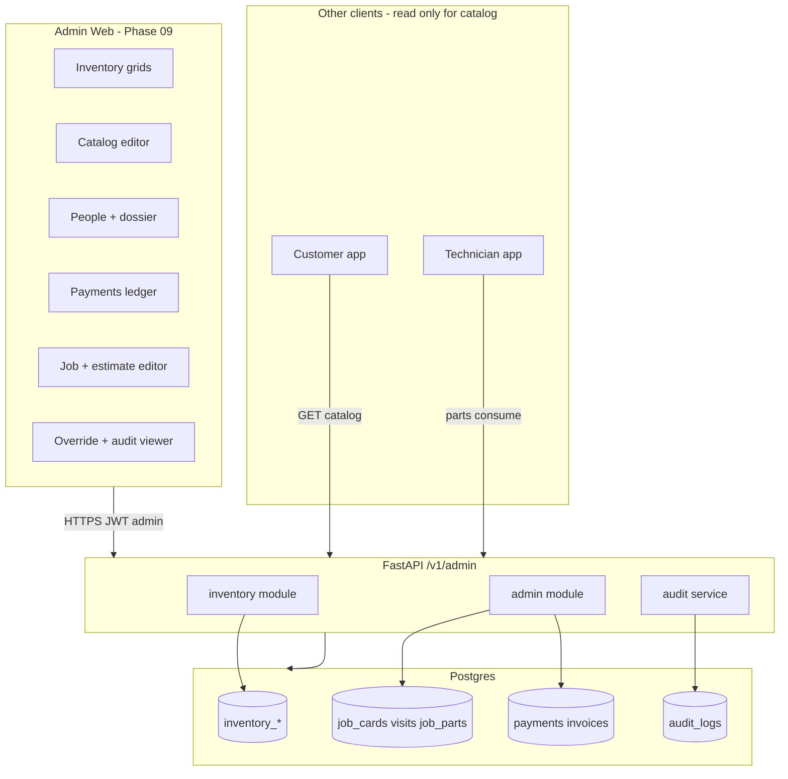
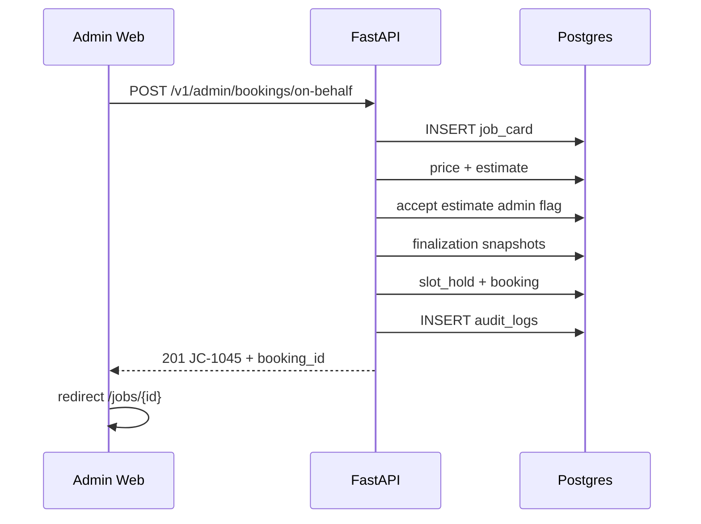
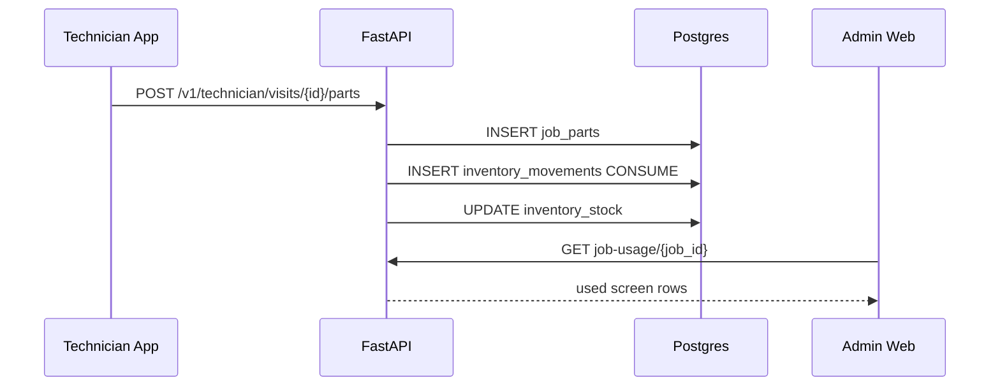
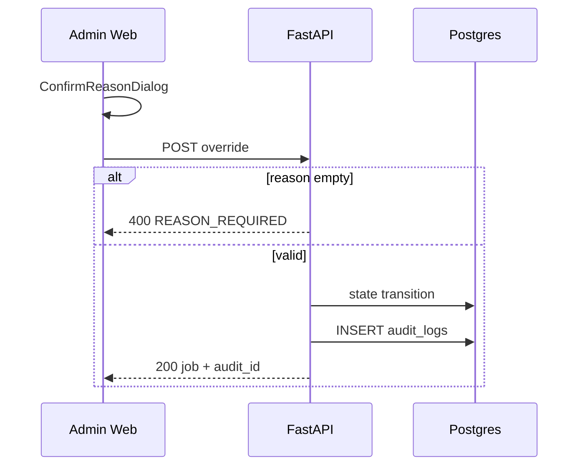

# PHASE 09 — Admin Web Ops Plane

**Document ID:** `PHASE-09-admin-web-ops-plane.md`  
**Version:** 1.0.0  
**Status:** Execution-ready specification  
**Depends on:** [PHASE-04-service-repair-advisor.md](./PHASE-04-service-repair-advisor.md) (Exit Gate §24), [PHASE-06-technician-field-execution.md](./PHASE-06-technician-field-execution.md) (Exit Gate §24), [PHASE-08-payments-invoicing-closure.md](./PHASE-08-payments-invoicing-closure.md) (Exit Gate §24)  
**Unblocks:** [PHASE-10-admin-mobile-ops-dispatch.md](./PHASE-10-admin-mobile-ops-dispatch.md), [PHASE-11-notifications-integrations-hardening.md](./PHASE-11-notifications-integrations-hardening.md)  
**Estimated effort:** 14–22 engineer-days (single developer + Cursor agent)

**Authority chain:**

1. Walkthrough admin ops screens embedded inline in §14 and [`docs/CARATOM-client-walkthrough.html`](../CARATOM-client-walkthrough.html) — UI/flow truth for **web-primary desk ops**.
2. [`docs/AUDIT-REPORT.md`](../AUDIT-REPORT.md) — **Admin web = dense ops**; admin mobile = inbox/advisor/dispatch lite (Phase 10).
3. [`docs/architecture/01-product-constitution.md`](../architecture/01-product-constitution.md) — overrides require reason + audit; clients never write financial truth via PostgREST.
4. Architecture docs **06, 08, 09, 11, 14** — admin route tree, inventory model, `/v1/admin/*` contracts, screen purposes, admin safety.

**Critical surface split (repeat in code review):**

> **Admin web (Phase 09)** owns inventory grids, catalog editor, people/tech dossiers, payments ledger, full job editor, estimate publish, on-behalf booking, overrides with audit, and audit log viewer.  
> **Admin mobile (Phase 10)** owns advisor inbox (`adm-01`–`adm-04`), job board lite, dispatch map, override quick actions — not catalog write or inventory receive.

---

## 0. Phase Summary

### Objective

Deliver the **desk operations plane** for CARATOM: a Next.js admin web app with dense, keyboard-friendly tables and split views where ops staff manage **inventory**, **catalog pricing**, **people**, **technician dossiers**, **payments ledger**, **on-behalf booking**, **job/estimate editing**, **parts traceability**, **overrides**, and **audit logs** — all via `/v1/admin/*` APIs with role enforcement and immutable audit trails.

### What Phase 09 delivers

| ID | Deliverable | Description |
|----|-------------|-------------|
| P09-A | Admin auth + layout | Supabase login for `role=admin`; persistent sidebar; ops shell `(ops)/` routes |
| P09-B | Inventory module | SKUs, warehouse + van stock, low-stock alerts, receive/adjust movements, job usage view |
| P09-C | Catalog editor | Write offerings, repair lines, pricing policies, feature settings (parts advance %, 2nd-car discount) |
| P09-D | People directory | Search customers/technicians; disable access; link to vehicles, jobs, parts history |
| P09-E | Technician dossier | Live duty, ping, today's jobs, weekly stats, parts fitted, reassign/disable actions |
| P09-F | Payments ledger | Razorpay + offline rows, daily totals, record offline payment, refund with reason |
| P09-G | On-behalf booking | Walk-in/WhatsApp flow creating same job card + booking path as customer app |
| P09-H | Full job editor | Omnipotent job card view: concerns, lines, visits, advisor case, parts used, invoice link |
| P09-I | Admin estimate editor | Publish/revise selling price; force-approve on call; versioned estimates |
| P09-J | Override panel | Force status, move slot, record offline payment, desk-complete — reason required |
| P09-K | Audit log viewer | Filterable command history with actor, resource, before/after, reason |
| P09-L | DB tables | `inventory_skus`, `inventory_stock`, `inventory_movements`; extend `audit_logs` if stub |
| P09-M | Contracts + tests | Admin DTOs; Playwright desk flows; API integration tests for audit + stock conservation |

### What Phase 09 explicitly does NOT deliver

| Item | Phase |
|------|-------|
| Advisor inbox live-call UX (`adm-01`–`adm-04`) | 10 |
| Dispatch map + assign from mobile | 10 |
| Job board mobile-first board/dispatch tabs | 10 |
| Push notifications to admin | 11 |
| Full reports/analytics dashboards (beyond ledger totals) | 11+ |
| Multi-city tenancy, procurement ERP | Post-MVP |
| Customer/technician mobile UI changes | Regression only |
| Production Railway admin deploy hardening | 12 |

### Canonical admin web journeys (Phase 09)

```text
Desk ops hub (sidebar)
  → inventory          — search SKU, low stock, receive stock
  → catalog            — edit ₹2999 / ₹399 / 10% / 50% parts advance
  → people             — Rajesh, Imran, Kavya; disable, create tech
  → tech/[id]          — Imran dossier: duty, ping, jobs, parts fitted
  → money              — ledger, offline record, refund
  → book               — on-behalf JC-1045 for walk-in customer
  → jobs/[id]          — full editor JC-1042
  → jobs/[id]/estimate — publish selling price
  → jobs/[id]/used     — SKUs fitted on this job
  → customers/[id]/parts — custparts cross-job history
  → jobs/[id]/override — force transitions with reason
  → more               — hub → audit log, CMS stub links
  → audit              — immutable command log
```

### Success statement

At Phase 09 exit, an admin user on **admin web** can search inventory, receive stock, edit catalog prices live-read by customer app, open Rajesh's parts history across jobs, view Imran's dossier with last ping, record ₹399 cash against JC-0991, refund JC-0802 with reason, create JC-1045 on behalf of a walk-in customer, open JC-1042 full editor, publish a revised estimate, apply an override with non-empty reason, and verify every mutation appears in audit log. API tests prove stock conservation, customer JWT cannot reach `/v1/admin/*`, and override without reason returns `400`.

---

## 1. Starting State

### 1.1 Phase 04, 06, 08 exit gates (must be true)

| Prerequisite | Verification |
|--------------|--------------|
| Advisor case + admin estimate publish API (Phase 04) | `POST /v1/admin/job-cards/{id}/estimate` |
| Job cards, visits, technician assignments (Phase 06) | Technician completes visit; `job_parts` rows exist |
| Invoices, payments, Razorpay webhook (Phase 08) | Paid booking shows invoice + payment events |
| `profiles.role` includes `admin` seeded account | Login as admin |
| Customer app reads catalog from API (no hardcoded prices) | Change price in DB → home reflects |
| `audit_logs` table stub or partial (Phase 04+) | At least schema exists |
| CI green on Phases 01–08 regression | GitHub Actions |

### 1.2 Repository state at Phase 09 start

```text
apps/admin/
  app/
    layout.tsx              # Phase 01 shell or Phase 02 read-only /catalog
    page.tsx                # Placeholder dashboard
    (ops)/catalog/page.tsx  # Optional read-only from Phase 02
backend/app/modules/
  auth/, profiles/, catalog/, job_cards/, estimates/, advisor/,
  bookings/, visits/, technicians/, invoices/, payments/   # Implemented Phases 03–08
  inventory/                # Missing or stub
  admin/                    # Partial — estimate publish, maybe job patch
  audit/                    # Missing or stub
packages/contracts/         # No AdminInventory, AdminCatalogWrite, AuditLog types
```

**Absent at start:**

- Inventory tables and movement invariants
- Admin catalog write routes
- Admin web dense layout (sidebar, data tables)
- People search unified view
- Technician dossier read model
- Payments ledger UI + offline record admin routes
- On-behalf booking wizard
- Override panel UI wired to `POST /v1/admin/job-cards/{id}/override`
- Audit log viewer
- Playwright admin suite

### 1.3 Admin web vs admin mobile resolution

| Walkthrough screen | Primary surface | Phase |
|--------------------|-----------------|-------|
| `inventory`, `catalog`, `people`, `money`, `more` | **Admin web** | 09 |
| `tech`, `book`, `used`, `custparts` | **Admin web** | 09 |
| `job`, `estimate` (full editor) | **Admin web** | 09 |
| `override` (full panel + audit) | **Admin web** | 09 |
| `board`, `dispatch` | Admin mobile lite + web read | 10 |
| `adm-01`–`adm-04` advisor on call | Admin mobile | 10 |
| `inbox` standalone | Admin mobile | 10 |

---

## 2. Desired End State

After Phase 09 passes Exit Gate (§24), the repository MUST include:

```text
apps/admin/
  app/
    (auth)/login/page.tsx
    (ops)/layout.tsx                    # Sidebar + top bar
    (ops)/page.tsx                      # Redirect → /inventory or /jobs
    (ops)/inventory/page.tsx
    (ops)/inventory/[skuId]/page.tsx
    (ops)/inventory/receive/page.tsx
    (ops)/catalog/page.tsx
    (ops)/catalog/offerings/[slug]/page.tsx
    (ops)/catalog/settings/page.tsx
    (ops)/people/page.tsx
    (ops)/people/customers/[id]/page.tsx
    (ops)/people/customers/[id]/parts/page.tsx   # custparts
    (ops)/people/technicians/new/page.tsx
    (ops)/technicians/[id]/page.tsx              # tech dossier
    (ops)/payments/page.tsx                      # money
    (ops)/payments/record/page.tsx
    (ops)/payments/refunds/page.tsx
    (ops)/book/page.tsx                          # on-behalf
    (ops)/jobs/page.tsx                          # searchable list (not mobile board)
    (ops)/jobs/[id]/page.tsx                     # job full editor
    (ops)/jobs/[id]/estimate/page.tsx
    (ops)/jobs/[id]/used/page.tsx
    (ops)/jobs/[id]/override/page.tsx
    (ops)/more/page.tsx
    (ops)/audit/page.tsx
  components/
    ops-shell.tsx, data-table.tsx, confirm-reason-dialog.tsx,
    money-format.tsx, job-status-badge.tsx, stock-level-cell.tsx
  lib/
    admin-api.ts, query-keys.ts
backend/app/modules/
  inventory/
    models.py, schemas.py, repository.py, router.py, service.py, invariants.py
  admin/
    catalog_router.py, people_router.py, payments_router.py,
    booking_router.py, override_router.py, dossier_router.py
  audit/
    models.py, service.py, middleware_hook.py
backend/alembic/versions/20260829_0009_phase09_inventory_audit.py
backend/tests/
  test_admin_inventory.py, test_admin_override_audit.py,
  test_admin_on_behalf_booking.py, test_stock_conservation.py
packages/contracts/src/admin/
  inventory.ts, catalog-write.ts, people.ts, payments-ledger.ts,
  override.ts, audit-log.ts, dossier.ts
e2e/admin/
  inventory.spec.ts, catalog.spec.ts, override-audit.spec.ts
```

---

## 3. Why This Phase Exists Here

Phase 09 is the **desk control plane** after field execution (06) and money closure (08) exist. Ops staff need to answer operational questions that mobile surfaces cannot:

1. **What is on the shelf and on each van?** — inventory grids with warehouse + van breakdown.
2. **What part was fitted on which car by whom?** — `used` and `custparts` traceability views.
3. **What did we collect today and was anything refunded?** — payments ledger.
4. **Can we recover a stuck job?** — override with audited reason.
5. **Can we book for a WhatsApp customer?** — on-behalf booking producing the same job card truth.

**Why not earlier?** Inventory movements depend on `job_parts` from technician visits (06). Ledger depends on `payments` (08). Catalog write without live customer read path (02) is pointless.

**Why not later?** Phase 10 mobile dispatch assumes web carries catalog/inventory/money truth. Phase 11 hardening assumes admin recovery paths exist.

**Risk if skipped:** Ops revert to spreadsheets; catalog prices diverge from API; parts warranty trail breaks; overrides happen in WhatsApp without audit.

---

## 4. Source Material

| Source | Use in Phase 09 |
|--------|-----------------|
| [`CARATOM-client-walkthrough.html`](../CARATOM-client-walkthrough.html) | Admin folder `deskTools` + screen copy for §14 |
| [`06-frontend-architecture.md`](../architecture/06-frontend-architecture.md) | Admin route tree `(ops)/*` |
| [`08-data-model.md`](../architecture/08-data-model.md) | `inventory_*`, `audit_logs` constraints |
| [`09-api-contracts.md`](../architecture/09-api-contracts.md) | `/v1/admin/*` namespace |
| [`11-screen-specifications.md`](../architecture/11-screen-specifications.md) | Admin dense ops, inventory, dossier |
| [`14-security.md`](../architecture/14-security.md) | Override reason, audit fields, role checks |
| [`15-testing-strategy.md`](../architecture/15-testing-strategy.md) | Playwright admin flows |
| [`AUDIT-REPORT.md`](../AUDIT-REPORT.md) | Web vs mobile screen ownership |
| [`README.md`](./README.md) | Phase dependency graph |
| Phase 02 light-blue accent tokens | Admin web uses same `#5DB7E8` brand |

---

## 5. Architectural Context

### 5.1 Phase 09 system context



### 5.2 Trust boundaries

```text
┌─────────────────────────────────────────────────────────────┐
│  ADMIN WEB — Browser on ops desk (Next.js on Railway)       │
│  - Supabase session; role=admin enforced server-side          │
│  - Never DATABASE_URL or service role in client bundle        │
│  - Destructive actions: ConfirmReasonDialog mandatory         │
└──────────────────────────┬──────────────────────────────────┘
                           │ /v1/admin/* + Idempotency-Key
┌──────────────────────────▼──────────────────────────────────┐
│  API ZONE — Admin commands                                    │
│  - Every override/adjust/refund writes audit_logs row          │
│  - Inventory movements transactional; stock never negative     │
└──────────────────────────┬──────────────────────────────────┘
                           │
┌──────────────────────────▼──────────────────────────────────┐
│  DATA ZONE — Authoritative ops truth                          │
│  - Catalog versions explain historical estimates               │
│  - job_parts ↔ inventory_movements linked for traceability    │
└─────────────────────────────────────────────────────────────┘
```

### 5.3 Admin web UX principles (dense ops)

| Principle | Implementation |
|-----------|----------------|
| Web-primary | Min width 1024px; responsive collapse to hamburger ≤768px but optimize for desk |
| Data density | TanStack Table: sort, filter, column resize, CSV export on ledger/inventory |
| Keyboard | `/` focus search; `Esc` close dialogs; `Enter` submit reason dialog |
| Split views | Job detail: left summary, right tabs (lines, visits, parts, money, audit) |
| No dashboard widgets | Every page answers one ops question |
| Server state | TanStack Query; stale time 30s inventory, 10s dossier ping |
| Optimistic UI forbidden | On money, inventory, override — wait for server + audit ref |
| Timezone display | Asia/Kolkata for all ops timestamps |
| Money display | `formatINR(amount_minor)` — never float rupees |

---

## 6. Exact Implementation Scope + Out of Scope

### 6.1 In scope (MUST implement)

| Area | Scope |
|------|-------|
| Admin layout | Sidebar nav: Inventory, Catalog, People, Payments, Book, Jobs, More |
| Inventory | SKU CRUD, stock by location (warehouse, van A/B), receive, adjust, low-stock threshold |
| Catalog write | PATCH offerings, repair offerings, pricing policies, feature_settings |
| People | Unified search; customer profile + vehicles; technician list + create |
| Technician dossier | Duty, skills, last ping, today/week jobs, ratings, parts fitted summary |
| Payments ledger | List with filters; daily total card; offline record; refund initiation |
| On-behalf booking | Select customer → offering → vehicle → finalize → slot → book |
| Job editor | Full read/write job card (admin); link to estimate, used parts, override |
| Estimate editor | Add/remove lines, publish to customer, force-approve |
| Override | Force status, move slot, offline payment shortcut, desk-complete |
| Audit log | Paginated filter by resource, actor, command, date range |
| Parts views | `used` per job; `custparts` per customer cross-job |
| Backend | All `/v1/admin/inventory`, catalog write, override, dossier, ledger routes |
| Tests | API integration + Playwright critical paths |

### 6.2 Out of scope (MUST NOT implement in Phase 09)

| Item | Deferred to |
|------|-------------|
| Advisor inbox call queue UI | 10 |
| Live dispatch map assign UX | 10 |
| GPS turn-by-turn | Post-MVP |
| Supplier PO / procurement | Post-MVP |
| Full CMS WYSIWYG | 11 (stub links from `more` OK) |
| Automated low-stock purchase orders | Post-MVP |
| Multi-warehouse city tenancy | Post-MVP |
| Admin MFA UI | 12 |
| PDF report builder | 11+ |

### 6.3 Boundary rules

- Admin web MUST NOT duplicate advisor on-call flow (`adm-02`/`adm-03`) — link out "Open in admin mobile" stub OK until Phase 10.
- Technician app continues to record `job_parts`; admin web displays and can **correct** with audited adjustment movement only.
- Catalog price changes apply to **new** estimates; never mutate accepted estimate snapshots.
- Override commands MUST reject empty `reason` string (trimmed length ≥ 10 chars recommended UX).
- Customer role JWT → `403` on all `/v1/admin/*`; technician → `403`.

---

## 7. Repository Changes

### 7.1 New files (representative)

**Admin web:**

- `apps/admin/app/(ops)/layout.tsx`
- `apps/admin/app/(ops)/inventory/page.tsx` (+ detail, receive)
- `apps/admin/app/(ops)/catalog/page.tsx` (+ offering edit, settings)
- `apps/admin/app/(ops)/people/page.tsx`
- `apps/admin/app/(ops)/technicians/[id]/page.tsx`
- `apps/admin/app/(ops)/payments/page.tsx`
- `apps/admin/app/(ops)/book/page.tsx`
- `apps/admin/app/(ops)/jobs/[id]/page.tsx` (+ estimate, used, override)
- `apps/admin/app/(ops)/people/customers/[id]/parts/page.tsx`
- `apps/admin/app/(ops)/more/page.tsx`
- `apps/admin/app/(ops)/audit/page.tsx`
- `apps/admin/components/confirm-reason-dialog.tsx`
- `apps/admin/components/data-table.tsx`

**Backend:**

- `backend/app/modules/inventory/*`
- `backend/app/modules/admin/catalog_router.py`
- `backend/app/modules/admin/override_router.py`
- `backend/app/modules/admin/dossier_router.py`
- `backend/app/modules/admin/on_behalf_router.py`
- `backend/app/modules/audit/*`
- `backend/alembic/versions/20260829_0009_phase09_inventory_audit.py`
- `backend/tests/test_admin_*.py`

**Contracts:**

- `packages/contracts/src/admin/*.ts`

**E2E:**

- `e2e/admin/*.spec.ts`

### 7.2 Modified files

- `apps/admin/app/page.tsx` — redirect to `/inventory`
- `backend/app/main.py` — mount admin inventory + audit routers
- `packages/contracts/src/index.ts` — export admin types
- `docs/implementation/README.md` — Phase 09 link resolves (already listed)

### 7.3 Files that MUST NOT be created

- Duplicate admin mobile screens inside `apps/admin-mobile/` (Phase 10)
- Direct Supabase PostgREST client in admin web for domain writes
- `packages/ui` unless two consumers need shared table primitives (optional extract in Phase 11)

---

## 8. Detailed Implementation Sequence (Task 9.Y)

Execute in order unless noted **parallel OK**.

### Block A — Database & inventory domain (Days 1–4)

#### Task 9.1 — Alembic migration: inventory tables

Create `20260829_0009_phase09_inventory_audit.py`:

- `inventory_skus`
- `inventory_stock`
- `inventory_movements`
- Extend `audit_logs` if missing columns: `command`, `resource_type`, `resource_id`, `before_summary`, `after_summary`, `reason`, `request_id`

**Verify:** `uv run alembic upgrade head`; insert SKU + stock row.

#### Task 9.2 — Stock conservation invariant

Implement `InventoryService.adjust` transactional:

- `inventory_stock.quantity` never negative
- Every `CONSUME`, `RECEIVE`, `ADJUST`, `REVERSE` creates `inventory_movements` row
- Link `job_parts.inventory_movement_id` when consume from visit

**Verify:** `test_stock_conservation.py` — receive 10, consume 3, adjust -8 fails.

#### Task 9.3 — Seed inventory demo data

Seed SKUs matching walkthrough:

| SKU code | Name | WH qty | Van A |
|----------|------|--------|-------|
| CF-HON-01 | Cabin filter | 14 | 3 |
| R134A-250 | R134a gas 250g | 4 | 1 |
| COND-CITY | City condenser OEM | 1 | 0 |
| PAG-250 | PAG oil 250ml | 22 | 0 |

**Verify:** `GET /v1/admin/inventory/skus` returns 4 rows; 2 below low-stock threshold.

#### Task 9.4 — Audit service hook

Implement `AuditService.record(actor, command, resource, before, after, reason, request_id)` called from:

- Override router
- Inventory adjust/receive
- Catalog PATCH
- Offline payment record
- Refund initiate
- User disable

**Verify:** Override without reason → `400 REASON_REQUIRED`; with reason → audit row exists.

### Block B — Backend admin APIs (Days 4–10)

#### Task 9.5 — `GET/POST/PATCH /v1/admin/inventory/skus`

List with search `?q=cabin`, pagination `cursor`, low_stock filter.

POST create SKU; PATCH update name, oem_code, low_stock_threshold.

**Verify:** pytest `test_admin_inventory_crud`.

#### Task 9.6 — `POST /v1/admin/inventory/movements`

Body types:

```json
{
  "movement_type": "RECEIVE",
  "sku_id": "uuid",
  "location_code": "WH",
  "quantity": 10,
  "reason": "Supplier invoice #4421",
  "reference": "PO-4421"
}
```

**Verify:** Stock increments; movement row; audit logged.

#### Task 9.7 — `GET /v1/admin/inventory/job-usage/{job_card_id}`

Returns lines for `used` screen — joined `job_parts` + SKU metadata + visit label.

**Verify:** JC-1042 fixture shows cabin filter, condenser, gas.

#### Task 9.8 — `GET /v1/admin/customers/{id}/parts-history`

Returns `custparts` aggregate grouped by vehicle.

**Verify:** Rajesh shows City 2019 JC-1042 + JC-0881 rows.

#### Task 9.9 — `PATCH /v1/admin/catalog/offerings/{slug}`

Update `display_price_minor`, active flag, sort order. Creates `service_offering_versions` row.

**Verify:** PATCH health report price → customer `GET /v1/catalog/home` reflects after cache TTL.

#### Task 9.10 — `PATCH /v1/admin/catalog/settings`

Update `feature_settings`: `parts_advance_percent=50`, `second_vehicle_discount_percent=10`.

**Verify:** Settings row updated; audit logged.

#### Task 9.11 — `GET /v1/admin/people`

Unified search customers + technicians by name/phone.

**Verify:** Search "Rajesh" returns customer; "Imran" returns technician.

#### Task 9.12 — `POST /v1/admin/technicians`

Create technician profile linked to auth user or invite stub.

**Verify:** New row in `technicians`; appears on people screen.

#### Task 9.13 — `GET /v1/admin/technicians/{id}/dossier`

Composite read model:

```json
{
  "technician": { "id": "...", "display_name": "Imran", "on_duty": true, "van_code": "Van A" },
  "location": { "last_ping_at": "...", "locality": "Koramangala" },
  "today": { "assigned": 3, "completed": 2, "current_job_ref": "JC-1042" },
  "week_stats": { "jobs_done": 11, "avg_rating": 4.8 },
  "parts_fitted_week": [{ "sku_name": "Condenser OEM", "qty": 1 }]
}
```

**Verify:** Matches walkthrough `tech` screen sample data.

#### Task 9.14 — `GET /v1/admin/payments/ledger`

Query `?from=&to=&method=&status=` — includes Razorpay + offline + refunds.

Daily summary: `{ "total_minor": 4120000, "currency": "INR" }`.

**Verify:** Demo rows JC-1042 UPI, JC-0991 cash, JC-0802 refund.

#### Task 9.15 — `POST /v1/admin/payments/offline`

Record cash/UPI-at-door with invoice allocation.

**Verify:** Payment row + audit; invoice balance updates.

#### Task 9.16 — `POST /v1/admin/payments/{id}/refund`

Requires reason; creates refund row; links payment_events.

**Verify:** Ledger shows negative ₹650 for JC-0802.

#### Task 9.17 — `POST /v1/admin/bookings/on-behalf`

Multi-step server orchestration (single POST with full payload OK for MVP):

```json
{
  "customer_profile_id": "uuid",
  "service_offering_slug": "one-man-headlight-bulb",
  "vehicle_id": "uuid",
  "slot_id": "2026-08-19T16:00:00+05:30",
  "concerns": [{ "text": "Walk-in WhatsApp request" }],
  "admin_note": "Booked by Priya at desk"
}
```

Creates job card → price → auto-accept admin → finalize → hold → book.

**Verify:** Returns `public_ref` JC-1045 pattern; audit `ON_BEHALF_BOOK`.

#### Task 9.18 — `GET/PATCH /v1/admin/job-cards/{id}`

Admin full editor — patch concerns, items, status notes.

**Verify:** Patch concern text → version increment; audit optional for non-destructive edits.

#### Task 9.19 — `POST /v1/admin/job-cards/{id}/estimate`

Publish revised estimate (Phase 04 extend) — returns estimate version + customer notification enqueue stub.

**Verify:** New estimate version; job card links current admin estimate.

#### Task 9.20 — `POST /v1/admin/job-cards/{id}/override`

Commands:

```json
{
  "command": "FORCE_STATUS",
  "target_status": "INVOICED",
  "reason": "Agreed condenser on WhatsApp — customer paid offline",
  "payload": {}
}
```

Supported: `FORCE_STATUS`, `MOVE_SLOT`, `RECORD_OFFLINE_PAYMENT`, `DESK_COMPLETE`, `CANCEL_JOB`.

**Verify:** Invalid transition rejected; valid writes audit + state change.

#### Task 9.21 — `GET /v1/admin/audit-logs`

Cursor pagination; filters: `resource_type`, `actor_id`, `command`, date range.

**Verify:** Override appears with reason and request_id.

### Block C — Admin web UI (Days 8–16)

#### Task 9.22 — Ops shell layout

Sidebar items matching walkthrough `more` + primary nav. User menu: Priya (demo admin). Active route highlight `#5DB7E8`.

**Verify:** All §14 routes reachable; 404 on unknown.

#### Task 9.23 — Implement §14 screens 9.1–9.17

One PR slice per screen cluster; visual compare to walkthrough HTML.

**Verify:** Playwright smoke: inventory loads, catalog edit saves, audit shows override.

#### Task 9.24 — ConfirmReasonDialog component

Shared modal: title, textarea min 10 chars, confirm/cancel. Used on override, refund, adjust, disable user.

**Verify:** Submit disabled until reason length met.

#### Task 9.25 — Data tables

Inventory + ledger + audit use TanStack Table with column filters.

**Verify:** Sort by qty; filter low stock.

### Block D — Testing & audits (Days 15–18)

#### Task 9.26 — API integration suite

`test_admin_role_enforcement.py`, `test_stock_conservation.py`, `test_override_audit.py`, `test_on_behalf_booking.py`.

#### Task 9.27 — Playwright desk flows

Inventory receive, catalog price change, on-behalf book, override + audit verify.

#### Task 9.28 — Phase exit audits §18–§24

Complete all checklists before Phase 10.

### Block E — Cross-cutting admin features (Days 12–16)

#### Task 9.29 — Admin jobs list page

Implement `/jobs` searchable index:

- Filters: status multi-select, date range, area, assigned technician, payment status
- Columns: `public_ref`, customer name, status badge, tech, locality, `updated_at`
- Default sort: `updated_at DESC`
- Row click → `/jobs/[id]`
- Export CSV optional (debt OK if deferred)

**Verify:** Search `JC-1042` returns single row; filter Unassigned shows JC-1015 fixture.

#### Task 9.30 — Job editor tabs implementation

Within `/jobs/[id]` implement tab panels:

| Tab | Data source | Editable |
|-----|-------------|----------|
| Lines | `GET /v1/admin/job-cards/{id}` | Yes — concerns, items |
| Visits | nested visits + assignments | Read-only; link dispatch Phase 10 |
| Advisor | advisor case if exists | Read-only summary; link mobile inbox |
| Parts | `GET job-usage` | Correct SKU action only |
| Money | invoice + payments | Link to ledger filtered by job |
| Audit | audit logs filtered | Read-only |

**Verify:** JC-1042 fixture shows 2 visits, parts tab matches `used` screen.

#### Task 9.31 — Catalog settings page

Route `/catalog/settings`:

- Parts advance percent slider/input 0–100
- Second vehicle discount percent
- Service hours JSON editor (simple start/end per weekday)
- Service radius km (Koramangala launch)

**Verify:** Change parts advance to 40% → audit row; customer inspection flow reads setting in Phase 07 regression.

#### Task 9.32 — Customer detail page

Route `/people/customers/[id]`:

- Profile summary, phones, disable toggle
- Vehicles list with links
- Recent jobs table
- **View parts history** → `custparts` route
- **Book for customer** → `/book?customer_id=`

**Verify:** Rajesh detail shows City + Creta vehicles.

#### Task 9.33 — Inventory SKU detail page

Route `/inventory/[skuId]`:

- Stock by location table with adjust inline
- Recent movements paginated
- Linked job_parts consuming this SKU

**Verify:** Cabin filter detail shows WH + Van A breakdown.

#### Task 9.34 — Payments record + refund pages

`/payments/record`:

- Job ref autocomplete
- Invoice selector if multiple
- Amount, method enum, reference note, reason

`/payments/refunds` or modal from ledger row:

- Partial/full refund
- Reason required

**Verify:** Record ₹399 cash on JC-0991 → ledger row appears; invoice balance decreases.

#### Task 9.35 — Disable user flow

From people detail:

- `PATCH /v1/admin/profiles/{id}/disable` with reason
- Disabled users cannot login (Supabase ban or profile flag checked on JWT path)
- UI shows Disabled badge

**Verify:** Disabled customer JWT returns 403 on customer routes.

#### Task 9.36 — Wire estimate publish to notification outbox

On `POST /v1/admin/job-cards/{id}/estimate` success:

- Insert `outbox_events` row `ESTIMATE_PUBLISHED` (worker Phase 11 delivers)
- Admin UI shows toast "Estimate published · notification queued"

**Verify:** outbox row exists in DB; customer can fetch revised estimate.

#### Task 9.37 — Playwright auth fixture

Create `e2e/admin/fixtures/admin-auth.ts`:

- Login via Supabase test admin phone OTP or token injection
- Save `storageState` for reuse

**Verify:** All admin specs run without manual login.

#### Task 9.38 — OpenAPI tag grouping

Ensure OpenAPI `/docs` groups:

- `admin-inventory`
- `admin-catalog`
- `admin-people`
- `admin-payments`
- `admin-jobs`
- `admin-audit`

**Verify:** Generated docs readable for Phase 10 mobile agent.

---

## 9. Admin Web Implementation (Next.js)

### 9.1 App package setup

| Dependency | Purpose |
|------------|---------|
| `@tanstack/react-query` | Server state |
| `@tanstack/react-table` | Dense grids |
| `react-hook-form` + `zod` | Forms |
| `@caratom/contracts` | Admin DTOs |
| `@caratom/api-client` | Typed fetch + auth |
| `date-fns-tz` | Asia/Kolkata formatting |

### 9.2 Route map (normative)

| Walkthrough ID | Route | Component |
|----------------|-------|-----------|
| `inventory` | `/inventory` | `InventoryPage` |
| `catalog` | `/catalog` | `CatalogListPage` |
| `people` | `/people` | `PeoplePage` |
| `tech` | `/technicians/[id]` | `TechnicianDossierPage` |
| `money` | `/payments` | `PaymentsLedgerPage` |
| `book` | `/book` | `OnBehalfBookingPage` |
| `job` | `/jobs/[id]` | `JobEditorPage` |
| `estimate` | `/jobs/[id]/estimate` | `EstimateEditorPage` |
| `used` | `/jobs/[id]/used` | `JobPartsUsedPage` |
| `custparts` | `/people/customers/[id]/parts` | `CustomerPartsHistoryPage` |
| `override` | `/jobs/[id]/override` | `OverridePanelPage` |
| `more` | `/more` | `MoreHubPage` |
| audit (from more) | `/audit` | `AuditLogPage` |

### 9.3 Layout wireframe (ASCII)

```text
┌──────────────┬──────────────────────────────────────────────────────────┐
│ CARATOM Ops  │  Inventory                          Priya ▾               │
├──────────────┼──────────────────────────────────────────────────────────┤
│ Inventory ●  │  [Search SKU or OEM________________]    [2 low stock]     │
│ Catalog      │  ┌─────────────────────────────────────────────────────┐ │
│ People       │  │ SKU           │ WH │ Van A │ Total │ Status        │ │
│ Payments     │  │ Cabin filter  │ 14 │   3   │  17   │ OK            │ │
│ Book         │  │ R134a 250g    │  4 │   1   │   5   │ LOW           │ │
│ Jobs         │  │ ...           │    │       │       │               │ │
│ More         │  └─────────────────────────────────────────────────────┘ │
│              │  [Receive stock]                                            │
└──────────────┴──────────────────────────────────────────────────────────┘
```

### 9.4 Auth gate

```typescript
// apps/admin/app/(ops)/layout.tsx
export default async function OpsLayout({ children }) {
  const session = await getServerSession();
  if (!session) redirect('/login');
  const me = await adminApi.getMe(session.accessToken);
  if (me.role !== 'admin') redirect('/login?error=forbidden');
  return <OpsShell user={me}>{children}</OpsShell>;
}
```

### 9.5 Query keys

```typescript
export const adminKeys = {
  inventory: (filters: InventoryFilters) => ['admin', 'inventory', filters] as const,
  catalog: ['admin', 'catalog'] as const,
  dossier: (id: string) => ['admin', 'dossier', id] as const,
  ledger: (range: DateRange) => ['admin', 'ledger', range] as const,
  job: (id: string) => ['admin', 'job', id] as const,
  audit: (filters: AuditFilters) => ['admin', 'audit', filters] as const,
};
```

### 9.6 Error handling

Map API Problem Details to toast + inline field errors. On `403` → logout redirect. On `409 INVALID_STATE` → show current_state and allowed_actions if present.

### 9.7 Shared components specification

#### `OpsShell`

- Props: `user`, `children`, `activePath`
- Sidebar items with Lucide icons: Package (inventory), Tag (catalog), Users (people), Wallet (payments), CalendarPlus (book), Briefcase (jobs), MoreHorizontal (more)
- Collapse sidebar <1024px to icons only

#### `DataTable<T>`

- Generic wrapper around TanStack Table
- Props: `columns`, `data`, `isLoading`, `onRowClick`, `emptyMessage`
- Built-in column visibility toggle (ledger optional columns: method, request_id)

#### `ConfirmReasonDialog`

```typescript
type ConfirmReasonDialogProps = {
  open: boolean;
  title: string;
  description?: string;
  confirmLabel: string;
  minReasonLength?: number; // default 10
  onConfirm: (reason: string) => Promise<void>;
  onCancel: () => void;
};
```

- Textarea auto-focus; Confirm disabled until valid
- Loading state on confirm; close only on success

#### `MoneyCell`

- Formats `amount_minor` → `₹2,100` or `-₹650` (danger variant)
- Uses `Intl.NumberFormat('en-IN')`

#### `JobStatusBadge`

- Maps `job_card_status` enum to color chips matching walkthrough (warn for inspecting/unassigned, ok for completed)

#### `StockLevelCell`

- Shows total; warn chip if `is_low_stock`

### 9.8 Admin web file tree (complete)

```text
apps/admin/
  app/
    (auth)/
      login/page.tsx
    (ops)/
      layout.tsx
      page.tsx
      inventory/
        page.tsx
        receive/page.tsx
        [skuId]/page.tsx
      catalog/
        page.tsx
        settings/page.tsx
        offerings/[slug]/page.tsx
      people/
        page.tsx
        customers/[id]/page.tsx
        customers/[id]/parts/page.tsx
        technicians/new/page.tsx
      technicians/[id]/page.tsx
      payments/
        page.tsx
        record/page.tsx
        refunds/page.tsx
      book/page.tsx
      jobs/
        page.tsx
        [id]/page.tsx
        [id]/estimate/page.tsx
        [id]/used/page.tsx
        [id]/override/page.tsx
      more/page.tsx
      audit/page.tsx
  components/
    ops-shell.tsx
    data-table.tsx
    confirm-reason-dialog.tsx
    money-cell.tsx
    job-status-badge.tsx
    stock-level-cell.tsx
    job-editor/
      lines-tab.tsx
      visits-tab.tsx
      parts-tab.tsx
      money-tab.tsx
  lib/
    admin-api.ts
    query-keys.ts
    format-inr.ts
  hooks/
    use-admin-session.ts
    use-confirm-reason.ts
```

### 9.9 Responsive behavior

| Breakpoint | Behavior |
|------------|----------|
| ≥1280px | Full sidebar + split job editor |
| 1024–1279px | Sidebar icons + labels |
| 768–1023px | Hamburger sidebar overlay |
| <768px | Supported but not optimized — show banner "Use desktop for ops" |

### 9.10 Admin login flow

1. `/login` — Supabase phone OTP or email magic link for staff accounts
2. After session, `GET /v1/me` — reject if `role !== 'admin'`
3. Redirect to `/inventory` default landing

---

## 10. Backend Implementation

### 10.1 Module layout

```text
backend/app/modules/
  inventory/
    models.py          # InventorySku, InventoryStock, InventoryMovement
    schemas.py
    repository.py
    service.py         # receive, adjust, consume_link
    invariants.py      # non_negative_stock
    router.py          # /v1/admin/inventory/*
  admin/
    catalog_router.py
    people_router.py
    dossier_router.py
    payments_router.py
    on_behalf_router.py
    override_router.py
    job_cards_router.py
  audit/
    models.py          # AuditLog
    service.py         # record(), list()
    dependencies.py    # inject into command handlers
```

### 10.2 Override service (core)

```python
class AdminOverrideService:
    async def apply(self, job_card_id: UUID, body: OverrideRequest, actor: Profile) -> OverrideResponse:
        if not body.reason or len(body.reason.strip()) < 1:
            raise ProblemDetail(code="REASON_REQUIRED", status=400)
        async with self.db.begin():
            job = await self.jobs.get_for_update(job_card_id)
            before = job.status
            job = await self._dispatch_command(job, body)
            audit_id = await self.audit.record(
                actor_id=actor.id,
                command=f"override.{body.command}",
                resource_type="job_card",
                resource_id=str(job_card_id),
                before_summary={"status": before},
                after_summary={"status": job.status},
                reason=body.reason.strip(),
            )
        return OverrideResponse(job_card=self.mapper.to_admin_dto(job), audit_id=audit_id)
```

### 10.3 On-behalf booking service

Reuses existing `JobCardService`, `PricingService`, `BookingService` — **no duplicate booking logic**. Admin path passes `created_by_admin_id` and skips customer JWT ownership checks while still writing `profile_id` of target customer.

### 10.4 Dossier aggregator

Read-only join across `technicians`, `technician_location_pings`, `technician_assignments`, `visits`, `reviews`, `job_parts` — no writes except via explicit reassign endpoint (Phase 10 may mobile-primary; web button calls `POST /v1/admin/jobs/{id}/assign` stub OK).

### 10.5 Authorization middleware

```python
def require_admin(user: CurrentUser = Depends(get_current_user)) -> Profile:
    if user.role != "admin":
        raise Forbidden()
    return user
```

All `/v1/admin/*` routers use `dependencies=[Depends(require_admin)]`.

### 10.6 Inventory movement types

| Type | Direction | When |
|------|-----------|------|
| RECEIVE | +stock | Supplier delivery, van restock |
| CONSUME | -stock | Technician fits part on visit |
| ADJUST | +/- | Cycle count correction |
| REVERSE | +stock | Undo erroneous consume |
| TRANSFER | WH↔VAN | Van reload morning |

### 10.7 Catalog version write pattern

```python
async def patch_offering(self, slug: str, body: PatchOfferingRequest, actor: Profile):
    offering = await self.repo.get_by_slug_for_update(slug)
    if body.expected_version and offering.version != body.expected_version:
        raise Conflict("VERSION_MISMATCH")
    new_version = await self.repo.create_version(offering, body)
    await self.audit.record(..., command="catalog.patch_offering", ...)
    return new_version
```

### 10.8 Ledger aggregation query

Daily total uses Asia/Kolkata day boundaries converted to UTC for SQL filter:

```sql
SELECT COALESCE(SUM(
  CASE WHEN p.status IN ('CAPTURED','REFUNDED')
       THEN p.amount_minor ELSE 0 END
), 0) AS total_minor
FROM payments p
WHERE p.created_at >= :start_utc AND p.created_at < :end_utc;
```

Refunds stored as negative `amount_minor` or separate refund rows — pick one pattern in implementation and document in migration comment.

### 10.9 Parts history aggregation

`GET /v1/admin/customers/{id}/parts-history`:

- Join `job_parts` → `job_cards` → `vehicles` → `visits`
- Group by `vehicle_id`
- Sort jobs by `completed_at DESC`
- Return human labels: "condenser, filter, gas" concatenated from SKU names

### 10.10 Rate limiting (admin commands)

| Route | Limit |
|-------|-------|
| POST override | 30/hour per admin |
| POST movements | 100/hour per admin |
| PATCH catalog | 60/hour per admin |
| POST on-behalf | 50/hour per admin |

Full production limits Phase 12.

---

## 11. Database Implementation

### 11.1 Table `inventory_skus`

```sql
CREATE TABLE inventory_skus (
  id UUID PRIMARY KEY DEFAULT gen_random_uuid(),
  sku_code TEXT NOT NULL UNIQUE,
  name TEXT NOT NULL,
  oem_code TEXT,
  unit TEXT NOT NULL DEFAULT 'each',
  low_stock_threshold INTEGER NOT NULL DEFAULT 5,
  is_active BOOLEAN NOT NULL DEFAULT TRUE,
  metadata JSONB NOT NULL DEFAULT '{}',
  created_at TIMESTAMPTZ NOT NULL DEFAULT now(),
  updated_at TIMESTAMPTZ NOT NULL DEFAULT now()
);
CREATE INDEX idx_inventory_skus_active ON inventory_skus(is_active) WHERE is_active = TRUE;
```

### 11.2 Table `inventory_stock`

```sql
CREATE TABLE inventory_stock (
  id UUID PRIMARY KEY DEFAULT gen_random_uuid(),
  sku_id UUID NOT NULL REFERENCES inventory_skus(id),
  location_code TEXT NOT NULL CHECK (location_code IN ('WH','VAN_A','VAN_B','VAN_C')),
  quantity INTEGER NOT NULL CHECK (quantity >= 0),
  updated_at TIMESTAMPTZ NOT NULL DEFAULT now(),
  UNIQUE (sku_id, location_code)
);
CREATE INDEX idx_inventory_stock_sku ON inventory_stock(sku_id);
```

### 11.3 Table `inventory_movements`

```sql
CREATE TYPE inventory_movement_type AS ENUM (
  'RECEIVE', 'CONSUME', 'ADJUST', 'REVERSE', 'TRANSFER'
);

CREATE TABLE inventory_movements (
  id UUID PRIMARY KEY DEFAULT gen_random_uuid(),
  sku_id UUID NOT NULL REFERENCES inventory_skus(id),
  movement_type inventory_movement_type NOT NULL,
  location_code TEXT NOT NULL,
  quantity INTEGER NOT NULL CHECK (quantity > 0),
  job_card_id UUID REFERENCES job_cards(id),
  visit_id UUID REFERENCES visits(id),
  job_part_id UUID REFERENCES job_parts(id),
  actor_id UUID NOT NULL REFERENCES profiles(id),
  reason TEXT NOT NULL,
  reference TEXT,
  created_at TIMESTAMPTZ NOT NULL DEFAULT now()
);
CREATE INDEX idx_inventory_movements_job ON inventory_movements(job_card_id);
CREATE INDEX idx_inventory_movements_customer_sku ON inventory_movements(sku_id, created_at DESC);
```

### 11.4 Table `audit_logs` (complete if stub)

```sql
CREATE TABLE IF NOT EXISTS audit_logs (
  id UUID PRIMARY KEY DEFAULT gen_random_uuid(),
  actor_id UUID NOT NULL REFERENCES profiles(id),
  actor_role TEXT NOT NULL,
  command TEXT NOT NULL,
  resource_type TEXT NOT NULL,
  resource_id TEXT NOT NULL,
  before_summary JSONB,
  after_summary JSONB,
  reason TEXT,
  request_id TEXT,
  created_at TIMESTAMPTZ NOT NULL DEFAULT now(),
  CONSTRAINT audit_logs_override_reason CHECK (
    command NOT LIKE 'override.%' OR (reason IS NOT NULL AND length(trim(reason)) > 0)
  )
);
CREATE INDEX idx_audit_logs_resource ON audit_logs(resource_type, resource_id, created_at DESC);
CREATE INDEX idx_audit_logs_actor ON audit_logs(actor_id, created_at DESC);
```

### 11.5 Link `job_parts` to inventory

```sql
ALTER TABLE job_parts
  ADD COLUMN IF NOT EXISTS inventory_movement_id UUID REFERENCES inventory_movements(id);
```

---

## 12. API Contracts

### 12.1 Inventory

```text
GET    /v1/admin/inventory/skus?q=&low_stock=&cursor=&limit=
POST   /v1/admin/inventory/skus
PATCH  /v1/admin/inventory/skus/{sku_id}
GET    /v1/admin/inventory/skus/{sku_id}/stock
POST   /v1/admin/inventory/movements
GET    /v1/admin/inventory/job-usage/{job_card_id}
GET    /v1/admin/customers/{profile_id}/parts-history
```

**SKU list item:**

```json
{
  "id": "uuid",
  "sku_code": "CF-HON-01",
  "name": "Cabin filter",
  "stock_by_location": { "WH": 14, "VAN_A": 3 },
  "total_quantity": 17,
  "low_stock_threshold": 5,
  "is_low_stock": false
}
```

### 12.2 Catalog admin

```text
GET    /v1/admin/catalog/overview
PATCH  /v1/admin/catalog/offerings/{slug}
PATCH  /v1/admin/catalog/repair-offerings/{slug}
PATCH  /v1/admin/catalog/settings
```

**Settings PATCH body:**

```json
{
  "parts_advance_percent": 50,
  "second_vehicle_discount_percent": 10
}
```

### 12.3 People & dossier

```text
GET    /v1/admin/people?q=
GET    /v1/admin/customers/{id}
POST   /v1/admin/technicians
PATCH  /v1/admin/profiles/{id}/disable
GET    /v1/admin/technicians/{id}/dossier
```

### 12.4 Payments ledger

```text
GET    /v1/admin/payments/ledger?from=&to=
POST   /v1/admin/payments/offline
POST   /v1/admin/payments/{payment_id}/refund
```

**Ledger row:**

```json
{
  "id": "uuid",
  "job_card_ref": "JC-1042",
  "label": "UPI advance",
  "amount_minor": 210000,
  "currency": "INR",
  "method": "RAZORPAY_UPI",
  "status": "CAPTURED",
  "created_at": "2026-08-19T09:15:00Z"
}
```

### 12.5 On-behalf booking

```text
POST   /v1/admin/bookings/on-behalf
```

### 12.6 Job admin + override

```text
GET    /v1/admin/job-cards?status=&q=
GET    /v1/admin/job-cards/{id}
PATCH  /v1/admin/job-cards/{id}
POST   /v1/admin/job-cards/{id}/estimate
POST   /v1/admin/job-cards/{id}/override
```

### 12.7 Audit

```text
GET    /v1/admin/audit-logs?resource_type=&resource_id=&cursor=
```

### 12.8 Error catalog (Phase 09)

| Code | HTTP | When |
|------|------|------|
| `REASON_REQUIRED` | 400 | Override/refund/adjust without reason |
| `INSUFFICIENT_STOCK` | 409 | Consume/adjust would negative stock |
| `INVALID_STATE_TRANSITION` | 409 | Override command not allowed from current status |
| `FORBIDDEN` | 403 | Non-admin role |
| `CUSTOMER_NOT_FOUND` | 404 | On-behalf booking bad profile id |

### 12.9 Request/response examples (extended)

#### POST /v1/admin/inventory/movements (RECEIVE)

Request:

```json
{
  "movement_type": "RECEIVE",
  "sku_id": "a1b2c3d4-e5f6-7890-abcd-ef1234567890",
  "location_code": "WH",
  "quantity": 10,
  "reason": "Supplier invoice #4421",
  "reference": "PO-4421"
}
```

Response `201`:

```json
{
  "movement_id": "uuid",
  "sku_id": "uuid",
  "stock_by_location": { "WH": 14, "VAN_A": 3 },
  "total_quantity": 17,
  "audit_id": "uuid"
}
```

#### PATCH /v1/admin/catalog/offerings/general-service-health-report

Request:

```json
{
  "display_price_minor": 319900,
  "expected_version": 3
}
```

Response `200`:

```json
{
  "slug": "general-service-health-report",
  "display_price_minor": 319900,
  "version": 4,
  "effective_at": "2026-08-19T12:00:00Z",
  "audit_id": "uuid"
}
```

#### GET /v1/admin/technicians/{id}/dossier (excerpt)

```json
{
  "technician": {
    "id": "uuid",
    "display_name": "Imran",
    "on_duty": true,
    "van_code": "VAN_A",
    "skills": ["AC", "electrics", "brakes"]
  },
  "location": {
    "last_ping_at": "2026-08-19T11:13:00+05:30",
    "locality": "Koramangala",
    "latitude": 12.9352,
    "longitude": 77.6245
  },
  "today": {
    "assigned_count": 3,
    "completed_count": 2,
    "current_job_ref": "JC-1042",
    "jobs": [
      {
        "visit_id": "uuid",
        "label": "11:00 inspect City",
        "status": "IN_PROGRESS",
        "job_card_ref": "JC-1042"
      },
      {
        "visit_id": "uuid",
        "label": "16:30 repair Swift",
        "status": "QUEUED",
        "job_card_ref": "JC-0999"
      }
    ]
  },
  "week_stats": { "jobs_done": 11, "avg_rating": 4.8 },
  "parts_fitted_week": [
    { "sku_name": "Condenser OEM", "quantity": 1 },
    { "sku_name": "Cabin filters", "quantity": 4 }
  ]
}
```

#### POST /v1/admin/job-cards/{id}/override

Request:

```json
{
  "command": "FORCE_STATUS",
  "target_status": "INVOICED",
  "reason": "Agreed condenser on WhatsApp — customer paid offline",
  "payload": {}
}
```

Response `200`:

```json
{
  "job_card": {
    "id": "uuid",
    "public_ref": "JC-1042",
    "status": "INVOICED",
    "version": 12
  },
  "audit_id": "uuid"
}
```

#### GET /v1/admin/audit-logs (excerpt)

```json
{
  "items": [
    {
      "id": "uuid",
      "created_at": "2026-08-19T10:30:00Z",
      "actor_display_name": "Priya",
      "actor_role": "admin",
      "command": "override.FORCE_STATUS",
      "resource_type": "job_card",
      "resource_id": "JC-1042",
      "reason": "Agreed condenser on WhatsApp",
      "request_id": "req_abc123",
      "before_summary": { "status": "IN_SERVICE" },
      "after_summary": { "status": "INVOICED" }
    }
  ],
  "next_cursor": null
}
```

### 12.10 OpenAPI schema notes

- All admin list endpoints use cursor pagination: `{ items, next_cursor }`
- Money fields always `{ amount_minor, currency }`
- Timestamps ISO 8601 UTC in JSON; admin web converts to IST for display
- `Idempotency-Key` header documented on all POST command routes

---

## 13. Complete Data Flow

### 13.1 Inventory receive flow

```text
Admin → POST /v1/admin/inventory/movements (RECEIVE)
  → InventoryService validates SKU + location
  → BEGIN TRANSACTION
      → INSERT inventory_movements
      → UPSERT inventory_stock quantity += n
      → AuditService.record(...)
  → COMMIT
  → 200 + updated stock DTO
Admin UI → invalidate inventory query → table refresh
```

### 13.2 Catalog price change flow

```text
Admin → PATCH /v1/admin/catalog/offerings/general-service-health-report
  → CatalogAdminService creates new offering version
  → Updates display_price_minor
  → Audit log
Customer app → GET /v1/catalog/home (within stale window) → new ₹ price
Existing accepted estimates → unchanged (snapshot)
```

### 13.3 On-behalf booking flow

```text
Admin book screen → POST /v1/admin/bookings/on-behalf
  → Create JobCard for customer profile
  → Price → auto-accept (admin flag)
  → Finalize with saved vehicle/address
  → Slot hold → book
  → Audit ON_BEHALF_BOOK
  → Return JC-1045 + booking id
```

### 13.4 Override flow

```text
Admin override panel → confirm reason dialog
  → POST /v1/admin/job-cards/{id}/override
  → State machine transition
  → Audit with before/after
  → Return updated job + audit_id
Audit log page → filter resource_id=job_card_id → row visible
```

### 13.5 Parts traceability flow

```text
Technician app → POST /v1/technician/visits/{id}/parts (Phase 06)
  → job_parts row
  → inventory movement CONSUME (Phase 09 link)
Admin used screen → GET job-usage/{job_card_id}
Admin custparts → GET customers/{id}/parts-history
```

### 13.6 Sequence: on-behalf booking



### 13.7 Sequence: inventory consume from technician visit



### 13.8 Sequence: override with audit



### 13.9 Read models vs commands

| Screen | Read model endpoint | Command endpoints |
|--------|---------------------|-------------------|
| inventory | GET skus | POST movements, PATCH sku |
| catalog | GET overview | PATCH offering, PATCH settings |
| people | GET people | POST technicians, PATCH disable |
| tech | GET dossier | POST assign stub, PATCH disable |
| money | GET ledger | POST offline, POST refund |
| book | GET catalog + customer | POST on-behalf |
| job | GET job-cards/{id} | PATCH job-cards/{id} |
| estimate | GET estimates | POST estimate |
| used | GET job-usage | POST movements correct |
| custparts | GET parts-history | — |
| override | GET job state | POST override |
| audit | GET audit-logs | — |

---

## 14. UI/UX Conformance (embed ALL admin ops walkthrough screens inline)

**Normative reference:** [`docs/CARATOM-client-walkthrough.html`](../CARATOM-client-walkthrough.html) — Admin face, folder **Board, dispatch, inventory, and other desk tools** (`deskTools`).

**Global admin web tokens (Phase 02 light-blue accent + desk density):**

| Token | Value | Usage |
|-------|-------|-------|
| `--brand` | `#176B9E` | Sidebar active, primary buttons |
| `--brand-soft` | `#EAF6FC` | Banner backgrounds |
| `--bg` | `#F6F4F1` | Page canvas |
| `--card` | `#FFFFFF` | Cards, table rows |
| `--border` | `#E6E2DC` | Table borders |
| `--warn` | `#B45309` | Low stock chips, callback queue |
| `--danger` | `#B91C1C` | Refund amounts |
| `--ok` | `#2E7D4F` | Active tech chip |
| Table row height | 44px | Dense but clickable |
| Sidebar width | 220px | Fixed desktop |

**Global chrome (all admin ops screens):**

- Top bar right: admin display name **Priya** (demo)
- Sidebar: Inventory, Catalog, People, Payments, Book, Jobs, More
- Bottom tagline on `more` only: *"Admin controls the entire company from this app."* — web implementation adds subtitle: *Desk ops · admin web*

---

### 14.1 Screen `inventory`

**Walkthrough ID:** `inventory`  
**Route:** `/inventory`  
**Sidebar active:** Inventory

#### Navigation

| Action | Target |
|--------|--------|
| Search input | Filter table client-side + server `?q=` debounced |
| Row click | `/inventory/[skuId]` detail |
| **Receive stock** | `/inventory/receive` |
| Low stock chip tap | Filter `low_stock=true` |

#### Copy (verbatim)

| Element | Text |
|---------|------|
| Page title | Inventory |
| Search placeholder | Search SKU or OEM |
| Low stock badge | 2 low stock |
| Subtitle | Warehouse + vans |
| SKU row 1 name | Cabin filter |
| SKU row 1 sub | WH 14 · Van A 3 |
| SKU row 1 qty | 17 |
| SKU row 2 name | R134a gas 250g |
| SKU row 2 sub | WH 4 · Van A 1 |
| SKU row 2 qty chip | 5 (warn) |
| SKU row 3 name | City condenser OEM |
| SKU row 3 sub | WH 1 · on order |
| SKU row 3 chip | 1 (warn) |
| SKU row 4 name | PAG oil 250ml |
| SKU row 4 sub | WH 22 |
| SKU row 4 qty | 22 |
| Primary secondary CTA | Receive stock |

#### Layout (web-dense)

1. Page header + search full width max 480px
2. Filter chips: All | Low stock | Warehouse | Vans
3. Data table columns: **SKU name**, **Locations**, **Total**, **Status**
4. Sticky header on scroll
5. Footer: pagination or virtual scroll >100 rows

#### Colors

- Low stock qty: chip warn `#B45309` on `#FEF3C7`
- OK qty: bold `#1A1A1A`
- CTA secondary: outline `#176B9E`

#### Sample data

From seed §11; API `GET /v1/admin/inventory/skus`.

#### States

| State | Behavior |
|-------|----------|
| Loading | Skeleton 4 rows |
| Empty | "No SKUs yet" + Create SKU (admin) |
| Error | Banner + retry |
| Low stock | Row highlight subtle `#FEF3C7` background |

#### Web-specific enhancements (beyond walkthrough mobile mock)

- Column sort by total quantity ascending (surface lowest first)
- Bulk export selected SKUs to CSV
- Location filter tabs: **All | WH | Van A | Van B**
- Keyboard: `/` focuses search from anywhere on page

#### Sample API response row

```json
{
  "sku_code": "CF-HON-01",
  "name": "Cabin filter",
  "stock_by_location": { "WH": 14, "VAN_A": 3 },
  "total_quantity": 17,
  "is_low_stock": false
}
```

---

### 14.2 Screen `catalog`

**Walkthrough ID:** `catalog`  
**Route:** `/catalog`  
**Sidebar active:** Catalog

#### Navigation

| Action | Target |
|--------|--------|
| Row tap | `/catalog/offerings/[slug]` or inline expand editor |
| Settings link | `/catalog/settings` |

#### Copy (verbatim)

| Element | Text |
|---------|------|
| Page title | Catalog |
| Row 1 | Health report · **₹2,999** |
| Row 2 | Inspect + repair · **Quote** |
| Row 3 | One-man · **₹399** |
| Row 4 | 2nd car discount · **10%** |
| Row 5 | Parts advance · **50%** |
| Footer note | Customer app reads these live. No hardcoded prices. |

#### Layout

1. List/table: Offering name | Price display | Policy | Active toggle
2. Inline edit icon opens slide-over OR navigate to detail
3. Settings rows for global percentages

#### Colors

- Price column: `#142532` semibold
- Footer note: `#6B6B6B` 13px

#### API

`GET /v1/admin/catalog/overview` aggregates offerings + settings.

#### States

| State | Behavior |
|-------|----------|
| Saving | Row spinner; disable duplicate PATCH |
| Conflict | Version mismatch → refresh prompt |

---

### 14.3 Screen `catalog-offering-edit` (sub-screen)

**Walkthrough ID:** extension of `catalog`  
**Route:** `/catalog/offerings/[slug]`

#### Copy

| Field | Demo |
|-------|------|
| Name | General servicing + health report |
| Slug | general-service-health-report |
| Display price | ₹2,999 |
| Duration | 120 min |
| Active | On |

#### Actions

| Button | Behavior |
|--------|----------|
| Save changes | PATCH + audit |
| Cancel | Back to list |

---

### 14.4 Screen `people`

**Walkthrough ID:** `people`  
**Route:** `/people`  
**Sidebar active:** People

#### Navigation

| Action | Target |
|--------|--------|
| Rajesh card | `/people/customers/[id]` |
| Imran/Kavya card | `/technicians/[id]` |
| **Create technician** | `/people/technicians/new` |
| Search | Filter unified list |

#### Copy (verbatim)

| Element | Text |
|---------|------|
| Page title | People |
| Search placeholder | Search name or phone |
| Customer card | Rajesh Kumar · Customer |
| Customer sub | 3 jobs · City + Creta |
| Tech card 1 | Imran · **Tech · active** |
| Tech card 2 | Kavya · **Tech · active** |
| CTA | Create technician |

#### Layout

- Web: two-column grid cards ≥1024px; single column mobile
- Badge: Customer muted; Tech active green chip

#### Actions

- Disable user on detail — requires reason dialog (Phase 09)

---

### 14.5 Screen `tech` (technician dossier)

**Walkthrough ID:** `tech`  
**Route:** `/technicians/[id]`  
**Nav title:** Imran

#### Copy (verbatim)

| Element | Text |
|---------|------|
| Duty card | **On duty** · Van A |
| Duty sub | AC · electrics · last ping 2 min · Koramangala |
| Stat Today | 2 / 3 jobs |
| Stat Week | 11 done |
| Stat Rating | 4.8 |
| Stat On site | JC-1042 |
| Section Today | 11:00 inspect City · **Now** |
| Section Today 2 | 16:30 repair Swift · Queued |
| Section Parts fitted (week) | Condenser OEM · 1 |
| Section Parts 2 | Cabin filters · 4 |
| CTA secondary | Reassign current job |
| CTA ghost | Disable technician |

#### Layout

1. Header card with live dot (green pulse if ping <5 min)
2. 4-up stat grid
3. Today job list with status chips
4. Parts fitted summary table

#### API

`GET /v1/admin/technicians/{id}/dossier` — poll location every 30s when page focused.

---

### 14.6 Screen `money` (payments ledger)

**Walkthrough ID:** `money`  
**Route:** `/payments`  
**Sidebar active:** Payments

#### Copy (verbatim)

| Element | Text |
|---------|------|
| Page title | Payments |
| Summary label | Today |
| Summary amount | **₹41,200** |
| Row 1 | JC-1042 UPI advance · **₹2,100** |
| Row 2 | JC-0991 cash · **₹399** |
| Row 3 | Refund JC-0802 · **-₹650** (danger color) |
| CTA | Record offline payment |

#### Layout

1. Summary card full width
2. Date range picker (default today Asia/Kolkata)
3. Ledger table: Job ref | Label | Method | Amount | Time
4. Refund rows amount in `#B91C1C`

#### Navigation

| Action | Target |
|--------|--------|
| Row click | Job detail or payment detail drawer |
| Record offline | `/payments/record` |
| Refund | `/payments/refunds` or drawer |

---

### 14.7 Screen `book` (on-behalf booking)

**Walkthrough ID:** `book`  
**Route:** `/book`  
**Sidebar active:** Book

#### Copy (verbatim)

| Element | Text |
|---------|------|
| Page title | Book for customer |
| Intro | Walk-in or WhatsApp. Creates the same job card. |
| Customer field | Rajesh Kumar · +91… |
| Package field | One-man job |
| Car field | City 2019 |
| CTA | Create JC-1045 |

#### Layout (web wizard)

1. Step indicator: Customer → Service → Vehicle → Slot → Confirm
2. Customer search combobox (phone/name)
3. Offering select from catalog
4. Vehicle select from customer saved vehicles
5. Slot picker reusing admin slot API
6. Confirm shows summary before POST on-behalf

#### Server

Single POST on-behalf or step APIs — document chosen approach in PR; idempotency key on final create.

---

### 14.8 Screen `job` (full editor)

**Walkthrough ID:** `job`  
**Route:** `/jobs/[id]`  
**Example ref:** JC-1042

#### Copy (verbatim)

| Element | Text |
|---------|------|
| Badge | Full edit · admin |
| Concerns label | AC weak on idle |
| Line 1 | Health report · ₹2,999 |
| Line 2 | Cabin filter · ₹650 |
| Nav row | Edit lines › |
| CTA secondary | Confirm bill (called) |
| CTA primary | Open estimate |
| CTA secondary 2 | Parts used on this job |

#### Layout (split view)

```text
┌─────────────────────┬───────────────────────────────┐
│ JC-1042 summary     │ Tabs: Lines | Visits | Money  │
│ Status chip         │ Concerns textarea              │
│ Customer Rajesh     │ Line items editable table      │
│ Vehicle City 2019   │                               │
│ Quick links         │                               │
└─────────────────────┴───────────────────────────────┘
```

#### Navigation

| Link | Target |
|------|--------|
| Open estimate | `/jobs/[id]/estimate` |
| Parts used | `/jobs/[id]/used` |
| Override | `/jobs/[id]/override` |

---

### 14.9 Screen `estimate` (admin estimate editor)

**Walkthrough ID:** `estimate`  
**Route:** `/jobs/[id]/estimate`

#### Copy (verbatim)

| Element | Text |
|---------|------|
| Intro | Admin edits selling price · technician can propose lines separately |
| Line 1 | Labour leak + gas · ₹1,800 |
| Line 2 | Condenser OEM · ₹4,200 |
| Line 3 | Parts advance · 50% · ₹2,100 |
| CTA primary | Publish to customer |
| CTA secondary | Force-approve (on call) |

#### Behavior

- Publish creates new estimate version + customer notification stub
- Force-approve skips customer accept — audit reason required
- Line add/remove matches Phase 04 admin estimate API semantics

---

### 14.10 Screen `used` (parts on this job)

**Walkthrough ID:** `used`  
**Route:** `/jobs/[id]/used`  
**Title suffix:** Used · JC-1042

#### Copy (verbatim)

| Element | Text |
|---------|------|
| Subtitle | Rajesh · Honda City 2019 · fitted by Imran |
| Row 1 | Cabin filter · SKU CF-HON-01 · qty 1 · Visit 1 |
| Row 2 | City condenser OEM · SKU COND-CITY · qty 1 · Visit 2 |
| Row 3 | R134a gas · 250g · qty 1 · Visit 2 |
| Card title | Warranty trail |
| Card body | These lines are what was actually used on this car. |
| CTA | Correct a SKU |

#### Behavior

- Correct SKU → movement REVERSE + CONSUME with reason dialog
- Read-only for billing lines — this is physical truth

---

### 14.11 Screen `custparts` (customer parts history)

**Walkthrough ID:** `custparts`  
**Route:** `/people/customers/[id]/parts`  
**Title:** Rajesh · parts

#### Copy (verbatim)

| Element | Text |
|---------|------|
| Subtitle | All cars · all jobs |
| Card 1 | City 2019 · JC-1042 · condenser, filter, gas · 19 Aug |
| Card 2 | City 2019 · JC-0881 · H4 bulb ×2 · 2 Aug |
| Card 3 | Creta 2021 · No parts yet |

#### Layout

- Group by vehicle; chronological jobs descending
- Tap job → `/jobs/[id]/used`

---

### 14.12 Screen `override`

**Walkthrough ID:** `override`  
**Route:** `/jobs/[id]/override`

#### Copy (verbatim)

| Element | Text |
|---------|------|
| Banner | Omnipotent · reason required · audit log |
| Tile 1 | Force status → invoiced |
| Tile 2 | Move slot → Thu 9:00 |
| Tile 3 | Cash / offline → ₹2,100 |
| Tile 4 | Desk complete → Tech phone down |
| Reason label | Agreed condenser on WhatsApp |
| CTA primary | Apply override |
| CTA ghost | Cancel job |

#### Layout

- 2×2 command grid; selecting tile opens parameter inputs
- Reason textarea required before Apply enabled
- Success toast with audit id link → `/audit?resource_id=`

---

### 14.13 Screen `more`

**Walkthrough ID:** `more`  
**Route:** `/more`  
**Sidebar active:** More

#### Copy (verbatim)

| Element | Text |
|---------|------|
| Row 1 | Inventory › |
| Row 2 | Technician tracking › |
| Row 3 | Landing photos / copy › |
| Row 4 | Reports › |
| Row 5 | Service hours & radius › |
| Row 6 | Audit log › |
| Footer | Admin controls the entire company from this app. |

#### Navigation

| Row | Phase 09 behavior |
|-----|-------------------|
| Inventory | → `/inventory` |
| Technician tracking | → `/people?filter=technicians` |
| Landing photos / copy | → `/catalog` CMS stub or `/content` placeholder |
| Reports | Disabled "Phase 11" badge |
| Service hours & radius | → `/catalog/settings` |
| Audit log | → `/audit` |

---

### 14.14 Screen `audit-log`

**Walkthrough ID:** extension of `more` → Audit log  
**Route:** `/audit`

#### Copy

| Element | Text |
|---------|------|
| Page title | Audit log |
| Filters | Resource type · Actor · Date range · Command |
| Sample row | override.FORCE_STATUS · JC-1042 · Priya · reason visible |

#### Layout

- Dense table: Time | Actor | Command | Resource | Reason | Request ID
- Row expand → before/after JSON summary formatted

---

### 14.15 Screen `inventory-receive` (sub-screen)

**Route:** `/inventory/receive`

#### Copy

| Field | Example |
|-------|---------|
| SKU | R134a gas 250g |
| Location | WH |
| Quantity | 10 |
| Reason | Supplier invoice #4421 |

#### CTA

Receive stock → POST movement → redirect `/inventory`

---

### 14.16 Screen `payments-record-offline` (sub-screen)

**Route:** `/payments/record`

#### Fields

- Job card search JC-0991
- Amount ₹399
- Method Cash
- Reason Petty cash at door

---

### 14.17 Screen `jobs-list` (supporting)

**Route:** `/jobs`  
**Purpose:** Searchable index feeding `job` editor — not walkthrough mobile board but required for web ops.

#### Columns

Ref | Customer | Status | Tech | Area | Updated

---

### 14.18 Interaction matrix (admin ops screens)

| From screen | Action | To screen | API mutation |
|-------------|--------|-----------|--------------|
| inventory | Row click | inventory/[skuId] | — |
| inventory | Receive stock | inventory/receive | POST movements |
| catalog | Edit price | catalog/offerings/[slug] | PATCH offering |
| people | Rajesh | people/customers/[id] | — |
| people/customers | Parts history | custparts | — |
| people/customers | Book | book?customer_id= | — |
| tech | Disable | confirm dialog | PATCH disable |
| money | Record offline | payments/record | POST offline |
| money | Refund row | refunds modal | POST refund |
| book | Create | jobs/[newId] | POST on-behalf |
| jobs | Open | jobs/[id] | — |
| job | Estimate | jobs/[id]/estimate | — |
| job | Parts used | jobs/[id]/used | — |
| job | Override | jobs/[id]/override | — |
| used | Correct SKU | dialog | POST movements REVERSE+CONSUME |
| override | Apply | jobs/[id] | POST override |
| more | Audit log | audit | — |

### 14.19 Accessibility (admin web)

- All tables: `<table>` with `scope` headers or ARIA grid roles for TanStack Table
- Reason dialog: focus trap, `aria-labelledby` title
- Status chips: text label not color-only ("Low stock" not orange dot alone)
- Keyboard: sidebar `ArrowUp/Down` navigation optional enhancement

### 14.20 Analytics events (admin web)

| Event | When |
|-------|------|
| `admin_inventory_viewed` | /inventory mount |
| `admin_stock_received` | Successful receive |
| `admin_catalog_price_changed` | PATCH offering |
| `admin_on_behalf_booking_created` | JC created |
| `admin_override_applied` | Override success |
| `admin_refund_issued` | Refund success |
| `admin_audit_viewed` | /audit mount |

Server-side audit remains authoritative; analytics are supplementary only.

---

## 15. Security

### 15.1 Role enforcement

- All `/v1/admin/*` require JWT `role=admin`.
- Customer/technician tokens → `403` with no body leak of admin resources.
- Admin web login page rejects non-admin profiles after OTP.

### 15.2 Reason-required commands

| Command | Min reason |
|---------|------------|
| Override any | Non-empty; UI recommends ≥10 chars |
| Refund | Non-empty |
| Inventory ADJUST negative | Non-empty |
| Disable profile | Non-empty |
| Force-approve estimate | Non-empty |

### 15.3 Audit immutability

- `audit_logs` INSERT only — no UPDATE/DELETE in application code.
- Audit rows include `request_id` from `X-Request-Id` header.

### 15.4 Idempotency

- `POST /v1/admin/inventory/movements` — Idempotency-Key prevents double receive on retry.
- `POST /v1/admin/bookings/on-behalf` — Idempotency-Key returns same booking.

### 15.5 CORS

- Admin web origin (localhost:3000, production Railway URL) in allowlist.

### 15.6 PII in admin UI

- Phone numbers masked in list views `+91••••3210`; full on detail with admin role.

---

## 16. Testing Strategy

### 16.1 Backend integration tests

| Test file | Covers |
|-----------|--------|
| `test_admin_role_enforcement.py` | Customer 403 on all admin routes |
| `test_stock_conservation.py` | Receive/consume/adjust invariants |
| `test_admin_override_audit.py` | Reason required; audit row |
| `test_admin_on_behalf_booking.py` | Creates booking same as customer path |
| `test_admin_catalog_write.py` | Version bump; customer read reflects |
| `test_parts_history.py` | custparts + used aggregation |

### 16.2 Playwright (admin web)

| Spec | Flow |
|------|------|
| `inventory.spec.ts` | Login → inventory → receive stock → qty updates |
| `catalog.spec.ts` | Change health report price → verify API |
| `override-audit.spec.ts` | Override with reason → audit log row |
| `on-behalf.spec.ts` | Book JC for customer → job appears in list |

### 16.3 Manual desk checklist

- [ ] Sidebar navigation all §14 routes
- [ ] Low stock chips match seed
- [ ] Dossier ping refreshes
- [ ] Refund shows negative red amount
- [ ] custparts cross-job history correct

---

## 17. Verification Procedure

### 17.1 Backend boot

```powershell
cd backend && uv sync && uv run alembic upgrade head
uv run uvicorn app.main:app --reload --port 8000
```

### 17.2 Seed inventory

```powershell
uv run python scripts/seed_inventory_demo.py
```

### 17.3 Admin inventory list

```powershell
curl -s -H "Authorization: Bearer $ADMIN_TOKEN" `
  http://localhost:8000/v1/admin/inventory/skus | jq '.items | length'
```

Expected: ≥4

### 17.4 Receive stock

```powershell
curl -s -X POST -H "Authorization: Bearer $ADMIN_TOKEN" `
  -H "Content-Type: application/json" `
  -H "Idempotency-Key: test-receive-1" `
  -d '{"movement_type":"RECEIVE","sku_id":"...","location_code":"WH","quantity":5,"reason":"Test receive"}' `
  http://localhost:8000/v1/admin/inventory/movements
```

### 17.5 Override without reason fails

```powershell
curl -s -X POST -H "Authorization: Bearer $ADMIN_TOKEN" `
  -H "Content-Type: application/json" `
  -d '{"command":"FORCE_STATUS","target_status":"INVOICED","reason":""}' `
  http://localhost:8000/v1/admin/job-cards/$JOB_ID/override
```

Expected: `400 REASON_REQUIRED`

### 17.6 Customer forbidden

```powershell
curl -s -o /dev/null -w "%{http_code}" -H "Authorization: Bearer $CUSTOMER_TOKEN" `
  http://localhost:8000/v1/admin/inventory/skus
```

Expected: `403`

### 17.7 Admin web dev

```powershell
pnpm --filter @caratom/admin dev
```

Open `http://localhost:3000/inventory` — table renders seed data.

### 17.8 Playwright

```powershell
pnpm exec playwright test e2e/admin
```

### 17.10 Manual E2E desk script (45 min)

| Step | Action | Expected |
|------|--------|----------|
| 1 | Login admin web | Land /inventory |
| 2 | Search "R134a" | 1 row, low stock chip |
| 3 | Receive 5 units WH | Total increases; audit optional |
| 4 | Open /catalog | Health report ₹2,999 |
| 5 | Change to ₹3,199, save | Customer curl shows new price after refresh |
| 6 | Open /people, search Rajesh | Customer card |
| 7 | Open Rajesh parts history | JC-1042 + JC-0881 cards |
| 8 | Open Imran dossier | On duty, 2/3 jobs |
| 9 | Open /payments | Today total visible |
| 10 | Record offline ₹100 test | New ledger row |
| 11 | Open /book, create on-behalf | JC-#### confirmed |
| 12 | Open JC-1042 job editor | Lines + links work |
| 13 | Open estimate, publish | Version increment |
| 14 | Open used parts | 3 SKU rows |
| 15 | Open override, apply with reason | Status changes |
| 16 | Open /audit | Override row with reason |

### 17.11 Performance smoke

- Inventory list 500 SKUs: P95 load <2s on dev laptop
- Dossier poll does not block UI thread
- Job editor split view renders <1s for JC with 20 lines

### 17.12 Regression curl bundle (post Phase 09)

```powershell
# Customer still books (Phase 03)
curl -s -H "Authorization: Bearer $CUSTOMER_TOKEN" http://localhost:8000/v1/catalog/home | jq '.sections.general_service.offering.display_price.amount_minor'

# Technician still lists visits (Phase 06)
curl -s -H "Authorization: Bearer $TECH_TOKEN" "http://localhost:8000/v1/technician/visits?date=2026-08-19" | jq '.items | length'

# Payment webhook still works (Phase 08)
# Run existing test_payment_webhook.py
uv run pytest backend/tests/test_payment_webhook.py -q
```

---

## 18. Full Codebase Audit

Run before Phase 09 exit. Mark PASS/FAIL/N/A.

### 18.1 Admin web structure

- [ ] `(ops)/layout.tsx` with sidebar + auth gate
- [ ] All §14 routes exist and render
- [ ] ConfirmReasonDialog used on destructive actions
- [ ] No secrets in `NEXT_PUBLIC_*`
- [ ] TanStack Query for admin fetches

### 18.2 Backend

- [ ] `inventory` module complete
- [ ] All §12 routes mounted
- [ ] `require_admin` on every admin router
- [ ] Audit service wired to commands
- [ ] Stock never negative under concurrent test

### 18.3 Database

- [ ] Migration `0009_phase09` applies clean
- [ ] `inventory_movements.reason` NOT NULL
- [ ] Audit override reason constraint exists

### 18.4 Contracts

- [ ] `@caratom/contracts` admin types exported
- [ ] Admin web imports types — no duplicate interfaces

### 18.5 Security

- [ ] Customer/tech cannot admin routes (automated test)
- [ ] Override empty reason rejected
- [ ] PII masking in list views

### 18.6 Tests & CI

- [ ] pytest admin suite green
- [ ] Playwright admin smoke green
- [ ] CI includes admin web typecheck

---

## 19. Vibe Coding Principles Audit (table format)

| Control / Principle | Source | Phase 09 expectation | Pass criteria |
|-------------------|--------|------------------------|---------------|
| No secrets in client | GREENFIELD | Admin env example only public URLs | Manual review |
| AI claims ≠ evidence | VIBE-CODING §4.3 | §17 commands executed | Logs attached |
| Minimum scope | VIBE-CODING §4.11 | No mobile advisor inbox | §6.2 respected |
| Audit on destructive ops | Security prompt | Override/refund/adjust | test_override_audit |
| Idempotency on writes | Constitution | Movements, on-behalf | Integration tests |
| Server-owned money/inventory | Constitution rule 37 | No PostgREST writes | grep clean |
| Independent tests | VIBE-CODING §4.3 | pytest + Playwright separate | CI green |

---

## 20. Architecture Conformance Audit

| Architecture rule | Phase 09 conformance | Evidence |
|-------------------|----------------------|----------|
| Admin web dense ops | Required | §9, §14 |
| `/v1/admin` namespace | Required | §12 |
| Inventory tables per 08-data-model | Required | §11 |
| Audit reason on override | Required | §11.4 constraint |
| Clients use API not PostgREST | Required | admin-api.ts |
| Technician cannot set selling prices | Unchanged | Estimate editor admin-only |
| Catalog versioning | Required | offering_versions |
| UTC storage, IST display | Required | date-fns-tz |
| Admin mobile split | Required | No adm-01 UI in admin web |
| INR minor units | Required | contracts Money type |

---

## 21. Walkthrough Conformance Audit (screen-by-screen)

| Screen | Walkthrough element | Required | Verify method |
|--------|---------------------|----------|---------------|
| inventory | Search SKU or OEM | Yes | §14.1 |
| inventory | 2 low stock chip | Yes | Seed + API |
| inventory | Cabin filter WH 14 Van A 3 | Yes | Row data |
| inventory | R134a warn qty 5 | Yes | Chip color |
| inventory | Receive stock CTA | Yes | Navigation |
| catalog | Health report ₹2,999 | Yes | API-driven |
| catalog | Parts advance 50% | Yes | Settings |
| catalog | Live read footer note | Yes | Copy |
| people | Rajesh customer card | Yes | Search |
| people | Imran/Kavya active tech | Yes | Chips |
| people | Create technician | Yes | Route |
| tech | On duty Van A | Yes | Dossier API |
| tech | Today 2/3 jobs | Yes | Stats grid |
| tech | Parts fitted week | Yes | Table |
| tech | Disable technician | Yes | Reason dialog |
| money | Today ₹41,200 | Yes | Summary card |
| money | JC-1042 UPI ₹2,100 | Yes | Ledger row |
| money | Refund -₹650 red | Yes | Color |
| money | Record offline payment | Yes | Route |
| book | Walk-in WhatsApp intro | Yes | Copy |
| book | Create JC-1045 | Yes | On-behalf API |
| job | Full edit admin badge | Yes | Header |
| job | Open estimate | Yes | Link |
| job | Parts used on job | Yes | Link |
| estimate | Publish to customer | Yes | API |
| estimate | Force-approve on call | Yes | Button |
| used | SKU lines + visit labels | Yes | job-usage API |
| used | Warranty trail card | Yes | Copy |
| custparts | Cross-job by vehicle | Yes | parts-history API |
| override | Reason required banner | Yes | UX |
| override | Apply override | Yes | API + audit |
| more | 6 menu rows | Yes | Nav |
| more | Footer tagline | Yes | Copy |
| audit | Accessible from more | Yes | Route |

**Fail criteria:** Any copy/deviation not registered in §23 debt.

---

## 22. Regression Audit

| Prior phase capability | Regression check | Pass |
|------------------------|------------------|------|
| Customer catalog home | Price change reflects after admin edit | ☐ |
| Phase 08 payment webhook | Still reconciles; ledger shows row | ☐ |
| Phase 06 job_parts | Technician consume still works | ☐ |
| Phase 04 estimate publish | Admin web estimate route uses same API | ☐ |
| Customer cannot /v1/admin | test_role_enforcement | ☐ |
| CI Phases 01–08 tests | Still green | ☐ |

---

## 23. Technical Debt Review

| Debt item | Severity | Accept in Phase 09? | Paydown phase |
|-----------|----------|---------------------|---------------|
| On-behalf booking single POST vs wizard API | Low | Yes | Refine if UX friction |
| CMS / content stub links | Low | Yes | 11 |
| Reports menu disabled | Low | Yes | 11+ |
| No barcode scan on web receive | Low | Yes | Optional hardware phase |
| Dossier map mini-widget absent | Low | Yes | 10 dispatch |
| CSV export basic only | Low | Yes | 11 |
| Admin MFA | Medium | Yes | 12 |
| OpenAPI codegen | Medium | Yes | 11 |

---

## 24. Phase Exit Gate

All checkboxes required unless marked optional.

### 24.1 Backend

- [ ] Migration `0009_phase09_inventory_audit` applies
- [ ] Inventory SKUs seeded; low stock correct
- [ ] Stock conservation tests pass
- [ ] Catalog PATCH updates customer-visible prices
- [ ] Dossier API returns walkthrough-shaped data
- [ ] Ledger lists Razorpay + offline + refunds
- [ ] On-behalf booking creates confirmed booking
- [ ] Override requires reason + writes audit
- [ ] Customer/technician blocked from `/v1/admin/*`

### 24.2 Admin web

- [ ] §14 screens implemented (inventory through audit)
- [ ] Ops shell sidebar navigation complete
- [ ] ConfirmReasonDialog on destructive actions
- [ ] Dense tables on inventory, ledger, audit
- [ ] Split job editor with links to estimate/used/override
- [ ] Playwright smoke tests pass

### 24.3 Contracts & CI

- [ ] Admin contracts exported
- [ ] `pnpm typecheck` green
- [ ] pytest admin suite green
- [ ] CI pipeline green

### 24.4 Audits

- [ ] §18 Full codebase audit complete
- [ ] §19 Vibe audit complete
- [ ] §20 Architecture audit complete
- [ ] §21 Walkthrough audit complete (all admin ops rows)
- [ ] §22 Regression audit complete
- [ ] §23 Debt registered

**Exit statement:** Phase 09 complete when all §24 boxes checked and §17 executed with evidence.

---

## 25. Outputs Passed to Next Phase

### 25.1 Artifacts for Phase 10 (Admin mobile dispatch)

| Artifact | Location | Use |
|----------|----------|-----|
| Admin job read model | `GET /v1/admin/job-cards/{id}` | Mobile job detail |
| Override API | `override_router.py` | Mobile quick override |
| Inventory read API | `/v1/admin/inventory/*` | Mobile low-stock glance |
| Audit log API | `/v1/admin/audit-logs` | Mobile optional read |
| Catalog truth | admin catalog write | Mobile read-only prices |

### 25.2 Artifacts for Phase 11

| Artifact | Use |
|----------|-----|
| Audit log viewer | Extend filters, export |
| Reports stub | Replace with real reports |
| Notification enqueue from estimate publish | Wire worker |

### 25.3 Handoff command bundle

```powershell
pnpm install
docker compose up -d
cd backend && uv sync && uv run alembic upgrade head
uv run python scripts/seed_inventory_demo.py
pnpm dev:api
pnpm --filter @caratom/admin dev
# Login as admin → verify /inventory, /catalog, /audit
```

---

## 26. Cursor Execution Instructions

### 26.1 Agent preamble

When executing Phase 09 in Cursor:

1. Read this entire document before writing code.
2. Confirm Phase 04, 06, 08 exit gates (§1.1).
3. Implement backend inventory + audit before admin UI tables.
4. Embed walkthrough copy from §14 — do not paraphrase customer-facing labels.
5. Do NOT implement advisor inbox mobile screens — Phase 10.
6. Run §17 verification before claiming exit gate.

### 26.2 Recommended workflow

```text
Step 1: Tasks 9.1–9.4  (DB + inventory + audit)
Step 2: Tasks 9.5–9.21 (admin APIs)
Step 3: Task 9.22       (ops shell)
Step 4: Tasks 9.23–9.25 (§14 screens — parallel OK by route)
Step 5: Tasks 9.26–9.28 (tests + audits)
Step 6: §17 verification
Step 7: §18–§24 exit gate
```

### 26.3 Scope discipline

- If a screen is not listed in §14 or §6.1, do not build it.
- Do not port walkthrough mobile bottom tabs to admin web — use sidebar.
- Do not bypass audit service for overrides.
- Do not hardcode catalog prices in admin web — always PATCH API.

### 26.4 Common failure modes

| Failure | Fix |
|---------|-----|
| Stock negative | Wrap in transaction; check invariants.py |
| Admin 403 after login | Verify profile.role=admin in Supabase |
| Catalog change not on customer app | Invalidate TanStack query; check offering version |
| Override 409 | Show current_state from Problem Details |
| Playwright auth flake | Use storageState fixture with admin login |

### 26.5 Completion report template

```markdown
## Phase 09 Complete

- Exit gate: X/X checkboxes
- Walkthrough screens: inventory, catalog, people, tech, money, book, used, custparts, more, job, estimate, override, audit
- Verification: §17 commands [pass/fail]
- Line count: [N]
- Known debt: §23 items
- Ready for Phase 10: [yes/no]
```

### 26.6 Stop condition

Do **not** start Phase 10 until §24 exit gate is fully checked and §21 walkthrough audit shows PASS for all admin ops rows.

---

*End of PHASE-09-admin-web-ops-plane.md*