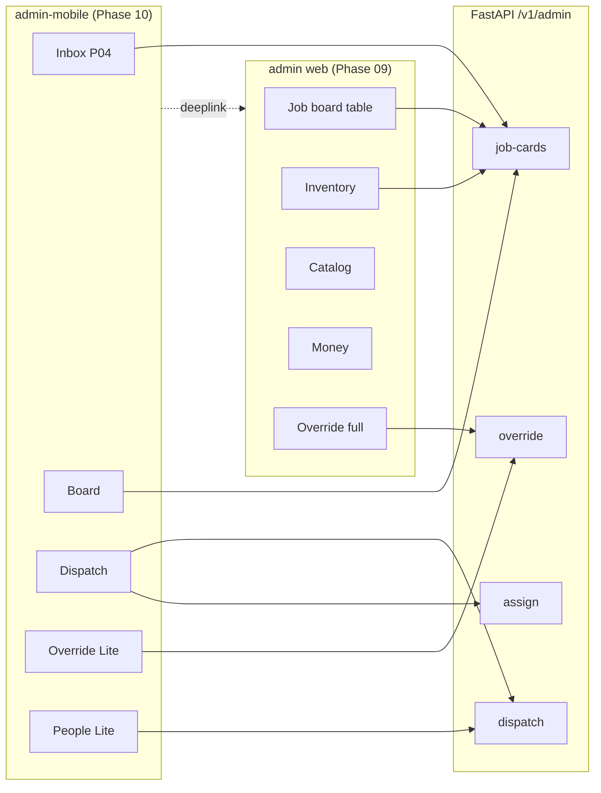
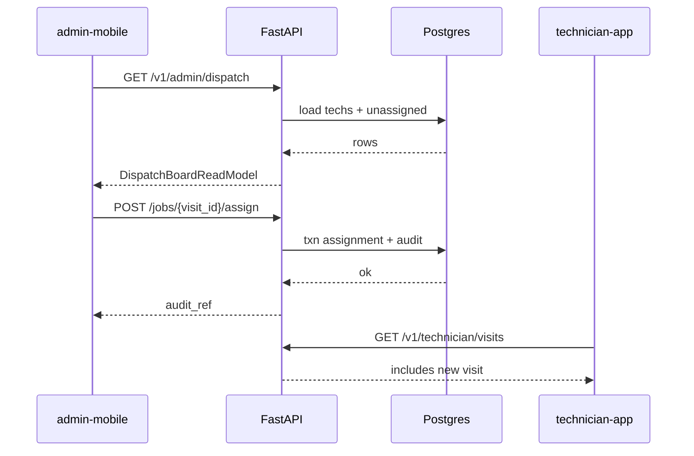

# PHASE 10 — Admin Mobile Ops: Board, Dispatch, Override Lite

**Document ID:** `PHASE-10-admin-mobile-ops-dispatch.md`  
**Status:** Executable specification  
**Authority:** [`docs/architecture/05-technical-architecture.md`](../architecture/05-technical-architecture.md), [`docs/implementation/README.md`](./README.md), [`docs/AUDIT-REPORT.md`](../AUDIT-REPORT.md) § Admin mobile vs web split  
**Depends on:** [PHASE-04-service-repair-advisor.md](./PHASE-04-service-repair-advisor.md), [PHASE-09-admin-web-ops-plane.md](./PHASE-09-admin-web-ops-plane.md)  
**Unblocks:** [PHASE-11-notifications-integrations-hardening.md](./PHASE-11-notifications-integrations-hardening.md)  
**Next phase:** Phase 11 (push notifications, deep links into admin mobile board/dispatch)  
**Estimated effort:** 4–6 engineering days (single developer + Cursor agent)

---

## 0. Phase Summary

### Objective

Deliver **field ops lite** on `apps/admin-mobile`: the walkthrough **Jobs board** (`board`), **Dispatch** (`dispatch`), and **Override** (`override`) screens — plus a **mobile job detail** read model and **technician quick-list** — so on-call admins can assign vans, reassign visits, and apply audited recovery actions from a phone without rebuilding Phase 09's dense desk UI.

Phase 04 already ships advisor inbox (`adm-01`→`adm-04`, `inbox` tab). Phase 10 completes the admin mobile **ops subset** while Phase 09 owns inventory grids, catalog editor, people CRUD, money ledger, and full job editor on **admin web**.

### Scope split (canonical — apply everywhere)

| Surface | Owns | Does NOT own |
|---------|------|--------------|
| **Admin mobile** (`apps/admin-mobile`) | Inbox/advisor (Phase 04), job board list, dispatch assign/reassign, override **lite** (4 actions), job detail **lite**, technician duty list, "Open in web" deeplinks | Full job line editor, inventory receive/adjust grids, catalog price editor, payment ledger, customer dossier, reports, CMS, audit log browser |
| **Admin web** (`apps/admin`) | Dense ops from Phase 09: `job`, `estimate`, `inventory`, `catalog`, `people`, `tech`, `money`, `book`, `used`, `custparts`, `more`, full override grid, dispatch split-view | On-call estimate editing during live calls (mobile ergonomics win for `adm-02`–`adm-04`) |

**Rule:** Same backend APIs; different read models and interaction density. Mobile never duplicates web tables — it uses card lists, bottom sheets, and single-primary-CTA flows.

### What Phase 10 delivers

| ID | Deliverable | Description |
|----|-------------|-------------|
| P10-A | Jobs board | `board` tab — filterable card list of job cards/bookings with status chips, area, assigned tech |
| P10-B | Job detail lite | `mob-job/[id]` — concerns, status, visit window, estimate summary, assign CTA, override entry |
| P10-C | Dispatch | `dispatch` — map placeholder, on-duty technicians, assign/reassign job to tech |
| P10-D | Override lite | `override` — Force status, Move slot, Record offline payment, Desk complete visit — reason + audit |
| P10-E | People lite | `people` tab — technician list with duty state, today's load, tap → dispatch pre-select |
| P10-F | More hub | `more` tab — deeplinks to admin web routes for inventory/catalog/money/reports/audit |
| P10-G | Mobile API wiring | TanStack Query hooks; `@caratom/contracts` admin dispatch DTOs; role=`admin` gate |
| P10-H | Backend polish | Mobile-friendly pagination on board/dispatch if not done in Phase 09; assign idempotency tests |
| P10-I | Walkthrough conformance | All Phase 10 mobile screens match embedded §14 specs |
| P10-J | Regression | Phase 04 advisor flow (`adm-01`→`adm-04`) still passes on same app build |

### What Phase 10 explicitly does NOT deliver

| Item | Phase / surface |
|------|-----------------|
| Full omnipotent job editor (`job`, line rewrite) | Phase 09 web |
| Estimate publish editor (`estimate`, `adm-03` duplicate on board stack) | Phase 04 inbox stack only |
| Inventory stock grids, receive stock | Phase 09 web |
| Catalog price editing | Phase 09 web |
| Customer parts history (`custparts`), used-on-job (`used`) | Phase 09 web |
| Walk-in booking (`book`) | Phase 09 web (mobile deeplink only) |
| Payments ledger UI (`money`) | Phase 09 web |
| Full override grid (waive, cancel job, force-approve estimate) | Phase 09 web; mobile gets 4-action lite subset |
| Automatic dispatch optimization, PostGIS routing | Post-MVP |
| Push notifications to admin mobile | Phase 11 |
| EAS private distribution build | Phase 12 |
| New advisor case APIs | Phase 04 (consume only) |

### Canonical mobile ops journey (Phase 10)

```text
board (Jobs tab)
  → mob-job/[id] (detail lite)
      → dispatch (pre-filled job) → assign tech → back to board
      → override (pre-filled job) → reason → apply → back to board

people tab
  → tech quick card → dispatch (pre-selected tech)

more tab
  → "Open inventory on web" → external browser / in-app WebView optional
```

**Advisor journey (Phase 04 — regression, not reimplemented):**

```text
inbox tab → adm-01 → adm-02 → adm-03 → adm-04 → customer gpr-10
```

### Success statement

At Phase 10 exit, an admin on a phone can open **Jobs**, see JC-1015 **Unassigned**, open detail, tap **Assign**, pick Imran on **Dispatch**, confirm assignment, see JC-1042 move to **Inspecting** with Imran on the board. They can open **Override**, choose **Move slot** to Thu 9:00 with reason, and see audit reference returned. Phase 04 advisor inbox still works. All inventory/catalog/money work remains on admin web without mobile duplication.

---

## 1. Starting State

### 1.1 Phase 04 exit gate (must be true)

| Prerequisite | Verification |
|--------------|--------------|
| `apps/admin-mobile` advisor stack: `adm-01`→`adm-04` | Manual E2E on device |
| `GET/POST/PATCH /v1/admin/advisor-cases` | pytest + mobile inbox |
| `POST /v1/admin/job-cards/{id}/estimate` publish during call | gpr-10 customer receives estimate |
| Inbox tab default; board tab placeholder or stub | Visual |
| Admin JWT + `role=admin` on mobile | `GET /v1/me` |

### 1.2 Phase 09 exit gate (must be true)

| Prerequisite | Verification |
|--------------|--------------|
| Admin web job board with filters | Playwright |
| `GET /v1/admin/dispatch` returns technicians + unassigned jobs | curl |
| `POST /v1/admin/jobs/{id}/assign` with audit | integration test |
| `POST /v1/admin/job-cards/{id}/override` full action set on web | Playwright override dialog |
| Inventory, catalog, people, money routes live | Phase 09 checklist §24 |
| `audit_logs` written on assign + override | DB query |
| Shared `@caratom/contracts` admin types exported | typecheck |

### 1.3 Repository state at Phase 10 start

```text
apps/admin-mobile/
  app/
    (auth)/login.tsx              # Phase 02/04
    (tabs)/
      inbox.tsx                   # Phase 04 — callback queue
      board.tsx                   # Stub or empty list
      people.tsx                  # Stub
      more.tsx                    # Stub
    advisor/
      [caseId]/job.tsx            # adm-02
      [caseId]/estimate.tsx       # adm-03
      [caseId]/send.tsx           # adm-04
    (tabs)/_layout.tsx            # 4 tabs: inbox, board, people, more

apps/admin/                       # Phase 09 — full ops plane
backend/app/modules/admin/
  dispatch.py                     # Phase 09
  overrides.py                    # Phase 09
  job_board.py                    # Phase 09
packages/contracts/src/admin/     # Partial — extend in Phase 10
```

**Absent at Phase 10 start:**

- `apps/admin-mobile/app/dispatch.tsx` (or `(ops)/dispatch`)
- `apps/admin-mobile/app/override.tsx`
- `apps/admin-mobile/app/mob-job/[id].tsx`
- Mobile TanStack Query hooks for board/dispatch/assign/override
- Board card components, dispatch map placeholder, override lite form
- Mobile E2E checklist for board/dispatch/override
- Deeplink config from mobile `more` → web ops URLs

### 1.4 Walkthrough vs scope resolution

| Walkthrough screen | Mobile (Phase 10) | Web (Phase 09) |
|--------------------|-------------------|----------------|
| `board` | ✓ Full card list | ✓ Dense table + filters |
| `job` | Lite (read + CTAs) | Full editor |
| `estimate` | Link to inbox/advisor only | Full publish UI |
| `dispatch` | ✓ Assign/reassign | ✓ Split view + bulk |
| `override` | ✓ 4-action lite | ✓ Full grid |
| `inventory`, `catalog`, `money`, `book`, `used`, `custparts` | Deeplink only | ✓ Primary |
| `people`, `tech` | Lite tech list | Full dossier |
| `more` | Hub + deeplinks | Full settings |
| `inbox`, `adm-01`–`adm-04` | Phase 04 (regression) | Optional read-only mirror |

---

## 2. Desired End State

### 2.1 Repository tree (additions)

```text
apps/admin-mobile/
  app/
    mob-job/
      [id].tsx                    # Job detail lite
    dispatch.tsx                  # Modal stack or push from board
    override.tsx                  # Query param ?jobCardId=
    (tabs)/
      board.tsx                   # Walkthrough board
      people.tsx                  # Technician quick list
      more.tsx                    # Web deeplink hub
  src/
    hooks/
      useAdminJobBoard.ts
      useAdminDispatch.ts
      useAssignJob.ts
      useOverrideLite.ts
    components/
      JobBoardCard.tsx
      TechDutyCard.tsx
      DispatchMapPlaceholder.tsx
      OverrideActionSheet.tsx
      StatusChip.tsx
      OpenInWebLink.tsx
    config/
      webOpsUrls.ts               # ADMIN_WEB_BASE_URL + paths
  .env.example                    # EXPO_PUBLIC_ADMIN_WEB_URL

packages/contracts/src/admin/
  dispatch.ts                     # DispatchBoardReadModel
  job-board.ts                    # AdminJobBoardItem
  override-lite.ts                # OverrideLiteAction enum + request

backend/tests/integration/
  test_admin_mobile_dispatch_e2e.py   # Assign + board refresh
  test_admin_override_lite.py         # Subset actions whitelisted
```

### 2.2 Runtime topology

```text
┌─────────────────────┐     HTTPS      ┌──────────────────────┐
│  admin-mobile Expo  │ ──────────────►│  FastAPI /v1/admin/* │
│  (field ops lite)   │                │  (shared with web)    │
└─────────┬───────────┘                └──────────┬───────────┘
          │ deeplink (browser)                     │
          ▼                                        ▼
┌─────────────────────┐                ┌──────────────────────┐
│  admin Next.js web  │ ◄──────────────│  Supabase Postgres   │
│  (dense ops)        │   same JWT     │  audit_logs, visits  │
└─────────────────────┘                └──────────────────────┘
```

### 2.3 Tab bar (final)

| Tab ID | Label | Icon | Primary screen |
|--------|-------|------|----------------|
| `inbox` | Inbox | inbox | Phase 04 callback queue |
| `board` | Jobs | list | Phase 10 job board |
| `people` | People | user | Phase 10 tech quick list |
| `more` | More | gear | Phase 10 web deeplink hub |

**Note:** Walkthrough shows `people` tab; dense customer CRUD is web-only. Mobile `people` = technicians for dispatch context.

### 2.4 Demo fixture state (dev)

| Entity | Value |
|--------|-------|
| Unassigned job | JC-1015 · Honda i20 · Needs dispatch |
| Active job | JC-1042 · Honda City · Inspecting · Imran · Koramangala |
| Parts advance | JC-0991 · Creta · Kavya |
| On-duty techs | Imran (AC, 2 jobs), Kavya (one-man, 1 job) |
| Off duty | Dev |
| Admin user | Priya · role=admin |

---

## 3. Why This Phase Exists Here

Phase 09 builds the **desk ops plane** — tables, split views, keyboard workflows. Operations managers at a desk live there. But CARATOM's walkthrough admin face is a **phone app** used while walking the floor, on WhatsApp, or during live advisor calls (Phase 04).

Without Phase 10:

1. **Dispatch gap** — Technicians exist (Phase 06), assignments exist in DB, but field admins cannot assign from the device they actually carry.
2. **Board visibility gap** — Inbox handles advisor queue only; ops needs "what's unassigned right now" without opening a laptop.
3. **Recovery gap** — Override requires reason + audit ([`01-product-constitution.md`](../architecture/01-product-constitution.md) §45). Mobile lite override covers the 80% field cases (move slot, desk-complete, offline payment, force status) without porting the entire web god-mode grid.
4. **Duplication risk** — Building inventory/catalog on mobile would violate audit resolution C3. Phase 10 enforces the split with deeplinks.

Phase 10 sits **after** Phase 09 so all admin APIs and audit infrastructure exist; mobile is primarily **UX + read-model consumption**, not new domain logic.

---

## 4. Source Material

| Document | Use in Phase 10 |
|----------|-----------------|
| [`docs/CARATOM-client-walkthrough.html`](../CARATOM-client-walkthrough.html) | Normative UI for `board`, `dispatch`, `override`, tab chrome |
| [`docs/AUDIT-REPORT.md`](../AUDIT-REPORT.md) § Admin advisor + ops | Mobile vs web ownership table |
| [`docs/architecture/09-api-contracts.md`](../architecture/09-api-contracts.md) | `/v1/admin/dispatch`, assign, override |
| [`docs/architecture/11-screen-specifications.md`](../architecture/11-screen-specifications.md) | Job board, dispatch, override behavior |
| [`docs/architecture/04-state-machines.md`](../architecture/04-state-machines.md) | Valid override transitions |
| [`docs/architecture/06-frontend-architecture.md`](../architecture/06-frontend-architecture.md) | Admin route naming reference (adapt for Expo) |
| [`PHASE-04-service-repair-advisor.md`](./PHASE-04-service-repair-advisor.md) | Advisor screens — regression baseline |
| [`PHASE-09-admin-web-ops-plane.md`](./PHASE-09-admin-web-ops-plane.md) | API + audit assumptions |
| [`docs/implementation/README.md`](./README.md) | Master screen → phase map |

---

## 5. Architectural Context

### 5.1 Admin mobile in the system



### 5.2 Data read models

| Screen | Primary endpoint | Cache key | Stale time |
|--------|------------------|-----------|------------|
| Board | `GET /v1/admin/job-cards?cursor=&status=&area=` | `['admin','job-board',filters]` | 30s |
| Job lite | `GET /v1/admin/job-cards/{id}` | `['admin','job-card',id]` | 15s |
| Dispatch | `GET /v1/admin/dispatch` | `['admin','dispatch']` | 15s |
| People lite | `GET /v1/admin/dispatch` (technicians slice) | `['admin','dispatch','techs']` | 30s |
| Assign | `POST /v1/admin/jobs/{id}/assign` | invalidate dispatch + job-board | — |
| Override lite | `POST /v1/admin/job-cards/{id}/override` | invalidate job-card + board | — |

### 5.3 Override lite vs web full

| Action key | Mobile (Phase 10) | Web (Phase 09) | API `action` |
|------------|-------------------|----------------|--------------|
| Force status | ✓ | ✓ | `FORCE_STATUS` |
| Move slot | ✓ | ✓ | `MOVE_VISIT_SLOT` |
| Record offline payment | ✓ | ✓ | `RECORD_OFFLINE_PAYMENT` |
| Desk complete visit | ✓ | ✓ | `DESK_COMPLETE_VISIT` |
| Force-approve estimate | ✗ deeplink | ✓ | `FORCE_APPROVE_ESTIMATE` |
| Cancel job | ✗ deeplink | ✓ | `CANCEL_JOB` |
| Waive line | ✗ | ✓ | `WAIVE_LINE` |
| Adjust inventory | ✗ | ✓ | via inventory module |

Mobile sends the **same** override endpoint with a **whitelist-validated** action set; backend rejects disallowed actions for `client_surface=admin_mobile` if header present, or mobile simply never sends them.

### 5.4 Assignment model

Assignment targets **visits** (or booking-level job id per API convention from Phase 09):

```text
POST /v1/admin/jobs/{visit_id}/assign
{
  "technician_id": "uuid",
  "reason": "optional on reassignment",
  "idempotency_key": "..."
}
```

Response includes updated visit, technician assignment, job card summary, `audit_ref`.

Technician app (Phase 06) `GET /v1/technician/visits` reflects assignment within poll interval.

---

## 6. Exact Implementation Scope + Out of Scope

### 6.1 In scope (mandatory)

| ID | Requirement |
|----|-------------|
| S1 | Replace `board` tab stub with walkthrough-conformant card list |
| S2 | Search/filter bar: status, tech, area (bottom sheet filters) |
| S3 | Status chips: Unassigned, Inspecting, Parts advance, In progress, Completed (map from server enums) |
| S4 | `mob-job/[id]` detail lite with concerns, vehicle, slot, estimate total, assigned tech |
| S5 | CTAs: **Assign / Reassign**, **Override**, **Open full editor on web** |
| S6 | `dispatch` screen with map placeholder, technician cards, assign button per tech |
| S7 | Pre-fill dispatch from job detail (`?jobCardId=` or navigation state) |
| S8 | `override` lite — 4 actions, reason field required, confirm dialog |
| S9 | `people` tab — technician duty cards; tap → dispatch with tech selected |
| S10 | `more` tab — list rows matching walkthrough; each opens web URL |
| S11 | TanStack Query + mutation invalidation |
| S12 | `@caratom/contracts` types for board item, dispatch board, override lite |
| S13 | Pull-to-refresh on board, dispatch, people |
| S14 | Empty, loading, error states on all screens |
| S15 | Role gate: non-admin → sign out + message |
| S16 | Integration tests: assign flow, override lite actions |
| S17 | Walkthrough audit §21 for board, dispatch, override |
| S18 | Regression: Phase 04 advisor E2E still passes |

### 6.2 Out of scope (do not implement)

| ID | Item | Reason |
|----|------|--------|
| O1 | Full `job` line editor on mobile | Web Phase 09 |
| O2 | `estimate` publish screen on board stack | Inbox/advisor Phase 04 only |
| O3 | Inventory list/receive on mobile | Web + deeplink |
| O4 | Catalog editor on mobile | Web + deeplink |
| O5 | Money ledger on mobile | Web + deeplink |
| O6 | Customer search/CRUD on mobile | Web |
| O7 | Walk-in `book` form on mobile | Web + deeplink |
| O8 | MapLibre live routing optimization | Post-MVP |
| O9 | Push notification on assign | Phase 11 |
| O10 | WebView embedded admin web | Optional; default external browser OK |
| O11 | Offline queue for admin mobile | Phase 11 debt |
| O12 | Duplicate backend override logic | Reuse Phase 09 module |

### 6.3 Assumptions

- Phase 09 `GET /v1/admin/job-cards` supports cursor pagination (`limit=20` default for mobile).
- Phase 09 dispatch endpoint returns `{ technicians: [], unassigned_jobs: [], assigned_jobs: [] }` or equivalent unified board.
- Admin web URL available via `EXPO_PUBLIC_ADMIN_WEB_URL` (e.g. `http://localhost:3000` dev, Railway prod).
- Single city launch: Koramangala; area filter optional.
- Map on dispatch is **placeholder** (same pattern as walkthrough CSS map) — no live turn-by-turn.
- IST display for all slot times.
- Reassign requires optional reason string (encouraged, not always mandatory per Phase 09 policy).

---

## 7. Repository Changes

### 7.1 New files (create)

| Path | Purpose |
|------|---------|
| `apps/admin-mobile/app/mob-job/[id].tsx` | Job detail lite |
| `apps/admin-mobile/app/dispatch.tsx` | Dispatch assign UI |
| `apps/admin-mobile/app/override.tsx` | Override lite form |
| `apps/admin-mobile/src/hooks/useAdminJobBoard.ts` | Infinite query board list |
| `apps/admin-mobile/src/hooks/useAdminDispatch.ts` | Dispatch board query |
| `apps/admin-mobile/src/hooks/useAssignJob.ts` | Assign mutation |
| `apps/admin-mobile/src/hooks/useOverrideLite.ts` | Override mutation |
| `apps/admin-mobile/src/components/JobBoardCard.tsx` | Board row card |
| `apps/admin-mobile/src/components/TechDutyCard.tsx` | Technician card |
| `apps/admin-mobile/src/components/DispatchMapPlaceholder.tsx` | Map visual |
| `apps/admin-mobile/src/components/OverrideActionPicker.tsx` | 2×2 grid |
| `apps/admin-mobile/src/components/StatusChip.tsx` | warn/ok/neutral chips |
| `apps/admin-mobile/src/components/OpenInWebLink.tsx` | External link helper |
| `apps/admin-mobile/src/config/webOpsUrls.ts` | Path builder |
| `packages/contracts/src/admin/dispatch.ts` | Dispatch DTOs |
| `packages/contracts/src/admin/job-board.ts` | Board item DTOs |
| `packages/contracts/src/admin/override-lite.ts` | Lite action types |
| `backend/tests/integration/test_admin_mobile_dispatch_e2e.py` | Assign E2E |
| `backend/tests/integration/test_admin_override_lite.py` | Lite whitelist |

### 7.2 Modified files

| Path | Change |
|------|--------|
| `apps/admin-mobile/app/(tabs)/board.tsx` | Implement board list |
| `apps/admin-mobile/app/(tabs)/people.tsx` | Technician quick list |
| `apps/admin-mobile/app/(tabs)/more.tsx` | Deeplink hub |
| `apps/admin-mobile/app/_layout.tsx` | Register mob-job, dispatch, override stacks |
| `apps/admin-mobile/.env.example` | `EXPO_PUBLIC_ADMIN_WEB_URL` |
| `packages/contracts/src/index.ts` | Export admin types |
| `packages/api-client/src/admin.ts` | Board, dispatch, assign, override helpers |
| `backend/app/modules/admin/dispatch.py` | Optional: mobile pagination defaults |
| `backend/app/modules/admin/overrides.py` | Optional: `client_surface` audit metadata |

### 7.3 Files explicitly NOT created

| Path | Reason |
|------|--------|
| `apps/admin-mobile/app/inventory.tsx` | Web primary |
| `apps/admin-mobile/app/catalog.tsx` | Web primary |
| `apps/admin-mobile/app/money.tsx` | Web primary |
| `apps/admin-mobile/app/estimate/[id].tsx` | Advisor stack only (Phase 04) |
| `backend/app/modules/admin/mobile/` | No separate backend — reuse Phase 09 |

---

## 8. Detailed Implementation Sequence (Task X.Y)

### Task group 10.1 — Contracts + API client (Day 1 morning)

**10.1.1** Add `AdminJobBoardItem` to `packages/contracts/src/admin/job-board.ts`:

```typescript
export interface AdminJobBoardItem {
  id: string;
  ref: string;                    // JC-1042
  status: string;
  status_label: string;           // Inspecting, Unassigned, ...
  policy_label: string;           // General service, One-man, ...
  customer_name: string;
  vehicle_label: string;          // Honda City 2019
  area_label: string;             // Koramangala
  visit_window_label: string | null;  // Wed 19 · 11:00–13:00
  assigned_technician: { id: string; name: string } | null;
  estimate_total_minor: number | null;
  payment_chip: string | null;    // Parts advance, Paid, ...
  needs_dispatch: boolean;
}
```

**10.1.2** Add `DispatchBoardReadModel` to `packages/contracts/src/admin/dispatch.ts`.

**10.1.3** Add `OverrideLiteAction` enum: `FORCE_STATUS | MOVE_VISIT_SLOT | RECORD_OFFLINE_PAYMENT | DESK_COMPLETE_VISIT`.

**10.1.4** Extend `packages/api-client/src/admin.ts` with `listJobBoard`, `getDispatchBoard`, `assignJob`, `overrideJobCard`.

**Verification:** `pnpm typecheck` passes.

---

### Task group 10.2 — Board tab (Day 1 afternoon)

**10.2.1** Implement `useAdminJobBoard` with cursor pagination (FlashList).

**10.2.2** Build `JobBoardCard` matching §14.2 walkthrough layout.

**10.2.3** Wire `(tabs)/board.tsx`:
- Nav title **Jobs**
- Right action **All** → filter bottom sheet
- Search placeholder **Filter status, tech, area**
- Pull-to-refresh

**10.2.4** Card tap → `/mob-job/[id]`.

**Verification:** Board shows 3 demo cards from seed; JC-1015 shows **Unassigned** chip.

---

### Task group 10.3 — Job detail lite (Day 2 morning)

**10.3.1** Create `mob-job/[id].tsx` with read-only concerns, line summary (names + totals only), visit, tech.

**10.3.2** Primary CTA **Assign** or **Reassign** → `/dispatch?jobCardId=`.

**10.3.3** Secondary **Override** → `/override?jobCardId=`.

**10.3.4** Tertiary **Open full editor on web** → `webOpsUrls.job(id)`.

**Verification:** Navigation preserves back stack to board.

---

### Task group 10.4 — Dispatch (Day 2 afternoon)

**10.4.1** Implement `DispatchMapPlaceholder` — grey map area, road line, van icon, pin (walkthrough visual).

**10.4.2** List technician cards from `GET /v1/admin/dispatch`.

**10.4.3** When `jobCardId` param set, show banner **Assigning JC-1042** and highlight recommended tech.

**10.4.4** **Assign JC-**** button → confirm sheet → `POST assign` → toast + navigate back.

**10.4.5** Handle `TECH_UNAVAILABLE`, `VISIT_ALREADY_ASSIGNED` problem details.

**Verification:** Assign JC-1015 to Imran; board refreshes; technician app sees visit (Phase 06 smoke).

---

### Task group 10.5 — Override lite (Day 3 morning)

**10.5.1** Build `OverrideActionPicker` 2×2 grid per §14.4.

**10.5.2** Reason field required — min 10 chars; pre-fill forbidden.

**10.5.3** Action-specific sub-forms:
- Force status → picker of allowed targets from API
- Move slot → date + slot picker (reuse slot components pattern from customer app read-only + select)
- Offline payment → amount + method
- Desk complete → confirm visit id

**10.5.4** **Apply override** → mutation → show `audit_ref` in success toast.

**Verification:** Move slot with reason creates `audit_logs` row.

---

### Task group 10.6 — People + More tabs (Day 3 afternoon)

**10.6.1** `people.tsx` — reuse `TechDutyCard`; data from dispatch endpoint technicians slice.

**10.6.2** Tap tech → `/dispatch?technicianId=` (pre-select, show their load).

**10.6.3** `more.tsx` — walkthrough rows; each uses `OpenInWebLink`:
- Inventory → `/inventory`
- Technician tracking → `/technicians` (web dossier list)
- Landing photos / copy → `/content`
- Reports → `/reports`
- Service hours & radius → `/settings`
- Audit log → `/audit`

**10.6.4** Footer copy: *Full catalog, money, and job editor open in admin web.*

**Verification:** Deeplinks resolve in dev browser.

---

### Task group 10.7 — Backend tests + polish (Day 4)

**10.7.1** `test_admin_mobile_dispatch_e2e.py` — assign unassigned visit.

**10.7.2** `test_admin_override_lite.py` — each of 4 actions + audit assertion.

**10.7.3** Optional: add `X-Client-Surface: admin_mobile` header from api-client for analytics.

**10.7.4** Seed data: ensure JC-1015 unassigned, Imran on duty.

**Verification:** `uv run pytest tests/integration/test_admin_mobile*.py -v`

---

### Task group 10.8 — Audits + exit gate (Day 4–5)

**10.8.1** Execute §17 verification checklist on iOS + Android.

**10.8.2** Run §18–§23 audits.

**10.8.3** Regression Phase 04 advisor on same build.

**10.8.4** Complete §24 exit gate.

---

### Task group 10.9 — Seed script `seed_phase10_demo` (Day 4)

**10.9.1** Create `backend/app/scripts/seed_phase10_demo.py` (idempotent):

```python
"""Ensures JC-1015 unassigned, JC-1042 assigned Imran, JC-0991 parts advance."""
# Upsert technicians Imran ON_DUTY, Kavya ON_DUTY, Dev OFF_DUTY
# Link visits to job cards with human refs matching walkthrough
# Safe to re-run: uses ref keys not random UUIDs
```

**10.9.2** Document in `backend/README.md`:

```powershell
uv run python -m app.scripts.seed_phase10_demo
```

**10.9.3** Wire seed into dev docker compose optional init hook.

**Verification:** Board API returns ≥3 items matching §14.2 copy.

---

### Task group 10.10 — Admin-mobile README + env (Day 5)

**10.10.1** Update `apps/admin-mobile/README.md` with:

- Tab map (inbox vs board vs people vs more)
- Scope split table (mobile lite vs web dense)
- Deeplink env var
- Manual E2E checklist link to §17.3

**10.10.2** Verify `.env.example` documents all four EXPO_PUBLIC vars.

---

## 9. Mobile Implementation (`apps/admin-mobile`)

### 9.1 Expo Router structure (Phase 10 final)

```text
app/
  (auth)/
    login.tsx
  (tabs)/
    _layout.tsx
    inbox.tsx                 # Phase 04
    board.tsx                 # Phase 10
    people.tsx                # Phase 10
    more.tsx                  # Phase 10
  advisor/
    [caseId]/
      job.tsx                 # adm-02
      estimate.tsx            # adm-03
      send.tsx                # adm-04
  mob-job/
    [id].tsx                  # Phase 10
  dispatch.tsx                # Phase 10 — stack modal preferred
  override.tsx                # Phase 10
  _layout.tsx
```

### 9.2 Navigation patterns

| From | Action | To |
|------|--------|-----|
| board card | tap | `/mob-job/{id}` |
| mob-job | Assign | `/dispatch?jobCardId={id}` |
| mob-job | Override | `/override?jobCardId={id}` |
| mob-job | Open full editor | external web `/jobs/{id}` |
| dispatch | Assign confirm | pop to mob-job or board |
| people tech card | tap | `/dispatch?technicianId={id}` |
| more row | tap | external web path |

Use `router.push` for stack screens; tabs remain mounted.

### 9.3 TanStack Query configuration

```typescript
// useAdminJobBoard.ts — pattern
export function useAdminJobBoard(filters: BoardFilters) {
  return useInfiniteQuery({
    queryKey: ['admin', 'job-board', filters],
    queryFn: ({ pageParam }) => api.admin.listJobBoard({ ...filters, cursor: pageParam }),
    getNextPageParam: (last) => last.next_cursor ?? undefined,
    staleTime: 30_000,
  });
}
```

Mutations invalidate: `['admin','job-board']`, `['admin','dispatch']`, `['admin','job-card', id]`.

### 9.4 List performance

- Use `@shopify/flash-list` for board (expect 50–200 jobs/day).
- Estimated item size: 88px.
- Avoid re-render: memo `JobBoardCard`.

### 9.5 Map placeholder spec

Not MapLibre in Phase 10 — static placeholder matching walkthrough:

- Container: 160px height, `#E8E4DE` background, rounded 12px
- Decorative road: horizontal gradient line
- Van icon: bottom-left
- Pin icon: center-right
- No user location permission required on dispatch screen

Phase 11+ may add technician last-ping dots if product approves.

### 9.6 Auth + role

Reuse Phase 04 Supabase session. On app focus, refetch `GET /v1/me` — if role !== `admin`, show blocking screen **Admin access required**.

### 9.7 Environment variables

```text
EXPO_PUBLIC_API_URL=https://api-dev.railway.app
EXPO_PUBLIC_SUPABASE_URL=
EXPO_PUBLIC_SUPABASE_ANON_KEY=
EXPO_PUBLIC_ADMIN_WEB_URL=http://localhost:3000
```

### 9.8 Port

Metro: **8083** (per Phase 01). Do not collide with customer 8081 / technician 8082.

---

## 10. Backend Implementation

Phase 10 **consumes** Phase 09 admin modules. Changes are minimal.

### 10.1 Endpoints used (must exist from Phase 09)

| Method | Path | Mobile use |
|--------|------|------------|
| GET | `/v1/admin/job-cards` | Board list |
| GET | `/v1/admin/job-cards/{id}` | Job lite detail |
| GET | `/v1/admin/dispatch` | Dispatch + people tech list |
| POST | `/v1/admin/jobs/{visit_id}/assign` | Assign/reassign |
| POST | `/v1/admin/job-cards/{id}/override` | Override lite |
| GET | `/v1/admin/job-cards/{id}/allowed-override-actions` | Optional — populate lite grid |

### 10.2 Optional Phase 10 backend enhancements

**10.2.1** Default mobile pagination:

```python
# dispatch.py — if client_surface == admin_mobile, default limit=20
DEFAULT_MOBILE_PAGE_SIZE = 20
```

**10.2.2** `allowed-override-actions` returns only lite subset for mobile clients:

```python
MOBILE_OVERRIDE_ACTIONS = {
    OverrideAction.FORCE_STATUS,
    OverrideAction.MOVE_VISIT_SLOT,
    OverrideAction.RECORD_OFFLINE_PAYMENT,
    OverrideAction.DESK_COMPLETE_VISIT,
}
```

**10.2.3** Audit metadata:

```python
audit_event.metadata["client_surface"] = request.headers.get("X-Client-Surface", "unknown")
```

### 10.3 Assign service rules (reiterate)

- Idempotency-Key required on assign POST.
- Cannot assign to off-duty technician unless override flag (web only — mobile shows error).
- Reassign writes previous + new technician to audit.
- Visit must be in assignable state (`SCHEDULED`, `UNASSIGNED`, etc. per Phase 09).

### 10.4 Error codes (mobile must handle)

| Code | UI |
|------|-----|
| `TECH_OFF_DUTY` | Toast + suggest another tech |
| `VISIT_NOT_ASSIGNABLE` | Banner on dispatch |
| `SLOT_UNAVAILABLE` | Move slot override sub-form reload |
| `OVERRIDE_REASON_REQUIRED` | Inline validation |
| `INVALID_TRANSITION` | Show allowed states from problem body |
| `FORBIDDEN` | Sign out / contact ops |

---

## 11. Database Implementation

Phase 10 introduces **no new tables**. Uses Phase 03–09 schema:

| Table | Phase 10 use |
|-------|--------------|
| `job_cards` | Board list, detail |
| `bookings` | Visit window display |
| `visits` | Assign target |
| `technician_assignments` | Assign writes |
| `technicians` | Dispatch cards |
| `technician_location_pings` | Optional subtitle "last ping 2 min" |
| `estimates` | Total on card |
| `audit_logs` | Override + assign audit refs |
| `profiles` | Admin role gate |

### 11.1 Seed requirements (dev/demo)

Ensure seed script or fixture includes:

```sql
-- Illustrative — align with Phase 09 seed IDs
-- JC-1015: booking confirmed, visit UNASSIGNED
-- JC-1042: visit IN_PROGRESS, assigned Imran
-- JC-0991: PARTS_ADVANCE state, Kavya
-- technicians: Imran ON_DUTY, Kavya ON_DUTY, Dev OFF_DUTY
```

### 11.2 Indexes (verify from Phase 09)

- `visits(status, scheduled_start)` for board filters
- `technician_assignments(visit_id)` unique current assignment
- `audit_logs(entity_type, entity_id)` for web deeplink audit view

---

## 12. API Contracts

### 12.1 `GET /v1/admin/job-cards`

**Query:** `cursor`, `limit`, `status`, `technician_id`, `area_slug`, `needs_dispatch=true`

**Response:**

```json
{
  "items": [
    {
      "id": "uuid",
      "ref": "JC-1042",
      "status": "INSPECTING",
      "status_label": "Inspecting",
      "policy_label": "General service",
      "customer_name": "Rajesh",
      "vehicle_label": "Honda City 2019",
      "area_label": "Koramangala",
      "visit_window_label": "Wed 19 · 11:00–13:00",
      "assigned_technician": { "id": "uuid", "name": "Imran" },
      "estimate_total_minor": 684900,
      "payment_chip": null,
      "needs_dispatch": false
    }
  ],
  "next_cursor": "eyJ..."
}
```

### 12.2 `GET /v1/admin/dispatch`

**Response:**

```json
{
  "technicians": [
    {
      "id": "uuid",
      "name": "Imran",
      "duty_status": "ON_DUTY",
      "skills_label": "AC · 2 jobs",
      "active_jobs_count": 2,
      "van_label": "Van A",
      "last_ping_label": "2 min ago",
      "area_label": "Koramangala"
    }
  ],
  "unassigned_jobs": [
    {
      "visit_id": "uuid",
      "job_card_ref": "JC-1015",
      "vehicle_label": "i20",
      "visit_window_label": "Thu 20 · 09:00–11:00"
    }
  ]
}
```

### 12.3 `POST /v1/admin/jobs/{visit_id}/assign`

**Request:**

```json
{
  "technician_id": "uuid",
  "reason": "Reassign — Imran closer to Koramangala"
}
```

**Headers:** `Idempotency-Key`, `Authorization`, optional `X-Client-Surface: admin_mobile`

**Response:** `{ "visit": {}, "assignment": {}, "job_card_summary": {}, "audit_ref": "aud_..." }`

### 12.4 `POST /v1/admin/job-cards/{id}/override`

**Request (move slot example):**

```json
{
  "action": "MOVE_VISIT_SLOT",
  "reason": "Customer requested Thursday morning on WhatsApp",
  "payload": {
    "visit_id": "uuid",
    "slot_hold_id": "uuid"
  }
}
```

**Response:** `{ "job_card": {}, "audit_ref": "aud_..." }`

### 12.6 Error response examples (mobile handling)

**TECH_OFF_DUTY:**

```json
{
  "code": "TECH_OFF_DUTY",
  "message": "Dev is off duty. Choose another technician or mark on duty on web.",
  "retryable": false,
  "request_id": "req_..."
}
```

**OVERRIDE_REASON_REQUIRED:**

```json
{
  "code": "OVERRIDE_REASON_REQUIRED",
  "message": "Override reason must be at least 10 characters.",
  "retryable": true,
  "field_errors": [{ "field": "reason", "message": "Too short" }]
}
```

**INVALID_TRANSITION:**

```json
{
  "code": "INVALID_TRANSITION",
  "message": "Cannot desk-complete visit in SCHEDULED state.",
  "current_state": "SCHEDULED",
  "allowed_actions": ["ASSIGN_TECH", "MOVE_SLOT", "CANCEL_JOB"]
}
```

Mobile maps `field_errors` to inline form state; `allowed_actions` may inform override picker disable states.

---

### 12.7 Idempotency semantics (assign)

| Request | Same Idempotency-Key | Different body |
|---------|----------------------|----------------|
| First POST | 200 + assignment | — |
| Retry POST | 200 + same assignment (no duplicate) | 409 `IDEMPOTENCY_CONFLICT` |

Client generates UUID per user confirm tap; store in mutation scope only (not persisted across app restarts for assign — new key on retry OK).

---

## 13. Complete Data Flow

### 13.1 Assign from board (happy path)

```text
1. Admin opens board tab
2. GET /v1/admin/job-cards → render cards
3. Tap JC-1015 Unassigned
4. GET /v1/admin/job-cards/{id} → mob-job detail
5. Tap Assign → dispatch?jobCardId=
6. GET /v1/admin/dispatch → tech list
7. Tap "Assign JC-1015" on Imran card
8. Confirm sheet
9. POST /v1/admin/jobs/{visit_id}/assign (Idempotency-Key)
10. Backend: assignment row, visit state, audit_log, outbox optional
11. Mobile: invalidate queries, toast "Assigned to Imran", pop to board
12. Technician app next poll: visit appears on today queue
```

### 13.2 Override lite — desk complete

```text
1. mob-job → Override
2. Select "Desk complete" tile
3. Enter reason "Tech phone down — confirmed completion on call"
4. POST override DESK_COMPLETE_VISIT
5. Backend validates transition (Phase 04 state machine)
6. audit_ref returned
7. Board shows COMPLETED chip
```

### 13.3 Deeplink to web

```text
1. more → Inventory
2. OpenInWebLink → {ADMIN_WEB_URL}/inventory?from=mobile
3. Admin web session: same Supabase cookie or token pass via query NOT allowed — user re-auth on web if needed (acceptable MVP)
```

**Note:** Prefer SSO same Supabase project so web session exists if user logged in on same device browser.

### 13.4 Sequence diagram — dispatch assign



---

## 14. UI/UX Conformance (embed ALL admin mobile ops walkthrough screens inline)

**Normative reference:** [`docs/CARATOM-client-walkthrough.html`](../CARATOM-client-walkthrough.html) — Admin app, `ops` folder + advisor folder.

**Global tokens (Phase 02 light-blue accent):**

| Token | Value | Usage |
|-------|-------|-------|
| `--brand` | `#176B9E` | Primary buttons, active tab |
| `--brand-soft` | `#EAF6FC` | Banner backgrounds |
| `--bg` | `#F6F4F1` | Screen canvas |
| `--card` | `#FFFFFF` | Job cards |
| `--border` | `#E6E2DC` | Card borders |
| `--text` | `#1A1A1A` | Primary text |
| `--muted` | `#6B6B6B` | Secondary text |
| `--warn` | `#B8860B` | Unassigned, waiting chips |
| `--ok` | `#2E7D4F` | On duty, dispatched ok |
| `--danger` | `#C62828` | Destructive confirm |

**Global chrome (all admin mobile screens):**

- Status bar: **9:41** · LTE (placeholder)
- Tab bar: **Inbox | Jobs | People | More** — active tab brand underline
- Nav back: **‹** on stack screens
- Admin name top-right on inbox: **Priya** (from profile)

---

### 14.1 Screen `inbox` (Phase 04 regression reference)

**Walkthrough ID:** `inbox`  
**Route:** `app/(tabs)/inbox.tsx`  
**Tab active:** `inbox`  
**Phase owner:** 04 (must still pass at Phase 10 exit)

#### Copy (verbatim)

| Element | Text |
|---------|------|
| Header | Call queue |
| Badge | 4 waiting |
| Card 1 title | JC-1042 |
| Card 1 meta | Rajesh · City |
| Card 1 policy | Health + AC |
| Card 1 wait | 12 min |
| Card 1 CTA | Call & confirm bill |
| Card 2 | JC-1043 · Meera · lighting · One-man · 8 min |
| Card 3 | JC-1044 · Arun · 2 cars · Inspect+repair · 6 min |

#### Layout

- Header row: **Call queue** + warn chip **4 waiting**
- Vertical stack of job cards with primary CTA per card

**Phase 10 action:** Do not refactor unless broken; run regression §22.2.

---

### 14.2 Screen `board`

**Walkthrough ID:** `board`  
**Route:** `app/(tabs)/board.tsx`  
**Tab active:** `board`  
**Nav title:** Jobs  
**Nav right:** All

#### Navigation

| Action | Target |
|--------|--------|
| Card tap | `/mob-job/{id}` |
| Filter **All** | Bottom sheet: status, tech, area |
| Pull refresh | Refetch board query |

#### Copy (verbatim)

| Element | Text |
|---------|------|
| Search placeholder | Filter status, tech, area |
| Card 1 title | JC-1042 City |
| Card 1 chip | Inspecting |
| Card 1 sub | Imran · Koramangala |
| Card 2 title | JC-0991 Creta |
| Card 2 chip | Parts advance |
| Card 2 sub | Kavya |
| Card 3 title | JC-1015 i20 |
| Card 3 chip | Unassigned |
| Card 3 sub | Needs dispatch |

#### Layout (top to bottom)

1. Search/filter bar (non-submitting; opens filter sheet on focus optional)
2. Card list — each card:
   - Row: **{ref} {vehicle}** + status chip right
   - Muted line: **{tech or "Needs dispatch"} · {area}**

#### Colors

- **Unassigned** chip: warn (`--warn` background soft)
- **Inspecting** chip: warn
- **Parts advance** chip: neutral/brand
- Card: white, 12px radius, 1px border `#E6E2DC`

#### Sample data (API)

From `GET /v1/admin/job-cards` — seed must return 3 rows matching above.

#### States

| State | Behavior |
|-------|----------|
| Loading | 3 skeleton cards |
| Empty | "No jobs match filters" + clear filters |
| Error | Banner + retry |
| Pagination | Infinite scroll when >20 |

---

### 14.3 Screen `mob-job` (job detail lite — mobile subset of walkthrough `job`)

**Walkthrough ID:** `job` (lite subset)  
**Route:** `app/mob-job/[id].tsx`  
**Nav title:** `{ref}` e.g. **JC-1042**  
**Tab active:** `board` (tab bar still visible under stack OR hidden — prefer hidden stack per Expo pattern)

#### Navigation

| Action | Target |
|--------|--------|
| Back | board tab |
| **Assign / Reassign** | `/dispatch?jobCardId=` |
| **Override** | `/override?jobCardId=` |
| **Open full editor on web** | external `{web}/jobs/{id}` |

#### Copy (mobile lite — omit web-only rows)

| Element | Text |
|---------|------|
| Chip | Read-only · field view |
| Concerns label | Concerns |
| Concerns value | AC weak on idle |
| Line 1 | Health report · ₹2,999 |
| Line 2 | Cabin filter · ₹650 |
| Visit | Wed 19 · 11:00–13:00 |
| Tech | Imran · Van A |
| Primary CTA | Assign to technician |
| Secondary | Override |
| Tertiary link | Open full editor on web |

**Omit on mobile (web Phase 09):** Edit lines, Parts used on this job, Confirm bill (called), Open estimate publish.

#### Layout

1. Status chip row
2. Concerns cell
3. Line summary list (max 5 lines + "N more on web")
4. Visit + tech summary cards
5. CTAs stacked full width

#### Colors

- Primary CTA: `#176B9E`
- Secondary: outline brand
- Tertiary: muted link

---

### 14.4 Screen `dispatch`

**Walkthrough ID:** `dispatch`  
**Route:** `app/dispatch.tsx`  
**Nav title:** Dispatch  
**Tab active:** `board`

#### Navigation

| Action | Target |
|--------|--------|
| Back | previous (mob-job or board) |
| **Assign JC-{ref}** on tech card | Confirm → POST assign → back |

#### Copy (verbatim)

| Element | Text |
|---------|------|
| Map area | (placeholder — no label) |
| Tech 1 name | Imran |
| Tech 1 meta | AC · 2 jobs |
| Tech 1 CTA | Assign JC-1042 |
| Tech 2 name | Kavya |
| Tech 2 meta | One-man · 1 job |
| Tech 3 name | Dev |
| Tech 3 chip | Off |

#### Layout (top to bottom)

1. Map placeholder 160px (see §9.5)
2. Tech card — name row + muted skills/load + primary button when job selected
3. Repeat for each technician
4. Off-duty techs: neutral **Off** chip, no assign button

#### Behavior

- When `jobCardId` query present: buttons read **Assign JC-1015** (dynamic ref)
- When `technicianId` pre-selected: scroll that card into view
- On assign success: haptic + toast **Assigned to {name}**

#### States

| State | Behavior |
|-------|----------|
| Loading | Map skeleton + 3 card skeletons |
| No job selected | Dispatch view-only; buttons disabled with hint "Select a job from board" |
| Error assign | Problem detail message inline |

---

### 14.5 Screen `override` (lite)

**Walkthrough ID:** `override` (lite subset)  
**Route:** `app/override.tsx`  
**Nav title:** Override  
**Tab active:** `board`

#### Navigation

| Action | Target |
|--------|--------|
| Back | mob-job |
| **Apply override** | POST → success → back |
| **Open full override on web** | deeplink (optional link below grid) |

#### Copy (verbatim from walkthrough — lite tiles only)

| Element | Text |
|---------|------|
| Banner | Omnipotent · reason required · audit log |
| Tile 1 title | Force status |
| Tile 1 sub | → invoiced |
| Tile 2 title | Move slot |
| Tile 2 sub | Thu 9:00 |
| Tile 3 title | Cash / offline |
| Tile 3 sub | ₹2,100 |
| Tile 4 title | Desk complete |
| Tile 4 sub | Tech phone down |
| Reason label | Reason |
| Reason sample | Agreed condenser on WhatsApp |
| Primary CTA | Apply override |
| Ghost CTA | Cancel job → **web only** — show link "Cancel job on web" NOT mobile button |

**Mobile omits:** Walkthrough ghost **Cancel job** as in-app action — redirect to web for destructive cancel.

#### Layout

1. Warning banner (brand-soft bg)
2. 2×2 grid of action cells
3. Selected tile highlighted border brand
4. Action-specific sub-form (expand below grid)
5. Reason text field (multiline, min 10 chars)
6. **Apply override** full width
7. Muted link: Full override options on web

#### Colors

- Banner: `#EAF6FC` bg, `#5DB7E8` text
- Grid cells: white card, tap → `#EAF6FC` selected

#### Validation

- Reason required before submit
- Confirm dialog for FORCE_STATUS and DESK_COMPLETE

---

### 14.6 Screen `people` (technician quick list — lite subset of walkthrough `people`)

**Walkthrough ID:** `people` (lite)  
**Route:** `app/(tabs)/people.tsx`  
**Tab active:** `people`

#### Copy

| Element | Text |
|---------|------|
| Search placeholder | Search name |
| Section | Technicians on duty |
| Card pattern | {name} · {skills} · {load} |

**Omit on mobile:** Create technician, customer cards, full dossier — web Phase 09.

#### Navigation

| Action | Target |
|--------|--------|
| Tech card tap | `/dispatch?technicianId=` |
| Footer link | Open people management on web |

---

### 14.7 Screen `more` (deeplink hub — matches walkthrough list)

**Walkthrough ID:** `more`  
**Route:** `app/(tabs)/more.tsx`  
**Tab active:** `more`

#### Copy (verbatim rows)

| Row | Opens web path |
|-----|----------------|
| Inventory | `/inventory` |
| Technician tracking | `/technicians` |
| Landing photos / copy | `/content` |
| Reports | `/reports` |
| Service hours & radius | `/settings` |
| Audit log | `/audit` |

#### Additional mobile-only rows

| Row | Behavior |
|-----|----------|
| Catalog & prices | `/catalog` |
| Payments & ledger | `/payments` |
| Book for customer | `/book` |

#### Footer muted copy

Full catalog, money, and job editor open in admin web.

---

### 14.8 Advisor screens `adm-01-inbox` through `adm-04-send` (Phase 04 — embedded for audit)

**Phase owner:** 04 — Phase 10 embeds for walkthrough audit completeness; **do not reimplement**.

#### 14.8.1 `adm-01-inbox`

| Element | Text |
|---------|------|
| Header | Callback queue |
| Badge | 3 waiting |
| Highlight card | JC-1042 · Call now |
| Body | Rajesh · submitted estimate · callback requested |
| Price hint | ₹5,999 indicative · AC + brake pads |
| CTA | Open & call customer |

#### 14.8.2 `adm-02-job`

| Element | Text |
|---------|------|
| Chip | Sales advisor on call with Rajesh |
| Note | Only advisor edits estimate lines — field technician sees read-only job card later. |
| Concerns | AC weak · brakes soft |
| CTA | Edit estimate on call |

#### 14.8.3 `adm-03-estimate`

| Element | Text |
|---------|------|
| Chip | Sales advisor · live call |
| CTA primary | Ready to send to app |
| CTA secondary | + Add line / Remove line |

#### 14.8.4 `adm-04-send`

| Element | Text |
|---------|------|
| Total | ₹6,849 |
| Banner | Customer sees ⑩ Accept / Deny · Accept → ⑪ Slot · Deny → repairs cart |
| CTA | Send to customer app now |

**Regression:** Phase 10 exit requires these four screens unchanged in behavior from Phase 04.

---

### 14.9 Screens explicitly NOT implemented on mobile

| Walkthrough ID | Owner |
|----------------|-------|
| `estimate` (full publish) | Web + advisor stack |
| `inventory` | Web |
| `used` | Web |
| `custparts` | Web |
| `tech` (full dossier) | Web |
| `book` | Web |
| `money` | Web |
| `catalog` | Web |

Mobile shows deeplink row only in `more`.

---

### 14.10 Mobile vs web feature matrix (embed in PR description)

| Capability | Mobile | Web |
|------------|--------|-----|
| Advisor inbox + on-call edit | ✓ | Mirror optional |
| Job board | Cards | Table + bulk |
| Dispatch assign | ✓ | ✓ + map split |
| Override | 4 actions | Full grid |
| Job line editor | Read + deeplink | ✓ |
| Inventory | Deeplink | ✓ |
| Catalog prices | Deeplink | ✓ |
| Payments | Deeplink | ✓ |
| Audit log browse | Deeplink | ✓ |

---

### 14.11 Bottom sheet — board filters

**Trigger:** Tap nav right **All** or focus search bar on `board`.

#### Copy

| Element | Text |
|---------|------|
| Sheet title | Filter jobs |
| Section status | Status |
| Section tech | Technician |
| Section area | Area |
| Chip all | All |
| Chip unassigned | Unassigned |
| Chip inspecting | Inspecting |
| Chip parts | Parts advance |
| CTA apply | Show jobs |
| CTA clear | Clear filters |

#### Behavior

- Multi-select status chips OR single-select per section (prefer single-select for v1 simplicity)
- Technician picker lists on-duty + off-duty with muted off-duty
- Area defaults to Koramangala; "All areas" when Phase 12 multi-city
- Apply closes sheet and refetches with query params
- Active filter count badge on **All** when filters applied

---

### 14.12 Confirm sheet — assign technician

**Trigger:** Tap **Assign JC-{ref}** on dispatch tech card.

#### Copy

| Element | Text |
|---------|------|
| Title | Assign to Imran? |
| Body | JC-1015 · Honda i20 · Thu 20 · 09:00–11:00 will move to Imran's queue. |
| Reassign note | Imran currently has 2 jobs today. |
| Primary | Confirm assign |
| Secondary | Cancel |

#### Behavior

- Haptic on confirm
- Disable double-tap while mutation pending
- On success: toast **Assigned to Imran** + `audit_ref` in dev menu optional
- On `TECH_OFF_DUTY`: stay on sheet, show inline error

---

### 14.13 Confirm dialog — override apply

**Trigger:** Tap **Apply override** when action is `FORCE_STATUS` or `DESK_COMPLETE_VISIT`.

#### Copy

| Element | Text |
|---------|------|
| Title | Apply override? |
| Body | This writes an audit log entry. Reason: "{reason_preview}" |
| Primary | Apply |
| Secondary | Go back |

---

### 14.14 Component specifications

#### `JobBoardCard`

```typescript
interface JobBoardCardProps {
  item: AdminJobBoardItem;
  onPress: (id: string) => void;
}
```

| Prop | Render rule |
|------|-------------|
| `ref` + vehicle | Title row left, bold 15px |
| `status_label` | `StatusChip` variant from `needs_dispatch` → warn |
| `assigned_technician` | Subtitle name or **Needs dispatch** muted |
| `area_label` | Subtitle after · separator |
| `payment_chip` | Optional second chip on card (Parts advance) |

#### `TechDutyCard`

```typescript
interface TechDutyCardProps {
  technician: DispatchTechnician;
  selectedJobRef?: string;
  onAssign?: () => void;
  onPress?: () => void;
}
```

| Duty status | Chip | Assign button |
|-------------|------|---------------|
| ON_DUTY | ok dot + name | Visible when job selected |
| OFF_DUTY | neutral **Off** | Hidden |

#### `StatusChip`

| Variant | Background | Text | Walkthrough use |
|---------|------------|------|-----------------|
| warn | `#FFF8E7` | `#B8860B` | Unassigned, Inspecting, waiting |
| ok | `#E8F5EC` | `#2E7D4F` | On duty, dispatched |
| neutral | `#F0EFEC` | `#6B6B6B` | Parts advance, queued |
| danger | `#FDECEC` | `#C62828` | Failed QC (future) |

#### `OpenInWebLink`

```typescript
function buildWebOpsUrl(path: keyof typeof WEB_OPS_PATHS): string {
  const base = process.env.EXPO_PUBLIC_ADMIN_WEB_URL!;
  // Host allowlist: reject if base not https in prod
  return `${base.replace(/\/$/, '')}${WEB_OPS_PATHS[path]}`;
}
```

---

### 14.15 Override sub-form field specs

#### FORCE_STATUS

| Field | Type | Validation |
|-------|------|------------|
| Target status | Picker from API `allowed_targets[]` | Required |
| Visit | Auto from job context | Read-only |

#### MOVE_VISIT_SLOT

| Field | Type | Validation |
|-------|------|------------|
| Date | Horizontal date strip (7 days) | Required |
| Slot | 2-col grid | Required; reload on date change |
| Preview | **Thu 9:00** muted | From selection |

#### RECORD_OFFLINE_PAYMENT

| Field | Type | Validation |
|-------|------|------------|
| Amount | Currency INR | > 0, max invoice due |
| Method | Cash / UPI offline / Other | Required |
| Reference | Optional text | — |

#### DESK_COMPLETE_VISIT

| Field | Type | Validation |
|-------|------|------------|
| Visit | Picker if multi-visit job | Required |
| Confirm checkbox | "Customer confirmed completion" | Must check |

---

### 14.16 Accessibility (admin mobile ops)

| Requirement | Implementation |
|-------------|----------------|
| Touch targets | Min 44×44pt for assign buttons |
| Chip contrast | WCAG AA on warn/ok backgrounds |
| Screen reader | Job card reads "{ref}, {status}, assigned to {tech}" |
| Reason field | `accessibilityLabel`: Override reason required |
| Loading | Announce "Refreshing jobs" on pull-to-refresh |
| Error | Focus moves to error banner on assign failure |

---

### 14.17 Analytics events (Phase 10 instrumentation — emit; Phase 16 aggregates)

| Event | Properties |
|-------|------------|
| `admin_mobile_board_viewed` | filter_count |
| `admin_mobile_job_opened` | job_card_ref, needs_dispatch |
| `admin_mobile_dispatch_opened` | has_job_context |
| `admin_mobile_assign_confirmed` | job_card_ref, technician_id |
| `admin_mobile_assign_failed` | error_code |
| `admin_mobile_override_applied` | action, audit_ref |
| `admin_mobile_web_deeplink` | path |

Use existing analytics wrapper from Phase 02 if present; stub console in dev.

---

## 15. Security

### 15.1 Phase 10 security requirements

| Control | Implementation |
|---------|----------------|
| Admin role required | All `/v1/admin/*` routes; mobile checks `GET /v1/me`.role |
| JWT in SecureStore | Phase 04 pattern — no AsyncStorage |
| Override reason | Server rejects empty; mobile enforces min length |
| Audit on assign/override | Every mutation returns `audit_ref` |
| Idempotency | Assign POST requires Idempotency-Key |
| No service role in mobile | Supabase anon key only |
| Deeplink web URLs | Allowlist host — `EXPO_PUBLIC_ADMIN_WEB_URL` only |
| Client surface header | Optional `X-Client-Surface: admin_mobile` for audit |

### 15.2 MUST NOT do in Phase 10

- Bypass override reason in dev builds
- Expose full override actions on mobile without confirmation
- Embed service role key for "faster admin API"
- Open arbitrary URLs from `more` (only configured paths)
- Allow technician role to access admin-mobile screens

### 15.3 Threat notes

- **Stolen admin phone** — mitigated by Supabase session TTL + Phase 12 MDM guidance
- **Malicious assign** — audit trail + reason on reassign
- **Override abuse** — audit + web visibility; reason min length

Reference: [`14-security.md`](../architecture/14-security.md)

---

## 16. Testing Strategy

### 16.1 Test pyramid

| Layer | Scope | Tool |
|-------|-------|------|
| Backend integration | assign, override lite, board pagination | pytest |
| Contract types | Zod parse sample payloads | vitest |
| Hook unit | query invalidation keys | vitest |
| Component | JobBoardCard, OverrideActionPicker | RNTL |
| Manual E2E | board → dispatch → assign | iOS + Android device |
| Regression | adm-01→adm-04 | same manual pass |
| Web deeplink | more rows open correct URL | manual |

### 16.2 Required backend tests

```python
# test_admin_mobile_dispatch_e2e.py
def test_assign_unassigned_visit_to_on_duty_tech(admin_client, seed_jc_1015):
    r = admin_client.post(
        f"/v1/admin/jobs/{seed_jc_1015.visit_id}/assign",
        json={"technician_id": seed_imran.id},
        headers={"Idempotency-Key": "test-assign-1"},
    )
    assert r.status_code == 200
    assert r.json()["audit_ref"]

def test_cannot_assign_off_duty_dev(admin_client, seed_jc_1015, seed_dev_off):
    r = admin_client.post(..., json={"technician_id": seed_dev_off.id}, ...)
    assert r.status_code == 409
    assert r.json()["code"] == "TECH_OFF_DUTY"
```

```python
# test_admin_override_lite.py
@pytest.mark.parametrize("action", [
    "FORCE_STATUS", "MOVE_VISIT_SLOT", "RECORD_OFFLINE_PAYMENT", "DESK_COMPLETE_VISIT"
])
def test_override_lite_writes_audit(admin_client, action, ...):
    ...
```

### 16.3 Manual E2E checklist (admin mobile)

- [ ] Board shows JC-1015 Unassigned
- [ ] Assign flow completes
- [ ] Board refreshes to show Imran
- [ ] Override move slot with reason succeeds
- [ ] More → Inventory opens web
- [ ] Inbox advisor flow still works (Phase 04)
- [ ] Non-admin login blocked

### 16.4 CI

Extend GitHub Actions:

```yaml
- run: uv run pytest tests/integration/test_admin_mobile*.py -v
- run: pnpm --filter @caratom/admin-mobile test
```

---

## 17. Verification Procedure

### 17.1 Prerequisites

```powershell
pnpm install
docker compose up -d
cd backend && uv sync && uv run alembic upgrade head && uv run python -m app.scripts.seed_phase10_demo
cd ..
pnpm dev:api
pnpm --filter @caratom/admin-mobile start
# Metro 8083
```

Ensure Phase 09 admin web running on 3000 for deeplink tests.

### 17.2 API verification

```powershell
# Board list
curl -s -H "Authorization: Bearer $ADMIN_TOKEN" \
  "$API_URL/v1/admin/job-cards?limit=5" | jq '.items[].ref'

# Dispatch board
curl -s -H "Authorization: Bearer $ADMIN_TOKEN" \
  "$API_URL/v1/admin/dispatch" | jq '.technicians[].name'

# Assign (replace visit_id)
curl -s -X POST -H "Authorization: Bearer $ADMIN_TOKEN" \
  -H "Idempotency-Key: $ASSIGN_IDEMPOTENCY" \
  -H "Content-Type: application/json" \
  -d '{"technician_id":"'"$IMRAN_ID"'"}' \
  "$API_URL/v1/admin/jobs/$VISIT_ID/assign" | jq '.audit_ref'
```

### 17.3 Mobile verification steps

| Step | Action | Expected |
|------|--------|----------|
| 1 | Login as admin | Tabs visible |
| 2 | Open Jobs | 3 seed cards |
| 3 | Tap JC-1015 | Detail lite |
| 4 | Assign → Imran | Success toast |
| 5 | Back to Jobs | JC-1015 shows Imran |
| 6 | Override move slot | audit_ref toast |
| 7 | People → Imran | Dispatch opens |
| 8 | More → Inventory | Browser opens /inventory |
| 9 | Inbox → advisor case | adm-02 loads |

### 17.4 Regression commands

```powershell
uv run pytest tests/integration/test_advisor_flow.py -v
pnpm --filter @caratom/admin-mobile exec tsc --noEmit
pnpm typecheck
```

---

## 18. Full Codebase Audit

| # | Check | Pass criteria |
|---|-------|---------------|
| 1 | Four apps still launch | customer, technician, admin-mobile, admin |
| 2 | admin-mobile port 8083 | No Metro conflict |
| 3 | No inventory screen in admin-mobile | Deeplink only |
| 4 | Board uses API not mock | Network inspect |
| 5 | Assign invalidates cache | UI updates without kill |
| 6 | Override reason sent | audit_logs.reason populated |
| 7 | contracts/types match OpenAPI | typecheck |
| 8 | Phase 04 advisor routes intact | File paths exist |
| 9 | webOpsUrls allowlist | No user-controlled URL |
| 10 | Admin role gate | technician JWT rejected |
| 11 | Idempotency on assign | double POST no duplicate assignment |
| 12 | Walkthrough copy §14 | Spot-check 5 strings |
| 13 | No secrets in admin-mobile bundle | grep service_role |
| 14 | CI green | GitHub Actions |

---

## 19. Vibe Coding Principles Audit (table)

| Control | Source | Phase 10 application | Status |
|---------|--------|----------------------|--------|
| AI code unverified until tests pass | VIBE §4.3 | pytest + manual E2E before exit | ☐ |
| Smallest scope | GREENFIELD | No web screen ports | ☐ |
| Server authoritative | CONSTITUTION | Assign/override via API only | ☐ |
| Audit overrides | CONSTITUTION §45 | reason + audit_ref | ☐ |
| No secrets in client | QUICKSTART | .env.example only | ☐ |
| Idempotency retryable writes | CONSTITUTION | assign POST | ☐ |
| Explicit exit gate | GREENFIELD | §24 complete | ☐ |

---

## 20. Architecture Conformance Audit

| Rule | Source | Phase 10 compliance |
|------|--------|---------------------|
| Admin mobile + web split | AUDIT C3 | §6.2 out of scope enforced |
| Manual dispatch only | 00-overview MVP | No auto-optimize |
| Override audited | 04-state-machines | reason required |
| Clients use FastAPI not PostgREST | 05-technical | api-client only |
| UTC storage IST display | CONSTITUTION | slot labels IST |
| Cursor pagination boards | 05-technical | FlashList + cursor |
| Technician cannot set prices | CONSTITUTION | mobile read-only lines |
| Same JWT admin role | 07-backend | shared auth |

---

## 21. Walkthrough Conformance Audit (screen-by-screen)

| Screen ID | Walkthrough | Phase | Mobile/Web | Status |
|-----------|-------------|-------|------------|--------|
| `inbox` | ✓ | 04 | mobile | ☐ regression |
| `adm-01-inbox` | ✓ | 04 | mobile | ☐ regression |
| `adm-02-job` | ✓ | 04 | mobile | ☐ regression |
| `adm-03-estimate` | ✓ | 04 | mobile | ☐ regression |
| `adm-04-send` | ✓ | 04 | mobile | ☐ regression |
| `board` | ✓ | 10 | mobile | ☐ |
| `job` | lite | 10 | mobile | ☐ |
| `dispatch` | ✓ | 10 | mobile + web | ☐ mobile |
| `override` | lite | 10 | mobile + web | ☐ mobile |
| `people` | lite | 10 | mobile | ☐ |
| `more` | ✓ | 10 | mobile | ☐ |
| `inventory` | ✓ | 09 | web only | ☐ deeplink |
| `catalog` | ✓ | 09 | web only | ☐ deeplink |
| `money` | ✓ | 09 | web only | ☐ deeplink |
| `job` full | ✓ | 09 | web | ☐ web |
| `estimate` | ✓ | 09 | web | ☐ web |
| `tech` | ✓ | 09 | web | ☐ web |

**Audit method:** Side-by-side with `docs/CARATOM-client-walkthrough.html` admin face on iPhone 14 simulator + Android Pixel.

---

## 22. Regression Audit

### 22.1 Phase 04 advisor

| Flow | Verify |
|------|--------|
| Inbox lists advisor cases | ✓ |
| adm-02 → adm-03 → adm-04 | ✓ |
| Send estimate → customer gpr-10 | ✓ |

### 22.2 Phase 09 web

| Flow | Verify |
|------|--------|
| Web job board still loads | ✓ |
| Web dispatch assign still works | ✓ |
| Web full override grid | ✓ |

### 22.3 Phase 06 technician

| Flow | Verify |
|------|--------|
| Assigned visit appears on technician today | ✓ |

### 22.4 Phase 03–08 customer

| Flow | Verify |
|------|--------|
| Customer booking unaffected | smoke gs-10 |

---

## 23. Technical Debt Review

| Item | Severity | Accept in Phase 10? | Follow-up |
|------|----------|---------------------|-----------|
| Map placeholder not live pings | Low | Yes | Phase 11+ |
| Web deeplink re-auth friction | Medium | Yes | Shared SSO cookie research |
| No admin mobile offline | Medium | Yes | Phase 11 queue |
| Cancel job web-only | Low | Yes | Intentional safety |
| No push on assign | Medium | Yes | Phase 11 |
| Single-area filter | Low | Yes | Multi-city Phase 12+ |

Register accepted debt in PR description.

---

## 24. Phase Exit Gate

All boxes MUST be checked before starting Phase 11.

### 24.1 Prerequisites

- [ ] Phase 04 exit gate passed (advisor mobile)
- [ ] Phase 09 exit gate passed (admin web APIs)

### 24.2 Mobile features

- [ ] `board` tab matches §14.2 walkthrough
- [ ] `mob-job/[id]` detail lite functional
- [ ] `dispatch` assign/reassign works against API
- [ ] `override` lite 4 actions with reason + audit_ref
- [ ] `people` tab technician list → dispatch
- [ ] `more` tab deeplinks to web ops routes
- [ ] Pull-to-refresh on board and dispatch

### 24.3 Backend + contracts

- [ ] `GET /v1/admin/job-cards` paginated for mobile
- [ ] `GET /v1/admin/dispatch` returns techs + unassigned
- [ ] `POST assign` idempotent with audit
- [ ] `POST override` lite actions audited
- [ ] `@caratom/contracts` admin types exported
- [ ] pytest: `test_admin_mobile*.py` green

### 24.4 Security

- [ ] Non-admin blocked on admin-mobile
- [ ] Override without reason rejected client + server
- [ ] No service role in mobile bundle

### 24.5 Audits

- [ ] §18 Full codebase audit complete
- [ ] §19 Vibe audit complete
- [ ] §20 Architecture audit complete
- [ ] §21 Walkthrough audit complete (board, dispatch, override lite)
- [ ] §22 Regression audit complete (Phase 04 advisor + Phase 09 web smoke)
- [ ] §23 Debt registered

### 24.6 Documentation

- [ ] `apps/admin-mobile/README.md` updated with ops flows
- [ ] `.env.example` includes `EXPO_PUBLIC_ADMIN_WEB_URL`

**Exit statement:** Phase 10 complete when all §24.1–24.6 boxes checked and §17 executed with evidence.

---

## 25. Outputs Passed to Next Phase

### 25.1 Artifacts for Phase 11 (notifications + hardening)

| Artifact | Location | Use |
|----------|----------|-----|
| Admin mobile board/dispatch | `apps/admin-mobile` | Push: "New unassigned job" |
| Assign mutation hook | `useAssignJob.ts` | Trigger local notification optional |
| Deep link routes | `mob-job/[id]`, `dispatch` | Notification tap targets |
| Client surface header | api-client | Analytics correlation |
| Web deeplink map | `webOpsUrls.ts` | Extend for email links |

### 25.2 Artifacts for Phase 12 (production)

| Artifact | Location | Use |
|----------|----------|-----|
| admin-mobile EAS profile | `eas.json` | Private APK/IPA |
| Admin mobile E2E checklist | §17.3 | Release QA |
| Mobile vs web ADR reference | This doc §6 | Store description |

### 25.3 Demo credentials

| Fixture | Value |
|---------|-------|
| Admin phone | +91 98765 00001 |
| Admin name | Priya |
| Demo unassigned | JC-1015 |
| Demo assign target | Imran |
| Admin web URL dev | http://localhost:3000 |

### 25.4 API surface frozen for Phase 11+

Phase 11 must not break:

- `AdminJobBoardItem` shape
- `DispatchBoardReadModel` shape
- Assign idempotency semantics
- Override lite action keys

---

## 26. Cursor Execution Instructions

### 26.1 Agent preamble

When executing Phase 10 in Cursor:

1. Read this entire document before writing code.
2. Confirm Phase 04 **and** Phase 09 exit gates (§1.1, §1.2) — do not start if dispatch API or advisor inbox missing.
3. Read [`AUDIT-REPORT.md`](../AUDIT-REPORT.md) admin mobile vs web split — **do not port web tables to mobile**.
4. Execute §8 tasks in order; parallel OK for UI components after 10.1 contracts done.
5. Embed walkthrough copy from §14 — do not paraphrase user-facing strings.
6. Do not reimplement adm-01→adm-04 unless broken; run regression §22.1.
7. Run §17 verification before claiming §24 exit gate.
8. AI-generated code is unverified until pytest + manual E2E pass (Vibe §4.3).

### 26.2 Recommended workflow

```text
Step 1: Tasks 10.1        (contracts + api-client)
Step 2: Tasks 10.2–10.3   (board + mob-job)
Step 3: Tasks 10.4–10.5   (dispatch + override)
Step 4: Tasks 10.6        (people + more deeplinks)
Step 5: Tasks 10.7        (backend tests + seed)
Step 6: §17 verification  (API + mobile checklist)
Step 7: §22 regression    (Phase 04 advisor + Phase 09 web smoke)
Step 8: §18–§23 audits
Step 9: §24 exit gate
```

### 26.3 Scope discipline

| Do | Do not |
|----|--------|
| Implement board, dispatch, override lite on mobile | Build inventory/catalog/money mobile screens |
| Reuse Phase 09 admin APIs | Create duplicate backend modules |
| Deeplink to web for dense ops | Embed WebView ERP grids |
| Card lists + bottom sheets | Port Playwright web layouts to RN |
| 4 override actions only | Expose cancel job on mobile |
| Invalidate TanStack queries on assign | Manual local state only |
| Map placeholder per walkthrough | MapLibre live routing |

### 26.4 File creation order

1. `packages/contracts` admin types
2. `packages/api-client` admin helpers
3. Shared components (StatusChip, JobBoardCard, ...)
4. Hooks (useAdminJobBoard, useAssignJob, ...)
5. `(tabs)/board.tsx`
6. `mob-job/[id].tsx`
7. `dispatch.tsx`
8. `override.tsx`
9. `(tabs)/people.tsx`, `(tabs)/more.tsx`
10. Backend tests + seed script
11. README + env example

### 26.5 Common failure modes

| Failure | Fix |
|---------|-----|
| Board empty | Run Phase 10 seed; check admin JWT role |
| Assign 404 | Verify visit_id not job_card_id in URL |
| Override invalid transition | Fetch allowed actions; show picker |
| Deeplink wrong host | Set EXPO_PUBLIC_ADMIN_WEB_URL |
| Phase 04 inbox broken | Regression — revert shared layout changes |
| FlashList warning | Set estimatedItemSize=88 |
| Double assign | Send Idempotency-Key header |
| Web session missing on deeplink | Document re-login; same Supabase project |

### 26.6 Testing commands

```powershell
cd backend && uv run pytest tests/integration/test_admin_mobile_dispatch_e2e.py tests/integration/test_admin_override_lite.py -v
cd ..
pnpm --filter @caratom/admin-mobile test
pnpm typecheck
```

### 26.7 Commit guidance

Suggested messages (commit only when user requests):

```text
feat(phase-10): add admin job board and dispatch mobile UI
feat(phase-10): implement override lite with audit wiring
feat(phase-10): add people/more tabs with web deeplinks
test(phase-10): admin mobile dispatch and override integration tests
docs(phase-10): update admin-mobile README
```

### 26.8 Completion report template

```markdown
## Phase 10 Complete

- Exit gate: X/X checkboxes (§24)
- Integration tests: test_admin_mobile* [pass/fail]
- Manual E2E: board→dispatch→assign [pass/fail]
- Override lite: 4 actions [pass/fail]
- Walkthrough audit: board, dispatch, override [pass/fail]
- Regression Phase 04 advisor [pass/fail]
- Regression Phase 09 web smoke [pass/fail]
- Known debt: [§23 items]
- Ready for Phase 11: [yes/no]
```

### 26.9 Stop condition

**Stop after §24 exit gate passes.** Do not implement push notifications, live map tracking, automatic dispatch, admin mobile offline queue, or EAS production builds — those belong to Phases 11–12.

---

## Appendix A — Phase dependency checklist

Use before starting implementation:

| Phase | Required artifact | Verify command |
|-------|-------------------|----------------|
| 01 | `apps/admin-mobile` shell | `pnpm --filter @caratom/admin-mobile start` |
| 02 | Admin auth login | Login on device |
| 03 | Bookings + visits exist | DB `bookings` count > 0 |
| 04 | Advisor inbox + adm-01→04 | Manual E2E |
| 06 | Technicians + assignments API | `GET /v1/technician/visits` |
| 09 | Dispatch + override APIs | `curl GET /v1/admin/dispatch` |
| 09 | Admin web job board | Playwright smoke |

---

## Appendix B — ADR cross-reference

| Topic | Document |
|-------|----------|
| Four client surfaces | Phase 01 ADR / AUDIT C3 |
| Admin mobile vs web split | This doc §0, §6.2, §14.10 |
| Manual dispatch MVP | `00-overview.md` MVP scope |
| Override audit | `01-product-constitution.md` §45 |
| IST display | `01-product-constitution.md` §7 |

---

## Appendix C — `webOpsUrls.ts` path map

```typescript
export const WEB_OPS_PATHS = {
  inventory: '/inventory',
  technicians: '/technicians',
  content: '/content',
  reports: '/reports',
  settings: '/settings',
  audit: '/audit',
  catalog: '/catalog',
  payments: '/payments',
  book: '/book',
  job: (id: string) => `/jobs/${id}`,
  override: (id: string) => `/jobs/${id}/override`,
} as const;
```

All mobile deeplinks MUST use this map — no string concatenation in screen files.

---

## Appendix D — Status label mapping (server → chip)

| Server `status` | `status_label` | Chip variant | Walkthrough example |
|-----------------|----------------|--------------|---------------------|
| `UNASSIGNED` | Unassigned | warn | JC-1015 |
| `INSPECTING` | Inspecting | warn | JC-1042 |
| `PARTS_ADVANCE` | Parts advance | neutral | JC-0991 |
| `SERVICE_IN_PROGRESS` | In progress | neutral | — |
| `COMPLETED` | Completed | ok | — |
| `CANCELLED` | Cancelled | danger | — |

Backend owns labels; mobile does not hardcode enum → copy maps beyond fallbacks.

---

*End of PHASE-10-admin-mobile-ops-dispatch.md*