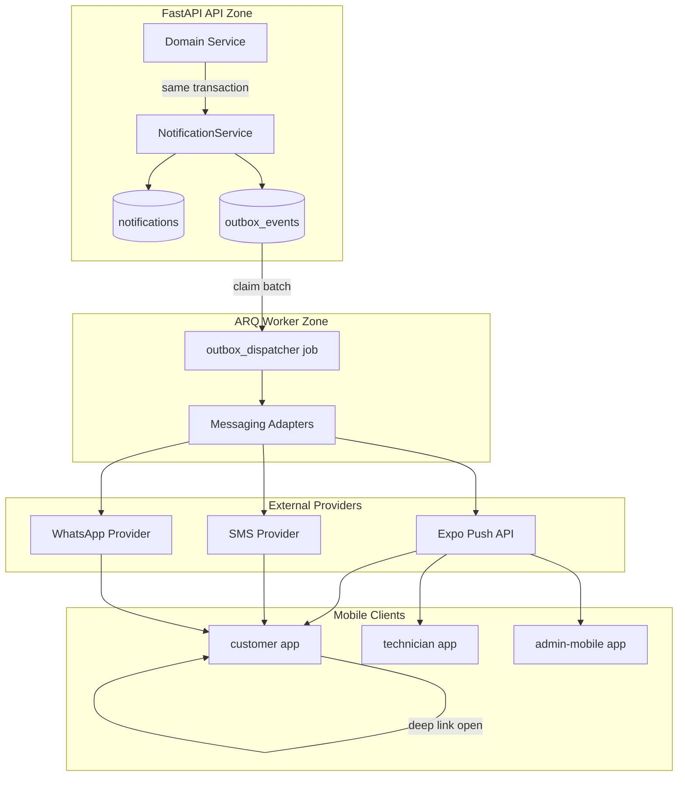
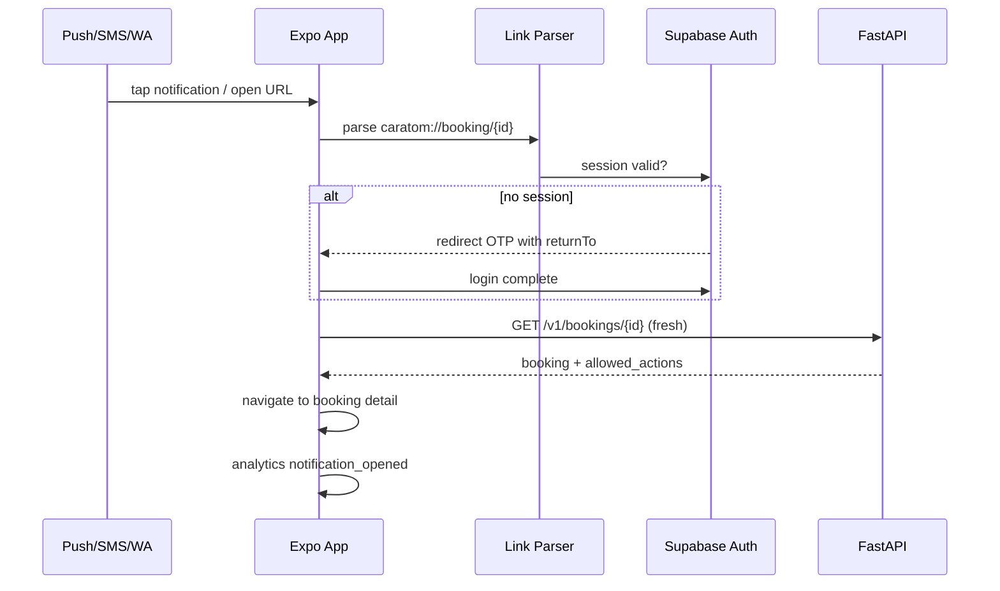

# PHASE 11 — Notifications, Integrations & Platform Hardening

**Document ID:** `PHASE-11-notifications-integrations-hardening.md`  
**Version:** 1.0.0  
**Status:** Executable specification  
**Depends on:** [PHASE-08-payments-invoicing-closure.md](./PHASE-08-payments-invoicing-closure.md), [PHASE-09-admin-web-ops-plane.md](./PHASE-09-admin-web-ops-plane.md), [PHASE-10-admin-mobile-ops-dispatch.md](./PHASE-10-admin-mobile-ops-dispatch.md) (Exit Gate §24 complete on each)  
**Unblocks:** [PHASE-12-production-release-operations.md](./PHASE-12-production-release-operations.md)  
**Estimated effort:** 12–18 engineer-days (single developer + Cursor agent)

**Authority chain:**

1. [`docs/architecture/13-error-recovery.md`](../architecture/13-error-recovery.md) — customer/technician/admin recovery flows; app lifecycle on resume/deep link.
2. [`docs/architecture/14-security.md`](../architecture/14-security.md) — secrets, redaction, webhook verification, rate limits.
3. [`docs/architecture/15-testing-strategy.md`](../architecture/15-testing-strategy.md) — outbox retry, notification idempotency, E2E paths.
4. [`docs/architecture/16-analytics.md`](../architecture/16-analytics.md) — event schemas, server vs client truth, no PII leakage.
5. [`docs/architecture/17-performance.md`](../architecture/17-performance.md) — budgets, caching, worker offload, observability.
6. [`docs/architecture/07-backend-architecture.md`](../architecture/07-backend-architecture.md) — outbox pattern, ARQ workers.
7. [`docs/architecture/05-technical-architecture.md`](../architecture/05-technical-architecture.md) — messaging adapters, notification intents.
8. [`docs/AUDIT-REPORT.md`](../AUDIT-REPORT.md) — advisor live estimate push, deep link gap, Expo Go vs EAS matrix.

**Critical glossary (repeat in code review):**

> **Notification intent** = durable domain record (`notifications` row) created in the same transaction as the business state change; **outbox event** = provider-delivery work item consumed by ARQ.  
> **Channel** = `push`, `sms`, `whatsapp`, `in_app` — not every intent uses every channel; policy decides.  
> **Deep link** = authenticated route into booking, estimate, payment, advisor, or notification inbox — never trusts client-side payment state.

---

## 0. Phase Summary

### Objective

Harden the CARATOM platform for **release candidacy** by implementing durable **notification delivery** (Push via Expo, SMS and WhatsApp via swappable adapters), **universal deep linking** across three Expo apps, **cross-cutting error recovery** aligned with architecture doc 13, **performance budget instrumentation** and fixes per doc 17, **analytics event pipeline** per doc 16, **EAS Update** channels for OTA JS fixes, and the **`outbox_events` ARQ worker** that makes integration side effects reliable without blocking API requests.

Phase 11 does **not** ship to public stores or configure production Railway — that is Phase 12. Phase 11 makes the product **behaviorally complete** for notifications, resume/deep-link recovery, and measurable quality gates.

### What Phase 11 delivers

| ID | Deliverable | Description |
|----|-------------|-------------|
| P11-A | `outbox_events` table + migration | Durable provider queue with claim/retry/dead-letter semantics |
| P11-B | Outbox ARQ worker | Claims rows, dispatches to channel adapters, records attempts |
| P11-C | Notification domain module | Intent creation, template rendering, `notifications` persistence, read APIs |
| P11-D | Expo Push adapter | Device token registration, batch send, receipt handling |
| P11-E | SMS adapter (port + MVP provider) | Transactional SMS for OTP-adjacent and critical alerts; fake in dev |
| P11-F | WhatsApp adapter (port + stub/MVP) | Template messages for advisor callback, payment due; sandbox in dev |
| P11-G | Channel policy engine | Maps business events → channels per role and urgency |
| P11-H | Deep link scheme + routing | `caratom://` and universal links; auth gate + server re-fetch |
| P11-I | Client push registration | Permission UX, Expo token upload, foreground/background handlers |
| P11-J | Notifications inbox UI | Customer + technician + admin-mobile screens; mark read; open target |
| P11-K | Error recovery layer | Offline banner, auth refresh, payment verify-on-resume, stale estimate/slot |
| P11-L | Performance budgets | FlashList, query stale times, backend index audit, p95 logging |
| P11-M | Analytics pipeline | `@caratom/analytics` package; server transition events; client view events |
| P11-N | EAS Update | `eas.json` update channels; runtime version policy; rollback procedure |
| P11-O | Admin undelivered queue | Admin web view of failed/dead-letter outbox + retry |
| P11-P | Tests + observability | Outbox idempotency, deep link E2E, perf smoke, structured metrics |

### What Phase 11 explicitly does NOT deliver

| Item | Phase |
|------|-------|
| App Store / Play Store submission | 12 |
| Production Railway deploy + runbooks | 12 |
| Full accessibility WCAG audit sign-off | 12 |
| Rate limit production tuning at edge | 12 |
| Backup/restore drills | 12 |
| SMS OTP template customization (Supabase) | 12 |
| GlitchTip/Sentry Cloud integration | Later / optional |
| Realtime WebSocket estimate push (optional enhancement) | Later; Phase 11 uses push + poll |
| Multi-language notification templates | Later |
| Customer marketing push campaigns | Out of scope MVP |

### Pinned integration versions (Phase 11 freeze)

| Tool / SDK | Version | Notes |
|------------|---------|-------|
| `expo-notifications` | Bundled with Expo SDK **52.x** | Push permissions + handlers |
| `expo-linking` | Bundled with Expo SDK **52.x** | Deep link parsing |
| `expo-updates` | Bundled with Expo SDK **52.x** | EAS Update runtime |
| EAS CLI | **≥ 13.x** | Build + update commands |
| Expo Push API | v2 | HTTPS, no SDK version pin |
| ARQ | **0.26.x** | Same as Phase 01 |
| Redis | **7.4.x** | Worker queue + optional dedupe cache |

Provider choice for SMS/WhatsApp is **adapter-selected**; default MVP recommendation:

| Channel | MVP provider | Env vars |
|---------|--------------|----------|
| Push | Expo Push Service | `EXPO_ACCESS_TOKEN` (optional for higher limits) |
| SMS | MSG91 or Twilio (pick one in ADR-011) | `SMS_PROVIDER`, `SMS_API_KEY`, `SMS_SENDER_ID` |
| WhatsApp | Twilio WhatsApp API or Meta Cloud API (sandbox) | `WHATSAPP_PROVIDER`, `WHATSAPP_*` secrets |

Record the chosen SMS/WhatsApp vendor in `docs/architecture/decisions/ADR-011-notification-providers.md`.

### Success statement

At Phase 11 exit:

1. Booking confirmation enqueues outbox rows; worker delivers push to customer device within 60 seconds in staging.
2. Advisor revised estimate (Phase 04 flow) triggers push + in-app notification; customer deep link opens estimate accept screen after auth.
3. Payment verification-pending (Phase 08) deep link re-queries server; client never marks paid locally.
4. Failed provider call lands in admin undelivered queue with retry action.
5. Performance smoke tests document p95 for catalog read, job read, slot query against doc 17 targets.
6. Analytics events fire for `notification_opened`, `booking_confirmed` (server), `app_opened` (client) without PII in payload.
7. EAS Update publishes to `preview` channel; customer app receives OTA bundle after reinstall policy check.
8. All §24 exit gate checkboxes pass.

---

## 1. Starting State

### 1.1 Prerequisites (Phases 08–10 exit gates)

| Prerequisite | Verification |
|--------------|--------------|
| Razorpay order + webhook reconciliation | Phase 08 tests green |
| `GET /v1/me/notifications` stub or read from DB | Returns cursor list |
| `notifications` table exists (may be write-only stub) | Migration applied |
| Invoice due + payment verified domain events | Phase 08 integration tests |
| Advisor estimate publish creates notification row (optional stub) | Phase 04/08 handoff |
| Admin web ops plane loads job detail | Phase 09 |
| Admin mobile dispatch assigns technician | Phase 10 |
| Technician offline queue replays | Phase 06 |
| EAS dev build profiles exist (minimum) | `eas.json` from Phase 08+ |
| CI runs lint, typecheck, backend tests | Green on main |

### 1.2 Repository state at Phase 11 start

```text
apps/customer/           # Booking detail, invoice, payment, profile; notifications screen stub
apps/technician/         # Today, visit detail; no push registration
apps/admin-mobile/       # Inbox, dispatch; no push registration
apps/admin/              # Ops plane; no notification admin views
backend/
  app/modules/
    notifications/       # May exist as read-only from Phase 08
    payments/              # Webhook handlers enqueue side effects (partial)
  worker/
    main.py                # ARQ stub or partial jobs
packages/contracts/        # Notification DTOs partial
packages/api-client/       # No push token endpoint
```

**Absent or incomplete at start:**

- `outbox_events` table and worker consumer
- Channel adapter implementations (`push`, `sms`, `whatsapp`)
- Device push token registration API
- Deep link route map in all three Expo apps
- Unified error recovery components (`OfflineBanner`, `RecoverableError`)
- `@caratom/analytics` package
- Performance measurement scripts
- EAS Update channel configuration
- Admin undelivered notification queue UI

### 1.3 Assumptions

- Staging Supabase + Railway + Redis available for integration tests.
- Physical devices or simulators with EAS **development** builds (Expo Go insufficient for push on iOS; document matrix in §9).
- India (+91) phone numbers for SMS/WhatsApp sandbox testing.
- Phase 11 uses **Asia/Kolkata** display for scheduled notification copy.

---

## 2. Desired End State

After Phase 11 passes the Exit Gate (§24), the repository MUST include:

```text
CarAtom-main/
├── apps/
│   ├── customer/
│   │   ├── app/
│   │   │   ├── _layout.tsx              # deep link + analytics bootstrap
│   │   │   ├── +native-intent.ts        # Android App Links intent filters
│   │   │   ├── notifications.tsx        # inbox screen
│   │   │   └── (linking)/               # auth-gated deep link targets
│   │   ├── src/
│   │   │   ├── linking/
│   │   │   │   ├── scheme.ts
│   │   │   │   ├── parseDeepLink.ts
│   │   │   │   └── useDeepLinkHandler.ts
│   │   │   ├── notifications/
│   │   │   │   ├── registerPush.ts
│   │   │   │   └── handleNotificationResponse.ts
│   │   │   ├── recovery/
│   │   │   │   ├── OfflineBanner.tsx
│   │   │   │   ├── AuthRecovery.tsx
│   │   │   │   ├── PaymentVerifyOnResume.tsx
│   │   │   │   └── StaleEstimateGuard.tsx
│   │   │   └── analytics/
│   │   │       └── track.ts
│   │   ├── app.json                     # scheme, associatedDomains
│   │   └── eas.json                     # update channels
│   ├── technician/                      # parallel: linking, push, recovery
│   ├── admin-mobile/                    # parallel: linking, push, recovery
│   └── admin/
│       └── app/
│           └── notifications/
│               └── undelivered/page.tsx # failed outbox admin view
├── packages/
│   ├── analytics/
│   │   ├── package.json
│   │   └── src/
│   │       ├── events.ts                # versioned event schemas
│   │       ├── client.ts
│   │       └── server-contracts.ts
│   └── contracts/
│       └── src/
│           ├── notifications.ts
│           ├── outbox.ts
│           └── deep-links.ts
├── backend/
│   ├── app/
│   │   ├── modules/
│   │   │   └── notifications/
│   │   │       ├── router.py
│   │   │       ├── service.py
│   │   │       ├── templates/
│   │   │       │   ├── v1/
│   │   │       │   │   ├── estimate_ready.yaml
│   │   │       │   │   ├── advisor_revised.yaml
│   │   │       │   │   ├── slot_confirmed.yaml
│   │   │       │   │   ├── payment_due.yaml
│   │   │       │   │   └── visit_complete.yaml
│   │   │       └── channel_policy.py
│   │   ├── integrations/
│   │   │   ├── ports/
│   │   │   │   ├── messaging.py       # Protocol: send_sms, send_whatsapp, send_push
│   │   │   └── adapters/
│   │   │       ├── expo_push.py
│   │   │       ├── sms_msg91.py         # or sms_twilio.py per ADR
│   │   │       ├── whatsapp_twilio.py   # or whatsapp_meta.py
│   │   │       └── fake_messaging.py    # dev/test
│   │   └── db/models/
│   │       ├── notification.py
│   │       └── outbox_event.py
│   └── worker/
│       ├── main.py
│       └── jobs/
│           ├── outbox_dispatcher.py
│           ├── notification_reminders.py
│           └── push_receipt_poll.py
├── scripts/
│   └── perf/
│       ├── smoke-api-latency.mjs
│       └── README.md
└── docs/architecture/decisions/
    └── ADR-011-notification-providers.md
```

---

## 3. Why This Phase Exists Here

Phase 11 sits **after money closure and both admin surfaces** because:

1. **Notification intents reference real domain objects** — bookings, estimates, invoices, payments, visits, advisor cases — all exist by Phase 08–10.
2. **Deep links target concrete screens** — booking detail, invoice/payment, estimate accept — implemented in Phases 03–08.
3. **Error recovery spans the full funnel** — stale estimates, slot holds, payment verification — meaningless without prior flows.
4. **Performance budgets require realistic data** — catalog seed, job boards, notification lists must exist to measure.
5. **EAS Update assumes stable navigation** — OTA updates must not break deep link contracts locked in Phase 11.

**Risk if skipped:** Production launch with silent notification failures, broken payment deep links, unmeasurable perf regressions, and no path to hotfix JS without store resubmission.

Per [`18-implementation-roadmap.md`](../architecture/18-implementation-roadmap.md) Phase 9 (hardening), this phase implements the **platform integration and quality** slice before Phase 12 operational release.

---

## 4. Source Material

| Source | Use in Phase 11 |
|--------|-----------------|
| [`13-error-recovery.md`](../architecture/13-error-recovery.md) | §11 recovery components; §13 data flows for resume |
| [`14-security.md`](../architecture/14-security.md) | §15 secrets, redaction, webhook patterns |
| [`15-testing-strategy.md`](../architecture/15-testing-strategy.md) | §16 outbox/idempotency/deep link tests |
| [`16-analytics.md`](../architecture/16-analytics.md) | §10 analytics events and rules |
| [`17-performance.md`](../architecture/17-performance.md) | §10 perf budgets, indexes, FlashList |
| [`05-technical-architecture.md`](../architecture/05-technical-architecture.md) | Outbox, messaging adapters, notification intents |
| [`06-frontend-architecture.md`](../architecture/06-frontend-architecture.md) | Deep links, permissions, persistence |
| [`07-backend-architecture.md`](../architecture/07-backend-architecture.md) | Worker jobs, transactional outbox |
| [`08-data-model.md`](../architecture/08-data-model.md) | `notifications`, `outbox_events` indexes |
| [`09-api-contracts.md`](../architecture/09-api-contracts.md) | `/v1/me/notifications`, device token routes |
| [`11-screen-specifications.md`](../architecture/11-screen-specifications.md) | Notifications screen spec |
| [`03-domain-model.md`](../architecture/03-domain-model.md) | `Notification` entity fields |
| [`AUDIT-REPORT.md`](../AUDIT-REPORT.md) | I4 advisor push; deep link gap; Expo Go matrix |
| [`19-open-questions.md`](../architecture/19-open-questions.md) | Q10 channel/provider — resolve in ADR-011 |

---

## 5. Architectural Context (diagram)

### 5.1 Notification delivery topology



### 5.2 Trust boundaries (Phase 11 additions)

```text
┌─────────────────────────────────────────────────────────────────────┐
│  CLIENT ZONE — Expo apps                                            │
│  - EXPO_PUBLIC_* only; Expo project ID for push                     │
│  - Stores push token locally until uploaded                         │
│  - Deep links NEVER skip auth; re-fetch server state on open        │
│  - Analytics: no phone, address, reg, payment_id, raw concerns      │
└──────────────────────────┬──────────────────────────────────────────┘
                           │ HTTPS + JWT
┌──────────────────────────▼──────────────────────────────────────────┐
│  API ZONE — FastAPI                                                 │
│  - Creates notification + outbox in domain transaction              │
│  - Device token endpoints scoped to authenticated profile           │
│  - Admin retry requires admin role + audit reason                   │
└──────────────────────────┬──────────────────────────────────────────┘
                           │
┌──────────────────────────▼──────────────────────────────────────────┐
│  WORKER ZONE — ARQ on Railway                                       │
│  - Claims outbox with FOR UPDATE SKIP LOCKED                        │
│  - Provider API keys from env only                                  │
│  - Idempotency keys per (outbox_id, channel, attempt)               │
└──────────────────────────┬──────────────────────────────────────────┘
                           │
┌──────────────────────────▼──────────────────────────────────────────┐
│  PROVIDER ZONE — Expo / SMS / WhatsApp                              │
│  - No business truth; delivery receipts only                        │
└─────────────────────────────────────────────────────────────────────┘
```

### 5.3 Deep link lifecycle



### 5.4 Outbox state machine

```text
PENDING → CLAIMED → SUCCEEDED
                 ↘ FAILED → (backoff) → PENDING
                 ↘ DEAD_LETTER (max attempts exceeded)
```

| Status | Meaning |
|--------|---------|
| `PENDING` | Ready for worker; `available_at <= now()` |
| `CLAIMED` | Worker owns row; stale claim reaped after TTL |
| `SUCCEEDED` | Provider accepted; receipt stored |
| `FAILED` | Attempt recorded; may retry |
| `DEAD_LETTER` | Manual admin retry only |

---

## 6. Exact Implementation Scope + Out of Scope

### 6.1 In scope (MUST implement)

| Area | Scope |
|------|-------|
| Database | `outbox_events` migration; extend `notifications`; `device_push_tokens` table |
| Outbox worker | ARQ cron + on-demand dispatch; exponential backoff |
| Adapters | Expo Push (required); SMS + WhatsApp ports with ≥1 real or sandbox adapter each |
| Templates | Versioned YAML templates v1 for top 8 business events |
| Channel policy | Role-based defaults; urgent vs normal |
| API | Device token CRUD; notification list/mark read; admin outbox retry |
| Customer app | Push registration, inbox, deep links, recovery layer |
| Technician app | Push for assignment/visit; deep link to visit detail |
| Admin mobile | Push for advisor inbox; deep link to case |
| Admin web | Undelivered queue, template preview read-only |
| Analytics | `@caratom/analytics` with ≥20 events from doc 16 |
| Performance | Index audit, FlashList on notifications/orders, perf smoke script |
| EAS Update | `preview` + `production` channels; runtimeVersion policy |
| Error recovery | Offline, auth, payment verify, stale estimate/slot per doc 13 |
| Tests | Outbox idempotency, fake adapter integration, deep link unit tests |
| ADR | ADR-011 provider selection |

### 6.2 Out of scope (MUST NOT implement in Phase 11)

| Item | Deferred to |
|------|-------------|
| Store submission, screenshots, ASO | Phase 12 |
| Production CDN/WAF rate limits | Phase 12 |
| Full device matrix (20+ devices) | Phase 12 |
| Marketing/broadcast push | Post-MVP |
| Customer notification preference center (granular toggles) | Phase 12 minimum |
| Realtime Supabase channel for estimate | Optional later |
| Temporal / second queue system | Never MVP |
| In-app chat | Out of scope |

### 6.3 Boundary rules

- Domain services MUST enqueue notifications via `NotificationService.enqueue_intent()` — never call Expo/SMS directly from routers.
- Worker MUST be the only runtime that calls provider APIs (except webhook receivers).
- Deep links MUST include `entity_type` + `entity_id` + optional `action`; never embed payment status.
- Analytics failure MUST NOT block booking, payment, or notification mark-read.
- EAS Update MUST NOT change native module versions — only JS/assets compatible with pinned runtime.

---

## 7. Repository Changes

### 7.1 New files (complete list)

**Packages:**

- `packages/analytics/package.json`, `tsconfig.json`, `src/events.ts`, `src/client.ts`, `src/index.ts`
- `packages/contracts/src/notifications.ts`, `outbox.ts`, `deep-links.ts`

**Backend:**

- `backend/app/db/models/outbox_event.py`, `device_push_token.py`
- `backend/app/modules/notifications/service.py`, `channel_policy.py`, `router.py`, `templates/v1/*.yaml`
- `backend/app/integrations/ports/messaging.py`
- `backend/app/integrations/adapters/expo_push.py`, `fake_messaging.py`, SMS/WhatsApp adapters
- `backend/worker/jobs/outbox_dispatcher.py`, `notification_reminders.py`, `push_receipt_poll.py`
- `backend/alembic/versions/xxxx_outbox_events_device_tokens.py`
- `backend/tests/integration/test_outbox_dispatch.py`, `test_notifications_api.py`

**Customer app:**

- `apps/customer/src/linking/*`, `src/notifications/*`, `src/recovery/*`, `src/analytics/track.ts`
- `apps/customer/app/notifications.tsx`
- Update `apps/customer/app/_layout.tsx`, `app.json`, `eas.json`

**Technician / admin-mobile:** Parallel `src/notifications`, `src/linking`, `src/recovery` (technician-specific targets).

**Admin web:**

- `apps/admin/app/notifications/undelivered/page.tsx`

**Scripts:**

- `scripts/perf/smoke-api-latency.mjs`, `scripts/perf/README.md`

**Docs:**

- `docs/architecture/decisions/ADR-011-notification-providers.md`

### 7.2 Modified files

- `backend/worker/main.py` — register outbox jobs
- `backend/app/main.py` — include notifications router extensions
- Domain modules (`bookings`, `payments`, `advisor`, `visits`) — call `enqueue_intent` at transition points
- `packages/contracts/src/index.ts` — export new types
- `packages/api-client/src/client.ts` — device token + notification methods
- `.github/workflows/ci.yml` — analytics package typecheck; outbox integration test job
- `docs/implementation/README.md` — confirm Phase 11 link (already present)

### 7.3 Files that MUST NOT be created

- Duplicate notification systems (Firebase direct bypassing Expo)
- Client-side SMS senders
- Redis-as-source-of-truth notification store
- Second outbox table

---

## 8. Detailed Implementation Sequence

Execute tasks **in order** unless marked parallel-safe.

---

### Task 11.1 — ADR-011 notification providers

**Goal:** Resolve open question 10 from architecture doc 19.

**Files:** `docs/architecture/decisions/ADR-011-notification-providers.md`

**Content:** Decision, SMS vendor, WhatsApp vendor, cost assumptions, DLT/template registration notes for India, fallback if WhatsApp sandbox unavailable (SMS + push only).

**Verification:** ADR committed; env var names documented in backend `.env.example`.

---

### Task 11.2 — Database migration: `outbox_events` + `device_push_tokens`

**Goal:** Durable queue and push target registry.

**Schema `outbox_events`:**

```sql
CREATE TYPE outbox_status AS ENUM (
  'PENDING', 'CLAIMED', 'SUCCEEDED', 'FAILED', 'DEAD_LETTER'
);

CREATE TABLE outbox_events (
  id UUID PRIMARY KEY DEFAULT gen_random_uuid(),
  notification_id UUID REFERENCES notifications(id) ON DELETE SET NULL,
  channel VARCHAR(32) NOT NULL,  -- push, sms, whatsapp
  payload JSONB NOT NULL,
  idempotency_key VARCHAR(128) NOT NULL,
  status outbox_status NOT NULL DEFAULT 'PENDING',
  attempt_count INT NOT NULL DEFAULT 0,
  max_attempts INT NOT NULL DEFAULT 8,
  available_at TIMESTAMPTZ NOT NULL DEFAULT now(),
  claimed_at TIMESTAMPTZ,
  claim_token UUID,
  last_error_code VARCHAR(64),
  last_error_message TEXT,
  provider_receipt JSONB,
  created_at TIMESTAMPTZ NOT NULL DEFAULT now(),
  updated_at TIMESTAMPTZ NOT NULL DEFAULT now(),
  UNIQUE (idempotency_key)
);

CREATE INDEX idx_outbox_pending ON outbox_events (status, available_at)
  WHERE status IN ('PENDING', 'FAILED');
```

**Schema `device_push_tokens`:**

```sql
CREATE TABLE device_push_tokens (
  id UUID PRIMARY KEY DEFAULT gen_random_uuid(),
  profile_id UUID NOT NULL REFERENCES profiles(id) ON DELETE CASCADE,
  app_surface VARCHAR(32) NOT NULL,  -- customer, technician, admin_mobile
  expo_push_token TEXT NOT NULL,
  platform VARCHAR(16) NOT NULL,   -- ios, android
  device_id VARCHAR(128),
  last_seen_at TIMESTAMPTZ NOT NULL DEFAULT now(),
  revoked_at TIMESTAMPTZ,
  created_at TIMESTAMPTZ NOT NULL DEFAULT now(),
  UNIQUE (profile_id, app_surface, expo_push_token)
);
```

**Extend `notifications`:** Ensure columns: `intent`, `template_key`, `template_version`, `channels_attempted`, `entity_type`, `entity_id`, `deep_link_path`, `read_at`, `delivery_status`.

**Verification:**

```powershell
cd backend && uv run alembic upgrade head
cd backend && uv run pytest tests/integration/test_migrations.py -q
```

---

### Task 11.3 — Messaging port + fake adapter

**Goal:** Define adapter interface; enable tests without providers.

**File:** `backend/app/integrations/ports/messaging.py`

```python
from typing import Protocol
from dataclasses import dataclass

@dataclass
class PushMessage:
    to_token: str
    title: str
    body: str
    data: dict[str, str]
    priority: str = "default"

@dataclass
class SmsMessage:
    to_e164: str
    body: str
    template_id: str | None = None

@dataclass
class WhatsAppMessage:
    to_e164: str
    template_name: str
    template_params: dict[str, str]

@dataclass
class SendResult:
    success: bool
    provider_message_id: str | None
    error_code: str | None
    retryable: bool

class MessagingPort(Protocol):
    async def send_push(self, msg: PushMessage) -> SendResult: ...
    async def send_sms(self, msg: SmsMessage) -> SendResult: ...
    async def send_whatsapp(self, msg: WhatsAppMessage) -> SendResult: ...
```

**Fake adapter:** Records sends in memory for tests; simulates retryable failures via env `FAKE_MESSAGING_FAIL_RATE`.

**Verification:** Unit test fake adapter; inject via FastAPI dependency override.

---

### Task 11.4 — Expo Push adapter

**Goal:** Production push delivery.

**File:** `backend/app/integrations/adapters/expo_push.py`

**Implementation notes:**

- POST `https://exp.host/--/api/v2/push/send` with JSON array batch (max 100).
- Map `PushMessage.data` to Expo `data` (string values only).
- Handle `DeviceNotRegistered` → mark token revoked in DB.
- Optional: `EXPO_ACCESS_TOKEN` header for higher rate limits.

**Verification:** Staging send to registered dev device; receipt stored in `provider_receipt`.

---

### Task 11.5 — SMS + WhatsApp adapters

**Goal:** Implement ADR-011 chosen providers.

**Parallel-safe** after Task 11.3.

**SMS:** Implement selected vendor; truncate body to 1600 chars; never include full address in SMS — use deep link short path.

**WhatsApp:** Template-only messages in MVP (Meta/Twilio requirement); map `advisor_revised`, `payment_due` templates.

**Dev/staging:** Fall back to `fake_messaging` when `SMS_PROVIDER=fake`.

**Verification:** Sandbox send to test number; integration test with fake adapter asserts idempotency.

---

### Task 11.6 — Notification templates v1

**Goal:** Versioned, channel-specific copy.

**Directory:** `backend/app/modules/notifications/templates/v1/`

**Required templates:**

| Template key | Trigger | Push title (example) |
|--------------|---------|----------------------|
| `estimate_ready` | Estimate published | Your estimate is ready |
| `advisor_revised` | Advisor publishes revision | Updated estimate from advisor |
| `advisor_call_requested` | Advisor case opened | We'll call you shortly |
| `slot_confirmed` | Booking confirmed | Visit confirmed |
| `technician_assigned` | Dispatch assigns | Technician assigned |
| `technician_eta` | ETA update | Technician on the way |
| `payment_due` | Invoice balance > 0 | Payment due |
| `payment_verified` | Payment captured | Payment received |
| `visit_complete` | Visit completed | Service complete |
| `parts_advance_due` | Inspection flow | Parts advance due |

Each YAML file:

```yaml
version: 1
intent: estimate_ready
channels:
  push:
    title: "Your estimate is ready"
    body: "Review and accept your {{service_name}} estimate."
  sms:
    body: "CARATOM: Your estimate is ready. Open: {{deep_link_short}}"
  whatsapp:
    template_name: "caratom_estimate_ready"
    params: [service_name, deep_link_short]
deep_link_template: "caratom://estimate/{{estimate_id}}"
```

**Verification:** Snapshot test rendered output for each template with fixture context.

---

### Task 11.7 — Channel policy engine

**Goal:** Decide which channels fire per intent/role/urgency.

**File:** `backend/app/modules/notifications/channel_policy.py`

**Default policy (MVP):**

| Intent | Customer push | Customer SMS | Customer WhatsApp |
|--------|---------------|--------------|-------------------|
| `estimate_ready` | ✓ | — | — |
| `advisor_revised` | ✓ | ✓ | ✓ (if opted in sandbox) |
| `slot_confirmed` | ✓ | ✓ | — |
| `payment_due` | ✓ | — | ✓ |
| `technician_assigned` | ✓ | — | — |

Technician/admin-mobile: push only for operational alerts.

**Verification:** Unit tests for each intent; admin override via `FeatureSetting` deferred to Phase 12.

---

### Task 11.8 — NotificationService + domain hooks

**Goal:** Transactional enqueue from domain transitions.

**File:** `backend/app/modules/notifications/service.py`

**Core API:**

```python
class NotificationService:
    def enqueue_intent(
        self,
        db: Session,
        *,
        profile_id: UUID,
        intent: str,
        entity_type: str,
        entity_id: UUID,
        context: dict,
        request_id: str,
    ) -> Notification:
        """Create notifications row + outbox_events per channel policy in same transaction."""
```

**Hook points (modify existing services):**

| Domain event | Module | Intent |
|--------------|--------|--------|
| Estimate published | `pricing` / `advisor` | `estimate_ready` or `advisor_revised` |
| Booking confirmed | `bookings` | `slot_confirmed` |
| Payment captured | `payments` | `payment_verified` |
| Invoice issued with balance | `invoices` | `payment_due` |
| Visit completed | `visits` | `visit_complete` |
| Technician assigned | `dispatch` | `technician_assigned` |

**Verification:** Integration test — confirm booking creates notification + outbox rows atomically; rollback on booking failure leaves zero rows.

---

### Task 11.9 — Outbox dispatcher worker

**Goal:** Reliable async delivery.

**File:** `backend/worker/jobs/outbox_dispatcher.py`

**Algorithm:**

1. Select batch `FOR UPDATE SKIP LOCKED` where `status IN (PENDING, FAILED)` and `available_at <= now()` and `attempt_count < max_attempts`.
2. Set `CLAIMED`, assign `claim_token`.
3. Resolve adapter from channel; call provider with timeout 15s.
4. On success → `SUCCEEDED`, store receipt.
5. On retryable failure → increment `attempt_count`, `FAILED`, `available_at = now() + backoff(attempt)` (30s, 2m, 5m, 15m, 1h…).
6. On non-retryable or max attempts → `DEAD_LETTER`.

**Cron:** Every 30 seconds via ARQ cron; plus enqueue immediate job on high-priority intents.

**Stale claim reaper:** Reset `CLAIMED` older than 5 minutes to `PENDING`.

**Verification:**

```powershell
cd backend && uv run pytest tests/integration/test_outbox_dispatch.py -v
```

Tests: idempotent redelivery, backoff scheduling, dead letter after max attempts.

---

### Task 11.10 — Device push token API

**Goal:** Register Expo tokens per app surface.

**Routes:**

```text
PUT  /v1/me/device-push-token
DELETE /v1/me/device-push-token/{token_id}
```

**Body (PUT):**

```json
{
  "app_surface": "customer",
  "expo_push_token": "ExponentPushToken[xxx]",
  "platform": "ios",
  "device_id": "optional-stable-id"
}
```

**Verification:** Token associated with profile; duplicate PUT upserts `last_seen_at`; technician token not sent customer notifications.

---

### Task 11.11 — Notifications read API enhancements

**Goal:** Inbox with cursor pagination and mark read.

**Routes:**

```text
GET  /v1/me/notifications?cursor=&limit=20
POST /v1/me/notifications/{id}/read
POST /v1/me/notifications/read-all
```

**Response item shape (`@caratom/contracts`):**

```typescript
export const NotificationItemSchema = z.object({
  id: z.string().uuid(),
  intent: z.string(),
  title: z.string(),
  body: z.string(),
  deep_link_path: z.string(),
  entity_type: z.string(),
  entity_id: z.string().uuid(),
  read_at: z.string().datetime().nullable(),
  created_at: z.string().datetime(),
  delivery_status: z.enum(['pending', 'delivered', 'failed']),
});
```

**Verification:** Cursor stable ordering by `created_at DESC, id DESC`; mark read idempotent.

---

### Task 11.12 — Admin outbox retry API + UI

**Goal:** Operational recovery for dead letters.

**Routes:**

```text
GET  /v1/admin/notifications/outbox?status=DEAD_LETTER&cursor=
POST /v1/admin/notifications/outbox/{id}/retry
```

**Retry:** Requires `reason` in body; sets status `PENDING`, resets `attempt_count` partially; audit log entry.

**Admin UI:** Table with channel, intent, last error, created_at, Retry button with reason modal.

**Verification:** Playwright test — admin retries failed row; worker processes on next tick.

---

### Task 11.13 — `@caratom/analytics` package

**Goal:** Versioned client + server event contracts.

**Events (minimum from doc 16):**

Client: `app_opened`, `session_restored`, `notification_opened`, `notifications_viewed`, `booking_detail_viewed`, `estimate_viewed`, `payment_started`, `offline_banner_shown`.

Server: `booking_confirmed`, `payment_verified`, `notification_delivered`, `outbox_dead_letter`, state transition events.

**Rules:**

- Include `event_schema_version`, `app_version`, `app_surface`, anonymous `session_id`.
- Never include phone, address, reg, payment_id, image URLs, raw concerns.
- Client uses fire-and-forget POST `/v1/analytics/events` (batch); failure swallowed.

**Verification:** Unit test schema validation rejects PII fields.

---

### Task 11.14 — Deep link scheme (all Expo apps)

**Goal:** Universal link contract.

**Scheme:** `caratom://`

**Paths:**

| Path | Target screen |
|------|---------------|
| `caratom://booking/{booking_id}` | Booking detail |
| `caratom://estimate/{estimate_id}` | Estimate accept/review |
| `caratom://payment/{invoice_id}` | Invoice/payment |
| `caratom://advisor/{advisor_case_id}` | Advisor status |
| `caratom://visit/{visit_id}` | Technician visit detail |
| `caratom://notifications` | Inbox |
| `caratom://support/{ticket_id}` | Support ticket |

**Universal links (Phase 11 staging):**

- iOS: `applinks:staging.caratom.app`
- Android: intent filter for `https://staging.caratom.app/l/*`

**Short link path:** `https://staging.caratom.app/l/b/{booking_id}` redirects to app scheme.

**Implementation:** `packages/contracts/src/deep-links.ts` shared parsers; per-app `useDeepLinkHandler` in root layout.

**Verification:** Unit tests for parse + invalid IDs; manual open from `npx uri-scheme open`.

---

### Task 11.15 — Customer push registration + handlers

**Goal:** OS permission → token upload → notification tap routing.

**Files:** `apps/customer/src/notifications/registerPush.ts`, `handleNotificationResponse.ts`

**Flow:**

1. After login, if not yet granted, show in-context rationale before requesting permission (not at cold launch).
2. `Notifications.getExpoPushTokenAsync({ projectId })`.
3. `PUT /v1/me/device-push-token`.
4. Foreground: show in-app banner using design system toast.
5. Background tap: `handleNotificationResponse` → parse `data.deep_link_path` → `router.push` after auth check.

**Expo Go matrix (document in app README):**

| Feature | Expo Go | EAS dev build |
|---------|---------|---------------|
| Push iOS | No | Yes |
| Push Android | Limited | Yes |
| Deep link custom scheme | Yes | Yes |

**Verification:** Physical device receives staging push; tap opens correct screen.

---

### Task 11.16 — Technician + admin-mobile push (parallel)

**Goal:** Operational notifications.

**Technician intents:** `visit_assigned`, `visit_updated`, `dispatch_message`.

**Admin-mobile intents:** `advisor_case_waiting`, `dispatch_override_needed`.

Repeat Task 11.15 pattern with `app_surface` `technician` / `admin_mobile`.

**Verification:** Assign visit in staging → technician device push within 60s.

---

### Task 11.17 — Error recovery layer (customer app)

**Goal:** Implement doc 13 patterns as reusable components.

**Components:**

| Component | Behavior |
|-----------|----------|
| `OfflineBanner` | NetInfo listener; shows when offline; disables mutating CTAs |
| `AuthRecovery` | On 401: refresh once; else OTP with `returnTo` |
| `PaymentVerifyOnResume` | AppState active → re-fetch payment status if pending |
| `StaleEstimateGuard` | Before book CTA: compare estimate version; block if stale |
| `StaleSlotGuard` | Hold expired → release UI, reload slots, retain checkout data |
| `DuplicateBookingRecovery` | On conflict/idempotency hit → navigate to existing booking |

**Integration:** Wrap booking detail, checkout, payment screens.

**Verification:** RN Testing Library tests for offline banner + stale estimate block; manual airplane mode test.

---

### Task 11.18 — Performance hardening pass

**Goal:** Meet doc 17 budgets where measurable.

**Client:**

- Convert orders list, notifications list, job board to `@shopify/flash-list`.
- TanStack Query: `staleTime` catalog 5m, profile 2m, notifications 30s.
- Image resize on upload paths (technician) — verify max dimension 2048.
- Debounce search 300ms; abort obsolete fetches.

**Backend:**

- Verify indexes from §Task 11.2 and doc 08 on hot paths.
- Add query timing middleware logging p95 per route (structured JSON).
- Ensure pricing path makes zero external HTTP calls.

**Script:** `scripts/perf/smoke-api-latency.mjs` — 100 iterations, report p50/p95 for `/v1/catalog/home`, `/v1/job-cards/{id}`, `/v1/slots`.

**Verification:** Document results in PR; p95 within doc 17 targets on staging or explain gap.

---

### Task 11.19 — EAS Update configuration

**Goal:** OTA updates for JS/asset hotfixes.

**File:** `apps/customer/eas.json` (and technician, admin-mobile)

```json
{
  "cli": { "version": ">= 13.0.0" },
  "build": {
    "development": { "developmentClient": true, "channel": "development" },
    "preview": { "channel": "preview" },
    "production": { "channel": "production" }
  },
  "submit": {}
}
```

**app.json:**

```json
{
  "expo": {
    "updates": {
      "url": "https://u.expo.dev/<project-id>",
      "enabled": true,
      "checkAutomatically": "ON_LOAD",
      "fallbackToCacheTimeout": 0
    },
    "runtimeVersion": { "policy": "appVersion" }
  }
}
```

**Procedure:**

1. `eas update --channel preview --message "phase-11 test"`
2. Kill app → reopen → verify new bundle via logged `updateId`.

**Rollback:** `eas update --channel preview --branch rollback-<date>` or republish prior update group.

**Verification:** Update received on preview build; native module change NOT included in update (document limitation).

---

### Task 11.20 — Reminder jobs (optional cron)

**Goal:** Time-based notifications without assuming prior delivery succeeded.

**File:** `backend/worker/jobs/notification_reminders.py`

**Examples:**

- Slot reminder T-24h and T-2h (query bookings with confirmed slot).
- Payment due T+24h after invoice (balance > 0).

**Rule:** Query persisted state; create new intent if no successful delivery record for `(intent, entity_id, window)` — idempotent.

**Verification:** Integration test with frozen clock.

---

### Task 11.21 — CI + documentation updates

**Goal:** Pipeline covers new packages and integration tests.

- Add `@caratom/analytics` to workspace.
- CI job: `pytest tests/integration/test_outbox_dispatch.py`.
- Update backend README: worker env vars, running dispatcher locally.
- Update customer README: EAS build required for push testing.

**Verification:** `pnpm ci` green.

---

## 9. Mobile Implementation (3 Expo apps + shared patterns)

### 9.1 Push permission UX

Per [`06-frontend-architecture.md`](../architecture/06-frontend-architecture.md):

- Request notification permission **in context** — e.g., after first booking confirmed ("Get visit updates") or from profile → notifications settings.
- If denied, show settings deep link instruction; do not re-prompt aggressively.
- Copy must explain value: visit updates, advisor callbacks, payment receipts — not marketing.

### 9.2 Root layout bootstrap

**Customer `app/_layout.tsx` responsibilities:**

1. Initialize `@caratom/analytics` with session id.
2. Register `Linking.addEventListener('url')` + `useURL()`.
3. Call `useDeepLinkHandler()` before navigation ready.
4. On auth session restore → `registerPushIfNeeded()`.
5. Subscribe `Notifications.addNotificationResponseReceivedListener`.

### 9.3 Notifications inbox screen

Per [`11-screen-specifications.md`](../architecture/11-screen-specifications.md) Notifications section:

**Route:** `app/notifications.tsx`

**UI:**

- FlashList of notification items.
- Unread indicator (dot or bold title).
- Tap → mark read API + navigate via `deep_link_path`.
- Empty state: "No updates yet" + explanation.
- Error state: retry button.
- Pull-to-refresh.

**Analytics:** `notifications_viewed` on mount; `notification_opened` on tap with `intent`, `entity_type` only.

### 9.4 Deep link auth gate

```typescript
// apps/customer/src/linking/useDeepLinkHandler.ts (behavioral spec)
async function handleDeepLink(url: string) {
  const parsed = parseDeepLink(url);
  if (!parsed) return;

  const session = await supabase.auth.getSession();
  if (!session.data.session) {
    router.push({ pathname: '/login', params: { returnTo: parsed.path } });
    return;
  }

  // Always re-fetch target resource before navigation
  await prefetchEntity(parsed);
  router.push(parsed.route);
}
```

### 9.5 Payment deep link safety

When path matches `payment/{invoice_id}`:

1. Fetch `GET /v1/invoices/{id}` and payment status.
2. If `PAYMENT_VERIFICATION_PENDING` → show verifying UI, poll every 3s max 30s.
3. Never set local `paid=true` from query params.

### 9.6 Advisor revised estimate deep link

When path matches `estimate/{estimate_id}`:

1. Fetch estimate with version.
2. If superseded → show "Updated estimate" summary per doc 13.
3. If expired → editable job card path with retry pricing.

### 9.7 Technician app specifics

- Push data routes to `visit/{id}` only if visit assigned to authenticated technician (server 403 → error screen).
- Offline queue unchanged from Phase 06; push is additive.

### 9.8 Admin-mobile app specifics

- Push for `advisor_case_waiting` opens advisor inbox case detail.
- Deep link `advisor/{id}` fetches case status before showing call/revise actions.

### 9.9 EAS build requirement matrix

| App | Push | Deep link | EAS Update | Distribution |
|-----|------|-----------|------------|--------------|
| customer | Required | Required | Required | Public (Phase 12) |
| technician | Required | Required | Required | Private |
| admin-mobile | Required | Required | Required | Private |

Document in each app README; link to Expo push FCM/APNs setup checklist.

---

## 10. Backend Implementation (notifications, outbox, integrations)

### 10.1 Module layering

```text
router.py          → HTTP validation, auth
service.py         → NotificationService, template render
channel_policy.py  → channel selection
repository.py      → SQLAlchemy queries (optional split)
templates/v1/      → YAML copy
```

Integrations live under `app/integrations/` — **not** inside domain modules.

### 10.2 Transaction boundary

```python
# Pseudocode — booking confirm
with db.begin():
    booking = booking_service.confirm(...)
    notification_service.enqueue_intent(
        db,
        profile_id=booking.customer_profile_id,
        intent="slot_confirmed",
        entity_type="booking",
        entity_id=booking.id,
        context={"service_name": booking.snapshot.service_name, ...},
        request_id=request.state.request_id,
    )
    # outbox rows created inside enqueue_intent
```

If `confirm` raises, no notification or outbox rows persist.

### 10.3 Idempotency keys

Format: `{intent}:{entity_id}:{channel}:{template_version}`

Duplicate enqueue with same key returns existing outbox row (no double send).

### 10.4 Worker registration

**File:** `backend/worker/main.py`

```python
class WorkerSettings:
    functions = [outbox_dispatcher.run, notification_reminders.run]
    cron_jobs = [
        cron(outbox_dispatcher.run, second={0, 30}),
        cron(notification_reminders.run, minute=0),
        cron(push_receipt_poll.run, minute={5, 35}),
    ]
```

### 10.5 Provider configuration

**`backend/app/config.py` additions:**

```python
sms_provider: str = "fake"
whatsapp_provider: str = "fake"
expo_access_token: str | None = None
notification_max_attempts: int = 8
outbox_batch_size: int = 50
```

**Factory:** `get_messaging_adapter()` returns fake in `ENV=development` unless `FORCE_REAL_MESSAGING=true`.

### 10.6 Structured logging

Log fields: `request_id`, `outbox_id`, `notification_id`, `channel`, `intent`, `attempt`, `latency_ms`, `provider_code`.

Redact: phone last 4 only, token prefix only, no full payload.

### 10.7 Analytics ingest endpoint

```text
POST /v1/analytics/events
```

- Accept batch of client events; validate schema; insert into `analytics_events` table (append-only) OR forward to stdout for Phase 11 MVP.
- Rate limit: 60 req/min per profile.

---

## 11. Database Implementation

### 11.1 `notifications` table (canonical)

| Column | Type | Notes |
|--------|------|-------|
| `id` | UUID PK | |
| `profile_id` | UUID FK | Recipient |
| `intent` | VARCHAR | Machine key |
| `template_key` | VARCHAR | |
| `template_version` | INT | |
| `title` | TEXT | Rendered |
| `body` | TEXT | Rendered |
| `entity_type` | VARCHAR | booking, estimate, … |
| `entity_id` | UUID | |
| `deep_link_path` | TEXT | `caratom://…` |
| `read_at` | TIMESTAMPTZ NULL | |
| `delivery_status` | ENUM | pending, delivered, failed |
| `created_at` | TIMESTAMPTZ | |

Index: `(profile_id, created_at DESC)` for inbox cursor.

### 11.2 Outbox indexes (performance doc 17)

- `idx_outbox_pending` partial index (see Task 11.2).
- `idx_outbox_notification_id` for admin joins.
- Analyze query plans for dispatcher batch ≤50 rows — target <10ms claim on staging.

### 11.3 Retention (document; enforce Phase 12)

| Table | Proposed retention |
|-------|-------------------|
| `notifications` | 90 days read; 180 days unread |
| `outbox_events` | 30 days after SUCCEEDED; 1 year DEAD_LETTER |
| `device_push_tokens` | Revoke unused 90 days |

Phase 11: document in ADR; deletion job optional stub.

---

## 12. API Contracts

### 12.1 Device push token

**`PUT /v1/me/device-push-token`**

Request:

```json
{
  "app_surface": "customer",
  "expo_push_token": "ExponentPushToken[xxxx]",
  "platform": "android",
  "device_id": "abc-123"
}
```

Response `200`:

```json
{
  "id": "uuid",
  "revoked_at": null,
  "last_seen_at": "2026-08-29T12:00:00Z"
}
```

Errors: `VALIDATION_FAILED`, `AUTH_REQUIRED`.

### 12.2 Notifications list

**`GET /v1/me/notifications?cursor=&limit=20`**

Response:

```json
{
  "items": [ /* NotificationItem[] */ ],
  "next_cursor": "base64-or-null",
  "unread_count": 3
}
```

### 12.3 Mark read

**`POST /v1/me/notifications/{id}/read`**

Response `200`: updated item. Idempotent if already read.

### 12.4 Admin outbox list

**`GET /v1/admin/notifications/outbox?status=DEAD_LETTER`**

Admin JWT required. Returns redacted payload (no phone full).

### 12.5 Admin retry

**`POST /v1/admin/notifications/outbox/{id}/retry`**

```json
{ "reason": "Provider outage resolved; manual retry" }
```

Audit log required.

### 12.6 Analytics batch

**`POST /v1/analytics/events`**

```json
{
  "events": [
    {
      "name": "notification_opened",
      "schema_version": 1,
      "occurred_at": "2026-08-29T12:00:00Z",
      "properties": {
        "intent": "slot_confirmed",
        "entity_type": "booking"
      }
    }
  ]
}
```

### 12.7 Problem details codes (Phase 11 additions)

| Code | HTTP | Retryable |
|------|------|-----------|
| `NOTIFICATION_NOT_FOUND` | 404 | false |
| `OUTBOX_NOT_RETRYABLE` | 409 | false |
| `DEVICE_TOKEN_INVALID` | 400 | false |
| `INTEGRATION_UNAVAILABLE` | 503 | true |

---

## 13. Complete Data Flow

### 13.1 Booking confirmed → push delivered

```text
1. Customer confirms booking (POST /v1/bookings/confirm, idempotency-key)
2. BookingService.confirm() in transaction:
   a. Creates booking row + snapshot
   b. NotificationService.enqueue_intent(slot_confirmed)
   c. Creates notifications row (delivery_status=pending)
   d. Creates outbox_events rows: channel=push, channel=sms (per policy)
3. Transaction commits
4. API returns 201 booking to client
5. ARQ outbox_dispatcher claims push outbox row
6. ExpoPushAdapter resolves device_push_tokens for profile+customer
7. Expo API accepts; outbox SUCCEEDED; notification delivery_status=delivered
8. Customer device receives push; tap → deep link → booking detail
9. Server analytics logs notification_delivered (intent, channel, latency)
10. Client analytics logs notification_opened
```

### 13.2 Advisor revised estimate (Phase 04 integration)

```text
1. Admin publishes revised estimate (existing Phase 04 endpoint)
2. Hook: enqueue_intent(advisor_revised) with estimate version in context
3. Push + WhatsApp outbox rows (SMS fallback if WA fails)
4. Customer receives push during call scenario (walkthrough gpr-10)
5. Deep link → estimate screen → StaleEstimateGuard compares version
6. Accept CTA enabled only if version matches server
```

### 13.3 Payment verification pending resume

```text
1. Customer completes Razorpay checkout; webhook delayed
2. Client shows PAYMENT_VERIFICATION_PENDING (Phase 08)
3. Push sent on payment_verified OR customer resumes via deep link
4. PaymentVerifyOnResume fetches GET /v1/invoices/{id}/payments
5. UI updates to paid or failed based on server only
```

### 13.4 Outbox failure → admin retry

```text
1. SMS provider returns 503 retryable → attempt_count++
2. After max attempts → DEAD_LETTER
3. Admin web undelivered queue shows row
4. Admin submits retry with reason → audit log
5. Outbox PENDING; worker succeeds on next run
```

### 13.5 EAS Update fetch

```text
1. App cold start → expo-updates checks channel
2. New manifest downloaded in background
3. Next reload applies JS fix (e.g., deep link parser bug)
4. runtimeVersion must match native build
```

---

## 14. UI/UX Conformance (notifications + recovery surfaces)

### 14.1 Notifications inbox (customer)

**Entry:** Home app bar bell icon; Profile → Notifications; push tap.

**Layout:**

- Header: "Notifications"
- List item: title (1 line), body (2 lines max), relative time, unread dot
- Tap target min 44pt height

**States:**

| State | UI |
|-------|-----|
| Loading | Skeleton rows ×5 |
| Empty | Illustration + "No updates yet" |
| Error | Banner + Retry |
| Offline | OfflineBanner; show cached list if any |

**Colors:** Brand `#5DB7E8` for unread dot; neutral text from design tokens.

### 14.2 Push notification banner (foreground)

When app foregrounded and push arrives:

- Show top in-app banner (not system alert) with title/body
- Tap banner → same routing as background tap
- Auto-dismiss 5s

### 14.3 Offline banner (global)

- Fixed below header; amber/warning token
- Copy: "You're offline. Some actions are unavailable."
- Does not block read-only views

### 14.4 Payment verifying state

- Spinner + "Confirming payment…"
- Subcopy: "This usually takes a few seconds."
- After 30s: "Still verifying" + contact support link

### 14.5 Stale estimate modal

- Title: "Estimate updated"
- Body: change summary from server diff
- Actions: "Review new estimate" (primary), "Edit job card" (secondary)

### 14.6 Admin undelivered queue

- Dense table matching admin web patterns (Phase 09)
- Status chip: DEAD_LETTER red
- Retry opens reason dialog (required non-empty)

### 14.7 Accessibility

- Notification list items: accessible label includes read state + title + time
- Push permission rationale: screen reader friendly
- Reduced motion: no slide animation on banner

---

## 15. Security

Aligned with [`14-security.md`](../architecture/14-security.md).

### 15.1 Secrets

| Secret | Location |
|--------|----------|
| `EXPO_ACCESS_TOKEN` | Railway worker + API |
| `SMS_API_KEY` | Railway worker only |
| `WHATSAPP_*` | Railway worker only |
| Expo `projectId` | Client app.json (public OK) |

Never commit secrets; never expose SMS/WhatsApp keys to clients.

### 15.2 Authorization

- Device tokens: profile can only register for self.
- Notifications list: profile sees own rows only.
- Admin outbox: admin role only; retry audited.
- Deep link targets: server enforces ownership on fetch (403 → error screen).

### 15.3 Payload redaction

- Push `data` payload: entity ids and deep link only — no phone, address, amount.
- SMS: minimal text + link; no full invoice line items.
- Logs: redact E.164 except last 4 digits.

### 15.4 Rate limits

| Endpoint | Limit |
|----------|-------|
| `PUT /v1/me/device-push-token` | 10/hour/profile |
| `POST /v1/analytics/events` | 60/min/profile |
| Admin outbox retry | 30/hour/admin |

Phase 12 adds edge rate limits; Phase 11 implements application-level.

### 15.5 Webhook surfaces

Phase 11 does not add new public webhooks. Expo receipt polling is outbound HTTPS only.

### 15.6 Privacy

Notification body must not include vehicle registration or full address. Use "your vehicle" and service name only.

---

## 16. Testing Strategy

Aligned with [`15-testing-strategy.md`](../architecture/15-testing-strategy.md).

### 16.1 Python unit tests

- Template rendering all v1 templates.
- Channel policy matrix.
- Idempotency key deduplication.
- Backoff schedule calculation.
- Deep link path generation.

### 16.2 API integration tests

- Booking confirm creates notification + outbox atomically.
- Outbox dispatcher with fake adapter: success, retry, dead letter.
- Duplicate dispatcher run does not double-send (idempotency).
- Device token upsert and revoke.
- Notifications cursor pagination stable under concurrent inserts.
- Admin retry restores DEAD_LETTER to delivery.

### 16.3 TypeScript unit tests

- `parseDeepLink` valid/invalid URLs.
- Analytics schema rejects PII properties.
- Recovery guards: stale estimate blocks CTA.

### 16.4 React Native Testing Library

- Notifications inbox: loading, empty, error, tap navigates.
- OfflineBanner appears when NetInfo offline.
- PaymentVerifyOnResume polling stops after terminal state.

### 16.5 Playwright (admin web)

- Undelivered queue loads.
- Retry modal requires reason.

### 16.6 E2E critical paths (staging)

1. Complete booking → receive push within 60s → tap → booking detail.
2. Simulate outbox failure → admin retry → delivery succeeds.
3. Payment pending → deep link → resolves to paid after webhook fixture.
4. Advisor revised estimate push → accept new version flow.

### 16.7 Performance smoke

- Run `scripts/perf/smoke-api-latency.mjs` against staging.
- Record p95; compare to doc 17 targets.

### 16.8 EAS Update manual test

- Publish preview update changing visible string.
- Confirm OTA applies after app restart.

---

## 17. Verification Procedure (concrete commands)

### 17.1 Backend

```powershell
cd backend
uv sync
uv run alembic upgrade head
uv run pytest tests/ -q --tb=short
uv run pytest tests/integration/test_outbox_dispatch.py -v
```

### 17.2 Worker local

```powershell
cd backend
docker compose up -d redis
uv run arq worker.main.WorkerSettings
# Separate terminal: trigger booking confirm; watch dispatcher logs
```

### 17.3 TypeScript

```powershell
pnpm install
pnpm typecheck
pnpm lint
pnpm --filter @caratom/analytics test
```

### 17.4 Push smoke (staging device)

```powershell
# Register token via app; then:
curl -X POST "%API_URL%/v1/admin/dev/simulate-notification" ^
  -H "Authorization: Bearer %ADMIN_TOKEN%" ^
  -H "Content-Type: application/json" ^
  -d "{\"profile_id\":\"...\",\"intent\":\"slot_confirmed\"}"
```

(Dev simulate endpoint optional; document in backend README.)

### 17.5 Deep link

```powershell
npx uri-scheme open "caratom://booking/00000000-0000-4000-8000-000000000001" --ios
```

### 17.6 Performance smoke

```powershell
node scripts/perf/smoke-api-latency.mjs --base-url https://staging-api.caratom.app --iterations 100
```

### 17.7 EAS Update

```powershell
cd apps/customer
eas update --channel preview --message "phase-11 verification"
```

### 17.8 Expected outputs

| Check | Expected |
|-------|----------|
| pytest | 100% pass |
| Outbox integration | No duplicate sends on double dispatch |
| typecheck | 0 errors |
| Push smoke | Device notification within 60s |
| Perf smoke p95 catalog | < 500ms staging |
| EAS update | New bundle id in app logs |

---

## 18. Full Codebase Audit checklist

Run before Phase 11 exit gate. Mark PASS/FAIL/N/A.

### 18.1 Outbox + worker

- [ ] `outbox_events` migration applied
- [ ] Dispatcher registered in ARQ cron
- [ ] Idempotency keys prevent duplicate sends
- [ ] DEAD_LETTER visible in admin UI
- [ ] Stale claim reaper tested

### 18.2 Adapters

- [ ] Expo Push adapter implemented
- [ ] SMS adapter matches ADR-011
- [ ] WhatsApp adapter or documented sandbox stub
- [ ] Fake adapter used in CI tests
- [ ] No direct provider calls from API routers

### 18.3 Mobile push + deep links

- [ ] All three Expo apps register push tokens
- [ ] Permission UX in-context, not cold launch
- [ ] Deep link scheme documented and parsed
- [ ] Auth gate on all deep links
- [ ] Payment deep link never trusts query params

### 18.4 Error recovery

- [ ] OfflineBanner on customer critical screens
- [ ] Auth refresh + returnTo preserved
- [ ] Stale estimate/slot guards before confirm
- [ ] Payment verify on resume

### 18.5 Performance

- [ ] FlashList on notifications + orders lists
- [ ] Query stale times configured
- [ ] Backend index audit documented
- [ ] Perf smoke script committed with results

### 18.6 Analytics

- [ ] `@caratom/analytics` package exists
- [ ] PII rejection tested
- [ ] Server transition events logged
- [ ] Analytics failure non-blocking

### 18.7 EAS Update

- [ ] eas.json channels configured
- [ ] runtimeVersion policy set
- [ ] OTA test documented

### 18.8 Security

- [ ] Provider secrets worker-only
- [ ] Push payload redacted
- [ ] Admin retry requires reason + audit

---

## 19. Vibe Coding Principles Audit (table format)

| Control / Principle | Source | Phase 11 expectation | Pass criteria |
|---------------------|--------|------------------------|---------------|
| No secrets in repository | GREENFIELD Checklist 3 | Provider keys in Railway only | Manual review + gitleaks |
| Integration behind ports | Constitution §42 | `MessagingPort` + adapters | No Expo HTTP in domain |
| AI claims ≠ evidence | VIBE-CODING §4.3 | §17 commands for push/outbox | Logs attached |
| Idempotent side effects | Architecture outbox | Unique idempotency_key | Integration test pass |
| Minimum scope | VIBE-CODING §4.11 | No marketing push | Audit §18 |
| Independent test execution | VIBE-CODING §4.3 | CI runs outbox tests | Green workflow |
| Trust boundaries | §5 diagrams | Worker zone isolated | Diagram present |
| Redaction in logs | Security doc 14 | Phone/token redaction | Log sample review |
| Analytics no PII | Doc 16 | Schema validation test | Unit test pass |
| EAS Update traceability | Security prompt §16 | Update message + channel logged | eas CLI output saved |

---

## 20. Architecture Conformance Audit

| Architecture rule | Phase 11 conformance | Evidence |
|-------------------|------------------------|----------|
| Outbox for notifications | Required | §10.2 transaction |
| Redis not business truth | Required | Postgres outbox |
| ARQ worker delivery | Required | worker jobs |
| Messaging adapter port | Required | integrations/ports |
| Deep links auth + re-fetch | Required | §9.4 |
| Error recovery doc 13 | Required | §9.17 components |
| Performance budgets doc 17 | Required | §11.18 + smoke script |
| Analytics doc 16 | Required | @caratom/analytics |
| Expo Push for mobile | Required | expo_push adapter |
| Templates versioned | Required | templates/v1 |
| Admin sees undelivered | Required | admin UI |
| No Realtime bus creep | Required | Push+poll only |

**Non-conformance allowed in Phase 11:**

- WhatsApp production template approval may lag (SMS+push fallback documented).
- Edge CDN rate limits deferred to Phase 12.

---

## 21. Walkthrough Conformance Audit

| Walkthrough element | Phase 11 coverage | Evidence |
|--------------------|-------------------|----------|
| gpr-10 revised estimate push | Push + deep link | §13.2 |
| Booking confirmed notification | slot_confirmed intent | §13.1 |
| Payment due / verified | payment_* intents | §13.3 |
| Notifications screen | Inbox UI | §14.1 |
| adm-04 send to app | advisor_revised push | Integration with Phase 04 |
| Technician dispatch alert | visit_assigned push | §9.8 |
| Support / SOS | Deep link support/{id} | §12.1 paths |

**Gate rule:** Walkthrough flows must receive push OR in-app notification within 60s on staging; deep link must land on correct screen after OTP if logged out.

---

## 22. Regression Audit

| Check | Method |
|-------|--------|
| Phases 03–08 E2E booking + payment | Re-run Phase 08 checklist |
| Advisor flow still works | Phase 04 smoke |
| Technician offline queue | Phase 06 replay test |
| Admin dispatch | Phase 10 assign smoke |
| Notification enqueue does not slow confirm API | p95 confirm < 2s excluding network |
| Deep link does not break back stack | Manual navigation test |

**Baseline:** Tag `phase-11-complete` after exit gate for Phase 12 diffs.

---

## 23. Technical Debt Review

| Debt item | Severity | Accept in Phase 11? | Paydown phase |
|-----------|----------|---------------------|---------------|
| WhatsApp production templates pending | Medium | Yes | 12 |
| Customer granular notification prefs | Low | Yes | 12 |
| Analytics warehouse export | Low | Yes | Post-MVP |
| GlitchTip integration | Low | Yes | Optional |
| Universal links production domain | Medium | Yes | 12 |
| Notification retention deletion job | Low | Yes | 12 |
| Realtime estimate channel | Low | Yes | Optional |
| SMS DLT registration | High | Document | 12 before prod SMS scale |
| expo-updates rollback automation | Medium | Partial manual | 12 runbook |

---

## 24. Phase Exit Gate (checkbox list)

All boxes MUST be checked before starting Phase 12.

### Outbox + delivery

- [ ] `outbox_events` table migrated
- [ ] Worker dispatches push successfully on staging
- [ ] SMS adapter sends sandbox message (or fake in CI with ADR exception documented)
- [ ] WhatsApp sandbox or documented fallback to SMS+push
- [ ] Idempotency integration test passes
- [ ] DEAD_LETTER admin retry works

### Mobile

- [ ] Customer push registration + inbox complete
- [ ] Technician + admin-mobile push operational
- [ ] Deep links work for booking, estimate, payment, visit
- [ ] Auth gate + server re-fetch on all deep links
- [ ] Error recovery components integrated on checkout/payment/booking detail

### Platform quality

- [ ] Performance smoke script run; p95 documented vs doc 17
- [ ] FlashList on long lists (notifications, orders)
- [ ] Analytics package wired; PII test passes
- [ ] EAS Update preview channel verified

### Security + ops

- [ ] No provider secrets in client or git
- [ ] Admin retry audited
- [ ] Push payload redaction verified

### CI + audits

- [ ] CI green including outbox integration tests
- [ ] §18 Full Codebase Audit: all applicable PASS
- [ ] §19 Vibe audit: applicable PASS
- [ ] §20 Architecture audit: all Phase 11 rules PASS
- [ ] §21 Walkthrough notification paths PASS

---

## 25. Outputs Passed to Next Phase

Phase 12 ([`PHASE-12-production-release-operations.md`](./PHASE-12-production-release-operations.md)) receives:

| Output | Location | Phase 12 usage |
|--------|----------|----------------|
| Reliable notification pipeline | outbox + worker | Production provider keys |
| Deep link contract | packages/contracts/deep-links | Universal links on production domain |
| EAS Update channels | eas.json | Production rollout + rollback runbook |
| Performance baseline | scripts/perf results | Store release perf sign-off |
| Analytics schemas | packages/analytics | Production consent + retention |
| Admin undelivered queue | apps/admin | Ops runbook integration |
| ADR-011 | docs/architecture/decisions | SMS DLT + WhatsApp approval |
| Recovery components | apps/*/src/recovery | Production monitoring alignment |

**Handoff command bundle for Phase 12 agent:**

```powershell
pnpm install
docker compose up -d
cd backend && uv sync && uv run alembic upgrade head && cd ..
pnpm dev:api
# Terminal 2: uv run arq worker.main.WorkerSettings
# Verify push + outbox, then begin Phase 12 production tasks
```

---

## 26. Cursor Execution Instructions

### 26.1 Agent preamble

When executing Phase 11 in Cursor:

1. Read this entire document before writing code.
2. Read architecture docs **13, 14, 15, 16, 17** in full.
3. Read ADR-011 after Task 11.1 before implementing SMS/WhatsApp.
4. Do NOT call Expo/SMS/WhatsApp from domain routers — worker only.
5. Do NOT store payment truth from deep link query params.
6. Execute §8 tasks sequentially; parallel only where marked.
7. Run §17 verification before claiming exit gate.
8. AI-generated code is unverified until commands pass (Vibe Coding §4.3).

### 26.2 Recommended Cursor workflow

```text
Step 1:  Tasks 11.1–11.2   (ADR + migration)
Step 2:  Tasks 11.3–11.5   (adapters)
Step 3:  Tasks 11.6–11.8   (templates, policy, service hooks)
Step 4:  Task 11.9         (worker dispatcher)
Step 5:  Tasks 11.10–11.12 (APIs + admin UI)
Step 6:  Task 11.13        (analytics package)
Step 7:  Tasks 11.14–11.16 (deep links + mobile push)
Step 8:  Tasks 11.17–11.18 (recovery + perf)
Step 9:  Task 11.19        (EAS Update)
Step 10: Tasks 11.20–11.21 (reminders + CI)
Step 11: §17 full verification
Step 12: §18–§21 audits
Step 13: §24 exit gate checkboxes
```

### 26.3 Scope discipline rules

- If a task is not listed in §6.1, do not implement it.
- Do not add Firebase Cloud Messaging parallel to Expo Push.
- Do not add Supabase Realtime as general event bus.
- Do not deploy to production stores — Phase 12.
- Do not upgrade Expo SDK without ADR.
- Keep notification copy concise; no marketing campaigns.

### 26.4 File creation order (minimize broken workspace)

1. Migration + models
2. Ports + fake adapter + tests
3. Real adapters + worker
4. NotificationService + domain hooks
5. API routes + contracts
6. `@caratom/analytics` + contracts deep-links
7. Mobile linking + push (customer first, then tech/admin-mobile)
8. Recovery components
9. Admin UI
10. Perf script + CI updates

### 26.5 Common failure modes

| Failure | Fix |
|---------|-----|
| Push not received iOS | Use EAS dev build, not Expo Go; verify APNs key in Expo dashboard |
| Expo Push DeviceNotRegistered | Revoke stale token; re-register on app launch |
| Outbox stuck CLAIMED | Run stale claim reaper; check worker crash logs |
| Duplicate notifications | Verify idempotency_key unique constraint |
| Deep link opens wrong screen | Parse with shared contracts; log raw URL |
| Payment screen shows paid incorrectly | Remove query param trust; server fetch only |
| EAS Update not applying | runtimeVersion mismatch; rebuild native |
| SMS blocked India | DLT template ID missing; use push fallback |
| Perf smoke fails | Check missing indexes; run EXPLAIN ANALYZE |
| Analytics CI fails PII test | Strip properties to allowlist |

### 26.6 Commit guidance

Phase 11 MAY span multiple commits. Suggested messages:

```text
feat(phase-11): add outbox_events migration and models
feat(phase-11): implement messaging adapters and worker dispatcher
feat(phase-11): wire notification intents to domain transitions
feat(phase-11): add device push token and notifications API
feat(phase-11): customer push registration and deep links
feat(phase-11): error recovery components and perf hardening
feat(phase-11): add analytics package and EAS Update config
docs(phase-11): ADR-011 notification providers
```

Do not commit unless user requests.

### 26.7 Completion report template

When Phase 11 is complete, report:

```markdown
## Phase 11 Complete

- Exit gate: X/X checkboxes
- CI: [link or status]
- Push smoke: [device, latency]
- Outbox idempotency test: [pass/fail]
- Perf smoke p95: [catalog / job / slots]
- EAS Update: [channel, update id]
- §18–§21 audits: [summary]
- Known debt: [§23 items]
- Ready for Phase 12: [yes/no]
```

### 26.8 Stop condition

**Stop after §24 exit gate passes.** Do not begin App Store submission, production Railway cutover, or DLT bulk SMS registration — that is Phase 12.

---

*End of PHASE-11-notifications-integrations-hardening.md*