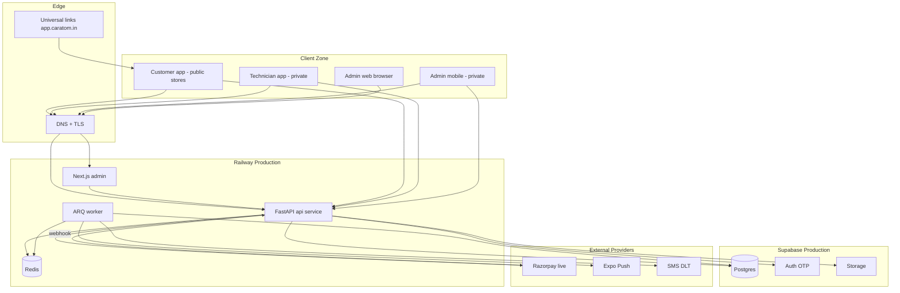
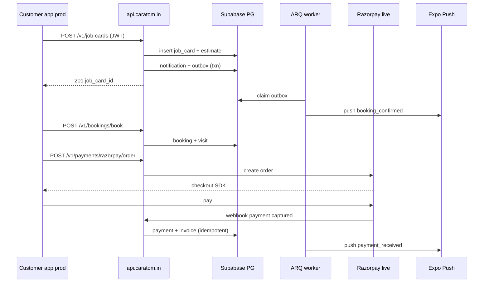

# PHASE 12 — Production Release & Operations

**Document ID:** `PHASE-12-production-release-operations.md`  
**Version:** 1.0.0  
**Status:** Executable specification — **final phase**  
**Depends on:** [PHASE-11-notifications-integrations-hardening.md](./PHASE-11-notifications-integrations-hardening.md) (Exit Gate §24 complete)  
**Unblocks:** Production launch — no subsequent implementation phase  
**Estimated effort:** 10–18 engineer-days (single developer + Cursor agent + ops stakeholder sign-off)

**Authority chain:**

1. [`docs/implementation/README.md`](./README.md) — Global production definition; Phase 12 Exit Gate = production-ready.
2. [`Vibe code principles/AUDIT-PLAYBOOK.md`](../../Vibe%20code%20principles/AUDIT-PLAYBOOK.md) — Full E2E audit methodology for §16–§21.
3. [`Vibe code principles/LEGAL-APPLICABILITY.md`](../../Vibe%20code%20principles/LEGAL-APPLICABILITY.md) — India DPDP §7; primary launch jurisdiction.
4. Architecture docs **05, 07, 14, 15, 18** — Railway deploy, security, testing, roadmap release slice.
5. [`docs/CARATOM-client-walkthrough.html`](../CARATOM-client-walkthrough.html) — E2E journey truth for §21 walkthrough audit.
6. [`docs/AUDIT-REPORT.md`](../AUDIT-REPORT.md) — Resolved contradictions; store vs private distribution matrix.

**Critical launch split (repeat in release review):**

> **Customer app** → public App Store + Google Play with full store compliance, ASO assets, and production universal links.  
> **Technician + admin-mobile** → **private distribution only** (EAS internal/ad hoc + MDM or signed APK/IPA links); never public store listing.  
> **Admin web + API + worker** → Railway production project + Supabase production project; secrets in platform stores only.

---
## 0. Phase Summary

### Objective

Take CARATOM from **release candidate** (Phase 11 exit) to **production-operational**: configure Supabase and Railway production environments, execute full walkthrough E2E audits on staging mirroring prod, ship the customer app through App Store and Google Play, distribute technician and admin-mobile apps privately, document runbooks for deploy/rollback/incident/backup, satisfy India launch legal minimums (DPDP notice, RBI-aligned payment posture, SMS DLT if scaling SMS, GST invoice fields), and pass all §18–§22 audits with stakeholder sign-off.

Phase 12 is **operations-heavy** — it adds runbooks, production config, store metadata, and audit evidence. It does **not** introduce new product features unless required for compliance or release blockers.

### What Phase 12 delivers

| ID | Deliverable | Description |
|----|-------------|-------------|
| P12-A | Supabase production project | Prod Postgres, Auth, Storage buckets, RLS review, backup policy, connection pooling |
| P12-B | Railway production stack | API service, ARQ worker, Redis, admin Next.js; health checks; zero-downtime deploy |
| P12-C | Production env contract | `.env.production.example`, secret inventory, rotation runbook |
| P12-D | Customer store release | App Store + Play Store submission, screenshots, privacy labels, review responses |
| P12-E | Private app distribution | Technician + admin-mobile EAS internal builds, install docs, version pinning |
| P12-F | Universal links + domain | `app.caratom.in` (example) SSL, apple-app-site-association, assetlinks.json |
| P12-G | E2E audit suite | Playwright + Detox/Maestro scripts covering all walkthrough journeys |
| P12-H | Full codebase audit | §18 checklist with evidence artifacts in `docs/release/audit-evidence/` |
| P12-I | Vibe + security audit | §19–§20 using present Vibe files; document missing catalog gaps |
| P12-J | Walkthrough conformance | §21 screen-by-screen pass against walkthrough HTML |
| P12-K | Regression baseline | Tag `v1.0.0-rc1`; CI green; smoke on prod after cutover |
| P12-L | India legal pack | Privacy policy, terms, consent copy, grievance officer, DPDP notice, GST invoice checklist |
| P12-M | Operational runbooks | Deploy, rollback, incident, on-call, backup restore drill, payment webhook replay |
| P12-N | Monitoring baseline | Railway logs, health alerts, Razorpay webhook DLQ, outbox dead-letter alerts |
| P12-O | Rate limits + WAF notes | Edge rate limits for auth and webhook endpoints |
| P12-P | Launch checklist + sign-off | §24 exit gate; stakeholder approval template |

### What Phase 12 explicitly does NOT deliver

| Item | Notes |
|------|-------|
| New product features | Bug fixes for release blockers only |
| Multi-city expansion | Post-MVP |
| SOC 2 / ISO certification | Out of scope MVP |
| 24/7 staffed NOC | Runbooks only; on-call rotation is org process |
| Full WCAG third-party audit | Internal pass + documented known gaps |
| GlitchTip/Sentry Cloud | Optional; Railway logs MVP |
| Marketing website beyond landing | CMS stub from Phase 09 sufficient |
| International launch (non-India) | Re-verify LEGAL-APPLICABILITY before expansion |

### Production environment matrix

| Component | Staging (Phase 11) | Production (Phase 12) |
|-----------|-------------------|----------------------|
| Supabase project | `caratom-staging` | `caratom-prod` |
| Railway project | `caratom-staging` | `caratom-prod` |
| Razorpay | Test mode keys | Live mode keys + webhook secret |
| SMS/WhatsApp | Sandbox / fake | DLT-registered templates (India SMS) |
| Expo EAS | `preview` channel | `production` channel |
| Customer API URL | `api-staging.caratom.in` | `api.caratom.in` |
| Admin web URL | `admin-staging.caratom.in` | `admin.caratom.in` |
| Database migrations | Alembic on staging first | Promote after staging pass |

### Success statement

At Phase 12 exit:

1. A real customer in Bengaluru can download CARATOM from Play Store or App Store, book General Service end-to-end, pay via Razorpay live, and receive push notifications on production infrastructure.
2. A technician receives a private build, completes a visit, records parts — inventory and ledger reflect in admin web on production.
3. An admin on production admin web can override a stuck job with audited reason.
4. All walkthrough journeys in §21 pass on staging with production-config parity.
5. Backup restore drill completed once; runbooks committed; §24 exit gate signed.
6. India legal minimum documents published and linked from app + website.
7. No secrets in git; production `.env` only in Railway/Supabase/EAS secret stores.

## 1. Starting State

### 1.1 Phase 11 exit gate prerequisites

| Prerequisite | Verification |
|--------------|--------------|
| Outbox worker delivers push on staging | Manual test + integration test |
| Deep links work on EAS dev/preview builds | Device matrix sample |
| EAS Update preview channel verified | `eas update --channel preview` |
| Performance smoke p95 documented | `scripts/perf/smoke-api-latency.mjs` output |
| All Phases 01–11 exit gates passed | Git tags or checklist archive |
| CI green on main branch | GitHub Actions |
| Staging Supabase + Railway operational | Health 200 |
| ADR-011 notification providers committed | SMS/WhatsApp vendor chosen |

### 1.2 Repository state at Phase 12 start

```text
CarAtom-main/
├── apps/customer/          # Feature-complete; eas.json with preview channel
├── apps/technician/        # Feature-complete; private profile
├── apps/admin-mobile/      # Feature-complete; private profile
├── apps/admin/             # Ops plane + undelivered notifications
├── backend/                # All domain modules; Alembic head
├── packages/               # contracts, api-client, analytics
├── e2e/                    # Partial Playwright; not full walkthrough coverage
├── scripts/perf/           # Smoke latency script
├── docs/implementation/    # PHASE-01 through PHASE-11 complete
└── docs/release/           # MISSING — created in Phase 12
```

**Absent at start:**

- `docs/release/` runbooks and audit evidence folder
- Production Supabase/Railway projects (may exist empty)
- Store listing assets (screenshots, descriptions)
- Production domain DNS + universal link files
- `.env.production.example` consolidated
- Full E2E walkthrough automation
- India legal documents (privacy policy, terms)
- Production monitoring alert rules
- Backup restore drill record

### 1.3 Stakeholder roles for Phase 12

| Role | Responsibility |
|------|----------------|
| Engineering lead | Runbooks, deploy, audit execution |
| Product/Ops | Walkthrough sign-off, override policy |
| Legal/compliance advisor | India docs review (external counsel recommended) |
| Apple/Google developer account owner | Store submission |
| Finance | Razorpay live KYC, GST invoice fields |
| On-call engineer | Incident runbook training |

### 1.4 Assumptions

- Launch geography: **India (Karnataka first)** — Asia/Kolkata timezone, INR, +91 phones.
- Apple Developer Program and Google Play Console accounts exist.
- Railway Team plan or equivalent for production services.
- Supabase Pro or equivalent for production Postgres + daily backups.
- Domain `caratom.in` (or agreed production domain) DNS manageable.
- Razorpay live account approved for marketplace/service payments.

## 2. Desired End State

After Phase 12 passes Exit Gate (§24), the repository and infrastructure MUST include:

```text
CarAtom-main/
├── docs/release/
│   ├── RUNBOOK-deploy.md
│   ├── RUNBOOK-rollback.md
│   ├── RUNBOOK-incident.md
│   ├── RUNBOOK-backup-restore.md
│   ├── RUNBOOK-payment-webhook-replay.md
│   ├── RUNBOOK-eas-update-rollback.md
│   ├── RUNBOOK-private-app-distribution.md
│   ├── STORE-app-store-checklist.md
│   ├── STORE-play-store-checklist.md
│   ├── LEGAL-india-launch-pack.md
│   ├── PRODUCTION-env-inventory.md
│   └── audit-evidence/
│       ├── YYYYMMDD-walkthrough-e2e/
│       ├── YYYYMMDD-security-audit/
│       └── YYYYMMDD-backup-restore-drill/
├── .env.production.example          # All prod var NAMES; no values
├── apps/customer/
│   ├── eas.json                     # production profile + store config
│   └── store/                       # screenshots, metadata templates
├── apps/technician/eas.json         # internal distribution profile
├── apps/admin-mobile/eas.json       # internal distribution profile
├── e2e/
│   ├── walkthrough/
│   │   ├── general-service.spec.ts
│   │   ├── repair-advisor.spec.ts
│   │   ├── oneman-sos.spec.ts
│   │   ├── technician-field.spec.ts
│   │   └── admin-web-ops.spec.ts
│   └── README.md
├── infra/                           # optional IaC snapshots
│   └── railway-production-notes.md
└── .github/workflows/
    ├── ci.yml                       # unchanged green
    └── release.yml                  # tag-triggered staging→prod promotion (optional)
```

**Production infrastructure (external to repo):**

```text
Supabase prod
  ├── Postgres 15 (pooled + direct URLs)
  ├── Auth (OTP SMS via Supabase; DLT templates if custom SMS)
  ├── Storage buckets: media-assets (private), public-assets (read)
  └── Daily backups enabled; PITR if plan allows

Railway prod
  ├── Service: api (FastAPI, healthcheck /health)
  ├── Service: worker (ARQ)
  ├── Service: redis
  ├── Service: admin (Next.js standalone)
  └── Custom domains: api.*, admin.*

EAS
  ├── Customer: production build → App Store + Play
  ├── Technician: internal channel only
  └── Admin-mobile: internal channel only

Razorpay live
  └── Webhook URL: https://api.caratom.in/v1/webhooks/razorpay
```

## 3. Why This Phase Exists Here

Phase 12 is the **capstone** after all product surfaces and platform hardening (Phase 11):

1. **Production config differs materially from dev** — CORS origins, JWT audiences, webhook secrets, rate limits, and log redaction must be validated under real traffic patterns.
2. **Store review is a gate** — Apple and Google enforce privacy, permissions, and payment disclosures; private apps skip public store but need MDM/install runbooks.
3. **Legal and financial obligations attach at launch** — India DPDP notice, grievance redressal, GST-compliant invoices, and RBI payment partner rules cannot remain "TODO."
4. **Audits require frozen scope** — E2E walkthrough conformance is meaningful only when feature-complete; Phase 12 captures evidence before launch traffic.
5. **Operational maturity** — Without runbooks, the first production incident becomes ad-hoc debugging; Phase 12 institutionalizes deploy/rollback/backup.

**Risk if skipped:** Launch with staging secrets, broken universal links, failed Razorpay webhooks, no backup drill, or advisor push to wrong environment — each is a revenue or trust catastrophe.

Per [`18-implementation-roadmap.md`](../architecture/18-implementation-roadmap.md), this phase implements the **release + ops** slice.

## 4. Source Material

| Source | Use in Phase 12 |
|--------|-----------------|
| [`AUDIT-PLAYBOOK.md`](../../Vibe%20code%20principles/AUDIT-PLAYBOOK.md) | §16–§18 audit methodology |
| [`LEGAL-APPLICABILITY.md`](../../Vibe%20code%20principles/LEGAL-APPLICABILITY.md) | §14 India legal; §15 privacy |
| [`GREENFIELD-PLAYBOOK.md`](../../Vibe%20code%20principles/GREENFIELD-PLAYBOOK.md) | Launch checklist cross-ref |
| [`05-technical-architecture.md`](../architecture/05-technical-architecture.md) | Railway topology, logging |
| [`07-backend-architecture.md`](../architecture/07-backend-architecture.md) | Worker deploy, migrations |
| [`14-security.md`](../architecture/14-security.md) | Secrets, retention, rate limits |
| [`15-testing-strategy.md`](../architecture/15-testing-strategy.md) | E2E scope, staging parity |
| [`18-implementation-roadmap.md`](../architecture/18-implementation-roadmap.md) | Release phase scope |
| [`CARATOM-client-walkthrough.html`](../CARATOM-client-walkthrough.html) | §21 journey list |
| [`README.md`](./README.md) | Global production definition |
| Phase 11 handoff §25 | EAS Update, deep links, outbox |
| Expo EAS docs | Store submission, internal distribution |
| Railway docs | Deploy, env vars, healthchecks |
| Supabase docs | Prod checklist, RLS, backups |
| Razorpay docs | Live mode, webhook IP allowlist |
| Apple App Store Review Guidelines | Customer app compliance |
| Google Play policy | Data safety form, permissions |
| India DPDP Act 2023 + rules (verify currency) | §14 legal pack |

## 5. Architectural Context (diagram)

### 5.1 Production deployment topology



### 5.2 Environment promotion flow

```text
Developer PR → CI (lint, test, typecheck)
  → merge main
  → auto-deploy staging (Railway staging project)
  → Alembic migrate staging
  → E2E walkthrough suite on staging
  → manual promote: tag v1.x.x
  → Alembic migrate production (maintenance window if breaking)
  → Railway prod deploy api → worker → admin
  → EAS production build customer app (if native change)
  → eas update --channel production (if JS-only)
  → smoke tests on production
  → store release phased rollout (Play 10% → 100%; App Store manual release)
```

### 5.3 Trust boundaries (production)

```text
┌──────────────────────────────────────────────────────────────────────┐
│ PUBLIC INTERNET                                                       │
│  - Customer app (untrusted)                                           │
│  - Razorpay webhooks (verify HMAC + IP allowlist)                     │
│  - Store installs only for customer app                               │
└────────────────────────────┬─────────────────────────────────────────┘
                             │ TLS 1.2+
┌────────────────────────────▼─────────────────────────────────────────┐
│ RAILWAY EDGE — api.caratom.in / admin.caratom.in                      │
│  - Rate limits on /auth-adjacent and webhook routes                   │
│  - Request ID on every response                                       │
│  - CORS: customer app origins + admin web only                        │
└────────────────────────────┬─────────────────────────────────────────┘
                             │
┌────────────────────────────▼─────────────────────────────────────────┐
│ DATA PLANE — Supabase Postgres (private network via pooler)           │
│  - No PostgREST client writes for domain truth                        │
│  - Service role ONLY on backend/worker                                │
│  - RLS on profiles read paths if any direct client access             │
└──────────────────────────────────────────────────────────────────────┘
```

### 5.4 Distribution model

| App | Distribution | Identity | Update path |
|-----|--------------|----------|-------------|
| Customer | App Store + Play Store | Public | Store update + EAS Update OTA for JS |
| Technician | EAS internal / ad hoc | Allowlisted Apple devices / Play internal testing | EAS build notify ops |
| Admin-mobile | Same as technician | Ops staff devices only | EAS build notify ops |
| Admin web | URL bookmark | Supabase admin login | Railway deploy |

## 6. Exact Implementation Scope + Out of Scope

### 6.1 In scope (MUST implement)

| Area | Scope |
|------|-------|
| Supabase prod | New project; migrate; seed prod catalog (not test users); backup policy |
| Railway prod | API, worker, redis, admin; custom domains; healthchecks |
| Secrets | Inventory all prod secrets; rotate from staging; never commit |
| Migrations | Staging-first Alembic; production promotion checklist |
| Customer store | Metadata, screenshots, privacy nutrition, permissions justification |
| Private apps | Internal distribution profiles; install runbook for ops + techs |
| Universal links | Domain verification files; update app.json associatedDomains |
| E2E audits | Automate all walkthrough journeys; manual sign-off sheet |
| Full audits | §18–§22 with evidence folder |
| India legal | Privacy policy, terms, in-app links, DPDP notice, grievance email |
| GST invoices | Verify invoice PDF fields with finance (GSTIN, HSN/SAC if applicable) |
| Runbooks | Deploy, rollback, incident, backup, webhook replay, EAS rollback |
| Monitoring | Health alert, webhook failure alert, outbox dead-letter threshold |
| Rate limits | Auth OTP abuse, webhook replay protection |
| Production smoke | Post-deploy script hitting /health + critical read APIs |
| Launch sign-off | §24 checklist + stakeholder template |

### 6.2 Out of scope (MUST NOT implement in Phase 12)

| Item | Notes |
|------|-------|
| New booking flows | Feature freeze except P0 bugs |
| Second region deploy | Single Railway region MVP |
| Kubernetes migration | Railway remains |
| Public technician app store listing | Explicitly forbidden |
| Marketing CRM integration | Post-MVP |
| Automated pen test vendor | Recommended but optional |
| Multi-language app UI | English + INR sufficient MVP |

### 6.3 Boundary rules

- **No schema changes** in production without staging migration pass + backup.
- **No force-push** to main; release tags only.
- Store submission uses **production API URL** baked in `EXPO_PUBLIC_API_URL` at build time — verify before upload.
- Razorpay live keys MUST NOT appear in client bundles; order creation server-side only.
- Private app APK/IPA links MUST be access-controlled (ops wiki, not public GitHub).
- Walkthrough audit failures are **P0** until waived in writing by product lead.

## 7. Repository Changes

### 7.1 New files (complete list)

**Release docs:**

- `docs/release/README.md`
- `docs/release/RUNBOOK-deploy.md`
- `docs/release/RUNBOOK-rollback.md`
- `docs/release/RUNBOOK-incident.md`
- `docs/release/RUNBOOK-backup-restore.md`
- `docs/release/RUNBOOK-payment-webhook-replay.md`
- `docs/release/RUNBOOK-eas-update-rollback.md`
- `docs/release/RUNBOOK-private-app-distribution.md`
- `docs/release/STORE-app-store-checklist.md`
- `docs/release/STORE-play-store-checklist.md`
- `docs/release/LEGAL-india-launch-pack.md`
- `docs/release/PRODUCTION-env-inventory.md`
- `docs/release/audit-evidence/.gitkeep` (evidence itself may be gitignored)

**Env:**

- `.env.production.example` (root)
- `backend/.env.production.example`
- `apps/customer/.env.production.example`
- `apps/admin/.env.production.example`

**E2E:**

- `e2e/walkthrough/general-service.spec.ts`
- `e2e/walkthrough/repair-advisor.spec.ts`
- `e2e/walkthrough/oneman-sos.spec.ts`
- `e2e/walkthrough/technician-field.spec.ts` (or manual template)
- `e2e/walkthrough/admin-web-ops.spec.ts`
- `e2e/walkthrough/README.md`

**Scripts:**

- `scripts/release/prod-smoke.mjs`
- `scripts/release/pre-store-build-check.mjs`

**Store assets:**

- `apps/customer/store/metadata/en-US/description.txt`
- `apps/customer/store/screenshots/` (git LFS or external bucket — document choice)

**Infra notes:**

- `infra/railway-production-notes.md`

**CI (optional):**

- `.github/workflows/release.yml`

### 7.2 Modified files

- `apps/customer/app.json` — associatedDomains production
- `apps/customer/eas.json` — production profile store config
- `apps/technician/eas.json` — internal distribution
- `apps/admin-mobile/eas.json` — internal distribution
- `apps/customer/app/(tabs)/profile.tsx` — legal links
- `README.md` — production quickstart pointer to docs/release
- `docs/implementation/README.md` — mark Phase 12 complete when done

### 7.3 Files that MUST NOT be created

- Production secrets committed as `.env.production`
- Public download page for technician APK without access control
- Duplicate monitoring SaaS if Railway logs sufficient for MVP
- Customer app enterprise sideload bypassing stores (use stores for customers)

## 8. Detailed Implementation Sequence

Execute tasks **in order** unless marked parallel-safe. Phase 12 is checkpoint-heavy — do not skip verification substeps.

---

### Task 12.1 — Create docs/release/ scaffold

**Goal:** Create docs/release/ scaffold

**Work:** Create folder structure per §2. Add README index linking all runbooks.

**Verification:**

- `docs/release/README.md` exists; links placeholders for each runbook.

---

### Task 12.2 — Production env inventory

**Goal:** Production env inventory

**Work:** Document every production env var in `PRODUCTION-env-inventory.md` with owner, rotation cadence, and store location (Railway/Supabase/EAS).

**Verification:**

- No secret values in git; names match `.env.production.example`.

---

### Task 12.3 — Consolidate .env.production.example

**Goal:** Consolidate .env.production.example

**Work:** Root + backend + apps production example files.

**Verification:**

- All Phase 01–11 vars present; commented staging vs prod notes.

---

### Task 12.4 — Supabase production project

**Goal:** Supabase production project

**Work:** Create prod project; enable backups; configure Auth SMS; create storage buckets.

**Verification:**

- Dashboard screenshots in audit-evidence (redacted).

---

### Task 12.5 — Supabase RLS + access review

**Goal:** Supabase RLS + access review

**Work:** Verify no client writes to financial tables via PostgREST; service role backend-only.

**Verification:**

- Checklist in LEGAL-india + security audit.

---

### Task 12.6 — Railway production project

**Goal:** Railway production project

**Work:** Create services: api, worker, redis, admin; connect repo; set healthcheck path `/health`.

**Verification:**

- All services green in Railway dashboard.

---

### Task 12.7 — Custom domains + TLS

**Goal:** Custom domains + TLS

**Work:** Configure api.* and admin.* DNS CNAME; verify TLS.

**Verification:**

- `curl -I https://api.caratom.in/health` returns 200.

---

### Task 12.8 — Production secrets injection

**Goal:** Production secrets injection

**Work:** Set all Railway + Supabase secrets; rotate Razorpay webhook secret for live.

**Verification:**

- Webhook test event succeeds in Razorpay dashboard.

---

### Task 12.9 — Alembic staging promotion

**Goal:** Alembic staging promotion

**Work:** Run `alembic upgrade head` on staging with production-like data volume sample.

**Verification:**

- Migration completes < 5 min; no lock timeout.

---

### Task 12.10 — Alembic production cutover

**Goal:** Alembic production cutover

**Work:** Maintenance note; backup before migrate; upgrade head on prod.

**Verification:**

- Schema version matches staging; smoke pass.

---

### Task 12.11 — Production catalog seed

**Goal:** Production catalog seed

**Work:** Seed offerings, pricing policies, service area — NOT demo users.

**Verification:**

- Customer app prod build shows live prices from API.

---

### Task 12.12 — CORS + ALLOWED_ORIGINS prod

**Goal:** CORS + ALLOWED_ORIGINS prod

**Work:** Set exact admin web + Expo origins; remove localhost.

**Verification:**

- Preflight from prod admin web succeeds.

---

### Task 12.13 — Rate limit middleware prod tuning

**Goal:** Rate limit middleware prod tuning

**Work:** Apply stricter limits on OTP request and webhook endpoints per doc 14.

**Verification:**

- Load test shows 429 after threshold; legit flow unaffected.

---

### Task 12.14 — Razorpay live mode switch

**Goal:** Razorpay live mode switch

**Work:** Live keys in Railway only; verify order create + webhook + reconciliation.

**Verification:**

- Test ₹1 transaction (refund) documented in audit-evidence.

---

### Task 12.15 — SMS DLT registration (India)

**Goal:** SMS DLT registration (India)

**Work:** If using custom SMS beyond Supabase: register entity, templates, link in ADR-011.

**Verification:**

- DLT template IDs in env OR documented fallback push-only launch.

---

### Task 12.16 — Universal links domain

**Goal:** Universal links domain

**Work:** Host apple-app-site-association + assetlinks.json; update customer app.json.

**Verification:**

- Apple/Google validator tools pass.

---

### Task 12.17 — EAS production profile customer

**Goal:** EAS production profile customer

**Work:** Build production customer binary with prod API URL.

**Verification:**

- Binary installs on test device; login OTP works.

---

### Task 12.18 — EAS internal profiles tech/admin-mobile

**Goal:** EAS internal profiles tech/admin-mobile

**Work:** Configure internal distribution; document device UDID registration.

**Verification:**

- Ops test device installs both apps.

---

### Task 12.19 — Store assets — screenshots

**Goal:** Store assets — screenshots

**Work:** Capture 6.7" and 6.5" iPhone + phone + tablet Android per store guidelines.

**Verification:**

- PNG in apps/customer/store/.

---

### Task 12.20 — Store metadata — copy

**Goal:** Store metadata — copy

**Work:** App name, subtitle, keywords, description, privacy policy URL.

**Verification:**

- STORE-*-checklist.md complete.

---

### Task 12.21 — App Store privacy nutrition

**Goal:** App Store privacy nutrition

**Work:** Declare data collected: phone, location (if used), payment info via Razorpay.

**Verification:**

- App Store Connect privacy questionnaire saved.

---

### Task 12.22 — Play Store data safety

**Goal:** Play Store data safety

**Work:** Complete data safety form matching actual SDK behavior.

**Verification:**

- Play Console export PDF in audit-evidence.

---

### Task 12.23 — App Store submission

**Goal:** App Store submission

**Work:** Upload build; submit for review; respond to rejection if any.

**Verification:**

- App Store status: Ready for Sale OR documented timeline.

---

### Task 12.24 — Play Store submission

**Goal:** Play Store submission

**Work:** Upload AAB; staged rollout 10%.

**Verification:**

- Play Console production track active.

---

### Task 12.25 — Private distribution runbook

**Goal:** Private distribution runbook

**Work:** Write RUNBOOK-private-app-distribution.md with install steps.

**Verification:**

- Technician lead confirms install on 2 devices.

---

### Task 12.26 — Deploy runbook

**Goal:** Deploy runbook

**Work:** Document Railway deploy order: migrate → api → worker → admin.

**Verification:**

- Dry-run on staging documented.

---

### Task 12.27 — Rollback runbook

**Goal:** Rollback runbook

**Work:** Railway rollback + Alembic downgrade policy (avoid if possible).

**Verification:**

- Simulated api rollback on staging.

---

### Task 12.28 — Backup restore drill

**Goal:** Backup restore drill

**Work:** Restore Supabase backup to scratch project; verify row counts.

**Verification:**

- Evidence log in audit-evidence/backup-restore.

---

### Task 12.29 — Incident runbook

**Goal:** Incident runbook

**Work:** Severity levels, Razorpay outage, worker down, DB unreachable.

**Verification:**

- Tabletop walkthrough with team.

---

### Task 12.30 — Webhook replay runbook

**Goal:** Webhook replay runbook

**Work:** Document Razorpay webhook manual replay + idempotency verification.

**Verification:**

- Test replay on staging without duplicate payment.

---

### Task 12.31 — EAS Update rollback runbook

**Goal:** EAS Update rollback runbook

**Work:** Document `eas update:republish` previous bundle.

**Verification:**

- Test rollback on preview channel.

---

### Task 12.32 — E2E — general service

**Goal:** E2E — general service

**Work:** Automate gs-01→gs-10 against staging.

**Verification:**

- Playwright spec green 3 consecutive runs.

---

### Task 12.33 — E2E — repair advisor

**Goal:** E2E — repair advisor

**Work:** Automate gpr-01→gpr-12 including deny-cart path.

**Verification:**

- Spec green.

---

### Task 12.34 — E2E — one-man + SOS

**Goal:** E2E — one-man + SOS

**Work:** Automate om-01→om-06 and sos-01→sos-04.

**Verification:**

- Spec green.

---

### Task 12.35 — E2E — technician field

**Goal:** E2E — technician field

**Work:** Maestro/Detox or manual script for today→qc.

**Verification:**

- Signed manual sheet if automation partial.

---

### Task 12.36 — E2E — admin web ops

**Goal:** E2E — admin web ops

**Work:** Extend Phase 09 Playwright for full desk ops path.

**Verification:**

- inventory→override→audit visible.

---

### Task 12.37 — E2E — payments live smoke

**Goal:** E2E — payments live smoke

**Work:** Post-deploy prod smoke with real micro-transaction.

**Verification:**

- Evidence redacted receipt in audit-evidence.

---

### Task 12.38 — India legal pack

**Goal:** India legal pack

**Work:** Draft privacy policy, terms, consent strings, grievance officer.

**Verification:**

- LEGAL-india-launch-pack.md + published URLs.

---

### Task 12.39 — In-app legal links

**Goal:** In-app legal links

**Work:** Profile/settings link to privacy + terms; OTP consent line.

**Verification:**

- Visible in customer app prod build.

---

### Task 12.40 — GST invoice verification

**Goal:** GST invoice verification

**Work:** Finance signs invoice PDF sample with required fields.

**Verification:**

- Checklist item in §24.

---

### Task 12.41 — Monitoring alerts

**Goal:** Monitoring alerts

**Work:** Railway deploy notifications; healthcheck failure alert; dead-letter threshold.

**Verification:**

- Test alert fires on staging worker stop.

---

### Task 12.42 — Production smoke script

**Goal:** Production smoke script

**Work:** Add scripts/release/prod-smoke.mjs

**Verification:**

- Exit 0 against prod post-deploy.

---

### Task 12.43 — GitHub release workflow (optional)

**Goal:** GitHub release workflow (optional)

**Work:** Tag-triggered staging validation gate.

**Verification:**

- Documented even if manual promote preferred.

---

### Task 12.44 — Full codebase audit §18

**Goal:** Full codebase audit §18

**Work:** Execute checklist; store evidence.

**Verification:**

- All applicable PASS or waived with owner.

---

### Task 12.45 — Vibe audit §19

**Goal:** Vibe audit §19

**Work:** Using present Vibe files; note missing CONSTITUTION gaps.

**Verification:**

- Table complete.

---

### Task 12.46 — Architecture audit §20

**Goal:** Architecture audit §20

**Work:** Verify production matches doc 05 trust boundaries.

**Verification:**

- PASS.

---

### Task 12.47 — Walkthrough audit §21

**Goal:** Walkthrough audit §21

**Work:** Screen-by-screen against walkthrough HTML.

**Verification:**

- 100% PASS or documented deferrals.

---

### Task 12.48 — Regression audit §22

**Goal:** Regression audit §22

**Work:** Re-run Phases 03–11 critical tests on staging.

**Verification:**

- CI green.

---

### Task 12.49 — Launch sign-off meeting

**Goal:** Launch sign-off meeting

**Work:** Complete §24; archive signatures.

**Verification:**

- Sign-off PDF in audit-evidence.

---

### Task 12.50 — Tag v1.0.0

**Goal:** Tag v1.0.0

**Work:** Git tag release; changelog.

**Verification:**

- Tag pushed; release notes published.

---

## 9. Mobile Release Implementation (store + private distribution)

### 9.1 Customer app — App Store

**Profile:** `production` in `eas.json`

| Setting | Value |
|---------|-------|
| `EXPO_PUBLIC_API_URL` | `https://api.caratom.in` |
| `EXPO_PUBLIC_SUPABASE_URL` | Prod Supabase URL |
| `EXPO_PUBLIC_SUPABASE_ANON_KEY` | Prod anon key (public by design) |
| Bundle ID | `in.caratom.customer` (example — lock in Phase 12 Task 12.17) |
| iOS deployment target | Per Expo SDK 52 default |

**Pre-submission checklist (STORE-app-store-checklist.md):**

1. [ ] Production API health verified from TestFlight build
2. [ ] OTP login works on prod Supabase
3. [ ] Razorpay checkout completes live test transaction
4. [ ] Push notifications on prod worker
5. [ ] Deep link opens booking from notification
6. [ ] Privacy policy URL live
7. [ ] App Tracking Transparency: declare if analytics uses IDFA (prefer no IDFA)
8. [ ] Location permission strings accurate (technician visit tracking is server-side from tech app — customer location for address only)
9. [ ] Screenshots match current UI (light-blue accent)
10. [ ] No staging URLs in binary (`grep -r staging` on build artifacts)

**Review rejection playbook:**

| Rejection reason | Response |
|----------------|----------|
| Guideline 4.2 minimum functionality | Demo video + test account credentials in Review Notes |
| Guideline 5.1.1 data collection | Update privacy nutrition to match actual SDKs |
| Guideline 3.1.1 payments | Clarify physical service; Razorpay for real-world services permitted |
| Guideline 2.1 crashes | Symbolicated crash log; hotfix via EAS Update if JS-only |

### 9.2 Customer app — Google Play

**Track:** Production with staged rollout

| Form | Key declarations |
|------|------------------|
| Data safety | Phone number, approximate location (address), app activity (analytics events) |
| Permissions | Location (optional, for address pin), notifications |
| Target API level | Meet Play mandatory level for 2026 |

**Internal testing → closed testing → production** path recommended even if public launch urgent.

### 9.3 Technician app — private distribution ONLY

**NEVER submit technician app to public App Store or Play Store consumer listing.**

| Platform | Method |
|----------|--------|
| iOS | Apple Developer **Custom Apps** or Ad Hoc with registered UDIDs (≤100 devices) or EAS internal distribution |
| Android | Play Console **internal testing** track with allowlisted emails OR direct APK via MDM |

**Install runbook summary (full doc in RUNBOOK-private-app-distribution.md):**

```text
1. Ops collects technician device ID (iOS UDID / Android email for internal track)
2. Register in Apple/Google allowlist
3. Trigger EAS build: eas build --profile internal --platform all
4. Send install link via ops WhatsApp (not automated customer SMS)
5. Technician opens link → installs → login with technician role account
6. Verify today screen loads production jobs only
7. Record device + version in ops spreadsheet
```

### 9.4 Admin-mobile — private distribution

Same as §9.3 with separate bundle ID `in.caratom.adminmobile`.

Ops staff devices only; typically ≤10 devices at MVP.

### 9.5 EAS Update production channel

| Scenario | Action |
|----------|--------|
| JS typo fix | `eas update --channel production --message "hotfix copy"` |
| Native module change | Full `eas build` + store submission (customer) or internal build (tech) |
| Rollback | `eas update:republish --group <previous>` per runbook |

**Runtime version policy:** `appVersion` or `sdkVersion` — MUST match Phase 11 ADR; document in eas.json.

### 9.6 Version numbering

Use semantic versioning `MAJOR.MINOR.PATCH`:

- Customer store version visible to users
- All apps share backend API version compatibility — backend must support N-1 app version for 30 days post-release

## 10. Backend Production Deployment (Railway)

### 10.1 Service definitions

**API service:**

```dockerfile
# Uses backend/Dockerfile or Railway Nixpacks
CMD uv run uvicorn app.main:app --host 0.0.0.0 --port $PORT
```

| Railway setting | Value |
|-----------------|-------|
| Healthcheck path | `/health` |
| Healthcheck timeout | 30s |
| Restart policy | ON_FAILURE |
| Replicas | 1 MVP (scale horizontally when p95 > target) |

**Worker service:**

```text
CMD uv run arq worker.main.WorkerSettings
```

| Setting | Notes |
|---------|-------|
| Same repo root as API | Different start command |
| Redis URL | Internal Railway Redis plugin URL |
| No public domain | Worker not HTTP-exposed |

**Redis:**

- Railway Redis plugin; persistence enabled if available
- Used by ARQ only MVP

### 10.2 Environment variables (API + worker shared unless noted)

| Variable | Service | Notes |
|----------|---------|-------|
| `DATABASE_URL` | both | Supabase pooler URL; `?sslmode=require` |
| `SUPABASE_URL` | both | JWKS fetch |
| `SUPABASE_SERVICE_ROLE_KEY` | both | Server only |
| `REDIS_URL` | both | Internal |
| `RAZORPAY_KEY_ID` | api | Live |
| `RAZORPAY_KEY_SECRET` | api | Live |
| `RAZORPAY_WEBHOOK_SECRET` | api | Live |
| `ENVIRONMENT` | both | `production` |
| `CORS_ORIGINS` | api | JSON array prod origins |
| `LOG_LEVEL` | both | `info` |
| `EXPO_ACCESS_TOKEN` | worker | Push |
| `SMS_*` / `WHATSAPP_*` | worker | Per ADR-011 |

### 10.3 Deploy procedure (summary — full RUNBOOK-deploy.md)

```powershell
# 1. Verify staging
pnpm test
cd backend && uv run pytest && cd ..

# 2. Backup prod DB (Supabase dashboard or CLI)

# 3. Migrate
cd backend && uv run alembic upgrade head

# 4. Deploy Railway (git push main if auto-deploy, or railway up)
# Order: api → worker → admin (or parallel api+worker, then admin)

# 5. Prod smoke
node scripts/release/prod-smoke.mjs

# 6. Monitor logs 15 minutes
```

### 10.4 Zero-downtime considerations

- FastAPI startup must run Alembic **before** accepting traffic OR migrations run as separate release step (preferred).
- Worker: deploy worker after API if schema changed; brief outbox delay acceptable.
- Use Railway deployment sleep hook if healthcheck flaky on cold start.

### 10.5 Webhook endpoints (production)

| Endpoint | Provider | Verification |
|----------|----------|--------------|
| `POST /v1/webhooks/razorpay` | Razorpay | HMAC signature |
| Supabase auth hooks | If configured | JWT |

Document Razorpay webhook IP allowlist in PRODUCTION-env-inventory.md.

## 11. Database Production Implementation (Supabase)

### 11.1 Project configuration

| Setting | Production value |
|---------|------------------|
| Region | ap-south-1 (Mumbai) preferred for India latency |
| Postgres version | 15.x |
| Connection pooling | Supavisor transaction mode for API |
| Direct connection | Migrations only |
| Backups | Daily + verify PITR availability |
| SSL | Required |

### 11.2 Auth configuration

| Setting | Notes |
|---------|-------|
| Phone OTP | Primary login; +91 only MVP |
| SMS provider | Supabase default or custom with DLT templates |
| JWT expiry | Default; refresh handled by client SDK |
| Admin users | `profiles.role = admin` seeded manually; no public admin signup |

### 11.3 Storage buckets

| Bucket | Access | Content |
|--------|--------|---------|
| `media-assets` | Private; signed URLs from API | Visit photos, inspection images |
| `public-assets` | Public read | Marketing images if any |

**RLS policies:** Backend uses service role for uploads; clients never write directly.

### 11.4 Migration promotion checklist

```text
[ ] Migration tested on local Docker Postgres
[ ] Migration applied to staging
[ ] Staging E2E suite green
[ ] Backup taken of production
[ ] Maintenance window communicated (if locking migration)
[ ] alembic upgrade head on production
[ ] Verify alembic_version table
[ ] Smoke test critical reads/writes
[ ] Rollback plan documented (downgrade script exists?)
```

### 11.5 Data retention (production)

Per doc 14 — configure before launch:

| Data type | Retention | Deletion mechanism |
|-----------|-----------|-------------------|
| Location pings | 90 days | Scheduled job Phase 12 or SQL cron |
| Notifications | 180 days read archive | Worker job |
| Audit logs | 7 years (financial ops) | No auto-delete |
| Media assets | 2 years post job closure | Storage lifecycle rule |
| Support tickets | 3 years | Anonymize on account delete |

### 11.6 Backup restore drill (Task 12.28)

```text
1. Note production backup timestamp T0
2. Create temporary Supabase project OR restore to local pg_restore
3. Verify row counts: job_cards, payments, profiles within expected delta
4. Run read-only smoke queries
5. Document duration and issues
6. Destroy scratch instance
7. Store log in audit-evidence/YYYYMMDD-backup-restore/
```

## 12. API Contracts (production configuration)

Phase 12 does not introduce new public API endpoints. It **freezes** the contract set from Phases 01–11 and validates production behavior.

### 12.1 Production base URLs

| Surface | URL |
|---------|-----|
| API | `https://api.caratom.in` |
| Admin web | `https://admin.caratom.in` |
| OpenAPI | `https://api.caratom.in/openapi.json` |
| Health | `https://api.caratom.in/health` |

### 12.2 Health response (production)

Must include:

```json
{
  "status": "ok",
  "environment": "production",
  "database": "ok",
  "redis": "ok",
  "version": "1.0.0"
}
```

Never include secret names, connection strings, or internal hostnames in health body.

### 12.3 Rate limits (production)

| Route pattern | Limit | Window |
|---------------|-------|--------|
| `POST /v1/auth/*` (OTP request) | 5 per phone | 15 min |
| `POST /v1/webhooks/razorpay` | 1000 | 1 min |
| `GET /v1/catalog/*` | 120 | 1 min per IP |
| `/v1/admin/*` | 300 | 1 min per admin JWT |

Return `429` with `Retry-After` header.

### 12.4 CORS production allowlist

```json
[
  "https://admin.caratom.in",
  "exp://",
  "caratom://"
]
```

Expo dev origins removed in production API config.

### 12.5 Idempotency (production verification)

Re-run integration tests against staging with production config:

- Booking create with same `Idempotency-Key` → single row
- Razorpay webhook duplicate → single payment event
- Outbox dispatch duplicate → single provider call

## 13. Complete Data Flow

### 13.1 Production booking flow (customer → money)



### 13.2 Production admin override flow

```text
Admin web (admin.caratom.in)
  → POST /v1/admin/job-cards/{id}/override
  → Body: { command, params, reason }
  → API validates admin JWT + reason non-empty
  → Domain service applies transition
  → audit_logs INSERT (same transaction)
  → Response: { job_card, audit_id }
  → Admin UI toast with link to /audit?audit_id=
```

### 13.3 Store install → first API call

```text
User installs from Play Store
  → App launch reads EXPO_PUBLIC_API_URL (baked at build)
  → GET /health (optional splash check)
  → Supabase OTP login → JWT
  → GET /v1/me → profile
  → GET /v1/catalog/home → offerings with prod prices
```

### 13.4 Private app install flow

```text
Ops sends EAS internal link
  → Technician installs
  → Same prod API URL as customer
  → JWT role=technician enforced
  → GET /v1/technician/today → assigned visits only
```

## 14. UI/UX Conformance (release + legal surfaces)

Phase 12 adds **release-specific UI** requirements beyond walkthrough product screens.

### 14.1 Customer app — legal surfaces

| Surface | Requirement |
|---------|-------------|
| Login / OTP screen | Consent line: "By continuing, you agree to our Terms and Privacy Policy" with tappable links |
| Profile → Legal | Privacy Policy, Terms of Service, Grievance contact |
| Payment screen | Razorpay branding; no stored card data in CARATOM UI |
| Delete account | Request flow or support email (DPDP erasure path) |

### 14.2 Store listing vs in-app parity

Store screenshots MUST reflect:

- Light-blue accent `#5DB7E8` (Phase 02)
- Four home tabs
- General service flow at minimum

No misleading "features not in app" claims.

### 14.3 Admin web production banner (optional)

Non-production environments show orange banner `STAGING`. Production admin web shows **no banner** or subtle `Production` in footer only.

### 14.4 Accessibility release pass

Minimum before store submit:

- [ ] Text scales to 120% without layout break on checkout
- [ ] Primary buttons have accessible labels (not icon-only without aria-label)
- [ ] Color contrast ≥ 4.5:1 for body text on green/white
- [ ] OTP input accessible to screen readers

Document known gaps in audit-evidence for post-MVP WCAG audit.

### 14.5 Error messages (production)

Replace any remaining `staging` or internal error codes with user-safe copy per doc 13.

## 15. Security

### 15.1 Production secrets hygiene

| Rule | Verification |
|------|--------------|
| No secrets in git history | `gitleaks` scan on main |
| Service role never in mobile/web clients | Bundle analyzer + grep |
| Razorpay secret server-only | Client has key_id for checkout only if required by SDK pattern |
| Webhook HMAC enforced | Send invalid signature → 401 |
| JWT from prod Supabase only | Staging tokens rejected on prod API |

### 15.2 Production hardening checklist

- [ ] `ENVIRONMENT=production` disables stub auth paths
- [ ] OpenAPI `/docs` disabled or admin-auth gated in production
- [ ] Database direct URL not in client env
- [ ] Redis not publicly exposed
- [ ] Admin web session timeout configured (Supabase defaults + org policy)
- [ ] CORS minimal allowlist
- [ ] Security headers on admin Next.js (CSP baseline)
- [ ] File upload size limits enforced
- [ ] SQL injection: parameterized queries only (SQLAlchemy)

### 15.3 Incident severity (RUNBOOK-incident.md)

| Sev | Example | Response time |
|-----|---------|---------------|
| SEV1 | Payments broken, data leak suspected | Immediate; all hands |
| SEV2 | Worker down >15 min, bookings blocked | 30 min |
| SEV3 | Push delayed, non-critical UI bug | Next business day |
| SEV4 | Cosmetic | Backlog |

### 15.4 Breach notification readiness (India DPDP)

Maintain:

- Contact for Data Protection Board notification
- Template customer notification email
- 72-hour internal decision SLA from detection

See LEGAL-india-launch-pack.md — **engage legal counsel** before launch.

## 16. Testing Strategy

### 16.1 Test pyramid (production phase)

| Layer | Scope | Tool |
|-------|-------|------|
| Unit | Backend domain invariants | pytest |
| Integration | Webhooks, outbox, payments | pytest + staging |
| E2E walkthrough | All customer/tech/admin journeys | Playwright + manual |
| Production smoke | Post-deploy health + read paths | prod-smoke.mjs |
| Store QA | TestFlight / internal track | Human |

### 16.2 E2E walkthrough matrix

| Journey | Walkthrough IDs | Automation | Owner |
|---------|-----------------|------------|-------|
| General service | gs-01…gs-10 | Playwright | Task 12.32 |
| Repair + advisor | gpr-01…gpr-12, deny-cart | Playwright | Task 12.33 |
| One-man | om-01…om-06 | Playwright | Task 12.34 |
| SOS | sos-01…sos-04 | Playwright | Task 12.34 |
| Login/orders/profile | login, orders, profile | Playwright | Task 12.34 |
| Technician field | today…qc | Maestro or manual sheet | Task 12.35 |
| Inspection+repair | Phase 07 UI | Manual + partial auto | Task 12.35 |
| Admin web ops | inventory…audit | Playwright | Task 12.36 |
| Admin mobile advisor | adm-01…adm-04 | Manual on device | Sign-off sheet |
| Payments + invoice | Phase 08 screens | Playwright + live smoke | Task 12.37 |

### 16.3 Staging parity requirements

Staging MUST mirror production:

- Same Alembic head
- Same feature flags (all on)
- Razorpay test mode (not live) for automated E2E
- Separate Supabase project (never prod credentials on staging)

### 16.4 Audit testing (AUDIT-PLAYBOOK alignment)

Phase 12 executes **Mode C audit** on the built system:

1. Intake scope document in audit-evidence
2. Reconnaissance: attack surface inventory
3. Evidence collection per Vibe controls (present files)
4. Walkthrough conformance §21
5. Challenge review before sign-off

### 16.5 Device matrix (minimum)

| Device | OS | Apps tested |
|--------|-----|-------------|
| iPhone 13+ | iOS 17+ | Customer, admin-mobile |
| Pixel 6+ | Android 14+ | Customer, technician |
| Desktop Chrome | Latest | Admin web |

Expand post-MVP.

## 17. Verification Procedure (concrete commands)

### 17.1 Pre-flight (local)

```powershell
pnpm install
pnpm typecheck
pnpm lint
cd backend && uv sync && uv run pytest && cd ..
```

### 17.2 Staging E2E full suite

```powershell
$env:E2E_BASE_URL = "https://api-staging.caratom.in"
$env:E2E_ADMIN_URL = "https://admin-staging.caratom.in"
pnpm exec playwright test e2e/walkthrough/
```

Expected: all specs pass; artifacts in `playwright-report/`.

### 17.3 Production health

```powershell
curl -s https://api.caratom.in/health | jq .
curl -s -o /dev/null -w "%{http_code}" https://admin.caratom.in/
```

Expected: `200`, `"environment":"production"`.

### 17.4 Production smoke script

```powershell
node scripts/release/prod-smoke.mjs
```

Script checks:

- GET /health
- GET /v1/catalog/home (no auth — or 401 if gated, document expected)
- OPTIONS preflight from admin origin

### 17.5 Razorpay live webhook test

Use Razorpay dashboard "Send test webhook" after deploy.

Verify:

- API returns 200
- `payment_events` row created once on duplicate

### 17.6 Universal link validation

```powershell
curl -s https://app.caratom.in/.well-known/apple-app-site-association | jq .
curl -s https://app.caratom.in/.well-known/assetlinks.json | jq .
```

Use Apple AASA validator and Google Statement List generator online tools.

### 17.7 EAS production build verify

```powershell
cd apps/customer
eas build --profile production --platform ios --non-interactive
# After install on device:
adb logcat | findstr caratom   # Android
# Confirm API host in logs is api.caratom.in not staging
```

### 17.8 Backup restore drill

Follow RUNBOOK-backup-restore.md; record duration and row count deltas.

### 17.9 Secret scan

```powershell
# If gitleaks installed:
gitleaks detect --source . --verbose
```

Expected: no findings on main.

### 17.10 Phase 12 completion gate

Run §17.1–§17.9; complete §18–§22 audits; check §24 all boxes.

## 18. Full Codebase Audit checklist

Execute before launch sign-off. Store evidence screenshots/logs in `docs/release/audit-evidence/`.

### Platform

| # | Check | Method | Pass criteria |
|---|-------|--------|---------------|
| P1 | CI green on release tag | GitHub Actions | All jobs pass |
| P2 | Lockfiles committed | git status | pnpm-lock, uv.lock present |
| P3 | No `.env` in git | gitleaks + manual | Clean |
| P4 | Production env inventory complete | Doc review | PRODUCTION-env-inventory.md signed |

### Backend

| # | Check | Method | Pass criteria |
|---|-------|--------|---------------|
| B1 | All routers mounted | OpenAPI diff | Matches doc 09 |
| B2 | Alembic head = prod | SQL query | Versions match |
| B3 | Webhook idempotency | Integration test | No duplicates |
| B4 | Admin routes 403 non-admin | pytest | 403 |
| B5 | Override requires reason | pytest | 400 empty reason |
| B6 | Stock conservation | pytest | Movements balance |
| B7 | Worker processes outbox | Staging test | Push received |
| B8 | Logs redact PII | Log sample review | No phone/address raw |

### Mobile

| # | Check | Method | Pass criteria |
|---|-------|--------|---------------|
| M1 | Customer prod API URL | Binary config | api.caratom.in |
| M2 | No service role in apps | grep bundles | Clean |
| M3 | Deep links work prod | Device test | Opens correct screen |
| M4 | Push on prod | Device test | Notification received |
| M5 | Tech/admin not in public store | Store search | No listing |
| M6 | EAS Update production channel | eas update | Applies correctly |

### Admin web

| # | Check | Method | Pass criteria |
|---|-------|--------|---------------|
| A1 | Admin login prod | Browser | OTP works |
| A2 | Inventory receive | Playwright | Stock updates |
| A3 | Audit log after override | Playwright | Row visible |
| A4 | Ledger matches payments | Manual reconcile | Totals match Razorpay dashboard |

### Infrastructure

| # | Check | Method | Pass criteria |
|---|-------|--------|---------------|
| I1 | TLS valid | ssllabs or curl | No errors |
| I2 | Backups enabled | Supabase dashboard | Daily schedule on |
| I3 | Healthcheck configured | Railway | Auto-restart works |
| I4 | Redis reachable worker | Worker logs | Connected |
| I5 | Backup restore drill | Runbook | Completed once |

**Gate rule:** Any FAIL on B1–B8, M1–M2, I1–I2 is **launch blocking** unless waived in writing.

## 19. Vibe Coding Principles Audit (table format)

Using present Vibe files only. Missing `CONSTITUTION.md`, `CONTROLS-CATALOG-2.md`, `SCORING-AND-GATES.md` — note gaps; do not invent control IDs.

| Vibe source | Control theme | Phase 12 verification | Status |
|-------------|---------------|-------------------------|--------|
| QUICKSTART.md | Agent verified commands before ship | §17 all run | [ ] |
| GREENFIELD-PLAYBOOK.md | Launch checklist | docs/release complete | [ ] |
| VIBE-CODING-ARTICLE.md §4.3 | AI code tested not trusted | CI + E2E green | [ ] |
| AUDIT-PLAYBOOK.md §2 | Intake scope documented | audit-evidence/intake.md | [ ] |
| AUDIT-PLAYBOOK.md §3 | Attack surface mapped | Recon doc in evidence | [ ] |
| AUDIT-PLAYBOOK.md §8 | Finding format for blockers | P0 findings resolved | [ ] |
| LEGAL-APPLICABILITY.md §7 | India DPDP notice + consent | LEGAL-india-launch-pack | [ ] |
| LEGAL-APPLICABILITY.md §9 | 72-hour breach capability | Incident runbook | [ ] |
| CONTROLS-CATALOG-1.md | Map if present in repo | Spot-check auth, PII | [ ] |
| SECURITY_ANALYSIS.md | Missing — use doc 14 substitute | Security §15 checklist | [ ] |

**Waivers:** Record any `[ ]` marked WAIVED with owner + date in audit-evidence.

## 20. Architecture Conformance Audit

| Architecture rule | Source | Production verification | Pass |
|-------------------|--------|-------------------------|------|
| Server-authoritative money | doc 01 | Payment only via webhook + API | [ ] |
| No client PostgREST financial writes | doc 01 | RLS + no client direct DB | [ ] |
| Separate state machines | doc 03 | Override cannot skip illegal transitions | [ ] |
| Technician cannot set selling prices | doc 01 | Tech API has no price PATCH | [ ] |
| Admin override + audit | doc 01 | audit_logs row per override | [ ] |
| UTC storage IST display | doc 05 | Ledger shows Asia/Kolkata | [ ] |
| Outbox worker only messaging | doc 07 | No provider calls in routers | [ ] |
| Request ID on all responses | doc 05 | Header present prod smoke | [ ] |
| Admin web dense ops | AUDIT-REPORT | Web has inventory/catalog | [ ] |
| Customer on public stores only | README | Store listing live | [ ] |
| Tech/admin-mobile private | README | Internal distribution doc | [ ] |
| FastAPI + Railway + Supabase | doc 05 | Deploy matches diagram §5.1 | [ ] |
| Razorpay India | doc 05 | Live mode INR | [ ] |
| Light-blue accent UI | doc 10 | Screenshot review | [ ] |

**Gate rule:** All rows MUST pass for Phase 12 exit.

## 21. Walkthrough Conformance Audit (screen-by-screen)

**Normative reference:** [`docs/CARATOM-client-walkthrough.html`](../CARATOM-client-walkthrough.html)

Execute on **staging with production parity** before prod cutover; re-spot-check critical paths on prod after launch.

### 21.1 Customer — General Service (gs-*)

| Screen ID | Title | Pass criteria | Automated |
|-----------|-------|---------------|-----------|
| `gs-01` | Home tab General service | Matches walkthrough copy + navigation | Yes |
| `gs-02` | Vehicle picker | Matches walkthrough copy + navigation | Yes |
| `gs-03` | Job card | Matches walkthrough copy + navigation | Yes |
| `gs-04` | Add-ons | Matches walkthrough copy + navigation | Yes |
| `gs-05` | Estimate | Matches walkthrough copy + navigation | Yes |
| `gs-06` | Details checkout | Matches walkthrough copy + navigation | Yes |
| `gs-07` | Slot picker | Matches walkthrough copy + navigation | Yes |
| `gs-08` | Payment | Matches walkthrough copy + navigation | Yes |
| `gs-09` | Confirmed | Matches walkthrough copy + navigation | Yes |
| `gs-10` | Booking detail | Matches walkthrough copy + navigation | Yes |

### 21.2 Customer — General + Repair (gpr-*)

| Screen ID | Title | Pass criteria |
|-----------|-------|---------------|
| `gpr-01` | Home repair tab | Advisor flow + push notification path |
| `gpr-02` | Cart | Advisor flow + push notification path |
| `gpr-02-deny-cart` | Deny cart variant | Advisor flow + push notification path |
| `gpr-03` | Vehicle | Advisor flow + push notification path |
| `gpr-04` | Job card | Advisor flow + push notification path |
| `gpr-05` | Concerns | Advisor flow + push notification path |
| `gpr-06` | Estimate preview | Advisor flow + push notification path |
| `gpr-07` | Details | Advisor flow + push notification path |
| `gpr-08` | Submit + callback | Advisor flow + push notification path |
| `gpr-09` | On call waiting | Advisor flow + push notification path |
| `gpr-10` | Revised estimate | Advisor flow + push notification path |
| `gpr-11` | Accept/deny | Advisor flow + push notification path |
| `gpr-12` | Confirmed booked | Advisor flow + push notification path |

### 21.3 Customer — One-man (om-*) + SOS (sos-*)

- [ ] `om-01` — One-man home
- [ ] `om-02` — Job detail
- [ ] `om-03` — Vehicle
- [ ] `om-04` — Details
- [ ] `om-05` — Slot
- [ ] `om-06` — Confirmed
- [ ] `sos-01` — SOS home
- [ ] `sos-02` — Help type
- [ ] `sos-03` — Call active
- [ ] `sos-04` — Dispatched

### 21.4 Customer — Account (login, orders, profile, addresses)

- [ ] OTP login +91
- [ ] Orders list active + completed
- [ ] Profile edit name
- [ ] Address book CRUD
- [ ] Invoice + payment + review from Phase 08

### 21.5 Technician (today → me)

- [ ] `today` — walkthrough layout + copy
- [ ] `detail` — walkthrough layout + copy
- [ ] `map` — walkthrough layout + copy
- [ ] `inspect` — walkthrough layout + copy
- [ ] `service` — walkthrough layout + copy
- [ ] `parts` — walkthrough layout + copy
- [ ] `exception` — walkthrough layout + copy
- [ ] `qc` — walkthrough layout + copy
- [ ] `me` — walkthrough layout + copy

### 21.6 Admin mobile (adm-01 → adm-04, board, dispatch)

Note: Primary implementation Phase 10; Phase 12 verifies on prod devices.

- [ ] `adm-01-inbox`
- [ ] `adm-02-job`
- [ ] `adm-03-estimate`
- [ ] `adm-04-send`
- [ ] `board`
- [ ] `dispatch`
- [ ] `override`

### 21.7 Admin web (Phase 09 desk ops)

- [ ] `inventory` — see PHASE-09 §14
- [ ] `catalog` — see PHASE-09 §14
- [ ] `people` — see PHASE-09 §14
- [ ] `tech` — see PHASE-09 §14
- [ ] `money` — see PHASE-09 §14
- [ ] `book` — see PHASE-09 §14
- [ ] `job` — see PHASE-09 §14
- [ ] `estimate` — see PHASE-09 §14
- [ ] `used` — see PHASE-09 §14
- [ ] `custparts` — see PHASE-09 §14
- [ ] `override` — see PHASE-09 §14
- [ ] `more` — see PHASE-09 §14
- [ ] `audit` — see PHASE-09 §14

### 21.8 Inspection + Repair two-visit (Phase 07)

- [ ] Customer visit-2 booking UI after inspection findings
- [ ] Parts advance 50% payment path
- [ ] Technician inspection findings → estimate pipeline

**Gate rule:** ≥95% screens PASS; any FAIL on payment, override, or advisor loop is launch blocking.

## 22. Regression Audit

| Phase | Regression focus | Command / method |
|-------|------------------|------------------|
| 03 | General service book | e2e/walkthrough/general-service.spec.ts |
| 04 | Advisor + estimate publish | repair-advisor.spec.ts |
| 05 | One-man + SOS + login | oneman-sos.spec.ts |
| 06 | Technician offline queue | Manual + unit tests |
| 07 | Two-visit inspection | Manual checklist |
| 08 | Razorpay + invoice | Integration + live smoke |
| 09 | Admin inventory + audit | admin-web-ops.spec.ts |
| 10 | Dispatch assign | Manual admin-mobile |
| 11 | Push + deep link + outbox | Integration tests |

**Baseline tag:** `v1.0.0-rc1` before final store submission; `v1.0.0` at launch.

**CI rule:** Full pytest + Playwright on staging on every release candidate tag.

## 23. Technical Debt Review

| Debt item | Severity | Accept at launch? | Post-launch owner |
|-----------|----------|-------------------|-------------------|
| GlitchTip/Sentry | Low | Yes | Engineering |
| Granular notification prefs | Low | Yes | Product |
| Multi-language | Low | Yes | Product |
| Full WCAG audit | Medium | Yes with documented gaps | Compliance |
| Realtime estimate WebSocket | Low | Yes | Engineering |
| Automated pen test | Medium | Recommended pre-scale | Security |
| Multi-region Railway | Low | Yes | Infra |
| Customer marketing push | Low | Yes | Marketing |
| Procurement ERP | Low | Yes | Ops |
| MDM for technician devices | Medium | Partial manual install | Ops |

**Launch debt register:** Copy §23 table to release notes; assign owners for first 30-day sprint post-launch.

## 24. Phase Exit Gate (checkbox list)

**This is the final phase.** All boxes MUST be checked for production launch declaration.

### Infrastructure

- [ ] Supabase production project configured with backups
- [ ] Railway production api + worker + redis + admin deployed
- [ ] Custom domains TLS valid
- [ ] Alembic production at head matching staging
- [ ] Production secrets inventory complete; none in git
- [ ] Backup restore drill completed (evidence archived)
- [ ] Monitoring alerts configured and tested

### Mobile distribution

- [ ] Customer app App Store Ready for Sale (or approved pending release)
- [ ] Customer app Play Store production track active
- [ ] Technician app internal distribution runbook verified (≥2 devices)
- [ ] Admin-mobile internal distribution verified
- [ ] Universal links validated (Apple + Google)
- [ ] EAS Update production channel tested

### Payments + integrations

- [ ] Razorpay live webhook processing verified
- [ ] Live micro-transaction test + refund documented
- [ ] SMS DLT registered OR push-only fallback documented
- [ ] WhatsApp production templates approved OR fallback documented
- [ ] Push notifications on production devices

### Legal (India)

- [ ] Privacy policy published and linked in app
- [ ] Terms of service published
- [ ] DPDP collection notice at OTP login
- [ ] Grievance officer contact published
- [ ] GST invoice fields verified by finance
- [ ] Legal counsel review completed OR documented risk acceptance

### Audits + E2E

- [ ] §18 Full Codebase Audit: launch blockers PASS
- [ ] §19 Vibe audit: applicable PASS or waived
- [ ] §20 Architecture audit: all PASS
- [ ] §21 Walkthrough audit: ≥95% PASS; blockers none
- [ ] §22 Regression: CI green on release tag
- [ ] E2E walkthrough suite green on staging 3x consecutive

### Runbooks + ops

- [ ] RUNBOOK-deploy.md verified dry-run
- [ ] RUNBOOK-rollback.md verified on staging
- [ ] RUNBOOK-incident.md tabletop completed
- [ ] RUNBOOK-payment-webhook-replay.md verified
- [ ] RUNBOOK-private-app-distribution.md signed by ops
- [ ] On-call rotation assigned (org process)

### Sign-off

- [ ] Engineering lead sign-off
- [ ] Product/Ops sign-off
- [ ] Finance sign-off (Razorpay live + GST)
- [ ] Git tag `v1.0.0` created
- [ ] Release notes published

**Production-ready statement:** When all boxes checked, CARATOM MVP is **launched** per README global production definition.

## 25. Outputs Passed to Next Phase

Phase 12 is the **terminal implementation phase**. There is no Phase 13 in the implementation roadmap.

### 25.1 Deliverables for ongoing operations (post-launch)

| Output | Location | Operations usage |
|--------|----------|------------------|
| Production API | `https://api.caratom.in` | All clients |
| Admin web | `https://admin.caratom.in` | Desk ops |
| Runbooks | `docs/release/RUNBOOK-*.md` | Incidents + deploys |
| Audit evidence | `docs/release/audit-evidence/` | Compliance archive |
| E2E suite | `e2e/walkthrough/` | Regression on every release |
| Legal pack | `docs/release/LEGAL-india-launch-pack.md` | User trust + DPDP |
| Env inventory | `docs/release/PRODUCTION-env-inventory.md` | Secret rotation |
| Store checklists | `docs/release/STORE-*.md` | Future store updates |

### 25.2 Post-launch engineering cadence (recommended)

```text
Weekly: review outbox dead-letter + payment reconciliation
Per deploy: staging E2E → migrate prod → prod smoke → monitor 15 min
Monthly: dependency security audit (pnpm audit, pip audit)
Quarterly: backup restore drill + walkthrough spot audit
Annually: re-verify LEGAL-APPLICABILITY India section
```

### 25.3 Hotfix path

```text
P0 prod bug (JS-only):
  → fix on main → CI → eas update --channel production
P0 prod bug (native/API):
  → fix on main → CI → Railway deploy → eas build if needed → store expedited review
```

### 25.4 Handoff to operations team

```powershell
# Ops onboarding read order:
# 1. docs/release/README.md
# 2. RUNBOOK-incident.md
# 3. RUNBOOK-private-app-distribution.md
# 4. PRODUCTION-env-inventory.md (access-controlled)
# 5. LEGAL-india-launch-pack.md
```

## 26. Cursor Execution Instructions

### 26.1 Agent preamble

When executing Phase 12 in Cursor:

1. Read this entire document before any production changes.
2. Read [`AUDIT-PLAYBOOK.md`](../../Vibe%20code%20principles/AUDIT-PLAYBOOK.md) and [`LEGAL-APPLICABILITY.md`](../../Vibe%20code%20principles/LEGAL-APPLICABILITY.md) §7.
3. **Never commit production secrets** — use Railway/Supabase dashboards only.
4. Execute §8 tasks sequentially; production cutover tasks require explicit user confirmation.
5. Run staging E2E three times before prod migrate.
6. Run §17 verification before claiming §24 exit gate.
7. AI-generated runbooks are unverified until dry-run completed.
8. Do not add new product features — release blockers only.

### 26.2 Recommended Cursor workflow

```text
Step 1:  Tasks 12.1–12.3   (docs scaffold + env inventory)
Step 2:  Tasks 12.4–12.8   (Supabase + Railway prod — USER CONFIRM)
Step 3:  Tasks 12.9–12.12  (migrations + CORS)
Step 4:  Tasks 12.13–12.16 (Razorpay live + SMS DLT + universal links)
Step 5:  Tasks 12.17–12.18 (EAS builds)
Step 6:  Tasks 12.19–12.24 (store submission)
Step 7:  Tasks 12.25–12.31 (runbooks)
Step 8:  Tasks 12.32–12.37 (E2E + live smoke)
Step 9:  Tasks 12.38–12.42 (legal + monitoring)
Step 10: Tasks 12.43–12.50 (audits + sign-off + tag)
Step 11: §17 full verification
Step 12: §18–§22 audits with evidence
Step 13: §24 exit gate checkboxes
```

### 26.3 Scope discipline rules

- If a task is not in §6.1, do not implement it in Phase 12.
- Do not submit technician app to public store.
- Do not run `alembic upgrade` on production without backup confirmation.
- Do not enable Razorpay live without finance sign-off.
- Do not skip walkthrough audit for "minor" UI gaps — record PASS/FAIL explicitly.
- Store screenshots must match current app — no stock photos.

### 26.4 Production cutover communication template

```markdown
## Production cutover — [DATE TIME IST]

**Scope:** Alembic migrate + Railway deploy api/worker/admin
**Rollback owner:** [name]
**Backup timestamp:** [T0]
**Staging E2E:** [pass/fail + link]
**Expected downtime:** [none / X min]
**Verification:** prod-smoke.mjs + manual OTP login
```

### 26.5 Common failure modes

| Failure | Fix |
|---------|-----|
| App Store rejection privacy | Update nutrition labels; resubmit with test account |
| Play data safety mismatch | Align form with actual SDK data collection |
| Razorpay webhook 401 | Rotate webhook secret; verify signature algorithm |
| Universal links open browser not app | Fix AASA paths; rebuild app with correct entitlements |
| Prod API CORS error | Add exact admin origin to CORS_ORIGINS |
| Worker not processing outbox | Check REDIS_URL; worker service running |
| OTP SMS not delivered India | DLT template ID; fall back to email OTP if configured |
| EAS build wrong API URL | Rebuild with eas.json env for production profile |
| Migration lock timeout | Run during low traffic; check long transactions |
| Backup restore fails | Verify pg version match; contact Supabase support |

### 26.6 Commit guidance

Phase 12 commits only when user requests. Suggested messages:

```text
docs(phase-12): add release runbooks and env inventory
test(phase-12): add walkthrough E2E suite
chore(phase-12): production env examples and store metadata
docs(phase-12): india legal launch pack
chore(release): tag v1.0.0
```

Never commit: audit-evidence with PII, production `.env`, store signing keys.

### 26.7 Completion report template

```markdown
## Phase 12 Complete — PRODUCTION LAUNCHED

- Exit gate: X/X checkboxes
- App Store: [status + link]
- Play Store: [status + link]
- Prod API health: [url + version]
- E2E staging: [3x pass confirmation]
- Backup drill: [date + duration]
- Legal URLs: [privacy + terms]
- §18–§22 audits: [summary]
- Tag: v1.0.0
- Known post-launch debt: [§23 items]
```

### 26.8 Stop condition

**Stop when §24 exit gate passes and stakeholder sign-off archived.**

There is no Phase 13. Post-launch work follows §25.2 cadence and standard issue tracking — not a new implementation phase document.

---

*End of PHASE-12-production-release-operations.md*
