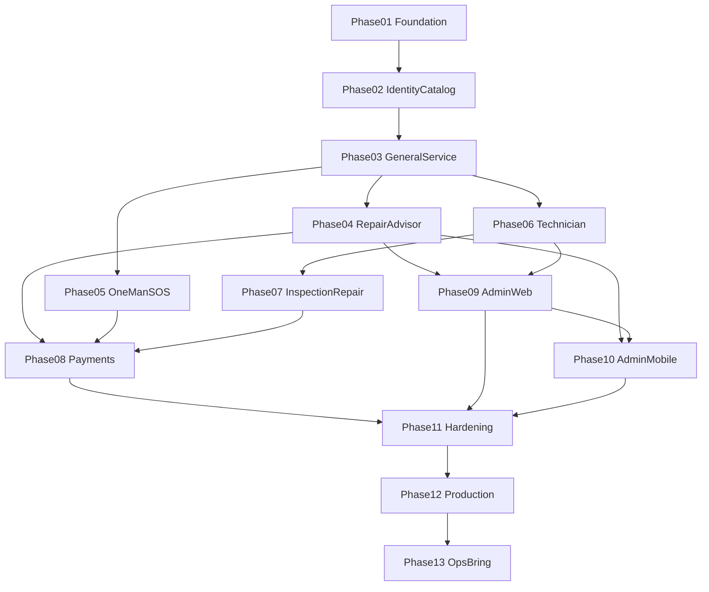

# CARATOM Implementation Phases — Master Index

This directory contains **13 standalone phase execution specifications** plus this orchestration README. Each phase is one Markdown file designed for sequential execution in Cursor.

**Authority:** Product UI/flows follow the walkthrough (embedded inline in phase docs). Commercial invariants follow [`01-product-constitution.md`](../architecture/01-product-constitution.md). Conflicts resolved per [`AUDIT-REPORT.md`](../AUDIT-REPORT.md).

**Do not implement application code from this README alone.** Open the linked phase document and execute it end-to-end, passing the Phase Exit Gate before proceeding.

---

## Purpose

CARATOM is a doorstep automotive-service operating system:

- **Customer app** (Expo, iOS + Android) — public App Store + Google Play
- **Technician app** (Expo, iOS + Android) — private direct install only
- **Admin mobile** (Expo, iOS + Android) — private direct install only
- **Admin web** (Next.js on Railway) — browser URL
- **Backend** (FastAPI on Railway) + **Supabase** (Postgres, Auth, Storage) + **Redis/ARQ** worker

---

## How to execute

```text
Read this README
  → Execute PHASE-01 (pass Exit Gate §24)
  → Execute PHASE-02
  → ...
  → Execute PHASE-12
  → Execute PHASE-13 (ops dispatch / kits / closeout — post-launch product)
  → Production-ready application
```

Each phase document includes sections 0–26: summary, scope, tasks, API/DB/mobile specs, audits, and exit gate.

---

## Dependency graph



---

## Phase table

| Phase | Document | Primary goal | Depends on | Produces |
|-------|----------|--------------|------------|----------|
| 01 | [PHASE-01-monorepo-platform-foundation.md](./PHASE-01-monorepo-platform-foundation.md) | Monorepo, 4 shells, API health, CI, contracts skeleton | — | Runnable empty platform |
| 02 | [PHASE-02-identity-design-catalog.md](./PHASE-02-identity-design-catalog.md) | Auth, design tokens, home (4 tabs), catalog seed | 01 | Browseable home + catalog |
| 03 | [PHASE-03-general-service-e2e.md](./PHASE-03-general-service-e2e.md) | General service gs-01→gs-10 E2E booking | 02 | First full customer journey |
| 04 | [PHASE-04-service-repair-advisor.md](./PHASE-04-service-repair-advisor.md) | Service+repair, advisor, admin-mobile advisor flow | 03 | Advisor loop + adm-01→04 |
| 05 | [PHASE-05-oneman-sos-account.md](./PHASE-05-oneman-sos-account.md) | One-man, SOS, login, orders, profile | 03 | Remaining customer journeys |
| 06 | [PHASE-06-technician-field-execution.md](./PHASE-06-technician-field-execution.md) | Technician field app + offline queue | 03 | Field execution |
| 07 | [PHASE-07-inspection-repair-loop.md](./PHASE-07-inspection-repair-loop.md) | Two-visit inspection+repair (UI spec + E2E) | 06 | INSPECTION_REPAIR policy |
| 08 | [PHASE-08-payments-invoicing-closure.md](./PHASE-08-payments-invoicing-closure.md) | Razorpay, invoice, review, booking detail | 04, 05, 07 | Money closure |
| 09 | [PHASE-09-admin-web-ops-plane.md](./PHASE-09-admin-web-ops-plane.md) | Admin web: inventory, catalog, people, money | 04, 06 | Desk ops plane |
| 10 | [PHASE-10-admin-mobile-ops-dispatch.md](./PHASE-10-admin-mobile-ops-dispatch.md) | Admin mobile: board, dispatch, override lite | 04, 09 | Mobile ops |
| 11 | [PHASE-11-notifications-integrations-hardening.md](./PHASE-11-notifications-integrations-hardening.md) | Push, deep links, perf, error recovery | 08, 09, 10 | Platform hardening |
| 12 | [PHASE-12-production-release-operations.md](./PHASE-12-production-release-operations.md) | Release, audits, store + private distribution | 11 | In-repo production-ready; live cutover is operator-owned ([docs/release](../release/README.md)) |
| 13 | [PHASE-13-ops-dispatch-kits-closeout.md](./PHASE-13-ops-dispatch-kits-closeout.md) | Safe OSS ops bring: dispatch board, kits, closeout, actuals, vehicle history | 12 | Desk + field ops density; slot holds unchanged |

---

## Master screen → phase map

### Customer (walkthrough IDs)

| Screens | Phase |
|---------|-------|
| `gs-01` … `gs-10` | 03 |
| `gpr-01` … `gpr-12`, `gpr-02-deny-cart` | 04 |
| `om-01` … `om-06` | 05 |
| `sos-01` … `sos-04` | 05 |
| `login`, `orders`, `profile`, `addresses` | 05 |
| Booking detail, invoice, payment, review, notifications | 08 |

### Technician

| Screens | Phase |
|---------|-------|
| `today`, `detail`, `map`, `inspect`, `service`, `parts`, `exception`, `qc`, `me` | 06 |
| Inspection findings → estimate (feeds Phase 07 customer UI) | 07 |

### Admin mobile

| Screens | Phase |
|---------|-------|
| `adm-01` … `adm-04` | 04 |
| `board`, `dispatch`, `override` (lite) | 10 |
| `inbox` (standalone) | 04, 10 |

### Admin web (web-primary)

| Screens | Phase |
|---------|-------|
| `inventory`, `catalog`, `people`, `tech`, `money`, `book`, `used`, `custparts`, `more`, `job`, `estimate` | 09 |
| `dispatch` (lanes, day grid, static map, mass assign), `closeout` | 13 |

---

## Master API endpoint → phase map

| Endpoint group | Phase |
|----------------|-------|
| Health, `/v1/me` (stub) | 01 |
| Auth profile, `/v1/catalog/*`, `/v1/services/*` | 02 |
| `/v1/job-cards/*` (create, price, accept), `/v1/bookings/*` (book) | 03 |
| Repair catalog, advisor case, admin estimate publish, dev simulate | 04 |
| One-man catalog, `/v1/support-tickets` | 05 |
| `/v1/technician/*`, `/v1/media/signed-upload` | 06 |
| Inspection findings, parts advance, visit 2 booking | 07 |
| Invoice, Razorpay webhook, `/v1/reviews`, notifications read | 08 |
| `/v1/admin/catalog`, inventory, people, payments, audit, override | 09 |
| `/v1/admin/dispatch`, assign (mobile UX) | 10 |
| Closeout queues, catalog kits, visit kit, mass-assign, vehicle history | 13 |
| Notification delivery workers, deep links | 11 |
| Production config, rate limits | 12 |

Full endpoint list: [`09-api-contracts.md`](../architecture/09-api-contracts.md).

---

## Master database table → phase map

| Tables | Introduced in |
|--------|---------------|
| `profiles` | 02 |
| `service_categories`, `service_offerings`, `included_service_items`, `pricing_policies`, `service_area_rules`, `cms_blocks` | 02 |
| `vehicles`, `addresses` | 02–03 |
| `job_cards`, `job_card_concerns`, `job_card_items`, `estimates`, `estimate_line_items`, `estimate_acceptances` | 03 |
| `repair_*`, `advisor_cases`, `advisor_call_attempts`, `advisor_notes` | 04 |
| `support_tickets` | 05 |
| `bookings`, `booking_snapshots`, `slot_holds`, `visits`, `technician_assignments`, `service_calendars`, `holidays` | 03–06 |
| `technicians`, `technician_skills`, `technician_location_pings`, `media_assets`, `job_parts`, `job_labour`, `qc_checks` | 06 |
| `inspections`, `inspection_findings` | 06–07 |
| `inventory_*` | 09 |
| `invoices`, `invoice_line_items`, `payments`, `payment_events`, `refunds` | 08 |
| `reviews`, `notifications`, `audit_logs`, `outbox_events` | 04–11 |
| `catalog_kit_lines`, `vehicle_service_logs`; visit actuals; `job_parts.intent` | 13 |

Full schema: [`08-data-model.md`](../architecture/08-data-model.md).

---

## Master feature → phase map

| Feature | Phase |
|---------|-------|
| Monorepo + CI | 01 |
| Supabase OTP + JWT | 02 |
| Design system (light-blue accent tokens) | 02 |
| General Service no advisor | 03 |
| General Service + add-ons + advisor | 04 |
| One-man Job | 05 |
| SOS / SupportTicket | 05 |
| Technician offline queue | 06 |
| Inspection + Repair two-visit | 07 |
| Razorpay + invoice | 08 |
| Admin inventory/catalog | 09 |
| Admin mobile dispatch | 10 |
| Push notifications + EAS Update | 11 |
| App Store + private distribution | 12 |
| Dispatch board, kits, closeout, actuals, vehicle history | 13 |

---

## Resolved contradictions (apply in all phases)

| Topic | Winning rule |
|-------|--------------|
| Vehicle timing | Early picker before job card (walkthrough); reprice at finalization if needed |
| Home tabs | Four mode tabs are UX entry; server uses `flow_policy` + `FlowDecision` |
| Service + repair tab | General Service with add-ons — NOT Inspection+Repair |
| Checkout | Combined details screen (name + phone + address) |
| Admin surfaces | Web = dense ops; mobile = inbox/advisor/dispatch lite |
| Brand color | Light-blue accent `#5DB7E8` / brand-strong `#176B9E` (doc 10); used tastefully, not page-wide |
| SOS | Full 4-screen UI required |
| Inspection+Repair UI | Defined in Phase 07 (no walkthrough folder) |

---

## Global engineering principles

From [`01-product-constitution.md`](../architecture/01-product-constitution.md):

1. Server-authoritative money, slots, lifecycle, and flow policy
2. Clients never write job/financial truth via PostgREST
3. Separate state machines: JobCard, Estimate, AdvisorCase, Booking, Visit, Invoice, Payment
4. Technician cannot set selling prices
5. Admin overrides require reason + audit
6. Idempotency on retryable writes
7. UTC storage; Asia/Kolkata display

---

## Vibe Coding Principles

Load from [`Vibe code principles/`](../../Vibe%20code%20principles/) at every phase exit (Section 19 of each phase doc):

| File | Use |
|------|-----|
| `QUICKSTART.md` | Agent entry |
| `GREENFIELD-PLAYBOOK.md` | Checklists mapped to phases |
| `VIBE-CODING-ARTICLE.md` | AI-generated code controls |
| `AUDIT-PLAYBOOK.md` | Phase 12 full audit |
| `CONTROLS-CATALOG-1.md` | Control IDs |
| `LEGAL-APPLICABILITY.md` | India (Phase 12) |

**Missing from repo** (use available substitutes): `CONSTITUTION.md`, `CONTROLS-CATALOG-2.md`, `SECURITY_ANALYSIS.md`, `SCORING-AND-GATES.md`. Phase audits reference present files only and note gaps.

---

## Global production definition

Phase 12 in-repo complete means runbooks, env contracts, legal/store artifacts, production hardening, and walkthrough E2E specs are in git. Live Railway / Supabase / Razorpay / store submission remain operator steps ([docs/release](../release/README.md)). Full §24 launch declaration waits for those boxes.

---

## Monorepo shape (all phases)

```text
apps/customer/
apps/technician/
apps/admin-mobile/
apps/admin/
packages/contracts/
packages/api-client/
backend/
docs/implementation/
```

Established in Phase 01; never restructure without ADR.

---

## Cross-phase consistency audit (completed)

Audit performed when all 12 phase documents were authored. Results:

| Check | Status |
|-------|--------|
| **13 artifacts** (README + 12 phases) | Pass |
| **Sections 0–26** in every phase file | Pass (Phase 02 re-aligned to standard headers) |
| **Dependency integrity** (no backward phase refs) | Pass |
| **flow_policy coverage** | `GENERAL_SERVICE` → 03; add-ons/advisor → 04; `ONE_MAN` → 05; `INSPECTION_REPAIR` → 07. **SOS is not a `flow_policy`** — Phase 05 uses `SupportTicket` only (no JobCard/Booking). Canonical enum is `ONE_MAN` (not `ONE_MAN_JOB`). |
| **Walkthrough screens** | gs-* → 03; gpr-* + adm-* → 04; om/sos/account → 05; technician → 06; post-booking → 08; admin web → 09; admin mobile ops → 10 |
| **Inspection+Repair customer UI** | Defined inline in Phase 07 (`ir-01`–`ir-16`) |
| **Resolved contradictions** | Documented in README + repeated in Phases 02–07 |
| **Vibe file gaps** | Missing `CONSTITUTION.md`, `CONTROLS-CATALOG-2.md`, `SECURITY_ANALYSIS.md`, `SCORING-AND-GATES.md` — audits use present files only |
| **API/table ownership** | Single owner per endpoint group in master maps above |

**Document sizes (verified lines):** 01: 1,539 · 02: 1,297 · 03: 2,188 · 04: 2,254 · 05: 1,720 · 06: 1,935 · 07: 2,000 · 08: 1,841 · 09: 2,026 · 10: 1,655 · 11: 1,511 · 12: 1,509 · **Total ~22,475** (excluding README).
